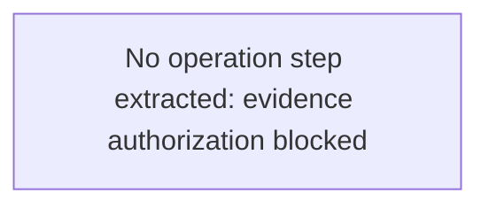

# View 1: Operation / Business Flow - Payment Reconciliation

## Normalization Status
- status: blocked
- source_state: draft
- primary_sources:
  - DOC-PAYMENT-RECON-001

## Summary
No operation flow was normalized because evidence authorization is unresolved.

## Mermaid Flow Diagram

## Evidence-Linked Flow Steps
| Step ID | Sequence | Statement | Evidence Basis | Confidence | Review Status |
| --- | ---: | --- | --- | --- | --- |
| STEP-PAYMENT-RECON-001 | 1 | No business flow step extracted; authorization must be resolved first. | DOC-PAYMENT-RECON-001; FRAG-PAYMENT-RECON-001 | blocked | blocked_pending_evidence |

## Candidate Seeds
| Candidate ID | Candidate Statement | Business Signal | Evidence Basis | Required Review |
| --- | --- | --- | --- | --- |
| CAND-PAYMENT-RECON-001 | Evidence authorization must be approved before flow normalization. | The team must avoid exposing production reconciliation details before redaction. | DOC-PAYMENT-RECON-001; FRAG-PAYMENT-RECON-001 | Resolve evidence intake |

## Gaps For SME Review
| TBD ID | Category | Question | Evidence | Owner | Blocking |
| --- | --- | --- | --- | --- | --- |
| TBD-PAYMENT-RECON-001 | pending_evidence_authorization | Is this deck approved and redacted for agent review? | DOC-PAYMENT-RECON-001 | legacy-ibmi-evidence-intake | yes |
