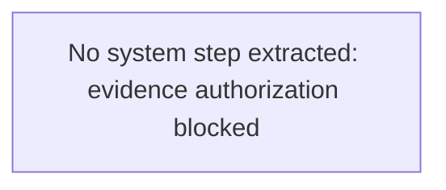

# View 2: System Flow - Payment Reconciliation

## Normalization Status
- status: blocked
- source_state: draft
- primary_sources:
  - DOC-PAYMENT-RECON-001

## Summary
No system flow was normalized because evidence authorization is unresolved.

## Mermaid Flow Diagram

## Evidence-Linked Flow Steps
| Step ID | Sequence | Statement | Evidence Basis | Confidence | Review Status |
| --- | ---: | --- | --- | --- | --- |
| STEP-PAYMENT-RECON-002 | 1 | No system flow step extracted; authorization must be resolved first. | DOC-PAYMENT-RECON-001; FRAG-PAYMENT-RECON-001 | blocked | blocked_pending_evidence |

## Candidate Seeds
| Candidate ID | Candidate Statement | Business Signal | Evidence Basis | Required Review |
| --- | --- | --- | --- | --- |
| CAND-PAYMENT-RECON-002 | Source approval is required before identifying systems or interfaces. | System names may expose sensitive reconciliation architecture. | DOC-PAYMENT-RECON-001; FRAG-PAYMENT-RECON-001 | Resolve evidence intake |

## Gaps For SME Review
| TBD ID | Category | Question | Evidence | Owner | Blocking |
| --- | --- | --- | --- | --- | --- |
| TBD-PAYMENT-RECON-001 | pending_evidence_authorization | Is this deck approved and redacted for agent review? | DOC-PAYMENT-RECON-001 | legacy-ibmi-evidence-intake | yes |
