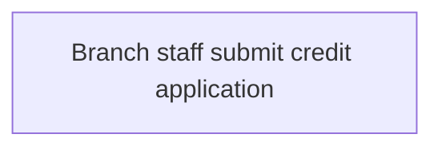

# View 1: Operation / Business Flow - Credit Check

## Normalization Status
- status: ready_for_context_intake
- source_state: sme_confirmed
- primary_sources:
  - DOC-CREDIT-CHECK-001
  - FRAG-CREDIT-CHECK-001

## Summary
Branch staff submit a credit application, host credit checking evaluates it,
and the branch receives an approve or decline recommendation. SME confirmed
this is the correct high-level business sequence for context intake.

## Mermaid Flow Diagram

## Evidence-Linked Flow Steps
| Step ID | Sequence | Statement | Evidence Basis | Confidence | Review Status |
| --- | ---: | --- | --- | --- | --- |
| STEP-CREDIT-CHECK-001 | 1 | Branch staff submit a credit application for eligibility checking. | DOC-CREDIT-CHECK-001; FRAG-CREDIT-CHECK-001 | high | sme_confirmed |

## Candidate Seeds
| Candidate ID | Candidate Statement | Business Signal | Evidence Basis | Required Review |
| --- | --- | --- | --- | --- |
| CAND-CREDIT-CHECK-001 | The module should distinguish approved and declined recommendation outcomes. | Credit operations needs both positive and negative outcomes reviewed before BRD drafting. | DOC-CREDIT-CHECK-001; FRAG-CREDIT-CHECK-001 | Carry into context intake as SME-confirmed seed |

## Gaps For SME Review
| TBD ID | Category | Question | Evidence | Owner | Blocking |
| --- | --- | --- | --- | --- | --- |
