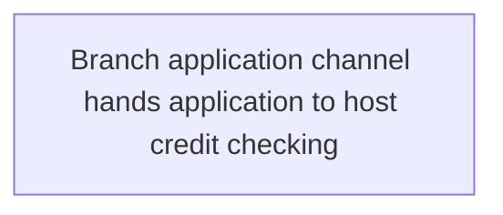

# View 2: System Flow - Credit Check

## Normalization Status
- status: ready_for_context_intake
- source_state: sme_confirmed
- primary_sources:
  - DOC-CREDIT-CHECK-001
  - FRAG-CREDIT-CHECK-002

## Summary
The branch application channel sends the submitted application to the host
credit checking function and receives a recommendation result.

## Mermaid Flow Diagram

## Evidence-Linked Flow Steps
| Step ID | Sequence | Statement | Evidence Basis | Confidence | Review Status |
| --- | ---: | --- | --- | --- | --- |
| STEP-CREDIT-CHECK-002 | 1 | The branch application channel hands the application to the host credit checking system. | DOC-CREDIT-CHECK-001; FRAG-CREDIT-CHECK-002 | high | sme_confirmed |

## Candidate Seeds
| Candidate ID | Candidate Statement | Business Signal | Evidence Basis | Required Review |
| --- | --- | --- | --- | --- |
| CAND-CREDIT-CHECK-002 | Interface timing should be verified before SLA commitments are written. | Customer waiting time may depend on whether the check is synchronous or deferred. | DOC-CREDIT-CHECK-001; FRAG-CREDIT-CHECK-002 | Carry into context intake as non-blocking TBD |

## Gaps For SME Review
| TBD ID | Category | Question | Evidence | Owner | Blocking |
| --- | --- | --- | --- | --- | --- |
