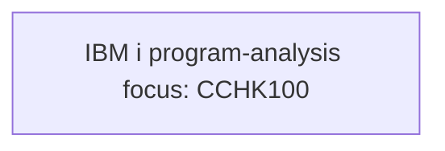

# View 3: Program Flow - Credit Check

## Normalization Status
- status: ready_for_context_intake
- source_state: sme_confirmed
- primary_sources:
  - DOC-CREDIT-CHECK-001
  - FRAG-CREDIT-CHECK-003

## Summary
The historical process diagram labels `CCHK100` as the host credit checking
program. SME confirmed this is an IBM i program-analysis focus, not a
complete program call chain.

## Mermaid Flow Diagram

## Evidence-Linked Flow Steps
| Step ID | Sequence | Statement | Evidence Basis | Confidence | Review Status |
| --- | ---: | --- | --- | --- | --- |
| STEP-CREDIT-CHECK-003 | 1 | Host credit checking is anchored by the IBM i program-analysis focus labeled in the diagram. | DOC-CREDIT-CHECK-001; FRAG-CREDIT-CHECK-003; PGM-CREDIT-CHECK-001 (CCHK100) | medium | sme_confirmed |

## Candidate Seeds
| Candidate ID | Candidate Statement | Business Signal | Evidence Basis | Required Review |
| --- | --- | --- | --- | --- |
| CAND-CREDIT-CHECK-003 | Source verification should confirm which program paths produce approval and decline recommendations. | BRD scenarios need both outcome paths before acceptance criteria are drafted. | DOC-CREDIT-CHECK-001; FRAG-CREDIT-CHECK-003 | Route later to program or flow analyzer if high risk |

## Gaps For SME Review
| TBD ID | Category | Question | Evidence | Owner | Blocking |
| --- | --- | --- | --- | --- | --- |
