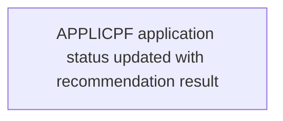

# View 4: Data Flow - Credit Check

## Normalization Status
- status: ready_for_context_intake
- source_state: sme_confirmed
- primary_sources:
  - DOC-CREDIT-CHECK-002
  - FRAG-CREDIT-CHECK-004

## Summary
The `APPLICPF` application status file is updated with the approve or decline
recommendation. Retention is not documented and is carried forward as a
non-blocking question.

## Mermaid Flow Diagram

## Evidence-Linked Flow Steps
| Step ID | Sequence | Statement | Evidence Basis | Confidence | Review Status |
| --- | ---: | --- | --- | --- | --- |
| STEP-CREDIT-CHECK-004 | 1 | `APPLICPF` application status is updated with the eligibility recommendation result. | DOC-CREDIT-CHECK-002; FRAG-CREDIT-CHECK-004; DATA-CREDIT-CHECK-001 (APPLICPF) | high | sme_confirmed |

## Candidate Seeds
| Candidate ID | Candidate Statement | Business Signal | Evidence Basis | Required Review |
| --- | --- | --- | --- | --- |
| CAND-CREDIT-CHECK-004 | Data retention ownership must be clarified before modernization decisions are finalized. | Retention affects compliance, purge behavior, and downstream audit evidence. | DOC-CREDIT-CHECK-002; FRAG-CREDIT-CHECK-004 | Carry into context intake as non-blocking TBD |

## Gaps For SME Review
| TBD ID | Category | Question | Evidence | Owner | Blocking |
| --- | --- | --- | --- | --- | --- |
| TBD-CREDIT-CHECK-001 | pending_sme_judgment | Who owns retention rules for application recommendation history? | DOC-CREDIT-CHECK-002; FRAG-CREDIT-CHECK-004 | Data owner | no |
