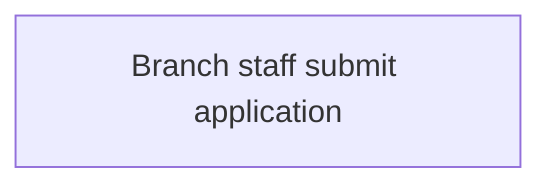
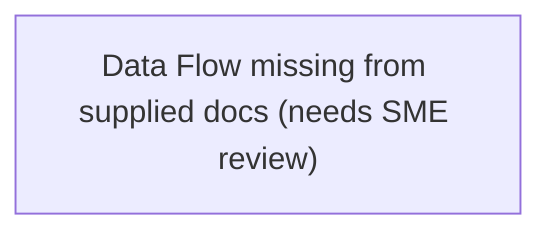
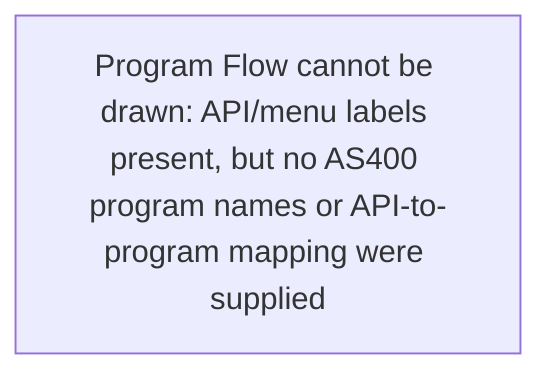
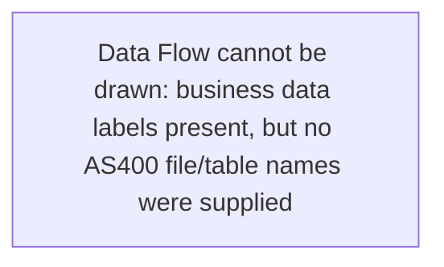

# Output Contract: Flow Context Normalizer

This reference defines the draft four-view context package produced under:

```text
00_context_packages/<MODULE-SLUG>/flow-normalization/
```

The package is a **pre-SME review artifact** unless
`flow-context-index.yaml.normalization.status` is `ready_for_context_intake` or
`ready_with_warnings`. It is not a BRD, approved module analysis, or final
business-rule source.

The four Markdown files in this package are normalized context views. They are
not the canonical module-analysis flow files in `04_modules/<MODULE-SLUG>/`.
Agents must not report this package as "the four module flows"; the final
module flows are synthesized later by `legacy-ibmi-module-analyzer`.

## Package Layout

```text
flow-normalization/
|-- flow-context-index.yaml
|-- source-document-index.yaml
|-- 01-operation-business-flow.md
|-- 02-system-flow.md
|-- 03-program-flow.md
|-- 04-data-flow.md
|-- evidence-map.md
|-- contradiction-log.md
|-- open-questions.md
`-- sme-review-pack.md
```

## `flow-context-index.yaml`

Required shape:

```yaml
schema_version: "0.1"
package_type: flow_context_normalization

module:
  slug: CREDIT-CHECK
  module_id: MODULE-CREDIT-CHECK-001
  business_name: Credit Check
  scope_statement: "Draft or SME-confirmed scope statement."
  owner: "Credit Operations SME"
  source_state: draft_documents

normalization:
  skill: legacy-flow-context-normalizer
  version: v0.1.9
  generated_at: "YYYY-MM-DDTHH:MM:SSZ"
  status: draft_needs_sme_review
  quality_level: L2 partial
  decision_reason: "Draft context views generated from authorized historical docs."
  downstream_next_step: legacy-sme-review-facilitator

evidence_authorization:
  status: approved
  evidence_manifest: "evidence/redacted/evidence-manifest.yaml"
  redaction_notes: "All source documents approved for agent review."

input_documents:
  - doc_id: DOC-CREDIT-CHECK-001
    path: "source-docs/Credit Check Process.vsdx"
    format: vsdx
    role: flow_diagram
    authorization_status: approved
    readable_status: extracted

output_files:
  flow_context_index: flow-context-index.yaml
  source_document_index: source-document-index.yaml
  operation_business_flow: 01-operation-business-flow.md
  system_flow: 02-system-flow.md
  program_flow: 03-program-flow.md
  data_flow: 04-data-flow.md
  evidence_map: evidence-map.md
  contradiction_log: contradiction-log.md
  open_questions: open-questions.md
  sme_review_pack: sme-review-pack.md

coverage:
  operation_business_flow: partial | usable | strong | absent
  system_flow: partial | usable | strong | absent
  program_flow: partial | usable | strong | absent
  data_flow: partial | usable | strong | absent
  technical_anchor_coverage:
    program_anchors: absent | partial | usable | strong
    data_anchors: absent | partial | usable | strong
    supplement_required: true | false
  brd_functional_analysis_hints:
    function_purpose: absent | partial | usable | strong
    business_scenarios: absent | partial | usable | strong
    channels: absent | partial | usable | strong
    user_touchpoints: absent | partial | usable | strong
    system_interfaces: absent | partial | usable | strong
    process_flow: absent | partial | usable | strong
    validation_rules: absent | partial | usable | strong
    error_handling: absent | partial | usable | strong
    dependencies: absent | partial | usable | strong
    optional_security_auth: absent | partial | usable | strong
    optional_workflow_design_notes: absent | partial | usable | strong
    optional_source_document_mapping: absent | partial | usable | strong
  evidence_map_complete: true
  contradictions_carried_forward: true
  sme_review_questions_prepared: true

gates:
  evidence_authorization_gate: pass | warning | blocked
  readable_source_gate: pass | warning | blocked
  module_scope_gate: pass | warning | blocked
  four_view_gate: pass | warning | blocked
  contradiction_visibility_gate: pass | warning | blocked
  sme_review_gate: pass | warning | blocked
  rule_promotion_gate: pass | warning | blocked

risk_acceptance:
  status: none | requested | accepted | rejected
  accepted_by: null
  accepted_at: null
  rationale: null
  downstream_restrictions:
    - "No approved BR-* or BRD claim may be generated from sparse context alone."
    - "All missing views remain carry-forward TBDs until corroborated."

blocking_items:
  - id: TBD-CREDIT-CHECK-001
    reason: "Data retention flow is not visible in supplied documents."
    owner: "Data owner"
supplement_requests:
  - id: TBD-CREDIT-CHECK-002
    view: program_flow
    needed_source: "API/menu-to-program mapping or IBM i program inventory"
    reason: "API IDs were supplied, but no AS400 program names were evidenced."
```

Rules:

- `status` must be one of:
  - `draft_needs_sme_review`
  - `triage_needs_source_enrichment`
  - `ready_for_context_intake`
  - `ready_with_warnings`
  - `blocked_pending_evidence`
  - `blocked_pending_scope`
  - `blocked_pending_readable_source`
  - `blocked_pending_contradiction_review`
- `downstream_next_step` is `legacy-sme-review-facilitator` for drafts,
  `source_owner_supplement_request` or SME clarification for sparse triage,
  `legacy-module-context-intake` for ready packages, and the remediation route
  for blocked packages.
- `quality_level` must be one of `L3 strong`, `L2 partial`, `L1 sparse`, or
  `L0 blocked`. Use `L1 sparse` when input is authorized and readable but no
  flow sequence can be safely generated.
- `blocking_items[]` is empty only when all gates pass or all remaining items
  are explicitly non-blocking.
- Gate/status compatibility: `warning` gates are compatible with
  `ready_for_context_intake` or `ready_with_warnings` **only when** (a) the
  warning item is recorded as a non-blocking question in `open-questions.md`
  and (b) SME sign-off in `sme-review-pack.md` explicitly accepts the gap.
  A `blocked` gate always forces a `blocked_*` status regardless of other
  gates. Typical valid combination: `four_view_gate: warning` when one view
  is `partial` coverage but SME confirms the gap does not block context
  intake.
- Missing view coverage is not a hard block by itself. Use `coverage.<view>:
  absent` or `partial`, keep `four_view_gate: warning`, and create an explicit
  `TBD-*` in the missing view and `open-questions.md`. Escalate to
  `blocked_*` only when the downstream step would have to invent sequence,
  ownership, system boundary, or data meaning.
- `coverage.brd_functional_analysis_hints` is advisory. It records which
  extracted fragments can later feed the SME-required BRD sections 1-9 and
  optional sections 10-12. A value of `absent` or `partial` does not block
  normalization by itself, but it must remain visible so
  `legacy-module-context-intake`, `legacy-ibmi-module-analyzer`, and
  `legacy-brd-writer` do not invent channels, UI touchpoints, interfaces,
  dependencies, security, or source-document mappings.
- `coverage.technical_anchor_coverage.program_anchors` records whether View 3
  has real IBM i program/job/object names. API IDs, journey IDs, menu IDs,
  screen IDs, or service names do not count unless the source explicitly maps
  them to an IBM i program/job/object.
- `coverage.technical_anchor_coverage.data_anchors` records whether View 4 has
  real IBM i file/table/data-object names such as PF/LF, SQL table, data area,
  data queue, display/printer file, DDS/DDL object, or file-spec object.
  Business concepts such as "customer data" or "card account status" do not
  count unless mapped to concrete IBM i object names.
- If a technical anchor is `absent`, the corresponding view coverage should be
  `absent` or `partial`, the Mermaid diagram must use a `TBD-*` placeholder,
  and `supplement_requests[]` / `open-questions.md` must request the missing
  source. Do not draw API/menu/business labels as if they were AS400 program
  or file nodes.
- When all four views are absent but the source set is authorized, readable,
  and module-relevant, use `normalization.status:
  triage_needs_source_enrichment` with `quality_level: L1 sparse`. The package
  still includes all ten files, but it is a source-quality triage output, not a
  canonical module-flow package.
- If the source owner or SME confirms that no additional document, spec, or
  flow input can be provided, the package may move from
  `triage_needs_source_enrichment` to `ready_with_warnings` only when
  `risk_acceptance.status: accepted` includes a named accountable owner,
  timestamp, rationale, and downstream restrictions. Additional Function
  Specs, Technical Designs, Program Specs, File Specs, interface specs, data
  dictionaries, RAG summaries, or SME notes may all be valid supplements. Do
  not change
  `quality_level: L1 sparse`, do not mark absent views as usable, and do not
  remove the `TBD-*` questions.

## `source-document-index.yaml`

Required shape:

```yaml
schema_version: "0.1"
documents:
  - doc_id: DOC-CREDIT-CHECK-001
    title: "Credit Check Process"
    path: "source-docs/Credit Check Process.vsdx"
    format: vsdx
    source_type: flow_diagram
    owner: "Credit Operations"
    document_date: "2025-11-18"
    sensitivity: internal
    authorization_status: approved
    readable_status: extracted
    extraction_method: "vsdx xml text + connector labels"
    pages_or_sheets: "Page-1"
    quality_notes: "Connector labels visible; two unlabeled decision diamonds."
    used_in:
      - 01-operation-business-flow.md
      - 02-system-flow.md
fragments:
  - fragment_id: FRAG-CREDIT-CHECK-001
    doc_id: DOC-CREDIT-CHECK-001
    locator: "Page-1 shape Approve / Reject"
    summary: "Decision node splits approved and declined applications."
    candidate_view: operation_business_flow
    evidence_strength: medium
```

Rules:

- Every input document gets a `DOC-*` ID even when it later proves unusable.
- `format` records the physical file type (`docx`, `xlsx`, `pdf`, `pptx`,
  `vsdx`, `md`, `txt`, image, `rag`, or `sme_note`). `source_type` records the
  document role. Common roles include `flow_diagram`, `function_spec`,
  `technical_design`, `program_spec`, `file_spec`, `interface_spec`,
  `batch_layout`, `api_spec`, `data_dictionary`, `mixed_spec_workbook`,
  `inventory`, `runbook`, `procedure`, `process_deck`, `rag_summary`, and
  `sme_note`.
- Function Specs, Technical Designs, Program Specs, File Specs, and interface
  specs are optional input sources. Treat them as evidence-bearing historical
  or design artifacts, not as guaranteed current production truth.
- Every extracted item used in a view gets a `FRAG-*` ID.
- `readable_status` is `extracted`, `manual_export_required`, `unreadable`,
  or `not_needed`.
- For multi-sheet Excel workbooks, use
  `scripts/extract_excel_fragments.py` to produce a first-pass
  `source-document-index.yaml`. The script enumerates every sheet, uses the
  first non-empty row as headers, and emits one `FRAG-*` per non-empty data row
  with locators such as `Interfaces row 4`.

## Four View Files

Each view file must include:

````markdown
# View N: [Name] - [Module Name]

## Normalization Status
- status: draft_needs_sme_review | triage_needs_source_enrichment | ready_for_context_intake | ready_with_warnings | blocked
- source_state: extracted_documents | mixed | sme_confirmed | draft
- primary_sources:
  - DOC-... / FRAG-...

## Summary
[Concise normalized view. No invented facts.]

## Mermaid Flow Diagram


## Evidence-Linked Flow Steps
| Step ID | Sequence | Statement | Evidence Basis | Confidence | Review Status |
| --- | ---: | --- | --- | --- | --- |

## Candidate Seeds
| Candidate ID | Candidate Statement | Business Signal | Evidence Basis | Required Review |
| --- | --- | --- | --- | --- |

## Gaps For SME Review
| TBD ID | Category | Question | Evidence | Owner | Blocking |
| --- | --- | --- | --- | --- | --- |
````

For a missing or unsupported view, still produce the file:

````markdown
## Summary
No source fragment in the supplied package directly describes this view. The
gap is carried forward for SME review instead of being treated as an inferred
flow.

## Mermaid Flow Diagram


## Evidence-Linked Flow Steps
| STEP-CREDIT-CHECK-001 | 1 | No data-flow step extracted; SME must confirm whether this view is needed before context intake. | TBD-CREDIT-CHECK-001 | low | needs_sme_review |
````

This placeholder pattern improves reviewability while preserving the rule that
the agent must not invent the missing flow.

View-specific guidance:

- Every view must include a Mermaid `flowchart` diagram before the evidence
  table. The diagram is the SME-readable flow view; the table remains the
  traceable source of truth.
- Mermaid node IDs should mirror `STEP-*` IDs by replacing hyphens with
  underscores, for example `STEP_CREDIT_CHECK_001`.
- Mermaid edges must be backed by evidence rows or explicit `TBD-*` questions.
  Do not draw inferred sequence arrows just because rows appear adjacent.

- **View 1, Operation / Business Flow**: people, roles, handoffs, approvals,
  BAU rhythm, manual steps, exceptions, business outcomes. Cite `DOC-*` and
  `FRAG-*` only; put technical names (program, file) inside `Evidence Basis`
  parentheses so the statement stays business-readable.
- **View 2, System Flow**: applications, external systems, interfaces, batch
  jobs, queues, messages, files, schedules, security/SLA hints. May mint
  `SYS-<MODULE-SLUG>-NNN` for system nodes extracted from diagrams or
  inventory lists; cite them in `Evidence Basis` alongside the source `DOC-*`.
  Every `SYS-*` cited must appear in `evidence-map.md` Extracted Fragments.
- **View 3, Program Flow**: IBM i programs, jobs, service programs, CL/RPG
  objects, call hints, execution sequence, branching hints, and source-analysis
  focus. May mint `PGM-<MODULE-SLUG>-NNN` only for AS400 / IBM i program,
  job, service program, or executable object nodes extracted from documents.
  API IDs, journey IDs, menu IDs, screen IDs, and service labels may appear as
  trigger/boundary context, but must not be drawn as `PGM-*` nodes or as the
  primary Program Flow when no IBM i program mapping is evidenced. If only
  API/menu/journey/screen labels exist, use a placeholder Mermaid node and a
  `TBD-*` asking for API-to-program mapping, menu-to-program mapping, program
  inventory, ARCAD export, DSPPGMREF/call graph, program specs, or SME
  confirmation. Every `PGM-*` cited must appear in `evidence-map.md` Extracted
  Fragments.
- **View 4, Data Flow**: IBM i data objects, PF/LF files, SQL tables, data
  areas, data queues, display/printer files, fields, CRUD direction,
  derivations, retention, ownership, and dictionary gaps. May mint
  `DATA-<MODULE-SLUG>-NNN` only for concrete AS400 / IBM i file/table/data
  objects extracted from data dictionaries, File Specs, DDS/DDL, CRUD tables,
  File I/O maps, or SME-confirmed mappings. Business data labels such as
  "card account data", "customer profile", or "request data" may describe the
  node but must not replace the file/table/object name. If no concrete
  IBM i data object is evidenced, use a placeholder Mermaid node and a
  `TBD-*` asking for file specs, DDS/DDL, data dictionary, CRUD matrix,
  File I/O map, or SME mapping. Every `DATA-*` cited must appear in
  `evidence-map.md` Extracted Fragments.

### View 3 / View 4 Technical-Anchor Examples

When the supplied documents contain API IDs but no IBM i program names:

````markdown
## Mermaid Flow Diagram


## Gaps For SME Review
| TBD-CARD-REPLACEMENT-031 | source_supplement_required | Provide API-to-program mapping for HCCAPI162/HCCAPI183/HCCAPI184 or confirm the IBM i entry programs/jobs. | DOC-CARD-REPLACEMENT-001 | Application SME | yes |
````

When the supplied documents contain business data labels but no IBM i file or
table names:

````markdown
## Mermaid Flow Diagram


## Gaps For SME Review
| TBD-CARD-REPLACEMENT-041 | source_supplement_required | Provide File Specs, DDS/DDL, data dictionary, CRUD matrix, or SME mapping from card/account/address data to IBM i files. | DOC-CARD-REPLACEMENT-002 | Data owner | yes |
````

`SYS-*`, `PGM-*`, and `DATA-*` are draft identifiers for the normalization
package only. They must not be used as stable IDs in downstream skills.

Candidate seed rules:

- `Candidate Statement` says what may be true in business-readable language.
- `Business Signal` explains the decision, control, SLA, ownership, exception,
  or capability affected by the candidate.
- `Evidence Basis` carries program names, file names, fields, document IDs,
  page/slide/row locators, and fragment IDs.
- `Review Status` and candidate facts may not use `approved` unless SME
  approval is recorded in `sme-review-pack.md`.

## `evidence-map.md`

Required sections:

```markdown
# Evidence Map - <MODULE-SLUG>

## Documents
| Evidence ID | Source Document | Locator | Summary | Strength | Used In |

## Extracted Fragments
| Evidence ID | Document ID | Locator | Extracted Detail | Strength | Used In |

## Cross-Document Corroboration
| Topic | Evidence A | Evidence B | Agreement | Notes |

## Candidate Facts
| Candidate ID | Statement | Business Signal | Evidence Basis | Promotion Status | Required Review |
```

Rules:

- Preserve original source names and locators.
- If a view cites a `DOC-*`, `FRAG-*`, `SYS-*`, `PGM-*`, or `DATA-*` ID,
  that ID must appear here.
- `Promotion Status` may be `needs_sme_review`, `sme_confirmed`,
  `blocked`, or `deferred`. It may not be `approved` at normalization time.

## `contradiction-log.md`

Required sections:

```markdown
# Contradiction Log - <MODULE-SLUG>

## Summary
- status: none_found | open_contradictions | blocked
- evaluated_checks_present: true | false

## Open Contradictions
| Conflict ID | Type | Summary | Evidence A | Evidence B | Owner | Blocking |

## Evaluated Checks
| Check | Result | Notes |

## Routing
[What must happen before SME approval or context intake.]
```

Rules:

- If `status: none_found`, include at least one evaluated check.
- Contradictions may be obsolete documents, alternate operational paths, or
  true unresolved conflicts. Do not merge them silently.

## `open-questions.md`

Required sections:

```markdown
# Open Questions - <MODULE-SLUG>

## Blocking Questions
| TBD ID | View | Question | Evidence | Owner | Needed Before |

## Non-Blocking Questions
| TBD ID | View | Question | Evidence | Owner | Carry Forward |

## Assumptions Not Yet Approved
| Assumption ID | Statement | Evidence | Review Status |

## Recommended Next Prompt
[Prompt for SME review or context intake.]
```

Rules:

- Mint `TBD-*` for questions that affect downstream traceability.
- Use `Blocking Questions` when downstream context intake would otherwise
  invent sequence, ownership, system boundary, or data meaning.
- Use `source_supplement_required` questions when View 3 lacks IBM i program
  anchors or View 4 lacks IBM i file/table/data-object anchors. Recommended
  supplements include API/menu-to-program mapping, inventory, ARCAD export,
  DSPPGMREF/call graph, program specs, File Specs, DDS/DDL, data dictionary,
  CRUD matrix, File I/O map, or SME-confirmed mapping.

## `sme-review-pack.md`

Required sections:

```markdown
# SME Review Pack - <MODULE-SLUG>

## Review Scope
[Module, source documents, and review objective.]

## Approval Checklist
| Item | Reviewer | Decision | Notes |

## View Review Questions
| View | Priority | Question | Evidence | Decision Needed |

## Contradictions To Resolve
| Conflict ID | Summary | Options | Decision |

## Sign-Off
| Role | Name | Decision | Date | Conditions |
```

Rules:

- Questions must be answerable by a business SME or named technical owner.
- The SME pack is the only place where a `ready_for_context_intake` claim can
  be justified.

## Promotion Rules

Allowed:

- Source document fragments -> draft flow steps
- Function / Technical / Program / File Spec fragments -> draft flow steps,
  candidate system/program/data nodes, or SME questions
- Flow steps -> SME review checklist items
- Conflicts -> contradiction log
- Gaps -> `TBD-*` open questions
- SME-confirmed or risk-accepted normalized flow context -> input to
  `legacy-module-context-intake`

Forbidden:

- Draft flow steps -> approved `BR-*`
- Old document labels -> confirmed current process without SME review
- Program names -> business capability boundaries
- One diagram arrow -> guaranteed runtime sequence
- Missing contradiction evidence -> approval
- `ready_with_warnings` -> downstream approval

## Local Validation

Use the bundled validator for package-level checks:

```bash
python3 skills/legacy-flow-context-normalizer/scripts/validate_flow_context_package.py \
  00_context_packages/<MODULE-SLUG>/flow-normalization
```

It checks required files, status vocabulary, output-file references,
view-to-evidence-map linkage, contradiction-log completeness, forbidden
candidate promotion, and ready-package SME review evidence. It is a structural
guard only; SME approval and semantic review are still required.
