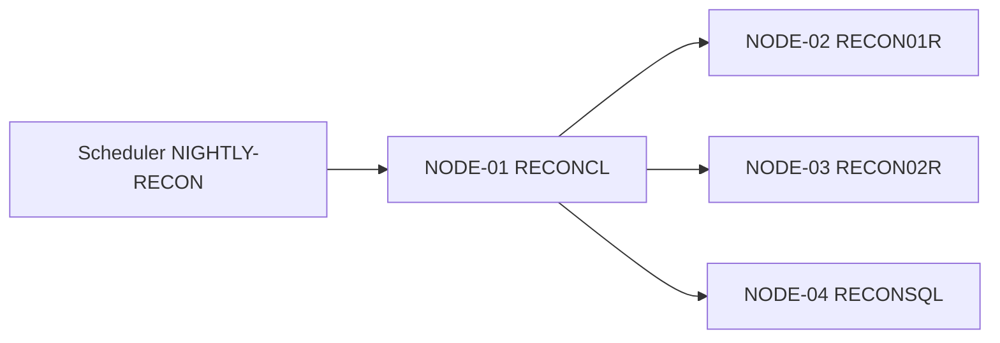

# Flow Analysis: Nightly Card-Transaction Reconciliation (FLOW-NIGHTLY-RECON-001)

## Metadata

- **Flow ID:** FLOW-NIGHTLY-RECON-001
- **Business Event Name:** Nightly reconciliation of on-us card transactions to GL
- **Trigger Model:** Scheduler (submitted via SBMJOB)
- **Module:** CARD-AUTH
- **Entry Node:** NODE-NIGHTLY-RECON-01 (RECONCL / OBJ-CARD-AUTH-101)
- **Exit Node(s):** NODE-NIGHTLY-RECON-04 (RECONSQL / OBJ-CARD-AUTH-104)
- **Runtime Model:** Asynchronous batch; cut-off 06:00 next day; expected runtime 1–3 hours
- **Status:** draft

---

## Trigger Context

- **Trigger Artifact:** Scheduler entry `NIGHTLY-RECON` → `SBMJOB CMD(CALL PGM(RECONCL))`
- **Source / Configuration:** WRKJOBSCDE entry NIGHTLY-RECON; SBMJOB inside scheduler config
- **Caller / Initiator:** IBM i job scheduler
- **Frequency:** Daily, Mon–Fri at 22:00
- **SLA:** Must complete before 06:00 next day (downstream GL consolidation cut-off)
- **Authentication Context:** Runs under shop batch profile QBATCH; no external auth
- **Evidence:** [EV-NIGHTLY-RECON-001: WRKJOBSCDE export, entry NIGHTLY-RECON]

---

## Transaction Call Map

Source: derived-from-code + SME confirmed



### Call Chain Summary

```text
[Scheduler 22:00 daily Mon-Fri]
    │
    ▼  SBMJOB CMD(CALL PGM(RECONCL))
NODE-01 (RECONCL)  ── orchestrator CL: sets up env, retrieves run date, submits work
    │
    ▼  CALL PGM(RECON01R) PARM(&RUNDATE)
NODE-02 (RECON01R) ── reads TXNLOGPF for run date, validates each row, writes to GLPOSTPF
    │
    ▼  CALL PGM(RECON02R) PARM(&RUNDATE)
NODE-03 (RECON02R) ── builds exception report; spools to RECONPRT
    │
    ▼  CALL PGM(RECONSQL) PARM(&RUNDATE)
NODE-04 (RECONSQL) ── SQLRPG: cross-checks GLPOSTPF against ledger via embedded SQL;
                       sends confirmation to RECONDTAQ; updates HSSDTAR002 (completion flag)
    │
    ▼
[End of flow]
```

**Evidence:**
- [EV-NIGHTLY-RECON-002: RECONCL line 38 CALL PGM(RECON01R)]
- [EV-NIGHTLY-RECON-003: RECONCL line 52 CALL PGM(RECON02R)]
- [EV-NIGHTLY-RECON-004: RECONCL line 66 CALL PGM(RECONSQL)]

---

## Nodes

| Node ID | Program (OBJ-*) | Role | Program Analysis | Notes |
| --- | --- | --- | --- | --- |
| NODE-NIGHTLY-RECON-01 | RECONCL (OBJ-CARD-AUTH-101) | orchestrator (CL) | program-analysis-OBJ-CARD-AUTH-101.md | Sets up env, manages overall job |
| NODE-NIGHTLY-RECON-02 | RECON01R (OBJ-CARD-AUTH-102) | worker | program-analysis-OBJ-CARD-AUTH-102.md | Heaviest worker; per-row validation & GL prep |
| NODE-NIGHTLY-RECON-03 | RECON02R (OBJ-CARD-AUTH-103) | reporter | program-analysis-OBJ-CARD-AUTH-103.md | Spool generation only; no data mutation |
| NODE-NIGHTLY-RECON-04 | RECONSQL (OBJ-CARD-AUTH-104) | data-access (SQLRPG) | program-analysis-OBJ-CARD-AUTH-104.md | Final cross-check; embedded SQL over GL |

**Missing program analyses:** none — all four approved.

---

## Edges

| Edge ID | From -> To | Via | Call Type | Site (program:line) | Condition | Evidence |
| --- | --- | --- | --- | --- | --- | --- |
| EDGE-NIGHTLY-RECON-01 | (scheduler) -> NODE-01 | N/A | scheduler-fire -> SBMJOB | (WRKJOBSCDE entry) | always at 22:00 weekday | EV-NIGHTLY-RECON-001 |
| EDGE-NIGHTLY-RECON-02 | NODE-01 -> NODE-02 | N/A | CALL | RECONCL:38 | always | EV-NIGHTLY-RECON-002 |
| EDGE-NIGHTLY-RECON-03 | NODE-01 -> NODE-03 | N/A | CALL | RECONCL:52 | only if NODE-02 returned RC=0 | EV-NIGHTLY-RECON-003 |
| EDGE-NIGHTLY-RECON-04 | NODE-01 -> NODE-04 | N/A | CALL | RECONCL:66 | only if NODE-03 returned RC=0 | EV-NIGHTLY-RECON-004 |

---

## Common Dependencies

| Common Node | Inbound Callers | Role Classification | Main Graph Treatment | Risk Notes | Evidence |
| --- | --- | --- | --- | --- | --- |
| (none) | N/A | N/A | N/A | no shared common program/API is called by multiple nodes in this flow | EV-NIGHTLY-RECON-002 to EV-NIGHTLY-RECON-004 |

---

## Cross-Program Data Flow

| Data ID | Carrier | Producer | Consumer | Mechanism | Payload / Key Fields | Direction & Timing | State Impact | Evidence |
| --- | --- | --- | --- | --- | --- | --- | --- | --- |
| DATA-NIGHTLY-RECON-01 | EDGE-02/03/04 | NODE-01 | NODE-02/03/04 | CALL parameter | RUNDATE (char 8) | sync in | run-date handoff | EV-... |
| DATA-NIGHTLY-RECON-02 | EDGE-02/03/04 | NODE-02/03/04 | NODE-01 | CALL parameter (out) | RC (numeric 4) | sync out | return status controls next edge | EV-... |
| DATA-NIGHTLY-RECON-03 | TXNLOGPF | upstream auth flow | NODE-02 | Shared file | day's transactions keyed by RUNDATE | batch-later | reads persistent transaction rows | EV-... |
| DATA-NIGHTLY-RECON-04 | GLPOSTPF | NODE-02 | NODE-04 and downstream GL consolidation | Shared file | GL staging rows | batch-later | creates rows, later read by SQL / GL | EV-... |
| DATA-NIGHTLY-RECON-05 | RECONPRT | NODE-03 | Finance team | Spool / PRTF | exception report | next-morning human review | report handoff | EV-... |
| DATA-NIGHTLY-RECON-06 | RECONDTAQ | NODE-04 | monitoring system | DTAQ | "RECON COMPLETE / FAILED" status message | async | external status handoff | EV-... |
| DATA-NIGHTLY-RECON-07 | HSSDTAR002 | NODE-01 / NODE-04 | NODE-01 / NODE-04 | Shared data area | BatchRunDate + completion flag | shared state | reads run date; updates checkpoint | EV-... |

**Critical trails:**
- Run date: HSSDTAR002 -> RECONCL -> CALL parameters -> RECON01R/RECON02R/RECONSQL.
- Transaction records: upstream auth flow -> TXNLOGPF -> RECON01R -> GLPOSTPF -> RECONSQL -> downstream GL consolidation.

---

## Flow Replay Path

| Replay Step | Trigger / Node / Edge | Input / Carrier | Logic / Decision | Persistence / Output | Error / Alternate Path | Evidence |
| --- | --- | --- | --- | --- | --- | --- |
| REPLAY-NIGHTLY-RECON-01 | Scheduler -> NODE-01 | WRKJOBSCDE entry; HSSDTAR002 run date | SBMJOB starts RECONCL | no persistence yet | scheduler missed -> manual submission path | EV-NIGHTLY-RECON-001 |
| REPLAY-NIGHTLY-RECON-02 | EDGE-NIGHTLY-RECON-02 | RUNDATE passed to RECON01R | NODE-02 reads TXNLOGPF and validates rows | PERSIST-NIGHTLY-RECON-01 writes GLPOSTPF rows | RC=-1/-2 -> EXCHAIN-NIGHTLY-RECON-01 | EV-NIGHTLY-RECON-002 |
| REPLAY-NIGHTLY-RECON-03 | EDGE-NIGHTLY-RECON-03 | RUNDATE passed to RECON02R | only runs when NODE-02 RC=0 | PERSIST-NIGHTLY-RECON-02 spools RECONPRT | RC<>0 -> EXCHAIN-NIGHTLY-RECON-02 | EV-NIGHTLY-RECON-003 |
| REPLAY-NIGHTLY-RECON-04 | EDGE-NIGHTLY-RECON-04 | RUNDATE and GLPOSTPF rows | NODE-04 cross-checks GLPOSTPF by SQL | PERSIST-NIGHTLY-RECON-03 sends RECONDTAQ; PERSIST-NIGHTLY-RECON-04 updates HSSDTAR002 | SQL error -> EXCHAIN-NIGHTLY-RECON-03 | EV-NIGHTLY-RECON-004 |

**Replay summary:**
```text
Scheduler -> RECONCL -> RECON01R writes GLPOSTPF -> RECON02R spools
exceptions -> RECONSQL cross-checks, sends RECONDTAQ, updates completion
checkpoint -> downstream GL reads GLPOSTPF after cut-off.
```

---

## Cross-Program Field Lineage

| Lineage ID | Business Data Item | Source Field / Node | Carrier / Edge | Consumer Field / Node | Transform / Decision | Final Persistence / Output | Evidence |
| --- | --- | --- | --- | --- | --- | --- | --- |
| LINEAGE-NIGHTLY-RECON-01 | Reconciliation run date | HSSDTAR002 BatchRunDate / NODE-01 | DATA-NIGHTLY-RECON-01 via EDGE-02/03/04 | RUNDATE parameter in NODE-02/03/04 | used as transaction selection key | GLPOSTPF run-date rows, RECONPRT, HSSDTAR002 checkpoint | EV-NIGHTLY-RECON-001 to EV-NIGHTLY-RECON-004 |
| LINEAGE-NIGHTLY-RECON-02 | Return status | NODE-02/03/04 RC | DATA-NIGHTLY-RECON-02 out parameter | NODE-01 RC checks | controls next call or ERREXIT/ABEND | skipped or allowed EDGE-03/04; final job status | EV-NIGHTLY-RECON-002 to EV-NIGHTLY-RECON-004 |
| LINEAGE-NIGHTLY-RECON-03 | GL staging rows | TXNLOGPF day transactions / NODE-02 | DATA-NIGHTLY-RECON-04 GLPOSTPF | NODE-04 SQL cross-check and downstream GL | validation filters and posting transformation inside NODE-02 | GLPOSTPF rows consumed by RECONSQL and GL consolidation | EV-NIGHTLY-RECON-002, EV-NIGHTLY-RECON-004 |

**Unresolved lineage:**
- TBD-NIGHTLY-RECON-003: HSSDTAR002 checkpoint field format is not documented.

---

## Flow Persistence Matrix

| Persist ID | Node / Routine | File / Object | Operation | Key / Condition | Fields Mutated / Output | Driven By | Commit / Rollback Impact | Downstream Consumer | Evidence |
| --- | --- | --- | --- | --- | --- | --- | --- | --- | --- |
| PERSIST-NIGHTLY-RECON-01 | NODE-02 | GLPOSTPF | WRITE | per TXNLOGPF row selected by RUNDATE | GL staging rows | LINEAGE-NIGHTLY-RECON-01, LINEAGE-NIGHTLY-RECON-03 | non-journaled rows durable per write; partial restart risk | NODE-04 and downstream GL consolidation | EV-NIGHTLY-RECON-002 |
| PERSIST-NIGHTLY-RECON-02 | NODE-03 | RECONPRT | spool / PRTF output | only if NODE-02 RC=0 | exception report | LINEAGE-NIGHTLY-RECON-01 | spool entry durable after report creation | Finance team | EV-NIGHTLY-RECON-003 |
| PERSIST-NIGHTLY-RECON-03 | NODE-04 | RECONDTAQ | DTAQ send | after SQL cross-check | completion/failure status message | LINEAGE-NIGHTLY-RECON-02 | external monitor sees status; DTAQ timeout is non-fatal | monitoring system | EV-NIGHTLY-RECON-004 |
| PERSIST-NIGHTLY-RECON-04 | NODE-04 | HSSDTAR002 | data-area update | final successful cross-check | completion flag/checkpoint | LINEAGE-NIGHTLY-RECON-01 | durable checkpoint; skipped on SQL failure | scheduler/operators and later runs | EV-NIGHTLY-RECON-004 |

---

## Branch Points

| Branch Ref | Location | Decider | Alternatives | Evidence |
| --- | --- | --- | --- | --- |
| EDGE-NIGHTLY-RECON-03 / NODE-NIGHTLY-RECON-01 ERREXIT | NODE-01 RECONCL:40 | RC from RECON01R | RC=0 → EDGE-NIGHTLY-RECON-03; RC≠0 → log + GOTO ERREXIT (skip remaining nodes) | EV-... |
| EDGE-NIGHTLY-RECON-04 / NODE-NIGHTLY-RECON-01 ERREXIT | NODE-01 RECONCL:54 | RC from RECON02R | RC=0 → EDGE-NIGHTLY-RECON-04; RC≠0 → log + GOTO ERREXIT | EV-... |
| NODE-NIGHTLY-RECON-01 normal-exit / abend | NODE-01 RECONCL:68 | RC from RECONSQL | RC=0 → normal exit; RC≠0 → log + ABEND | EV-... |

---

## UI Surfaces

N/A — non-interactive flow (batch).

---

## Error Propagation & Commit Boundaries

### Error Conditions Per Node

| Node | Error Condition | Detection | Local Handling | Propagated To Caller | Evidence |
| --- | --- | --- | --- | --- | --- |
| NODE-02 | TXNLOGPF read I/O error | MONITOR block | logs to QSYSOPR, returns RC=-1 | NODE-01 logs + ERREXIT | EV-... |
| NODE-02 | Validation rule failure on row | row-level check | writes exception to local error file; counts errors; if > threshold, returns RC=-2 | NODE-01 logs + ERREXIT | EV-... |
| NODE-03 | PRTF open / spool error | MONITOR | logs + RC=-1 | NODE-01 logs + ERREXIT | EV-... |
| NODE-04 | SQL error (SQLCODE < 0) | SQLCODE check | logs SQLSTATE, returns RC=-1 | NODE-01 logs + ABEND | EV-... |
| NODE-04 | DTAQ send timeout | MONITOR | logs to QSYSOPR; non-fatal (continues) | RC=0 with warning | EV-... |

### Flow-Level Error Outcomes

| Trigger Error | What Happens | Operator Visibility | Recovery |
| --- | --- | --- | --- |
| NODE-02 row threshold exceeded | Job ends RC=-2, no GL posting | QSYSOPR msg + RECONPRT not produced | SME reviews exceptions; manual rerun after fix |
| NODE-04 SQL failure mid-cross-check | Job ABENDs; GLPOSTPF has new rows; HSSDTAR002 checkpoint NOT updated | QSYSOPR + spool of SQL error | **Partial restart** procedure: ops re-runs NODE-04 only against existing GLPOSTPF (SME confirmed) |
| Scheduler missed (system down) | Job not submitted; downstream cut-off at risk | manual operator detection | Ops submits manually if before 04:00; otherwise escalate |

### Exception Propagation Chain

| Chain ID | Source Node | Message ID / Error Code / RC | Propagation Carrier | Caller Reaction | Skipped / Allowed Downstream Edges | Persistence Impact | Final Flow Outcome | Evidence |
| --- | --- | --- | --- | --- | --- | --- | --- | --- |
| EXCHAIN-NIGHTLY-RECON-01 | NODE-02 | RC=-1 or RC=-2 | CALL out parameter RC | NODE-01 logs and GOTO ERREXIT | EDGE-03 and EDGE-04 skipped | PERSIST-01 may be absent or partial; PERSIST-02/03/04 skipped | job ends before report/cross-check | EV-NIGHTLY-RECON-002 |
| EXCHAIN-NIGHTLY-RECON-02 | NODE-03 | RC=-1 | CALL out parameter RC | NODE-01 logs and GOTO ERREXIT | EDGE-04 skipped | PERSIST-01 durable; PERSIST-02 failed; PERSIST-03/04 skipped | job ends with GLPOSTPF rows but no completion flag | EV-NIGHTLY-RECON-003 |
| EXCHAIN-NIGHTLY-RECON-03 | NODE-04 | SQLCODE < 0 / RC=-1 | CALL out parameter RC + QSYSOPR | NODE-01 logs and ABENDs | no further downstream edge | PERSIST-01 durable; PERSIST-04 skipped; partial restart needed | job ABEND; downstream GL blocked until recovery | EV-NIGHTLY-RECON-004 |
| EXCHAIN-NIGHTLY-RECON-04 | NODE-04 | DTAQ send timeout warning | MONITOR/log path | NODE-04 continues with RC=0 warning | all edges already complete | PERSIST-04 still updates checkpoint; monitor message may be missing | reconciliation completes with monitoring gap | EV-NIGHTLY-RECON-004 |

### Commit Boundaries

```text
NODE-01 (CL setup, no commits)
    │
    ▼
NODE-02 (writes GLPOSTPF rows, non-journaled)        ← Boundary 1: each WRITE durable
    │
    ▼
NODE-03 (spool RECONPRT)                              ← Boundary 2: spool entry created
    │
    ▼
NODE-04 (SQL cross-check + DTAQ send + DTAARA update) ← Boundary 3: completion flag durable
    │
    ▼
[End — downstream GL consolidation reads GLPOSTPF after 06:00]
```

**Vulnerable Windows:**
- **Between Boundary 1 and Boundary 3:** if the job ABENDs, GLPOSTPF has
  rows but HSSDTAR002 says "not complete". The partial-restart procedure
  exists to handle this; documented as production reality but not in
  code. → SEED-NIGHTLY-RECON-04
- **Before Boundary 2:** if NODE-02 fails, GLPOSTPF has partial rows for
  the run date; partial restart re-runs NODE-02 with a "skip already
  written" check by transaction ID. → TBD-NIGHTLY-RECON-002

---

## Business Capability Seeds

| Seed ID | Candidate Rule / Capability | Business Signal | Evidence Basis | SME Question |
| --- | --- | --- | --- | --- |
| SEED-NIGHTLY-RECON-01 | All on-us card transactions for a given day must be reconciled before downstream GL consolidation | Daily reconciliation completion gates downstream GL readiness | REPLAY-01..04; PERSIST-04 checkpoint; LINEAGE-01 run date | Is this a hard regulatory requirement or operational SLA? |
| SEED-NIGHTLY-RECON-02 | Exception threshold gates GL posting | Exception volume can stop or defer downstream posting | EXCHAIN-01; NODE-02 returns RC=-2; PERSIST-02/03/04 skipped | What is the threshold value and who maintains it? |
| SEED-NIGHTLY-RECON-03 | Exception report must be human-reviewed | Finance reviews reconciliation exceptions before operational follow-up | PERSIST-02 RECONPRT spool; SME confirmed Finance reviews morning | Is review required (compliance) or best-effort? |
| SEED-NIGHTLY-RECON-04 | Partial restart is a recognised recovery mode | Operations may resume a failed reconciliation from a controlled point | EXCHAIN-02/03; vulnerable window between PERSIST-01 and PERSIST-04 | Should the restart logic move into code, or remain operational procedure? |

---

## TBDs & Blocking Status

### Pending Source
- (none — all four program-analyses approved)

### Pending SME Judgment
- **TBD-NIGHTLY-RECON-001:** Confirm RC=-2 threshold value in NODE-02
  - Blocking: pending_sme_judgment
  - Question: NODE-02 returns RC=-2 when "exceptions exceed threshold"; threshold value not in source (read from HSSDTAR100 data area). Need value + business meaning.
  - Related: [NODE-02, OBJ-CARD-AUTH-102]

- **TBD-NIGHTLY-RECON-002:** Confirm idempotency of partial restart
  - Blocking: pending_sme_judgment
  - Question: SME-described partial restart re-runs NODE-02. Does NODE-02 detect already-written GLPOSTPF rows for the run date and skip them? Source not inspected closely.
  - Related: [NODE-02, DATA-04]

### Non-Blocking
- **TBD-NIGHTLY-RECON-003:** Document HSSDTAR002 checkpoint format
  - Blocking: non_blocking
  - Question: Completion-flag field format (Y/N? timestamp? composite?) not in inventory description; useful for spec-writer but not blocking flow analysis.
  - Related: [DATA-07]

---

## Review Checklist

Before approval, SME must validate:

- [X] Trigger model correctly identified — Scheduler + Batch
- [X] Business event name accurately reflects the business transaction — confirmed by Anna Chen (Finance Ops)
- [X] All nodes in scope — 4 programs, none missing, none extra
- [X] All edges reflect actual production calls
- [X] Cross-program data flow captures carriers, producers, consumers, timing, state impact — 7 data exchanges, all traced
- [X] Flow Replay Path can be followed from trigger to final outcome — scheduler through checkpoint update documented
- [X] Cross-program field lineage preserves critical source, carrier, mutation, and output fields — RUNDATE, RC, and GL staging lineage captured
- [X] Flow Persistence Matrix lists transaction-level writes, updates, deletes, skipped mutations, and commit/rollback impacts — GLPOSTPF, RECONPRT, RECONDTAQ, and HSSDTAR002 captured
- [X] Branch points capture user-visible decisions — all 3 RC-driven branches in CL
- [X] UI surfaces match production screens — N/A (batch)
- [ ] Error propagation matches operational reality — **partial-restart procedure documented, but in operational notes not in code** (see SEED-04)
- [X] Exception Propagation Chain lists observed message IDs, error codes, return codes, skipped downstream edges, and final outcomes — RC and SQL/DTAQ error chains captured
- [X] Commit boundaries correctly identified — 3 boundaries, vulnerable windows flagged
- [X] Capability seeds are reasonable questions backed by replay, lineage, persistence, or exception evidence; not invented rules
- [X] All node program-analyses are approved

### SME Sign-Off

- **Reviewer:** [Anna Chen / Finance Ops — pending]
- **Review Date:** [Pending]
- **Decision:** draft → needs_sme_review
- **Notes:** Partial-restart procedure (SEED-04) is the key open item; rest of flow is well-evidenced.
