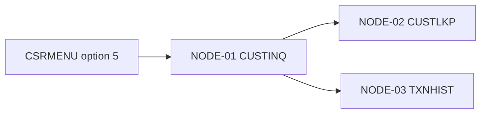

# Flow Analysis: Customer Inquiry from CSR Menu (FLOW-CUST-INQUIRY-001)

## Metadata

- **Flow ID:** FLOW-CUST-INQUIRY-001
- **Business Event Name:** Customer service rep customer lookup and transaction history view
- **Trigger Model:** Interactive Menu (`*MENU CSRMENU`, option 5)
- **Module:** CUST-INQUIRY
- **Entry Node:** NODE-CUST-INQUIRY-01 (CUSTINQ / OBJ-CUST-INQ-001)
- **Exit Node:** NODE-CUST-INQUIRY-01 (same — control returns to menu after exit)
- **Runtime Model:** Synchronous, interactive, sub-second per screen
- **Status:** draft

---

## Trigger Context

- **Trigger Artifact:** `*MENU CSRMENU`, option `5 = Customer Inquiry`
- **Source / Configuration:** Menu source `CSRMENU` (MENU source member) — option 5 dispatches `CALL PGM(CUSTINQ)`
- **Caller / Initiator:** Customer service representatives (CSR role)
- **Frequency:** ~40 invocations per CSR per shift (SME estimate)
- **SLA:** Sub-second screen response; no formal SLA
- **Authentication Context:** Inherits user's IBM i profile; CSR group permission required to see option 5
- **Evidence:** [EV-CUST-INQUIRY-001: CSRMENU source option 5]

---

## Transaction Call Map

Evidence basis: derived-from-code + SME confirmed



### Call Chain Summary

```text
[CSR on CSRMENU; selects option 5]
    │
    ▼
NODE-01 (CUSTINQ)   ── shows DSPF CUSTINQD (search panel)
    │
    │   CSR enters CustID, presses Enter
    ▼
NODE-01 (CUSTINQ)   ── CALLP CUSTLKP(CustID : CustData : RC)
    │
    ▼
NODE-02 (CUSTLKP)   ── CHAIN CUSTMSTR; returns CustData or RC=-1
    │
    ▼
NODE-01 (CUSTINQ)   ── if found, shows DSPF CUSTINQD2 (detail panel)
    │
    │   CSR presses F11 to view transaction history
    ▼
NODE-01 (CUSTINQ)   ── CALLP TXNHIST(CustID : SubfileBuffer : RC)
    │
    ▼
NODE-03 (TXNHIST)   ── reads TXNLOGPF for CustID (last 90 days), populates subfile buffer
    │
    ▼
NODE-01 (CUSTINQ)   ── shows DSPF TXNHISTD (subfile)
    │
    │   CSR enters option 5 next to a row, presses Enter
    ▼   (subfile dispatch — option 5=Display)
NODE-01 (CUSTINQ)   ── opens transaction detail subwindow (same DSPF, different format)
    │
    │   CSR presses F12 to exit
    ▼
[Return to CSRMENU]
```

**Evidence:**
- [EV-CUST-INQUIRY-002: CUSTINQ:120 CALLP CUSTLKP]
- [EV-CUST-INQUIRY-003: CUSTINQ:180 CALLP TXNHIST (after F11)]
- [EV-CUST-INQUIRY-004: CUSTINQ:230 subfile option 5 dispatch]

---

## Nodes

| Node ID | Program (OBJ-*) | Role | Artifact Set | Coverage Status | Blocking Coverage Gaps | Notes |
| --- | --- | --- | --- | --- | --- | --- |
| NODE-CUST-INQUIRY-01 | CUSTINQ (OBJ-CUST-INQ-001) | orchestrator + UI | summary=present; source=present; routines=present; messages=present; file_io=present; mutations=present; sql=not_applicable; human=program-analysis-OBJ-CUST-INQ-001.md | mode=segmented; readiness=approved; routines=deep_read | none | Drives 3 DSPFs; calls lookup and history workers |
| NODE-CUST-INQUIRY-02 | CUSTLKP (OBJ-CUST-INQ-002) | data-access | summary=present; source=present; routines=present; messages=present; file_io=present; mutations=present; sql=not_applicable; human=program-analysis-OBJ-CUST-INQ-002.md | mode=standard; readiness=approved; routines=deep_read | none | CHAIN on CUSTMSTR; pure lookup |
| NODE-CUST-INQUIRY-03 | TXNHIST (OBJ-CUST-INQ-003) | data-access | summary=present; source=present; routines=present; messages=present; file_io=present; mutations=present; sql=not_applicable; human=program-analysis-OBJ-CUST-INQ-003.md | mode=standard; readiness=approved; routines=deep_read | none | READE on TXNLOGPF; populates subfile buffer |

**Missing program analyses:** none.

---

## Edges

| Edge ID | From -> To | Via | Call Type | Site | Condition | Evidence Source | Resolution | Evidence |
| --- | --- | --- | --- | --- | --- | --- | --- | --- |
| EDGE-CUST-INQUIRY-01 | (MENU option 5) -> NODE-01 | N/A | MENU-option | CSRMENU opt 5 | user selects | MENU object + SME confirmation | sme_confirmed | EV-001 |
| EDGE-CUST-INQUIRY-02 | NODE-01 -> NODE-02 | search-handler routine | CALLP | CUSTINQ:120 | always after CustID input | program-analysis Call Evidence | confirmed_from_code | EV-002 |
| EDGE-CUST-INQUIRY-03 | NODE-01 -> NODE-03 | F11-handler routine | CALLP | CUSTINQ:180 | user presses F11 on detail panel | program-analysis Call Evidence | confirmed_from_code | EV-003 |

---

## Common Dependencies

| Common Node | Inbound Callers | Role Classification | Main Graph Treatment | Risk Notes | Evidence |
| --- | --- | --- | --- | --- | --- |
| (none) | N/A | N/A | N/A | no shared common program/API is called by multiple nodes in this flow | EV-002 to EV-003 |

---

## Cross-Program Data Flow

| Data ID | Carrier | Producer | Consumer | Mechanism | Payload / Key Fields | Direction & Timing | State Impact | Evidence |
| --- | --- | --- | --- | --- | --- | --- | --- | --- |
| DATA-CUST-INQUIRY-01 | EDGE-02 | NODE-01 | NODE-02 / NODE-01 | CALL parameters | CustID (customer identifier) [in], CustData (customer detail data structure) [out], RC (lookup return status) [out] | sync in/out | lookup result returned | EV-... |
| DATA-CUST-INQUIRY-02 | EDGE-03 | NODE-01 | NODE-03 / NODE-01 | CALL parameters | CustID (customer identifier) [in], SubfileBuffer (transaction-history subfile rows) [out], RC (history return status) [out] | sync in/out | history buffer returned | EV-... |
| DATA-CUST-INQUIRY-03 | CUSTMSTR | NODE-02 | NODE-01 via EDGE-02 | Shared file | CUSTMSTR record keyed by CustID (customer identifier) | sync lookup | read-only | EV-... |
| DATA-CUST-INQUIRY-04 | TXNLOGPF | NODE-03 | NODE-01 via EDGE-03 | Shared file | TXNLOGPF rows for last 90 days keyed by CustID (customer identifier) | sync lookup | read-only | EV-... |

**Critical trails:**
- Customer identity: DSPF input CustID -> CUSTINQ -> CUSTLKP -> CUSTMSTR -> CustData DS -> CUSTINQ detail panel.
- Transaction history: CUSTINQ F11 branch -> TXNHIST -> TXNLOGPF -> SubfileBuffer -> TXNHISTD subfile.

---

## Flow Replay Path

| Replay Step | Trigger / Node / Edge | Input / Carrier | Logic / Decision | Persistence / Output | Error / Alternate Path | Evidence |
| --- | --- | --- | --- | --- | --- | --- |
| REPLAY-CUST-INQUIRY-01 | MENU option 5 -> NODE-01 | CSRMENU option and user profile | CUSTINQ displays search panel | UI-CUST-INQUIRY-01 | no persistence | EV-CUST-INQUIRY-001 |
| REPLAY-CUST-INQUIRY-02 | EDGE-CUST-INQUIRY-02 | CustID from DSPF | CUSTLKP chains CUSTMSTR | UI-CUST-INQUIRY-02 shows detail when RC=0 | not found -> EXCHAIN-CUST-INQUIRY-01 | EV-CUST-INQUIRY-002 |
| REPLAY-CUST-INQUIRY-03 | EDGE-CUST-INQUIRY-03 | CustID and F11 branch | TXNHIST reads TXNLOGPF for last 90 days | UI-CUST-INQUIRY-03 subfile output | I/O error -> EXCHAIN-CUST-INQUIRY-03 | EV-CUST-INQUIRY-003 |
| REPLAY-CUST-INQUIRY-04 | NODE-01 subfile option 5 | selected subfile row | display transaction detail subwindow | DSPF detail format only | unknown option -> silent ignore seed | EV-CUST-INQUIRY-004 |

**Replay summary:**
```text
CSR selects menu option -> enters CustID -> CUSTLKP returns customer data
or not-found RC -> optional F11 history call -> TXNHIST returns subfile
buffer -> CUSTINQ displays history/detail -> F12 returns to menu.
```

---

## Cross-Program Field Lineage

| Lineage ID | Business Data Item | Source Field / Node | Carrier / Edge | Consumer Field / Node | Transform / Decision | Final Persistence / Output | Evidence |
| --- | --- | --- | --- | --- | --- | --- | --- |
| LINEAGE-CUST-INQUIRY-01 | Customer identity | CustID (customer identifier) input on CUSTINQD / NODE-01 | DATA-CUST-INQUIRY-01 via EDGE-02 | CustID (customer identifier) in CUSTLKP / NODE-02 | CHAIN CUSTMSTR; RC decides found/not-found | CUSTINQD2 detail panel or not-found message | EV-CUST-INQUIRY-002 |
| LINEAGE-CUST-INQUIRY-02 | Customer detail | CUSTMSTR record (customer master detail) / NODE-02 | CustData (customer detail data structure) out parameter | CUSTINQ display fields / NODE-01 | no transform observed | CUSTINQD2 fields | EV-CUST-INQUIRY-002 |
| LINEAGE-CUST-INQUIRY-03 | Transaction history | TXNLOGPF rows (customer transactions) / NODE-03 | SubfileBuffer (transaction-history subfile rows) out parameter | CUSTINQ subfile / NODE-01 | last-90-days filter | TXNHISTD subfile rows | EV-CUST-INQUIRY-003 |

**Unresolved lineage:**
- TBD-CUST-INQUIRY-002: Confirm business rationale for the 90-day transaction history filter.

---

## Flow Persistence Matrix

N/A — read-only flow. Upstream program analyses show CUSTLKP and TXNHIST read
CUSTMSTR/TXNLOGPF and return data to CUSTINQ; no `WRITE`, `UPDATE`, `DELETE`,
SQL DML, data-queue send, message-queue send, spool output, IFS output, or
other durable state mutation is part of this inquiry flow.

---

## Branch Points

| Branch Ref | Location | Decider | Alternatives | Evidence |
| --- | --- | --- | --- | --- |
| EDGE-CUST-INQUIRY-02 / NODE-CUST-INQUIRY-01 not-found path | CUSTINQ:135 | RC from CUSTLKP | RC=0 → show detail panel; RC=-1 → show "not found" message on search panel | EV-... |
| EDGE-CUST-INQUIRY-03 / NODE-CUST-INQUIRY-01 exit paths | CUSTINQ:175 | F-key pressed on detail panel | F3 → exit to menu; F11 → EDGE-CUST-INQUIRY-03; F12 → back to search | EV-... |
| NODE-CUST-INQUIRY-01 subfile dispatch | CUSTINQ:225 | Subfile option code | 5 → show detail subwindow; other → ignore (no error) | EV-... |

**Unhandled subfile options:** silent ignore (per NODE-CUST-INQUIRY-01 subfile dispatch) → SEED-CUST-INQUIRY-02 (is this correct UX?)

---

## UI Surfaces

| Surface ID | Object | Type | Displayed By | Key Fields | F-Keys Handled | Evidence |
| --- | --- | --- | --- | --- | --- | --- |
| UI-CUST-INQUIRY-01 | CUSTINQD | DSPF | NODE-01 | CustID (input) | F3=Exit, F12=Back | EV-... |
| UI-CUST-INQUIRY-02 | CUSTINQD2 | DSPF | NODE-01 | CustName, Status, OpenDate | F3=Exit, F11=History, F12=Back | EV-... |
| UI-CUST-INQUIRY-03 | TXNHISTD | DSPF (subfile) | NODE-01 | TxnDate, TxnAmount, TxnType, Status; subfile option field | F3=Exit, F12=Back; subfile option 5=Display | EV-... |

---

## Error Propagation & Commit Boundaries

### Error Conditions Per Node

| Node | Error Condition | Detection | Local Handling | Propagated To Caller | Evidence |
| --- | --- | --- | --- | --- | --- |
| NODE-02 | Customer not found | %FOUND check on CHAIN | RC=-1, empty CustData | NODE-01 shows "Customer ID not found" on CUSTINQD | EV-... |
| NODE-02 | CUSTMSTR I/O error | MONITOR | RC=-2 + logs QSYSOPR | NODE-01 shows generic error; CSR retries | EV-... |
| NODE-03 | No transactions found | %EOF check first iteration | RC=0 with empty subfile | NODE-01 shows "No transactions" on TXNHISTD | EV-... |
| NODE-03 | TXNLOGPF I/O error | MONITOR | RC=-1 + logs QSYSOPR | NODE-01 shows generic error | EV-... |

### Flow-Level Error Outcomes

| Trigger Error | What Happens | Operator Visibility | Recovery |
| --- | --- | --- | --- |
| Customer not found | "Not found" message on search panel | none | CSR re-enters CustID |
| CUSTMSTR unavailable | Generic error; flow returns to menu | QSYSOPR | DBA / ops investigates |
| TXNLOGPF unavailable | Generic error; CSR can still see customer detail (NODE-02 already succeeded) | QSYSOPR | DBA / ops investigates |

### Exception Propagation Chain

| Chain ID | Source Node | Error Code / Message / RC | Error Type | Output Carrier | Propagation Carrier | Caller Reaction | Skipped / Allowed Downstream Edges | Persistence Impact | Final Flow Outcome | Evidence Status | Evidence |
| --- | --- | --- | --- | --- | --- | --- | --- | --- | --- | --- | --- |
| EXCHAIN-CUST-INQUIRY-01 | NODE-02 | RC=-1 | not-found business condition | RC (lookup return status) | CALL out parameter RC | NODE-01 shows not-found message | EDGE-03 not available until valid customer detail | no persistence | CSR may re-enter CustID | confirmed_from_code | EV-CUST-INQUIRY-002 |
| EXCHAIN-CUST-INQUIRY-02 | NODE-02 | RC=-2 | file I/O error | RC (lookup return status) + QSYSOPR message | CALL out parameter RC + QSYSOPR log | NODE-01 shows generic error | EDGE-03 skipped | no persistence | flow returns to menu / CSR retries later | confirmed_from_code | EV-CUST-INQUIRY-002 |
| EXCHAIN-CUST-INQUIRY-03 | NODE-03 | RC=-1 | history file I/O error | RC (history return status) + QSYSOPR message | CALL out parameter RC + QSYSOPR log | NODE-01 shows generic history error | customer detail remains visible; history display skipped | no persistence | CSR can continue with customer detail only | confirmed_from_code | EV-CUST-INQUIRY-003 |

### Commit Boundaries

This flow is **read-only** — no writes to any file. There are no commit
boundaries. Every error is fully recoverable by the user.

---

## Business Capability Seeds

| Seed ID | Candidate Rule / Capability | Business Signal | Evidence Basis | SME Question |
| --- | --- | --- | --- | --- |
| SEED-CUST-INQUIRY-01 | CSR role must be authorised to view customer transaction history | Customer transaction history is sensitive and gated by staff role | REPLAY-01; menu option visibility depends on CSR group; LINEAGE-03 data shown is sensitive | What governs CSR access — group profile only, or finer-grained authorities? |
| SEED-CUST-INQUIRY-02 | Unknown inquiry actions may be ignored instead of shown as errors | Unrecognised user actions do not create a visible business response | REPLAY-04; branch point subfile option dispatch ignores unrecognised option codes | Is silent drop intentional or should an error be shown? |
| SEED-CUST-INQUIRY-03 | Transaction history may be limited to 90 days | Inquiry history has an observed age boundary | LINEAGE-03; NODE-03 hard-coded 90-day window | Is 90 days a regulatory limit, performance choice, or arbitrary? |

---

## TBDs & Blocking Status

### Pending Source
- (none — all program-analyses approved)

### Pending SME Judgment
- **TBD-CUST-INQUIRY-001:** Confirm CSR authorisation model
  - Blocking: pending_sme_judgment
  - Related: SEED-01

- **TBD-CUST-INQUIRY-002:** Confirm 90-day window rationale
  - Blocking: pending_sme_judgment
  - Related: SEED-03

### Non-Blocking
- **TBD-CUST-INQUIRY-003:** Silent-drop UX choice
  - Blocking: non_blocking
  - Related: SEED-02

---

## Review Checklist

- [X] Trigger model correctly identified — Interactive Menu
- [X] Business event name confirmed by SME (Liu Wei)
- [X] All nodes in scope
- [X] All edges reflect actual production calls
- [X] Cross-program data flow captures carriers, producers, consumers, timing, and state impact
- [X] Flow Replay Path can be followed from trigger to final outcome
- [X] Cross-program field lineage preserves critical source, carrier, mutation, and output fields
- [X] Flow Persistence Matrix lists transaction-level writes, updates, deletes, skipped mutations, and commit/rollback impacts — N/A read-only flow, explicitly proven
- [X] Branch points capture user-visible decisions (incl. F-keys and subfile options)
- [X] UI surfaces match production screens — 3 DSPFs documented
- [X] Error propagation matches operational reality
- [X] Exception Propagation Chain lists observed message IDs, error codes, return codes, skipped downstream edges, and final outcomes
- [X] Commit boundaries: N/A — read-only flow (explicitly documented)
- [X] Capability seeds are reasonable questions backed by replay, lineage, persistence, or exception evidence; not invented rules
- [X] All node program-analyses approved

### SME Sign-Off

- **Reviewer:** [Liu Wei / CS Ops — pending]
- **Review Date:** [Pending]
- **Decision:** draft → needs_sme_review
- **Notes:** Read-only inquiry flow with clear UI structure; key open items are authorisation model and 90-day window rationale.
