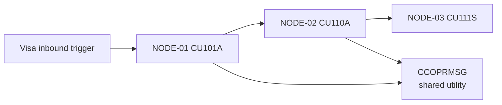

# Output Contract: Flow Analysis

This document defines the precise shape and required fields for compact
`program-set-sme-core-review.md` artifacts and, when explicitly requested,
full `flow-<FLOW-SLUG>.md` artifacts.

## Program-Set Core Review File Structure

Default for SME-provided program-flow/core-merge requests:

The deterministic builder must first write:

```text
program-set-core-input-manifest.yaml
program-set-sme-core-review.md
```

`program-set-core-input-manifest.yaml` is the control input. It records the
SME-supplied program order, normalized program identity, `run_resolution`,
artifact root, compact artifact availability, program resolution profile, and
delivery workspace profile. It also records source inventory cache status under
`source_inventory`: the checked cache directory, `program-list.csv` /
`scan-summary.yaml` presence, freshness/action, current source revision,
inventory revision, and per-program source-path/tier hints.
The LLM or agent may summarize from the manifest and listed compact artifacts,
but must not silently add or remove programs. In the default
program-evidence-first flow, the builder should receive `--program-first
--working-root <delivery-working-branch-checkout>`. After an all-program scan
has been reviewed and merged into the document/delivery repo, SME-local flow
assembly may instead use `--artifact-repo-mode approved_document_repo` with
`--working-root <local-document-repo-clone>`. The builder does not fetch
remote-main or silently read arbitrary prior-run artifacts for program-flow
assembly.

```markdown
# Program Set SME Core Review: [Program Set Name]

## Program Set Reading Summary
## Cross-Program Processing Overview
## Calculation Logic
## Validation Logic
## Exception Handling
## Message Inventory
## Core Completeness Ledger
## Sources
## Run Profile
## Source Inventory Cache
```

After the four core sections are populated, run the structural validator:

Windows:

```powershell
py -3 scripts\validate-program-set-core-review.py `
  --manifest program-set-core-input-manifest.yaml `
  --review program-set-sme-core-review.md
```

macOS/Linux:

```bash
python3 scripts/validate-program-set-core-review.py \
  --manifest program-set-core-input-manifest.yaml \
  --review program-set-sme-core-review.md
```

The validator must pass before SME handoff. It checks the reader-first section
order, a non-placeholder Program Set Reading Summary, the Cross-Program
Processing Overview table, reader-useful detail in the four core sections,
per-program coverage in Sources and Core Completeness Ledger, legal
`run_resolution` values, required routine logic sidecars for every completed or
approved-reused program, and absence of full-flow sections such as Nodes,
Edges, Replay, Persistence, Lineage, UI Surfaces, Capability Seeds, and SME
Checklist.

---

## Full Flow File Structure

Use this only when full transaction-flow analysis is explicitly requested:

```markdown
# Flow Analysis: [Business Event Name] (FLOW-*)

## Calculation Logic
## Validation Logic
## Exception Handling
## Message Inventory
## Metadata
## Trigger Context
## Transaction Call Map
## Nodes (Programs in the Chain)
## Edges (Calls Between Nodes)
## Common Dependencies
## Cross-Program Data Flow
## Flow Replay Path
## Cross-Program Field Lineage
## Flow Persistence Matrix
## Branch Points
## UI Surfaces                       (N/A for non-interactive flows)
## Error Propagation & Commit Boundaries
## Exception Propagation Chain
## Business Capability Seeds
## TBDs & Blocking Status
## Review Checklist
```

---

## SME Core Review Artifact

When the user asks to merge multiple existing program-analysis results, or when
the SME provides a program flow that should first analyze each named program
for the current run, produce:

- `program-set-sme-core-review.md`

Do not produce `flow-<FLOW-SLUG>.md` for this current SME core-merge workflow.
The SME-provided order may still be preserved inside the Sources table and Core
Completeness Ledger. Full transaction-flow artifacts are reserved for a
separately requested full flow analysis.

If the SME provides multiple named program flows in one request, split the
request into independent flow blocks. Each flow block produces its own folder
under `program_set_review_parent`:

```text
program_set_review_parent/
  {flow_1_review_slug}/
    program-set-core-input-manifest.yaml
    program-set-sme-core-review.md
  {flow_2_review_slug}/
    program-set-core-input-manifest.yaml
    program-set-sme-core-review.md
```

The same delivery working branch and PR may contain all sibling folders, but
each folder has its own manifest, Sources table, Core Completeness Ledger, and
validator result. Do not combine unrelated business flows into one
`program-set-sme-core-review.md`.

The default field workflow is program-evidence first with **no cross-run
reuse**. Every distinct SME-provided program must be analyzed from the current
source repo for this run before assembly. If the same normalized program appears
again later in the same SME batch, reuse only the artifact already produced
earlier in this run. Record `run_resolution` as `analyzed_this_run`,
`reused_same_run`, `pending_source`, or `blocked_missing_source`. Remote-main,
prior-run, and other analysts' artifacts may be compared later through Git/PR
review, but they do not satisfy this run's evidence gate.

The approved document repo workflow is explicit and separate. After the
all-program scan artifacts are reviewed and merged into the document/delivery
repo, an SME may clone that repo locally and assemble a selected flow with
`--artifact-repo-mode approved_document_repo`. In that mode, found artifacts
record `run_resolution: reused_artifact_repo` and
`artifact_source: approved_document_repo`; missing or incomplete programs still
remain visible as pending/blocker rows. If a fresh source inventory finds a
missing program, keep `run_resolution: pending_source` and allow targeted scan.
If fresh inventory also misses it, use
`run_resolution: blocked_missing_source`, `artifact_source:
source_inventory_missing`, and require SME/source follow-up.

Before source discovery for any program that is not already complete in the
current-run artifact root, check the source repo inventory cache. Default path:
`<source-root>/outputs/repo-scan/program-list.csv` and
`<source-root>/outputs/repo-scan/scan-summary.yaml`. Reuse `program-list.csv`
only when `scan-summary.yaml.source_revision_key` matches the current clean Git
source HEAD. If the cache is missing, stale, or the source worktree has
uncommitted source changes, run repo-level `legacy-ibmi-inventory` first, then
use the refreshed `program-list.csv` for targeted program analysis.

When another department uses a different delivery repo or folder structure,
the run must provide a `program_artifact_resolution_profile` with configurable
`repo`, `module_roots`, `program_folder_patterns`, artifact file patterns, and
program-name normalization. The current lending-card default uses exact
`modules/*/{PROGRAM}` matching and preserves leading `@`; `@CU118` and `CU118`
remain different programs unless a department-specific profile explicitly
defines aliases. Use `templates/delivery-profile.yaml` as the editable profile
shape. Its `delivery_workspace_profile` controls where current-run output is
written: the working branch is normally `develop-<person>` and may be created
from `origin/main`; program artifacts go under tier-specific roots; cross-tier
program-set reviews go under `program_set_review_parent/{REVIEW_SLUG}/`.

This artifact must remain a compact core review. It contains a reader-first
program-set orientation, the four core SME reading surfaces, and then the
source/coverage control surfaces:

```markdown
# Program Set SME Core Review: [Flow or Program Set Name]

## Program Set Reading Summary
## Cross-Program Processing Overview
## Calculation Logic
## Validation Logic
## Exception Handling
## Message Inventory
## Core Completeness Ledger
## Sources
## Run Profile
## Source Inventory Cache
```

**Rules:**
- Use `templates/sme-core-review.md` as the starting structure.
- Prefer `scripts/build-program-set-core-review.py` to create the manifest and
  skeleton after current-run program artifacts have been written or explicitly
  marked pending/blocked.
- Pass `--source-root <source-repo>` so the builder can check the default
  `outputs/repo-scan` inventory cache; pass `--inventory-dir` only when the
  team's cache is outside the configured default location.
- Aggregate from compact program artifacts first:
  `program-analysis-summary.yaml`, `message-inventory.yaml`,
  `source-index.yaml`, `routine-index.md`, `routine-logic-details.md`,
  `routine-logic-details.yaml`, and claim-specific optional sidecars.
- `routine-logic-details.md` and `routine-logic-details.yaml` are required for
  normal, complex, and large programs. They are audit/checkpoint sidecars for
  routine-level traceability, not the SME first reading path.
- Program Set Reading Summary must explain the program list / flow in SME
  language, state `standalone_exploratory`, `draft`, or `chain_ready`, and
  cover the processing layers: entry/dispatch, calculation, validation,
  exception/message handling, and persistence/finalization. It must not be an
  artifact list or pending placeholder.
- Cross-Program Processing Overview must include:
  `Processing Layer`, `Programs / Main Routines`, and
  `What To Understand First`. Use it to orient the SME before the detailed
  section tables.
- The four core SME sections must be self-contained. Each row must carry the
  merged logic, condition, carrier, outcome, handling action, or exact
  message/status meaning needed for SME review. Supporting detail references
  are required for traceability but must not replace the explanation.
- Populate the Core Completeness Ledger from the SME-provided program flow,
  current-run artifact resolution, inventory relationships, and discovered call
  evidence. No program may be omitted because its artifact is missing. The
  ledger reports artifact evidence availability, not final SME section quality:
  use `Routine Logic Evidence` for `routine-logic-details.yaml` availability
  and `Message Inventory` for `message-inventory.yaml` availability.
- Use `program-analysis.md` only for targeted human-readable clarification.
- Do not include Metadata, Nodes, Edges, Transaction Call Map, Replay,
  Persistence, Lineage, UI Surfaces, Capability Seeds, flow-level TBD tables,
  or SME Checklist in the compact core-review artifact.
- Every row must identify the source Program and, when available, Routine,
  `RLOG-*` / `MSG-*`, source line, or evidence status.
- `Message Inventory` must include every exact message ID, status value, return
  code, response literal, SQLSTATE, CPF/MCH/RNX/CPD message, operator text, or
  shop-local token observed across the participating program analyses. Do not
  replace individual rows with grouped labels such as "validation messages",
  "queue errors", or "generic status codes".
- If the same exact message appears in multiple programs with the same meaning
  and trigger, it may be one row with all Program/Routine sources listed. If the
  trigger, handling, carrier, or meaning differs, split it into separate rows.
- Run `scripts/validate-program-set-core-review.py` before handoff. Fix
  structural findings in the review; do not edit the manifest just to make a
  missing program disappear.

---

## Calculation Logic Section

This section must appear immediately after the title, before Metadata. It is the
SME first-read view of material cross-program calculations, assignments, and
payload derivations that affect the flow outcome. It summarizes; it does not
replace program-level `RLOG-*`, `DATA-*`, `LINEAGE-*`, or field-mutation
evidence.

```markdown
## Calculation Logic

| Flow Calculation / Assignment | Producing Node(s) | Target Field / Carrier | Source Operands / Carriers | Guard / Branch | Flow Effect | Supporting Detail | Evidence Status |
| --- | --- | --- | --- | --- | --- | --- | --- |
| Authorization response amount derivation | NODE-02 CU106 | response amount field | request amount, account/product controls | approval branch | outbound response payload | RLOG-CU106-017; LINEAGE-ONUS-AUTH-003 | confirmed |
```

**Requirements:**
- Include only calculations/assignments that materially affect the flow outcome,
  outbound payload, persisted state, downstream call, approval/decline status,
  settlement/reversal amount, audit record, or exception path.
- Write the calculation or assignment in the row itself, including the target,
  operands/carriers, guard, and effect. Do not make the reader open
  per-program artifacts to understand what is being calculated.
- Link every row to upstream compact artifacts (`program-analysis-summary.yaml`,
  `message-inventory.yaml`, `source-index.yaml`, `routine-index.md`,
  `routine-logic-details.md`, `routine-logic-details.yaml`,
  `file-io-inventory.yaml`, `field-mutation-matrix.yaml`,
  `sql-inventory.yaml`) or flow IDs such as `DATA-*`, `LINEAGE-*`,
  `PERSIST-*`, or `TBD-*`.
- Do not invent calculations at flow level. If the program-level detail is
  missing, write `unresolved - pending program detail` and create a
  `missing_program_artifact` or `pending_deep_read` TBD.

---

## Validation Logic Section

This section must appear immediately after Calculation Logic, before Exception
Handling. It is the SME first-read view of how validation, response status,
return codes, branch decisions, and generic handler outcomes propagate across
programs in the flow.

```markdown
## Validation Logic

| Message / Status / Outcome | Description | Producing Node | Trigger Chain | Carrier / Destination | Flow Effect | Related Message / Exception | Evidence Status |
| --- | --- | --- | --- | --- | --- | --- | --- |
| D | decline response | NODE-02 CU106 | request validation failed -> response code set | outbound response DS | caller receives decline; downstream posting skipped | MSG-CU106-004; EXCHAIN-ONUS-AUTH-002 | confirmed |
```

**Requirements:**
- Include cross-program validation outcomes, response codes, return codes,
  SQLSTATE / CPF / MCH / RNX / CPD messages, shop-local message IDs, indicator
  outcomes, generic catch-all outcomes, and externally visible status values.
- Write the validation condition, exact status/code, carrier/destination, and
  outcome in the row itself. Evidence refs supplement the row; they do not
  replace it.
- Preserve exact source codes/literals and link to program-level `MSG-*`,
  `RLOG-*`, and flow-level `EXCHAIN-*` / `DATA-*` evidence.
- If multiple programs touch the same outcome, show the producing node and the
  propagation path instead of duplicating unrelated program detail.

---

## Exception Handling Section

This section must appear immediately after Validation Logic, before Message
Inventory. It is the SME first-read view of how local exceptions become
flow-level outcomes.

```markdown
## Exception Handling

| Exception / Error Path | Origin Node | Detection Mechanism | Fields / Messages Set | Handling Action | Flow-Level Effect | Supporting Detail | Evidence Status |
| --- | --- | --- | --- | --- | --- | --- | --- |
| External auth advice timeout | NODE-04 CU120A | return code after CALLP | timeout status, operator message | log and abort | flow exits before response confirmation | RLOG-CU120A-009; EXCHAIN-ONUS-AUTH-003 | needs_sme_review |
```

**Requirements:**
- Include every observed business, parameter, file I/O, SQL, external-call,
  system, and generic-handler exception that changes flow outcome, skips a
  node, changes persistence, commits/rolls back, logs/messages, or returns an
  external status.
- State whether the flow returns, rolls back, skips downstream work, continues,
  aborts, logs, or leaves a pending operator/manual action.
- Write the detection mechanism, fields/messages set, handling action, and
  resulting behavior in the row itself. Evidence refs supplement the row; they
  do not replace it.
- Do not infer specific message IDs from generic handlers.

---

## Message Inventory Section

This section must appear immediately after Exception Handling, before Metadata.
It is the SME first-read summary of flow-relevant message/code/literal meanings.
Detailed per-program message occurrences remain in each program's
`message-inventory.md` / `message-inventory.yaml`.

```markdown
## Message Inventory

| Message / Code / Literal | Short Description | Producing Node(s) | Occurrences | Flow Effect | Detail Refs | Evidence Status |
| --- | --- | --- | --- | --- | --- | --- |
| UCC1852 | unresolved - message description not available | NODE-02 CU106 | 2 | decline response candidate | MSG-CU106-001 | unresolved |
```

**Requirements:**
- Create one summary row per exact flow-relevant message/code/literal. Do not
  group message families.
- Write the message/status/literal meaning and effect in the row itself. Detail
  refs are for traceability and must not require the SME to open another file to
  understand the message.
- Aggregate from program-level `message-inventory.yaml` sidecars. If the
  description is unavailable, keep `unresolved - message description not
  available` and create an Open Item / TBD.
- For many messages, keep this section compact and link to program-level
  `MSG-*` detail IDs; do not copy all per-program occurrence rows into the flow
  document.

---

## Metadata Section

```markdown
## Metadata

- **Flow ID:** FLOW-ONUS-AUTH-001
- **Business Event Name:** On-Us Card Authorization (online)
- **Analysis Intent:** standalone_exploratory | chain_ready
- **Flow Scan Mode:** orchestrated | assemble_existing
- **Trigger Model:** API / Remote (Visa inbound auth request)
- **Module:** [MODULE-SLUG] (e.g., CARD-AUTH)
- **Entry Node:** NODE-ONUS-AUTH-01 (program CU101A / OBJ-AUTH-ONUS-001)
- **Exit Node(s):** NODE-ONUS-AUTH-14 (program CU199Z / OBJ-AUTH-ONUS-014, returns response to Visa)
- **Runtime Model:** synchronous, real-time, sub-second SLA
- **Status:** draft_exploratory | draft | needs_sme_review | approved | approved_with_non_blocking_tbd | blocked_pending_source | blocked_pending_sme
```

**Status values:**
- `draft_exploratory` — Standalone quick-validation analysis; may have missing
  inventory, approval, or compact sidecars and is not downstream-ready.
- `draft` — Initial analysis; workflow incomplete, awaiting SME review
- `needs_sme_review` — All sections populated; awaiting SME judgment on business accuracy
- `approved` — SME reviewed and confirmed; ready for downstream processing
- `approved_with_non_blocking_tbd` — SME reviewed and approved with explicitly non-blocking TBDs carried forward
- `blocked_pending_source` — Analysis blocked; missing program-analysis, missing DSPF, or other source artifacts required before continuing
- `blocked_pending_sme` — Analysis blocked; ambiguous trigger model, unclear error intent, or missing SME business context; clarification required before continuing

---

## Trigger Context Section

Describe **how the flow starts** in enough detail that an SME can confirm
or correct. The format depends on the trigger model — see
`trigger-models.md`. Common required fields:

- Trigger artifact (CL name, MENU + option, DSPF + option / F-key,
  trigger registration, scheduler entry, API contract)
- Source line / configuration reference for the trigger
- Caller (who invokes — user role, scheduler, external system, internal
  program)
- Frequency / cadence
- SLA expectation (if any)
- Authentication / authorization context (if external)
- Evidence link

---

## Transaction Call Map Section

RDi-style call/dependency map showing the transaction's cross-program and
cross-boundary structure. This is not a business-process diagram and not
a statement-level flowchart. Internal subroutines remain folded into a
`Via` field unless exposing them is necessary for SME understanding.

```markdown
### Transaction Call Map

Evidence basis: derived-from-code | source-level flow header | both (matched) | SME confirmed



### Call Chain Summary

```text
[Visa Inbound]
    │
    ▼
NODE-01 (CU101A)  ── validates auth request, derives currency
    │
    ▼
NODE-02 (CU110A)  ── calls credit-check
    │   │
    │   └─→ NODE-03 (CU111S)  ── credit limit lookup (SQLRPG)
    │
    ▼
NODE-04 (CU120A)  ── extracts track data, classifies recurring
    │
    ▼
NODE-05 (CU130A)  ── CVV validation
    │
    ▼
NODE-06 (CU199Z)  ── builds response, returns to Visa
    │
    ▼
[Visa Outbound response]
```

**Evidence:**
- [EV-...-001: CU101A CALLP CU110A, line 245]
- [EV-...-002: CU110A CALLP CU111S, line 312]
- ...
```

For interactive flows include UI surfaces inline:

```text
[User on MENU CMENU100, option 5]
    │
    ▼
NODE-01 (CU200A)  ── shows DSPF CU200D (customer lookup)
    │
    │  User enters CustID, presses Enter
    ▼
NODE-01 (CU200A)  ── validates input, calls lookup
    │
    ▼
NODE-02 (CU201A)  ── customer record lookup
    │
    ▼
NODE-01 (CU200A)  ── shows DSPF CU200D2 (customer detail subfile)
    │
    │  User selects option 5=Display next to row
    ▼
NODE-03 (CU205A)  ── customer history detail
```

---

## Nodes Section

```markdown
### Nodes

Flow scan mode: `orchestrated` | `assemble_existing`

| Node ID | Program (OBJ-*) | Role | Artifact Set | Coverage Status | Blocking Coverage Gaps | Notes |
| --- | --- | --- | --- | --- | --- | --- |
| NODE-ONUS-AUTH-01 | CU101A (OBJ-AUTH-ONUS-001) | Entry / validator | human=`program-analysis.md`; summary=`program-analysis-summary.yaml`; source=`source-index.yaml`; routine_index=`routine-index.md`; routines_md=`routine-logic-details.md`; routines_yaml=`routine-logic-details.yaml`; messages=`message-inventory.yaml`; file_io=`file-io-inventory.yaml` present / optional_not_triggered / missing_when_needed; mutations=`field-mutation-matrix.yaml` present / optional_not_triggered / missing_when_needed; sql=`sql-inventory.yaml` present / not_applicable / missing_when_needed; object_human=`program-analysis-OBJ-AUTH-ONUS-001.md` | tier=normal_program; mode=standard; readiness=approved; routines=deep_read | none | Validates inbound payload format |
| NODE-ONUS-AUTH-02 | CU110A (OBJ-AUTH-ONUS-002) | Credit orchestrator | summary=present; source=present; routines=present; messages=missing; file_io=present; mutations=present; sql=not_applicable | mode=segmented; readiness=warning; routines=indexed_only technical utility | TBD-ONUS-AUTH-021: missing_program_artifact message sidecar; non-blocking utility routine coverage gap | Calls credit-check sub-flow |
| NODE-ONUS-AUTH-03 | CU111S (OBJ-AUTH-ONUS-003) | Data access (SQLRPG) | summary=present; source=present; routines=present; messages=present; file_io=present; mutations=present; sql=present | mode=large_program; readiness=blocked; routines=indexed_only state-impacting routine | TBD-ONUS-AUTH-022: credit update routine not deep-read; route to program analyzer unless named SME waiver recorded | DB2 cursor over credit-history |
| ... | ... | ... | ... | ... | ... | ... |
```

**Role taxonomy:**
- `entry` — first program in the chain after the trigger
- `validator` — input validation, preliminary checks
- `orchestrator` — calls other programs; mostly control flow
- `worker` — does the actual business logic
- `data-access` — primarily DB I/O (SQLRPG, native I/O wrappers)
- `reporter` — produces PRTF / spool / file output
- `exit` — last program; returns response or commits

**Requirements:**
- Set `Flow scan mode` to `orchestrated` when the flow analyzer starts from an
  entry trigger and discovers/analyzes the program set. Set it to
  `assemble_existing` when the user provides existing per-program analysis
  directories to combine.
- Every Node must have approved program analysis evidence. Core node inputs are
  `program-analysis.md`, `program-analysis-summary.yaml`, `source-index.yaml`,
  `routine-index.md`, `message-inventory.yaml`, `routine-logic-details.md`, and
  `routine-logic-details.yaml`, with `program-analysis-<OBJ-ID>.md` used for
  object-ID-specific human-readable confirmation when needed.
- `file-io-inventory.yaml`, `field-mutation-matrix.yaml`, and
  `sql-inventory.yaml` are optional unless the program summary marks them
  triggered or the flow claim needs I/O, mutation, or SQL evidence.
- If a node lacks required core artifacts or claim-specific optional artifacts,
  create a `missing_program_artifact` TBD. Fill only the missing program
  artifact when source is available; do not concatenate complete
  program-analysis Markdown files as a workaround.
- `Coverage Status` must use the structured format
  `mode=<standard|segmented|large_program>; readiness=<approved|warning|blocked>; routines=<deep_read|indexed_only|blocked plus short qualifier>`.
  SME waivers are recorded in `Blocking Coverage Gaps` or review notes,
  never as a coverage value.
- Every Node must carry upstream program coverage state from the program
  analysis, including any routine-level `deep_read`, `indexed_only`, or
  `blocked` gaps that affect flow readiness.
- For program-analysis v0.2.5 and later, every Node must expose whether
  the flow consumed compact upstream sidecars (`program-analysis-summary.yaml`,
  `source-index.yaml`, `routine-index.md`, `message-inventory.yaml`,
  `routine-logic-details.md`, `routine-logic-details.yaml`,
  `file-io-inventory.yaml`,
  `field-mutation-matrix.yaml`, `sql-inventory.yaml`) for Call Evidence,
  Logic Decomposition Ledger,
  Routine Logic Details, routine-local field lineage / carrier rows,
  routine-local exception closure rows, Key File & Field Logic, native I/O
  context, persisted mutation context, SQLRPGLE statement context,
  Validation Logic, Exception Closure Ledger, Routine / Window Data Flow,
  Redundancy Candidate Notes, and Open Items / Limitations. Older analyses
  require refresh or a named SME waiver before their missing details can
  support replay, lineage, persistence, or exception-chain claims.
- Node IDs are sequence-numbered (`NODE-<SLUG>-01`, `NODE-<SLUG>-02`, …).
- A program that is called multiple times in different roles may appear
  as multiple nodes (with different sequence numbers), or as one node
  with multiple inbound edges — pick what the SME finds clearer.

### Program Coverage Propagation

Every flow node must carry upstream program coverage state. A flow cannot
use an edge, data exchange, branch, error path, or commit boundary from
an `indexed_only` routine when that routine has business state impact.

| Upstream Coverage | Flow Outcome |
| --- | --- |
| `deep_read` | May use as flow evidence |
| `indexed_only` + technical utility | May use with non-blocking warning |
| `indexed_only` + state impact | Block and route back to program analyzer unless named SME waiver recorded |
| `blocked` | Block flow analysis |

SME confirmation or waiver is review metadata captured in evidence,
review notes, or sign-off. It is not a coverage value.

---

## Edges Section

```markdown
### Edges

| Edge ID | From -> To | Via | Call Type | Site (program:line) | Condition | Evidence Source | Resolution | Evidence |
| --- | --- | --- | --- | --- | --- | --- | --- | --- |
| EDGE-ONUS-AUTH-01 | (trigger) -> NODE-01 | N/A | API inbound | (Visa contract) | always | integration contract | confirmed_from_code | EV-ONUS-AUTH-001 |
| EDGE-ONUS-AUTH-02 | NODE-01 -> NODE-02 | SR100 | CALLP | CU101A:245 | if validation passed | program-analysis Call Evidence | confirmed_from_code | EV-ONUS-AUTH-002 |
| EDGE-ONUS-AUTH-03 | NODE-02 -> NODE-03 | SR300 | CALLP | CU110A:312 | always | program-analysis Call Evidence | confirmed_from_code | EV-ONUS-AUTH-003 |
| EDGE-ONUS-AUTH-04 | NODE-02 -> NODE-04 | SR350 | CALLP | CU110A:330 | if credit OK | program-analysis Call Evidence | confirmed_from_code | EV-ONUS-AUTH-004 |
| EDGE-ONUS-AUTH-05 | NODE-04 -> NODE-05 | N/A | CALLP | CU120A:185 | always | program-analysis Call Evidence | confirmed_from_code | EV-ONUS-AUTH-005 |
| EDGE-ONUS-AUTH-06 | NODE-05 -> NODE-06 | N/A | CALLP | CU130A:90 | always | program-analysis Call Evidence | confirmed_from_code | EV-ONUS-AUTH-006 |
```

**Call types:** `CALL`, `CALLP`, `CALLPRC` (service program), `SBMJOB`,
`trigger-fire`, `API-inbound`, `MENU-option`, `subfile-option`, `F-key`,
`scheduler-fire`, `DTAQ-receive`

**Condition examples:** `always`, `if validation passed`, `in loop per
record`, `error path`, `option = 4`, `F6 pressed`

**Via:** the internal routine/procedure from the caller's Program Call Map
that crosses the program/system boundary. Use `N/A` only when the call is
the trigger itself or no meaningful internal site applies.

**Evidence Source:** cite the upstream surface used to derive the edge:
`program-analysis Call Evidence`, `External Calls`, `WRKJOBSCDE`, DSPF DDS,
integration contract, runtime observation, or SME-confirmed handoff.

**Resolution:** carry the upstream call resolution label. Use
`confirmed_from_code`, `observed_in_runtime`, `sme_confirmed`,
`needs_sme_review`, or `unresolved`; unresolved dynamic calls cannot support
approved flow edges without a named SME waiver.

---

## Common Dependencies Section

Multiple programs often call the same common program, API, data queue, or
message utility. Preserve every inbound edge in the edge table; this
section summarizes shared dependencies so the visual map stays readable.

```markdown
### Common Dependencies

| Common Node | Inbound Callers | Role Classification | Main Graph Treatment | Risk Notes | Evidence |
| --- | --- | --- | --- | --- | --- |
| CCOPRMSG | NODE-01, NODE-02, NODE-05 | shared utility | folded as hub | shared message behavior; regression-sensitive | EV-... |
| AUTHPOST | NODE-03, NODE-04 | business state changer | expanded as formal node | writes authorization state | EV-... |
```

**Role classifications:** `shared utility`, `business state changer`,
`integration boundary`, `data-access hub`, `unknown`.

**Expansion rules:**
- If a common node writes business files, changes customer/account/
  inventory/money state, controls commit/rollback, makes approval/
  decline decisions, or calls an external business system, keep it
  expanded as a formal flow node.
- If a common node is logging, message formatting, date/time,
  delay/wait, or a technical wrapper, it may be folded in the visual
  graph but must remain in Common Dependencies and Edges.
- Never infer a Java service boundary from shared usage alone; service
  boundaries are modernization decisions that require module/spec
  evidence and SME review.

---

## Cross-Program Data Flow Section

Document **what** travels along each edge. See `data-flow-patterns.md`.
This section tracks data carriers, producers, consumers, timing, and
state impact. It is not a full field-lineage report; use field-level
detail only for critical fields.

```markdown
### Cross-Program Data Flow

| Data ID | Carrier | Producer | Consumer | Mechanism | Payload / Key Fields | Direction & Timing | State Impact | Evidence |
| --- | --- | --- | --- | --- | --- | --- | --- | --- |
| DATA-ONUS-AUTH-01 | EDGE-02 | NODE-01 | NODE-02 | CALL parameters | CustID (customer identifier), CardNo (card number), Amount (authorization amount), Currency (ISO currency) | sync in | read-only handoff | EV-... |
| DATA-ONUS-AUTH-02 | EDGE-02 | NODE-02 | NODE-01 | CALL parameter (out) | Decision (approval/decline), AuthCode (authorization code), ErrorMsg (customer-facing error text) | sync out | decision returned | EV-... |
| DATA-ONUS-AUTH-03 | HSSDTAR002 | NODE-02 | NODE-04 | Shared data area | BatchRunDate (settlement date) | out-of-band shared state | read/update shared state | EV-... |
| DATA-ONUS-AUTH-04 | ONUSDTAQ | NODE-04 | NODE-06 | DTAQ | TxnLogMessage (authorization log message) | async | external handoff | EV-... |
| DATA-ONUS-AUTH-05 | TXNLOGPF | NODE-04 | NODE-06 | Shared file | full transaction record keyed by AuthNo (authorization number) | batch-later / file handoff | creates then reads persistent row | EV-... |
```

**Mechanism taxonomy:**
- `CALL parameters` — passed in call (in / out / inout per parameter)
- `Shared data area` — `*DTAARA` written by one node, read by another
- `Data queue` — `*DTAQ` SNDDTAQ / RCVDTAQ between nodes
- `Shared file` — PF or LF written by one, read by another (with key)
- `Shared work file` — temp file with explicit lifecycle
- `Spool / PRTF` — output for downstream consumption
- `DSPF / screen fields` — user-entered or displayed fields that drive the flow
- `IFS file` — stream file produced or consumed outside DB2 for i
- `Message queue` — `*MSGQ` visible to operator or monitor process
- `Activation-group globals` — variables shared via ACTGRP
- `Out-of-band / manual` — SME-confirmed manual handoff

**Required:** every entry traces to source (parameter declaration, data
area access, queue send / receive, file write / read, screen field,
message send, or SME note).

**Field identity rule:** when the upstream program-analysis resolves both
source identifier and meaning, preserve it as `FIELD_NAME` (business meaning)
or `VARIABLE_NAME` (business meaning) [direction]. Use `unresolved` only when
the upstream artifact also named the gap.

**Critical field rule:** identify fields that affect money, inventory,
customer/account status, posting, approval/decline, compliance, audit,
external payloads, return codes, or error outcomes. Non-critical work
fields stay out of this table unless needed to explain a handoff.

**Critical trails:** for major business records, add a short trail below
the table, e.g. `Auth request -> DTAQ -> CUE64 -> AUTHLOG -> nightly
recon -> GLPOSTPF`.

---

## Flow Replay Path Section

The Flow Replay Path is the transaction-level "can we run this in our
heads?" view. It links trigger, data handoff, decision, persistence,
exception, and final outcome without repeating every program-local detail.

```markdown
### Flow Replay Path

| Replay Step | Trigger / Node / Edge | Input / Carrier | Logic / Decision | Persistence / Output | Error / Alternate Path | Evidence |
| --- | --- | --- | --- | --- | --- | --- |
| REPLAY-ONUS-AUTH-01 | API trigger -> NODE-01 | inbound auth payload | payload accepted | no persistence | malformed payload -> EXCHAIN-01 | EV-... |
| REPLAY-ONUS-AUTH-02 | EDGE-02 NODE-01 -> NODE-02 | DATA-01 Amount, CardNo, CustID | validation passed | no persistence | validation fail -> decline response | EV-... |
| REPLAY-ONUS-AUTH-03 | NODE-04 | LINEAGE-03 Decision | approved path | PERSIST-01 writes TXNLOGPF | write fail -> EXCHAIN-04 | EV-... |
```

**Requirements:**

- One row per replay-significant step, not one row per source statement.
- Each row must reference existing `NODE-*`, `EDGE-*`, `DATA-*`,
  `LINEAGE-*`, `PERSIST-*`, `EXCHAIN-*`, or `UI-*` rows.
- Include happy path and material alternate/error paths.
- If a flow cannot be replayed because an upstream program-analysis lacks
  field lineage, mutation, or exception details, create a blocking TBD
  or record a named SME waiver.

---

## Cross-Program Field Lineage Section

Cross-Program Field Lineage stitches program-local field lineage into a
flow-level chain. It answers: "Where did this critical value originate,
which carrier moved it, which node consumed or transformed it, and where
did it land?"

```markdown
### Cross-Program Field Lineage

| Lineage ID | Business Data Item | Source Field / Node | Carrier / Edge | Consumer Field / Node | Transform / Decision | Final Persistence / Output | Evidence |
| --- | --- | --- | --- | --- | --- | --- | --- |
| LINEAGE-ONUS-AUTH-01 | Authorization amount | Amount (authorization amount) / NODE-01 | DATA-01 via EDGE-02 | AuthAmount (normalized authorization amount) / NODE-02 | currency conversion in NODE-02 | PERSIST-01 TXNLOGPF.AUTH_AMT (posted authorization amount) | EV-... |
| LINEAGE-ONUS-AUTH-02 | Decline reason | ERR_CD (decline/error code) / NODE-03 | DATA-02 out parameter | DecisionReason (decline reason) / NODE-02 | maps to response code | outbound response field RespCode (network response code) | EV-... |
```

**Requirements:**

- Capture critical fields that affect money, inventory, customer/account
  status, posting, approval/decline, compliance, auditability, external
  payloads, return codes, message IDs, or error outcomes.
- Stitch through visible carriers: CALL parameters, shared files, data
  areas, queues, screen fields, spool, IFS files, APIs, or SME-confirmed
  manual handoffs.
- Do not infer a field match from similar names alone. The source must
  be an upstream program-analysis Routine Logic Details field lineage /
  carrier row, Field Lineage / Key Field row, a visible carrier field,
  DDS/copybook metadata, runtime evidence, or SME confirmation.
- Preserve upstream source identifiers with business meanings; do not shorten
  a resolved `FIELD_NAME` (business meaning) pair into an unlabeled prose noun.
- Use `TBD-*` when the physical field, alias mapping, direction, or
  downstream consumer is unclear.

---

## Flow Persistence Matrix Section

The Flow Persistence Matrix aggregates program-level Field Mutation
Matrix rows into transaction-level outcomes. It answers: "What durable
state changes because this flow ran, what was skipped, and who consumes
that state later?"

```markdown
### Flow Persistence Matrix

| Persist ID | Node / Routine | File / Object | Operation | Purpose | Key / Condition | Fields Mutated / Output | Driven By | Commit / Rollback Impact | Downstream Consumer | Evidence |
| --- | --- | --- | --- | --- | --- | --- | --- | --- | --- | --- |
| PERSIST-ONUS-AUTH-01 | NODE-04 SR800 | TXNLOGPF | WRITE | audit authorization outcome | if Decision in A/D | AuthNo (authorization number), Amount (authorization amount), Decision (approval/decline), RC (return code) | LINEAGE-01, LINEAGE-02 | durable before response | nightly recon flow | EV-... |
| PERSIST-ONUS-AUTH-02 | NODE-05 | CUST_MAST | UPDATE | refresh customer authorization state | only if approval path | LAST_AUTH_DT (last authorization date), AUTH_AMT (last authorized amount) | LINEAGE-01 | rolled back on ROLBK before COMMIT | customer inquiry | EV-... |
| PERSIST-ONUS-AUTH-03 | NODE-03 | CUST_MAST | skipped update | preserve customer state on decline | decline path | balance/status not updated | EXCHAIN-02 | no mutation by design | N/A | EV-... |
```

**Requirements:**

- Include PF/LF/SQL writes, updates, deletes, skipped mutations that are
  material to the flow, data queue sends, message queue sends, spool
  outputs, IFS/API durable external outputs, and completion/checkpoint
  data-area updates.
- Every persisted file/field mutation must be backed by an upstream
  program-analysis `field-mutation-matrix.yaml` row. Native file operation
  context should come from `file-io-inventory.yaml`; SQLRPGLE mutation and
  host-variable context should come from `sql-inventory.yaml`.
- `Driven By` should point to `LINEAGE-*`, `DATA-*`, error/return code,
  literal, or SME-confirmed manual handoff.
- `Commit / Rollback Impact` must say whether the mutation commits,
  rolls back, is externally visible, is retry-sensitive, or is skipped.
- For read-only flows, state `N/A — read-only flow` and cite the
  upstream program analyses that prove no durable mutation occurs.

---

## Branch Points Section

```markdown
### Branch Points

| Branch Ref | Location (node + line) | Decider | Alternatives | Evidence |
| --- | --- | --- | --- | --- |
| EDGE-ONUS-AUTH-04 / EDGE-ONUS-AUTH-05 | NODE-02 CU110A:300 | Decision field from credit check | A → continue to NODE-04; D → return decline to NODE-01 | EV-... |
| EDGE-ONUS-AUTH-08 / EDGE-ONUS-AUTH-09 | NODE-05 CU130A:140 | CVV match result | matched → continue; mismatched → reject path | EV-... |
```

**Unhandled branch destinations** (e.g., an option code the dispatcher
doesn't recognize) must be listed explicitly. If unhandled → TBD.

---

## UI Surfaces Section

For interactive flows only. Otherwise: `N/A — non-interactive flow`.

```markdown
### UI Surfaces

| Surface ID | Object | Type | Displayed By | Key Fields | F-Keys Handled | Evidence |
| --- | --- | --- | --- | --- | --- | --- |
| UI-CUST-LOOKUP-01 | CU200D | DSPF | NODE-01 (CU200A) | CustID | F3=Exit, F6=New, F12=Cancel | EV-... |
| UI-CUST-LOOKUP-02 | CU200D2 | DSPF (subfile) | NODE-01 (CU200A) | CustID, CustName, Status | F3, F6, F12; subfile options 5=Display, 9=Approve | EV-... |
```

---

## Error Propagation & Commit Boundaries Section

See `error-propagation.md` for full guidance.

```markdown
### Error Propagation

| Error Source | Detected At | Propagation Path | Final Outcome | Commit Behavior | Evidence |
| --- | --- | --- | --- | --- | --- |
| Credit-check failure | NODE-03 (CU111S) | RC=-1 returned to NODE-02, which sets Decision='D', returns to NODE-01 | Decline response to Visa | nothing committed (read-only) | EV-... |
| CVV mismatch | NODE-05 | logged to QSYSOPR, returned to NODE-04, response built by NODE-06 | Decline response + log audit row in TXNLOGPF | TXNLOGPF write committed | EV-... |
| DB read I/O error in CU111S | NODE-03 | unhandled (no MONITOR) | flow aborts; Visa times out | nothing committed | needs_sme_review per TBD |

### Commit Boundaries

The flow has the following commit boundaries:

- **Boundary 1:** NODE-04 writes TXNLOGPF (committed implicitly at WRITE)
- **Boundary 2:** NODE-06 sends response to Visa (final, irrevocable)

Between Boundary 1 and Boundary 2 there is a window: if NODE-06 fails,
TXNLOGPF has a row but Visa got no response. Visa will retry. → TBD:
confirm idempotency strategy.
```

---

## Exception Propagation Chain Section

The Exception Propagation Chain is the flow-level form of the upstream
program `Validation Logic` plus `Exception Closure Ledger` plus
Routine Logic Details' routine-local exception closure. It shows how local
node exceptions become transaction outcomes.

```markdown
### Exception Propagation Chain

| Chain ID | Source Node | Error Code / Message / RC | Error Type | Output Carrier | Propagation Carrier | Caller Reaction | Skipped / Allowed Downstream Edges | Persistence Impact | Final Flow Outcome | Evidence Status | Evidence |
| --- | --- | --- | --- | --- | --- | --- | --- | --- | --- | --- | --- |
| EXCHAIN-ONUS-AUTH-01 | NODE-03 | D003 / RC=-1 | business decline | RC out parameter | CALL out parameter RC | NODE-02 sets Decision='D' | skips EDGE-04, allows EDGE-06 response builder | PERSIST-01 writes decline audit; customer balance update skipped | decline response returned | confirmed_from_code | EV-... |
| EXCHAIN-ONUS-AUTH-02 | NODE-04 | CPF4101 | system I/O exception | joblog / exception | unhandled exception | caller has no MONITOR | skips all downstream edges | no commit after failure | job abort / caller timeout | needs_sme_review | EV-... |
```

**Requirements:**

- Include every observed upstream exception/error/return path that
  changes the flow outcome, skips a downstream edge, triggers rollback,
  writes a message/log/report, or changes operator/user visibility.
- For program-analysis v0.2.5 inputs, consume routine-local exception closure
  rows first when they identify the exact routine trigger, status/message
  fields, downstream skip/rollback/output, or Validation Logic link for a
  flow-affecting path.
- Carry forward observed `CPF*`, `CPD*`, `MCH*`, `RNX*`, `SQL*`,
  shop-local message IDs, literal business error codes, return codes,
  status flags, and generic catch-all handlers.
- Generic handlers remain generic. Do not infer specific message IDs from
  `*ANY`, bare `ON-ERROR`, or a generic error paragraph.
- Link `Persistence Impact` to `PERSIST-*` rows where possible,
  including skipped updates/deletes and committed partial state.
- Create a TBD when caller reaction, downstream edge behavior,
  persistence impact, or operator recovery is unclear.

---

## Business Capability Seeds Section

Each seed is a **business-language question for SME**, with technical pointers
kept in evidence — *never* an asserted rule.

```markdown
### Business Capability Seeds

These seeds are candidate business rules and capabilities suggested by
the flow structure. SME and `legacy-spec-writer` resolve them; the
flow analyzer does not declare rules.

| Seed ID | Candidate Rule / Capability | Business Signal | Evidence Basis | SME Question |
| --- | --- | --- | --- | --- |
| SEED-ONUS-AUTH-01 | Credit limit must be respected on every authorization | Authorization decision is made before approval is returned | REPLAY-02, LINEAGE-01, EXCHAIN-01 | Is "no authorization above credit limit" a required business rule for this flow, or only one implementation path? |
| SEED-ONUS-AUTH-02 | CVV/CVC verification may be required for ATM/POS transactions | Transaction type changes the validation path | REPLAY-04, LINEAGE-03, branch EDGE-08 | Which transaction types require CVV/CVC verification? |
| SEED-ONUS-AUTH-03 | Authorization decisions may require durable audit before response | The flow records the decision before responding | PERSIST-01 before outbound response boundary | Is decision logging a hard audit requirement, or best-effort operational logging? |
```

---

## TBDs & Blocking Status Section

Same conventions as program-analyzer. Group by:

- **Pending Source** — missing program-analysis, missing DSPF, missing
  copybook
- **Missing Program Artifact** — missing `program-analysis-summary.yaml`,
  `source-index.yaml`, `message-inventory.yaml`, `routine-logic-details.yaml`
  when required by tier/deep-read,
  `file-io-inventory.yaml`, `field-mutation-matrix.yaml`,
  `sql-inventory.yaml`, or human-readable program analysis needed to support a
  flow claim
- **Pending SME Judgment** — trigger model unclear, error intent unclear,
  capability seed unanswered
- **Downstream-Readiness Gap** — acceptable in `standalone_exploratory`, but
  must be resolved or waived before `chain_ready`
- **Non-Blocking** — known gaps that don't affect downstream

---

## Review Checklist Section

```markdown
### Review Checklist

Before approval, SME must validate:

- [ ] Trigger model correctly identified
- [ ] Business event name accurately reflects the business transaction
- [ ] All nodes in scope (no missing, no extras)
- [ ] All edges reflect actual production calls
- [ ] Cross-program data flow captures carriers, producers, consumers, timing, and state impacts
- [ ] Flow Replay Path can be followed from trigger to final outcome
- [ ] Cross-program field lineage preserves critical source, carrier, mutation, and output fields
- [ ] Flow Persistence Matrix lists transaction-level writes, updates, deletes, skipped mutations, and commit/rollback impacts
- [ ] Branch points capture user-visible decisions
- [ ] UI surfaces match production screens (interactive flows only)
- [ ] Error propagation matches operational reality
- [ ] Exception Propagation Chain lists observed message IDs, error codes, return codes, skipped downstream edges, and final outcomes
- [ ] Commit boundaries correctly identified
- [ ] Capability seeds are reasonable questions backed by replay, lineage, persistence, or exception evidence; not invented rules
- [ ] All node program-analyses are approved

### SME Sign-Off

- **Reviewer:** ____________________
- **Review Date:** __________________
- **Decision:** approved | approved_with_non_blocking_tbd | rejected
- **Notes:** ____________________
```

---

## Evidence Taxonomy

Flow analysis requires **evidence** for every edge, data exchange,
replay step, lineage row, persistence row, exception chain, branch point,
and trigger. This section defines what counts as authoritative evidence.

### Evidence Types

**1. Source Statement** (highest confidence for call flow)
- CALL / CALLP / CALLPRC in RPGLE
- CALL / SBMJOB in CL
- Trigger registration in CL (ADDPFTRG result, trigger program declaration)
- Example: EV-*: RECONCL line 38 CALL PGM(RECON01R)

**2. IBM i Object / Config Export** (authoritative for configuration)
- WRKJOBSCDE entry details (scheduler frequency, submitted command)
- DDS export for DSPF / PRTF / MENU (option codes, F-key handlers)
- ADDPFTRG output or trigger configuration listing
- File relationship details from DSPF (subfile control records, SFLCTL keywords)
- Example: EV-*: WRKJOBSCDE export, entry NIGHTLY-RECON (daily Mon-Fri 22:00)

**3. Integration Contract** (authoritative for external triggers)
- MQ queue configuration (queue name, message contract, publishing system)
- API gateway route definition and payload schema
- DDM registration for remote program calls
- FTP / IFS drop location and file format contract
- HTTP endpoint and request/response schema
- Example: EV-*: MQ queue WEBORDER.IN documented contract (JSON schema version 2.1)

**4. SME Confirmation** (authoritative for business context and intent)
- Documented BAU (business-as-usual) procedure or runbook
- Production execution procedures or disaster recovery playbook
- System-integration agreement with another department or external party
- Business event name and SLA confirmation
- Example: EV-*: Anna Chen (Finance Ops) confirmed: "Reconciliation must complete before 06:00 next-day GL consolidation"

### Using Multiple Evidence Types

A single edge or feature may require evidence from multiple types:

- **Scheduler entry submitting a batch job:** Evidence type 2 (WRKJOBSCDE export) + type 4 (SME confirmation of frequency and business meaning)
- **Trigger program defined by code + evidence of execution:** Evidence type 1 (ADDPFTRG statement in CL) + type 4 (SME confirmation of when trigger fires)
- **Remote program call:** Evidence type 3 (DDM or MQ contract) + type 4 (SME confirmation of partner system and SLA)
- **F-key dispatcher:** Evidence type 2 (DSPF DDS export showing CAxx keywords) + type 1 (IF/WHEN statements in source showing which programs are called)

### When TBD Is Required

If an edge or feature lacks evidence:
- `TBD-*: pending_source` — Missing type 1 or type 2 evidence (source code / config export)
- `TBD-*: pending_sme_judgment` — Missing type 4 evidence (SME confirmation of intent / business meaning)
- `TBD-*: non_blocking` — Evidence is weak but analysis can continue; noted for downstream review

---

## ID Conventions for Flow Analysis

| Prefix | Artifact | Example |
|---|---|---|
| `FLOW-` | the flow itself | `FLOW-ONUS-AUTH-001` |
| `NODE-` | one program participating in the flow | `NODE-ONUS-AUTH-03` |
| `EDGE-` | one call between two nodes | `EDGE-ONUS-AUTH-04` |
| `DATA-` | one data exchange / carrier touch (parameter set, DTAARA, DTAQ, shared file, screen field, message, IFS, manual handoff) | `DATA-ONUS-AUTH-02` |
| `REPLAY-` | one replay step in the end-to-end transaction | `REPLAY-ONUS-AUTH-03` |
| `LINEAGE-` | one cross-program critical-field lineage | `LINEAGE-ONUS-AUTH-01` |
| `PERSIST-` | one transaction-level persistence/output outcome | `PERSIST-ONUS-AUTH-02` |
| `EXCHAIN-` | one flow-level exception propagation chain | `EXCHAIN-ONUS-AUTH-01` |
| `UI-` | a UI surface (DSPF / PRTF / MENU) | `UI-ONUS-AUTH-01` |
| `SEED-` | a business-capability seed (question for SME) | `SEED-ONUS-AUTH-02` |
| `TBD-` | an open question | `TBD-ONUS-AUTH-005` |
| `EV-` | a piece of evidence | `EV-ONUS-AUTH-012` |

All IDs scope-prefixed by FLOW-SLUG so they remain unique across modules.
