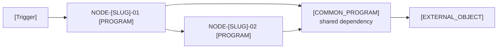

# Flow Analysis: [Business Event Name] (FLOW-[SLUG]-[NNN])

## Metadata

- **Flow ID:** FLOW-[SLUG]-[NNN]
- **Business Event Name:** [SME-confirmed name]
- **Trigger Model:** batch job | menu | subfile | F-key | DB trigger | scheduler | API/remote
  - (If scheduler + SBMJOB: use "Scheduler (submitted via SBMJOB)", not "Scheduler → Batch Job")
- **Module:** MODULE-[SLUG]
- **Entry Node:** NODE-[SLUG]-01 (program [NAME] / OBJ-[SLUG]-[NNN])
- **Exit Node(s):** NODE-[SLUG]-[NN] ...
- **Runtime Model:** synchronous / asynchronous, real-time / batch, SLA
- **Status:** draft | needs_sme_review | approved | approved_with_non_blocking_tbd | blocked_pending_source | blocked_pending_sme

---

## Trigger Context

[Per `references/trigger-models.md`, describe how this flow starts.
Required fields depend on trigger model.]

- **Trigger Artifact:** [CL / *MENU / DSPF / trigger registration / scheduler entry / API contract]
- **Source / Configuration:** [file:line or shop tool reference]
- **Caller / Initiator:** [user role / scheduler / external system / internal program]
- **Frequency:** [cadence or event-driven description]
- **SLA:** [response time / cut-off window / throughput, if applicable]
- **Authentication Context:** [if external; how the caller is authenticated]
- **Evidence:** [EV-[SLUG]-[NNN]]

---

## Transaction Call Map

Purpose: RDi-style call/dependency view for this business transaction.
This map shows the cross-program and cross-boundary call structure for
the flow; internal subroutines remain in the `Via` field unless they are
needed to explain the transaction.

Source: derived-from-code | source-level flow header | both (matched)



### Call Chain Summary

```text
[Trigger]
    │
    ▼
NODE-[SLUG]-01 ([PROGRAM])  ── [one-line role]
    │
    ▼
NODE-[SLUG]-02 ([PROGRAM])  ── [one-line role]
    │
    ▼
[Exit]
```

**Evidence:**
- [EV-[SLUG]-[NNN]: source pointer for each edge]

---

## Nodes

| Node ID | Program (OBJ-*) | Role | Program Analysis | Coverage Status | Blocking Coverage Gaps | Notes |
| --- | --- | --- | --- | --- | --- | --- |
| NODE-[SLUG]-01 | [PROGRAM] (OBJ-[SLUG]-[NNN]) | entry / orchestrator / worker / data-access / reporter / exit | `program-analysis-OBJ-[SLUG]-[NNN].md` | mode=<standard|segmented|large_program>; readiness=<approved|warning|blocked>; routines=<deep_read|indexed_only|blocked> | none / TBD-[SLUG]-[NNN] [routine indexed_only with state impact; route to program analyzer unless named SME waiver recorded] | [notes] |

**Missing program analyses:** none | TBD-[SLUG]-[NNN] for each

---

## Edges

| Edge ID | From -> To | Via | Call Type | Site (program:line) | Condition | Evidence |
| --- | --- | --- | --- | --- | --- | --- |
| EDGE-[SLUG]-01 | (trigger) -> NODE-[SLUG]-01 | N/A | [type] | [pointer] | always | EV-... |
| EDGE-[SLUG]-02 | NODE-[SLUG]-01 -> NODE-[SLUG]-02 | [SRxxx / procedure / N/A] | CALL / CALLP / CALLPRC / DTAQ | [PROGRAM]:[LINE] | [always / condition] | EV-... |

---

## Common Dependencies

| Common Node | Inbound Callers | Role Classification | Main Graph Treatment | Risk Notes | Evidence |
| --- | --- | --- | --- | --- | --- |
| [COMMON_PROGRAM] | [NODE-01, NODE-02] | shared utility / business state changer / unknown | expanded / folded as hub | [why it matters] | [EV-*] |

**Expansion rule:** if the common node changes business state, writes a
business file, controls commit/rollback, makes an approval/decline
decision, or calls an external business system, keep it expanded as a
formal flow node. If it is logging, message formatting, date/time,
delay/wait, or another technical utility, it may be folded in the visual
map but must remain in this table and in the edge table.

---

## Cross-Program Data Flow

| Data ID | Carrier | Producer | Consumer | Mechanism | Payload / Key Fields | Direction & Timing | State Impact | Evidence |
| --- | --- | --- | --- | --- | --- | --- | --- | --- |
| DATA-[SLUG]-01 | EDGE-[SLUG]-01 / [OBJECT] | NODE-[SLUG]-01 | NODE-[SLUG]-02 | CALL parameters / DTAARA / DTAQ / shared file / spool / IFS / MSGQ / DSPF / actgrp-globals / out-of-band | [field name + type / record / message] | sync in / sync out / async / batch-later / manual | read-only / creates / updates / deletes / external handoff | EV-... |

**Critical trails:**
- [Business data item]: [producer] -> [carrier/object] -> [consumer] -> [downstream outcome]

---

## Flow Replay Path

Purpose: replay the business transaction from trigger to terminal outcome,
using only evidence-backed nodes, edges, data exchanges, persistence rows,
exception chains, and UI surfaces.

| Replay Step | Trigger / Node / Edge | Input / Carrier | Logic / Decision | Persistence / Output | Error / Alternate Path | Evidence |
| --- | --- | --- | --- | --- | --- | --- |
| REPLAY-[SLUG]-01 | [trigger or NODE-*] | [field, parameter, file, UI, queue] | [decision, call, branch, loop, or N/A] | [PERSIST-* / UI-* / response / N/A] | [EXCHAIN-* / branch / N/A] | [EV-*] |

**Replay summary:**
```text
[trigger]
  -> [NODE / data handoff]
  -> [decision]
  -> [persistence/output]
  -> [final outcome]
```

---

## Cross-Program Field Lineage

Purpose: stitch program-local field lineages across CALL parameters, shared
files, data areas, queues, screens, spool, IFS files, and manual handoffs.

| Lineage ID | Business Data Item | Source Field / Node | Carrier / Edge | Consumer Field / Node | Transform / Decision | Final Persistence / Output | Evidence |
| --- | --- | --- | --- | --- | --- | --- | --- |
| LINEAGE-[SLUG]-01 | [customer id / amount / status / error code] | [NODE + field] | [EDGE/DATA/object] | [NODE + field] | [calculation / branch / no transform] | [PERSIST-* / response / report / UI] | [EV-*] |

**Unresolved lineage:**
- TBD-[SLUG]-[NNN]: [missing program-analysis lineage, carrier field, DDS/copybook, or SME handoff confirmation]

---

## Flow Persistence Matrix

Purpose: aggregate program-level field mutations into transaction-level data
outcomes. Do not repeat every program-local assignment; include only writes,
updates, deletes, skipped mutations, and external durable outputs that matter
to the flow outcome.

| Persist ID | Node / Routine | File / Object | Operation | Key / Condition | Fields Mutated / Output | Driven By | Commit / Rollback Impact | Downstream Consumer | Evidence |
| --- | --- | --- | --- | --- | --- | --- | --- | --- | --- |
| PERSIST-[SLUG]-01 | [NODE / routine] | [PF/LF/DSPF/PRTF/DTAQ/MSGQ/IFS/API] | WRITE / UPDATE / DELETE / SQL DML / send / spool / N/A skipped | [key and branch condition] | [field names or output payload] | [LINEAGE-* / DATA-* / literal / RC] | [commit, rollback, retry, skipped] | [node/system/user] | [EV-*] |

**Read-only flow:** N/A only when all upstream program analyses confirm no
persisted file mutations or durable external outputs.

---

## Branch Points

| Branch Ref | Location (node + line) | Decider | Alternatives | Evidence |
| --- | --- | --- | --- | --- |
| EDGE-[SLUG]-NN / NODE-[SLUG]-NN | NODE-[SLUG]-NN line XXX | [field / condition] | [outcome A → EDGE-X; outcome B → EDGE-Y] | EV-... |

**Unhandled branches:** none | list

---

## UI Surfaces

[For interactive flows only. Otherwise: `N/A — non-interactive flow`]

| Surface ID | Object | Type | Displayed By | Key Fields | F-Keys Handled | Evidence |
| --- | --- | --- | --- | --- | --- | --- |
| UI-[SLUG]-01 | [DSPF/PRTF/MENU] | [type] | NODE-[SLUG]-NN | [fields] | [F-keys] | EV-... |

---

## Error Propagation & Commit Boundaries

### Error Conditions Per Node

| Node | Error Condition | Detection | Local Handling | Propagated To Caller | Evidence |
| --- | --- | --- | --- | --- | --- |

### Flow-Level Error Outcomes

| Trigger Error | What Happens | Operator Visibility | Recovery |
| --- | --- | --- | --- |

### Exception Propagation Chain

| Chain ID | Source Node | Message ID / Error Code / RC | Propagation Carrier | Caller Reaction | Skipped / Allowed Downstream Edges | Persistence Impact | Final Flow Outcome | Evidence |
| --- | --- | --- | --- | --- | --- | --- | --- | --- |
| EXCHAIN-[SLUG]-01 | [NODE-*] | [CPF*/SQL*/UCC*/literal/RC] | [CALL out parm / MSGQ / exception / file status] | [branch, return, retry, abort, continue] | [EDGE-* skipped/allowed] | [PERSIST-* committed/skipped/rolled back] | [decline / abort / continue / operator action] | [EV-*] |

### Commit Boundaries

```text
[Sequence with annotated commit points]
```

**Vulnerable Windows:**
- [Description of any in-flight state risks]

---

## Business Capability Seeds

| Seed ID | Candidate Rule / Capability | Business Signal | Evidence Basis | SME Question |
| --- | --- | --- | --- | --- |
| SEED-[SLUG]-01 | [business-language candidate] | [business event / outcome / control suggested by the flow] | [NODE-* / EDGE-* / DATA-* / field / object pointers] | [business-language question for SME] |

Keep candidate statements and SME questions business-readable. Technical node,
program, field, and object references belong in `Evidence Basis`.

---

## TBDs & Blocking Status

### Pending Source
- **TBD-[SLUG]-[NNN]:** [question]
  - Blocking: pending_source
  - Routes to: [legacy-ibmi-inventory | legacy-ibmi-program-analyzer]
  - Related: [OBJ-* / NODE-* / EDGE-* / DATA-*]

### Pending SME Judgment
- **TBD-[SLUG]-[NNN]:** [question]
  - Blocking: pending_sme_judgment

### Non-Blocking
- **TBD-[SLUG]-[NNN]:** [question]
  - Blocking: non_blocking

---

## Review Checklist

Before approval, SME must validate:

- [ ] Trigger model correctly identified
- [ ] Business event name accurately reflects the business transaction
- [ ] All nodes in scope (no missing, no extras)
- [ ] All edges reflect actual production calls
- [ ] Cross-program data flow captures carriers, producers, consumers, timing, and state impacts
- [ ] Flow Replay Path can be followed from trigger to final outcome
- [ ] Cross-program field lineage preserves critical source, carrier, mutation, and output fields
- [ ] Flow Persistence Matrix lists transaction-level writes, updates, deletes, skipped mutations, and commit/rollback impacts
- [ ] Branch points capture user-visible decisions
- [ ] UI surfaces match production screens (interactive flows only)
- [ ] Error propagation matches operational reality
- [ ] Exception Propagation Chain lists observed message IDs, error codes, return codes, skipped downstream edges, and final outcomes
- [ ] Commit boundaries correctly identified
- [ ] Capability seeds are reasonable questions backed by replay, lineage, persistence, or exception evidence; not invented rules
- [ ] All node program-analyses are approved

### SME Sign-Off

- **Reviewer:** ____________________
- **Review Date:** __________________
- **Decision:** approved | approved_with_non_blocking_tbd | rejected
- **Notes:** ____________________
