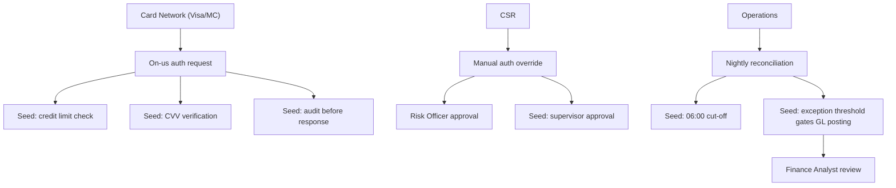
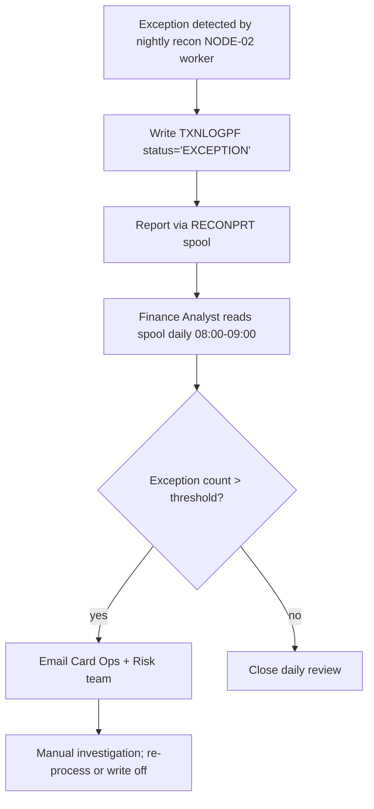

# View 1: Operation Flow / Business Background — Card Authorization

## Status: draft → needs_sme_review

## Mermaid Flow Diagram

## Business Scope

The Card Authorization module decides whether to approve or decline
card-transaction authorization requests, in real time for online channels
(Visa/Mastercard inbound) and through manual override for call-center
support, then reconciles those decisions against the GL daily. The
module spans real-time online auth + manual auth + nightly reconciliation
but excludes settlement (separate module) and dispute (CHARGEBACK module).

Source: Anna Chen (Card Ops) interview 2026-05-12; cross-checked against
flow analyses.

## Business Actors

| Actor ID | Name / Role | Description | Source |
| --- | --- | --- | --- |
| ACTOR-CARD-AUTH-01 | Cardholder | Person making the transaction; never directly interacts with this module | SME |
| ACTOR-CARD-AUTH-02 | Merchant | Initiates authorization via card network | SME |
| ACTOR-CARD-AUTH-03 | Card Network (Visa/MC) | Forwards auth requests on behalf of merchants | SME + Trigger Context of FLOW-ONUS-AUTH |
| ACTOR-CARD-AUTH-04 | CSR (Customer Service Rep) | Performs manual authorization for phone/branch | SME + Trigger of FLOW-MANUAL-AUTH |
| ACTOR-CARD-AUTH-05 | Risk Officer | Reviews flagged manual auths; approves overrides | SME (manual_actor: yes) |
| ACTOR-CARD-AUTH-06 | Operations | Monitors nightly recon job; handles failures | SME (manual_actor: yes) |
| ACTOR-CARD-AUTH-07 | Finance Analyst | Reviews exception report each morning | SME (manual_actor: yes) |

## Business Events

| Event ID | Event Name | Trigger | Flow ID |
| --- | --- | --- | --- |
| EVENT-CARD-AUTH-01 | On-us auth request | Visa/MC API inbound | FLOW-ONUS-AUTH-001 |
| EVENT-CARD-AUTH-02 | Manual auth override | CSR menu option 7 | FLOW-MANUAL-AUTH-001 |
| EVENT-CARD-AUTH-03 | Nightly reconciliation | Scheduler 22:00 daily | FLOW-NIGHTLY-RECON-001 |

## BAU Rhythm

| BAU Item | Cadence | Owner | Notes |
| --- | --- | --- | --- |
| Online auth volume | Peak Mon–Fri 12:00–14:00, Sat 10:00–22:00 | Card Ops | From SME observation |
| Manual auth volume | ~50/day; spike during system outages | CSR team | From SME |
| Nightly recon cut-off | Must complete before 06:00 next day | Finance/Ops | Downstream GL consolidation dependency |
| Morning exception review | 08:00–09:00 daily | Finance Analyst | Reads RECONPRT spool |
| Manual override approval | On-demand; ~5/week | Risk Officer | Supervisor sign-off in menu |

## Manual Intervention Points

| Intervention | When | Who | What | Source |
| --- | --- | --- | --- | --- |
| Manual auth override | CSR receives phone call requesting auth | CSR + Risk Officer | CSR enters via menu; Risk Officer approves on screen | SME + FLOW-MANUAL-AUTH |
| Partial-restart of recon | After NIGHTLY-RECON failure post-midnight | Operations | Re-run RECONSQL only against existing GLPOSTPF rows | SME (see FLOW-NIGHTLY-RECON SEED-04) |
| Exception report review | Daily morning 08:00 | Finance Analyst | Reads spool; emails Card Ops if exceptions exceed threshold | SME |

## Exception Lifecycle

Source: Anna Chen 2026-05-12.

## Business Rule Seeds (Module-Level)

| Seed ID | Candidate Rule | Business Signal | Evidence Basis | SME Question |
| --- | --- | --- | --- | --- |
| BR-CARD-AUTH-01 | Credit limit must be respected for every on-us auth | Authorization approval depends on cardholder exposure staying within limit | FLOW-ONUS-AUTH SEED-01 | Regulatory (PBOC) or operational policy? |
| BR-CARD-AUTH-02 | CVV verification required | Security validation affects whether a transaction may proceed | FLOW-ONUS-AUTH SEED-02 | All transactions or only ATMP? |
| BR-CARD-AUTH-03 | Audit row must persist before response | Authorization decision is recorded before external response | FLOW-ONUS-AUTH SEED-03 | Hard requirement (compliance) or best-effort? |
| BR-CARD-AUTH-04 | Manual override requires supervisor approval | Manual approval path includes a control point before override completion | FLOW-MANUAL-AUTH (DSPF F-key handling) | Always required, or threshold-based? |
| BR-CARD-AUTH-05 | Reconciliation must complete before 06:00 cut-off | Finance/GL readiness depends on daily reconciliation completion | FLOW-NIGHTLY-RECON SEED-01 | Hard regulatory deadline or downstream SLA? |
| BR-CARD-AUTH-06 | Exception threshold gates GL posting | Exception volume can stop or defer GL posting | FLOW-NIGHTLY-RECON SEED-02 | Threshold value + ownership? |

## TBDs

### Pending Source
- (none — flows all approved)

### Pending SME Judgment
- TBD-CARD-AUTH-001 — Confirm BR-01 regulatory vs operational
- TBD-CARD-AUTH-002 — Confirm BR-06 threshold value and owner

### Non-Blocking
- TBD-CARD-AUTH-003 — Document manual-override approval threshold (BR-04)

## SME Sign-Off
- **Reviewer:** Anna Chen
- **Review Date:** pending
- **Decision:** draft → needs_sme_review
- **Notes:** 2 pending SME judgments around regulatory framing
