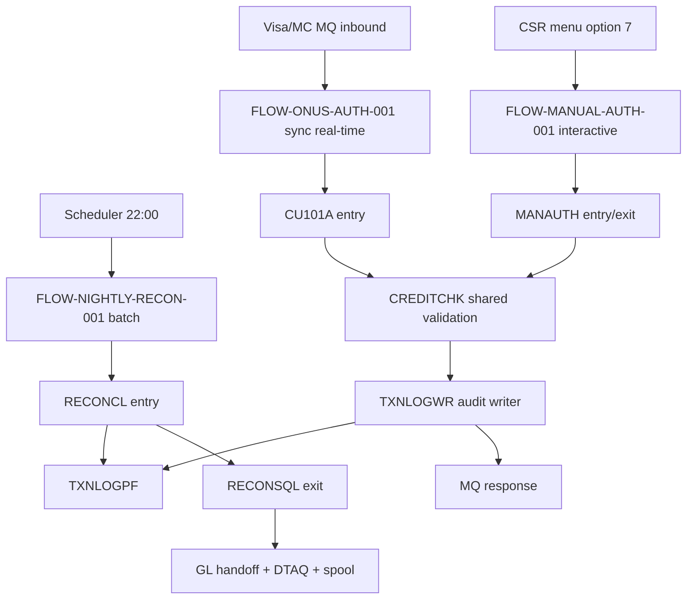

# View 3: Program Flow — Card Authorization

## Status: draft → needs_sme_review

## Mermaid Flow Diagram

## Flow Inventory

| Flow ID | Business Event | Trigger Model | Entry Program | Exit Program | Runtime |
| --- | --- | --- | --- | --- | --- |
| FLOW-ONUS-AUTH-001 | On-us auth request | API/Remote (MQ) | CU101A | CU199Z | sync, real-time, P95 < 800ms |
| FLOW-MANUAL-AUTH-001 | Manual override via CSR | Interactive Menu | MANAUTH | MANAUTH | sync, interactive, sub-second |
| FLOW-NIGHTLY-RECON-001 | Nightly reconciliation | Scheduler+Batch | RECONCL | RECONSQL | async, batch, 1–3 hours |

## Cross-Flow Dependencies

| From Flow | To Flow | Mechanism | Reason | Evidence |
| --- | --- | --- | --- | --- |
| FLOW-ONUS-AUTH-001 | FLOW-NIGHTLY-RECON-001 | Shared file TXNLOGPF | Online auth writes log; recon reads | FLOW-ONUS-AUTH DATA-05 ↔ FLOW-NIGHTLY-RECON DATA-03 |
| FLOW-MANUAL-AUTH-001 | FLOW-NIGHTLY-RECON-001 | Shared file TXNLOGPF | Manual auth also writes log | (computed from data-flow sections) |

## Shared Sub-Programs (called by multiple flows)

| Program | Called By Flows | Role | Notes |
| --- | --- | --- | --- |
| CREDITCHK (OBJ-CARD-AUTH-110) | FLOW-ONUS-AUTH, FLOW-MANUAL-AUTH | Credit-limit check utility | Shared validation; modernization hotspot |
| TXNLOGWR (OBJ-CARD-AUTH-120) | FLOW-ONUS-AUTH, FLOW-MANUAL-AUTH | Audit-log writer | Single writer point — keeps audit consistent |

## Overall Call Topology

The Mermaid diagram above is the aggregate call topology. Its shared
`CREDITCHK`, `TXNLOGWR`, and `TXNLOGPF` edges are backed by the approved
`FLOW-ONUS-AUTH`, `FLOW-MANUAL-AUTH`, and `FLOW-NIGHTLY-RECON` analyses.

## TBDs

### Pending Source
- (none — all flow analyses approved)

### Pending SME Judgment
- TBD-CARD-AUTH-PGM-001 — Confirm whether CREDITCHK has any callers outside this module (potential cross-module shared utility)

### Non-Blocking
- (none)

## SME Sign-Off
- **Reviewer:** Liu Wei (Dev Lead) — pending
- **Decision:** draft → needs_sme_review
