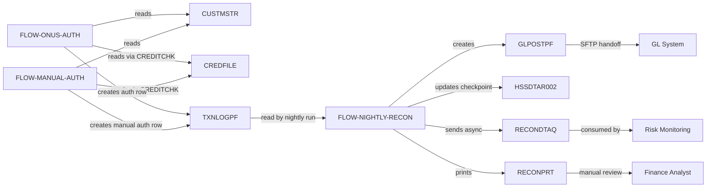
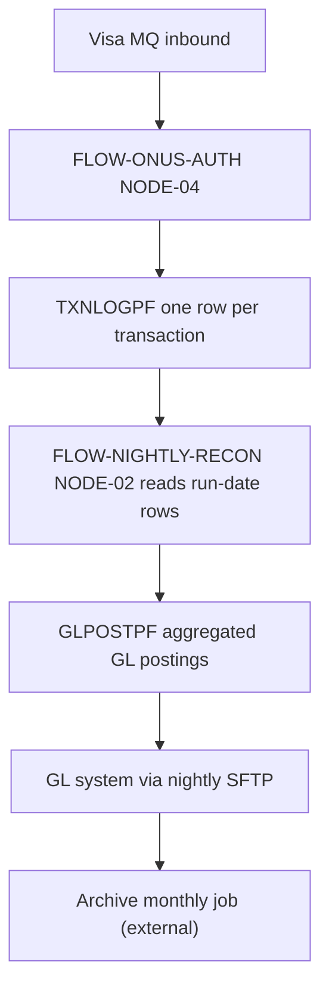

# View 4: Data Flow — Card Authorization

## Status: draft → needs_sme_review

## Mermaid Flow Diagram

## Data Objects in Scope

| Object | Type | Inventory ID | Producer Flows | Consumer Flows | Coupling Score | Evidence |
| --- | --- | --- | --- | --- | --- | --- |
| TXNLOGPF | PF | OBJ-CARD-AUTH-050 | FLOW-ONUS-AUTH, FLOW-MANUAL-AUTH | FLOW-NIGHTLY-RECON | 3 (HIGH) | EV / object-deps in all 3 flows |
| CUSTMSTR | PF | OBJ-CARD-AUTH-080 | (external — CUSTOMER-MASTER module) | FLOW-ONUS-AUTH, FLOW-MANUAL-AUTH | 2 (read-only here) | EV |
| CREDFILE | PF (DS) | OBJ-CARD-AUTH-081 | (external — CUSTOMER-MASTER module) | FLOW-ONUS-AUTH (via CREDITCHK), FLOW-MANUAL-AUTH (via CREDITCHK) | 2 | EV |
| GLPOSTPF | PF | OBJ-CARD-AUTH-060 | FLOW-NIGHTLY-RECON | (external — GL system) | 1 (outbound) | EV |
| RECONDTAQ | *DTAQ | OBJ-CARD-AUTH-070 | FLOW-NIGHTLY-RECON | (external — Risk Monitoring) | 1 | EV |
| RECONPRT | PRTF | OBJ-CARD-AUTH-071 | FLOW-NIGHTLY-RECON | (manual — Finance Analyst) | 1 | EV |
| HSSDTAR002 | *DTAARA | OBJ-CARD-AUTH-090 | FLOW-NIGHTLY-RECON | FLOW-NIGHTLY-RECON | 1 (internal) | EV |
| AUTHTPDS | PF (DS) | OBJ-CARD-AUTH-018 | (external — Visa interface) | FLOW-ONUS-AUTH | 1 | EV |

## Data Lifecycle

| Object | Created By | Updated By | Read By | Archived By | Purged By |
| --- | --- | --- | --- | --- | --- |
| TXNLOGPF | FLOW-ONUS-AUTH, FLOW-MANUAL-AUTH (per auth) | (append-only — never updated) | FLOW-NIGHTLY-RECON | monthly archive job (external — out of module) | yearly purge (external) |
| GLPOSTPF | FLOW-NIGHTLY-RECON | (none — single write per row) | GL system (external) | weekly truncate after GL SFTP confirmed (external) | n/a |
| HSSDTAR002 | FLOW-NIGHTLY-RECON (read-modify-write each day) | FLOW-NIGHTLY-RECON | FLOW-NIGHTLY-RECON | n/a (overwritten daily) | n/a |
| RECONPRT | FLOW-NIGHTLY-RECON (daily spool) | n/a | Finance Analyst (manual) | spool retention 30 days (system policy) | system spool purge |

## Coupling Hotspots (Modernization Risks)

| Object | Coupling Score | Risk | Mitigation |
| --- | --- | --- | --- |
| TXNLOGPF | HIGH (3 flows) | Schema change ripples through 3 flows + downstream nightly recon | Versioned record format; backward-compatible adds only; coordinate releases of all 3 flows |
| CUSTMSTR | MEDIUM (2 flows, read-only here) | Owned by CUSTOMER-MASTER module; we depend on its schema stability | Cross-module schema contract required |

## Critical Data Trails

**Authorization → Audit → Reconciliation → GL trail:**

## DB Table Relationships

| Parent | Child | FK | Notes |
| --- | --- | --- | --- |
| CUSTMSTR (CustID PK) | CREDFILE (CustID FK) | CustID | Customer master → credit profile |
| TXNLOGPF (TxnID PK) | GLPOSTPF (TxnID FK) | TxnID | One transaction → one or more GL posting rows |

## Cross-Module Data Dependencies

| Object | Owned By Module | Used By This Module | Mechanism | TBD? |
| --- | --- | --- | --- | --- |
| CUSTMSTR | CUSTOMER-MASTER | CARD-AUTH (read-only via CHAIN) | Direct file access | needs cross-module agreement (TBD-CARD-AUTH-001 captured in overview) |
| CREDFILE | CUSTOMER-MASTER | CARD-AUTH (read-only via EXTNAME) | Direct DDS reference | same TBD |
| GLPOSTPF | CARD-AUTH (we produce) | GL System (external) | File handoff + SFTP | confirmed via integration spec |

## TBDs

### Pending Source
- TBD-CARD-AUTH-DAT-001 — Confirm TXNLOGPF schema version; need to coordinate with FLOW-ONUS-AUTH SEED-04 idempotency strategy

### Pending SME Judgment
- TBD-CARD-AUTH-DAT-002 — Confirm GLPOSTPF retention policy after SFTP success; SME (Maria Lopez) checking

### Non-Blocking
- TBD-CARD-AUTH-DAT-003 — Document HSSDTAR002 checkpoint field format

## SME Sign-Off
- **Reviewer:** Maria Lopez (Data Analyst) — pending
- **Decision:** draft → needs_sme_review
