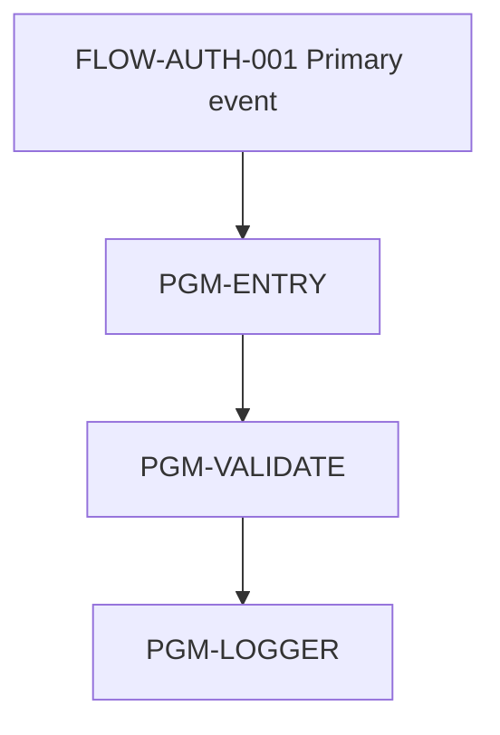
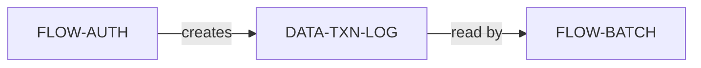

# Output Contract: Module Analysis

This document defines the canonical file shape for
`04_modules/<MODULE-SLUG>/`.

The default module-analysis package is intentionally focused on evidence-backed
program and data coverage. Do not generate `01-operation-flow.md` or
`02-system-flow.md` by default; operation and system context often requires
stronger SME or architecture evidence than code-backed runs provide. When such
context is available, preserve it in `module-overview.md` and the BRD crosswalk
with source eligibility.

Do not concatenate full flow or program Markdown to build module views. Use
approved flow rows and core compact child program artifacts first:
`program-analysis-summary.yaml`, `source-index.yaml`,
`routine-logic-details.yaml`, and `message-inventory.yaml`. Optional sidecars
(`file-io-inventory.yaml`, `field-mutation-matrix.yaml`, and
`sql-inventory.yaml`) are required only when triggered by program tier or when
module claims need file I/O, persisted mutation, or SQL evidence.
Human-readable Markdown is for targeted clarification only.

## File Structure

```text
04_modules/<MODULE-SLUG>/
├── module-overview.md
├── 03-program-flow.md
├── 04-data-flow.md
└── module-review-checklist.md
```

## `module-overview.md`

````markdown
# Module: [Business Module Name] (MODULE-<SLUG>-001)

## Metadata
- **Module ID:** MODULE-AUTH-MODULE-001
- **Business Name:** Authorization Processing
- **Scope Statement:** [SME-confirmed or source-backed paragraph]
- **Module Owner:** [SME name / role]
- **Evidence Mode:** code_backed | context_only
- **BRD Source Eligibility:** code_backed_only | mixed_with_questions | questions_only
- **In-scope Flows:** [list of FLOW-* with link to each flow analysis]
- **Status:** draft | needs_sme_review | approved | approved_with_non_blocking_tbd |
  blocked_pending_source | blocked_pending_sme | rejected
- **Mermaid Preview Status:** not_requested | skipped_large_module | passed | failed | timed_out
- **Completion Boundary:** stop_after_writeback

## Evidence View Index
| View | File | Status | Reviewer |
| --- | --- | --- | --- |
| Program Flow | 03-program-flow.md | [status] | [dev lead] |
| Data Flow | 04-data-flow.md | [status] | [data owner] |

## Optional Source-Backed Context Notes
| Context Area | Source | Eligibility | Notes / TBD |
| --- | --- | --- | --- |
| Business operation / BAU | [SME note / source doc] | confirmed_by_sme / source_documented / missing | [summary or TBD-*] |
| Channels / systems / interfaces | [flow trigger / integration spec / SME] | code_backed / source_documented / missing | [summary or TBD-*] |

## Top Blocking TBDs
[Aggregate pending_source and pending_sme_judgment TBDs from overview, Program
Flow, and Data Flow.]

## Module Program-Chain Readiness
| Flow ID | Replay Coverage | Edge Resolution Coverage | Critical Lineage Coverage | Persistence Coverage | Exception Chain Coverage | Blocking Gap |
| --- | --- | --- | --- | --- | --- | --- |
| FLOW-AUTH-001 | complete (`REPLAY-AUTH-001`) | complete | partial (`LINEAGE-AUTH-001`) | complete (`PERSIST-AUTH-001`) | complete (`EXCHAIN-AUTH-001`) | TBD-* or none |

## Flow Artifact Set
| Flow ID | Flow Analysis | Program Summary | Source Index | Routine Logic | Message Inventory | File I/O | Mutation Matrix | SQL Inventory | Gap / Waiver |
| --- | --- | --- | --- | --- | --- | --- | --- | --- | --- |
| FLOW-AUTH-001 | `flow-FLOW-AUTH-001.md` | `program-analysis-summary.yaml` present | `source-index.yaml` present | `routine-logic-details.yaml` present | `message-inventory.yaml` present | `file-io-inventory.yaml` present / optional_not_triggered / missing_when_needed | `field-mutation-matrix.yaml` present / optional_not_triggered / missing_when_needed | `sql-inventory.yaml` present / not_applicable / missing_when_needed | none / TBD-* |

## Module Persistence & Critical Field Summary
| Data / Field / Outcome | Source Flows | Persistence / Output With Purpose | Downstream Consumer | Risk / TBD |
| --- | --- | --- | --- | --- |
| AUTH_STATUS (authorization status) | FLOW-AUTH-001 (`LINEAGE-*`, `PERSIST-*`) | response + AUTHLOGPF write | external partner + nightly recon | TBD-* or none |

## Module Exception & Recovery Summary
| Exception Cluster | Source Flow / EXCHAIN | Error Type / Output Carrier | Business Outcome | Manual / Operational Recovery | BRD Coverage / TBD |
| --- | --- | --- | --- | --- | --- |
| RC=-2 / message family | FLOW-BATCH-001 (`EXCHAIN-*`) | validation threshold / RC out parameter + spool | GL posting skipped | Finance review | covered / TBD-* |

## Capability Seeds For BRD / Spec
| CAP Seed | Business Signal | Evidence Basis | SME Question |
| --- | --- | --- | --- |
| CAP-AUTH-MODULE-001 | [business event / outcome / policy cluster] | Program/Data flow evidence + SME scope | [boundary question] |

## BRD Functional Analysis Input Crosswalk
| BRD Section | SME-Required Area | Primary Module Source | Evidence / IDs | Source Eligibility | Coverage Status | Carry-Forward TBD |
| --- | --- | --- | --- | --- | --- | --- |
| 1 | Function Purpose | Module scope statement + SME/source notes | EV-* / SME note | brd_conclusion_allowed / needs_sme_review / questions_only | covered / partial / missing | TBD-* or none |
| 2 | Business Scenarios / Use Cases | In-scope flows + Program Flow replay coverage + SME/source notes | FLOW-* / REPLAY-* / EV-* | brd_conclusion_allowed / needs_sme_review / questions_only | covered / partial / missing | TBD-* or none |
| 3 | Channels | Flow trigger context + source-backed interface notes | FLOW-* / IF-* / EV-* | brd_conclusion_allowed / needs_sme_review / questions_only | covered / partial / missing | TBD-* or none |
| 4 | User Interface / User Touchpoints | Screen/report analysis + flow trigger context | OBJ-* / EV-* / FLOW-* | brd_conclusion_allowed / needs_sme_review / questions_only | covered / partial / missing | TBD-* or none |
| 5 | System Interfaces | Flow external calls + source-backed interface notes | IF-* / EDGE-* / EV-* | brd_conclusion_allowed / needs_sme_review / questions_only | covered / partial / missing | TBD-* or none |
| 6 | Process Flow | Program Flow replay coverage + Flow Replay Path | FLOW-* / REPLAY-* / EV-* | brd_conclusion_allowed / needs_sme_review / questions_only | covered / partial / missing | TBD-* or none |
| 7 | Validation Rules | Program/flow Validation Logic + field lineage + exception-chain seeds | LINEAGE-* / EXCHAIN-* / EV-* | brd_conclusion_allowed / needs_sme_review / questions_only | covered / partial / missing | TBD-* or none |
| 8 | Error Handling | Module Exception Summary + flow Exception Propagation Chain | EXCHAIN-* / EV-* / FLOW-* | brd_conclusion_allowed / needs_sme_review / questions_only | covered / partial / missing | TBD-* or none |
| 9 | Dependencies | Program Flow dependencies + Data Flow persistence/dependencies | DATA-* / OBJ-* / PERSIST-* / LINEAGE-* / EV-* | brd_conclusion_allowed / needs_sme_review / questions_only | covered / partial / missing | TBD-* or none |
| 10 | Security / Authentication (optional) | Source-backed interface/security notes | IF-* / EV-* | brd_conclusion_allowed / needs_sme_review / questions_only | optional_covered / not_evidenced | TBD-* or none |
| 11 | Workflow / Design Notes (optional) | Program Flow topology or supplied workflow docs | FLOW-* / DOC-* / EV-* | brd_conclusion_allowed / needs_sme_review / questions_only | optional_covered / not_evidenced | TBD-* or none |
| 12 | Source Document Mapping (optional) | Context package / evidence map / source document index | DOC-* / FRAG-* / EV-* | brd_conclusion_allowed / needs_sme_review / questions_only | optional_covered / not_evidenced | TBD-* or none |

## BRD Source Eligibility Crosswalk
| Source Type | Eligible BRD Use | Required Handling |
| --- | --- | --- |
| `code_backed` / approved flow-program evidence | BRD conclusion, observed behavior, dependency, or process step | Cite `EV-*`, `FLOW-*`, `REPLAY-*`, `LINEAGE-*`, `PERSIST-*`, or `EXCHAIN-*` |
| `confirmed_by_sme` | BRD conclusion or business context | Record SME name/role/date or linked review decision |
| `source_documented` | Supporting source mapping or review prompt until confirmed | Mark `needs_sme_review` unless explicitly approved |
| `candidate_only` | Question or candidate seed only | Convert to `TBD-*`; do not write as BRD prose |
| `generated_draft` | Coverage gap or review question only | Convert to `TBD-*`; do not write as BRD prose |
| `missing` | Gap | Carry `TBD-*` with resolver |

## Module Review Checklist
- [ ] Program Flow is at least `approved_with_non_blocking_tbd`
- [ ] Data Flow is at least `approved_with_non_blocking_tbd`
- [ ] For `code_backed` mode, `01_inventory/object-map.md`, in-scope
      `flow-*.md` artifacts and compact program artifacts are present and
      approved: `program-analysis-summary.yaml`, `source-index.yaml`,
      `routine-logic-details.yaml`, `message-inventory.yaml`,
      `file-io-inventory.yaml`, `field-mutation-matrix.yaml`, and
      `sql-inventory.yaml`
- [ ] Replay / field-lineage / persistence / exception-chain coverage is
      summarized for every in-scope flow, or named TBD / waiver recorded
- [ ] BRD sections 1-9 have crosswalk coverage or named carry-forward TBDs
- [ ] No BRD section is marked covered using only candidate/generated or
      unreviewed source-documented context
- [ ] No blocking TBDs remain
- [ ] Capability seeds reviewed
- [ ] Module ready for BRD writer

## Sign-Off
- **Module Owner:** ____
- **Date:** ____
- **Decision:** ____
````

## `03-program-flow.md`

````markdown
# Program Flow — [Module Name]

## Status: draft | needs_sme_review | approved | approved_with_non_blocking_tbd | blocked_pending_source | rejected

## Mermaid Flow Diagram



## Flow Inventory
| Flow ID | Business Event | Trigger Model | Entry Program | Exit Program | Runtime |
| --- | --- | --- | --- | --- | --- |

## Replay Coverage Summary
| Flow ID | Replay Paths Covered | Key Decision / Exception Paths | Persisted Outcomes | Missing Replay / Lineage / Persistence Gaps |
| --- | --- | --- | --- | --- |

## Compact Artifact Consumption
| Flow ID | Source Artifacts Used | Human Markdown Use |
| --- | --- | --- |
| FLOW-AUTH-001 | `flow-*.md` rows + `program-analysis-summary.yaml`, `source-index.yaml`, `routine-logic-details.yaml`, `message-inventory.yaml`, `file-io-inventory.yaml`, `field-mutation-matrix.yaml`, `sql-inventory.yaml` | targeted clarification only; do not concatenate |

## Cross-Flow Dependencies
| From Flow | To Flow | Mechanism | Reason | Evidence |
| --- | --- | --- | --- | --- |

## Shared Sub-Programs
| Program | Called By Flows | Role | Evidence / Notes |
| --- | --- | --- | --- |

## Overall Call Topology
[Explain the Mermaid topology and cite approved flow/program analyses.]

## TBDs
[Group pending_source, pending_sme_judgment, and non_blocking TBDs.]

## Review Checklist
- [ ] All flows in scope are listed
- [ ] Replay coverage is complete or carries named TBDs / waivers
- [ ] Cross-flow dependencies are backed by approved flow/program evidence
- [ ] Shared sub-programs are correctly identified
- [ ] Diagram nodes/edges trace to rows or source artifacts

## SME Sign-Off
- **Reviewer:** ____
- **Decision:** ____
````

## `04-data-flow.md`

````markdown
# Data Flow — [Module Name]

## Status: draft | needs_sme_review | approved | approved_with_non_blocking_tbd | blocked_pending_source | rejected

## Mermaid Flow Diagram



## Data Objects in Scope
| Object / Carrier | Type | Inventory ID | Producer Flows | Consumer Flows | State Impact Summary | Coupling Score | Evidence |
| --- | --- | --- | --- | --- | --- | --- | --- |

## Data Lifecycle
| Object / Carrier | Created By | Updated By | Read By | Sent / Received By | Archived By | Purged By |
| --- | --- | --- | --- | --- | --- | --- |

## Module Persistence Matrix
| Object / Field / Output | Producer Flows (`PERSIST-*`) | Consumer Flows / Systems | Purpose / Operation Summary | Commit / Retry / Recovery Notes | Evidence |
| --- | --- | --- | --- | --- | --- |

Persistence rows must preserve links to flow `PERSIST-*` rows and the compact
program sidecars that support them, especially `field-mutation-matrix.yaml`,
`file-io-inventory.yaml`, and `sql-inventory.yaml` for SQLRPGLE programs.

## Critical Field Lineage Across Module
| Critical Field / Business Data | Source Flows (`LINEAGE-*`) | Carriers | Persisted / Output Locations | Consumers | TBD / Risk |
| --- | --- | --- | --- | --- | --- |

## Exception-Aware Data Risks
| Exception Chain | Data / Persist Impact | Recovery / Manual Action | Evidence / TBD |
| --- | --- | --- | --- |

## Coupling Hotspots
| Object | Coupling Score | Risk | Mitigation |
| --- | --- | --- | --- |

## Critical Data Trails
[End-to-end paths of important data, using flow `DATA-*`, `LINEAGE-*`, and
`PERSIST-*` rows as anchors.]

## DB Table Relationships
[ER-style Mermaid diagram or table listing PK/FK relationships among module PF
/ LF / SQL tables.]

## Cross-Module Data Dependencies
| Object | Owned By Module | Used By This Module | Mechanism | TBD? |
| --- | --- | --- | --- | --- |

## TBDs
[Group pending_source, pending_sme_judgment, and non_blocking TBDs.]

## Review Checklist
- [ ] Data lifecycle is backed by code/flow evidence or named TBDs
- [ ] Persistence matrix includes durable writes, skipped mutations, queues,
      spool, IFS handoffs, response payloads, checkpoints, retry/rollback
- [ ] Critical field lineage traces carriers, program boundaries, persisted
      locations, and consumers
- [ ] Exception-aware data risks map `EXCHAIN-*` rows to recovery/manual action
- [ ] Coupling hotspots and cross-module dependencies are evidence-backed

## SME Sign-Off
- **Reviewer:** ____
- **Decision:** ____
````

## `module-review-checklist.md`

```markdown
# Module Review Checklist — [Module Name]

## Module-Level Sign-Off
- [ ] `module-overview.md` approved or approved_with_non_blocking_tbd
- [ ] `03-program-flow.md` approved or approved_with_non_blocking_tbd
- [ ] `04-data-flow.md` approved or approved_with_non_blocking_tbd
- [ ] Program Flow ↔ Data Flow consistency verified
- [ ] BRD crosswalk uses only eligible sources for covered rows
- [ ] No blocking TBDs remain
- [ ] Capability seeds list is complete and SME-confirmed
- [ ] Module ready for BRD writer

## Reviewers
- Module Owner: ____ — date: ____ — decision: ____
- Program Flow Reviewer: ____ — date: ____ — decision: ____
- Data Flow Reviewer: ____ — date: ____ — decision: ____
```

## Mermaid Rules

- Use a fenced `mermaid` block with `flowchart TD` or `flowchart LR`.
- Every diagram node and edge must be backed by a row or statement in the same
  file, a source artifact, a named SME note, or a named `TBD-*`.
- If evidence is incomplete, include a placeholder node that points to the
  relevant `TBD-*`; do not draw a plausible but unsupported flow.
- Rendered preview is optional. The validation gate is the fenced Mermaid source
  plus evidence-backed node/edge traceability.

## ID Conventions

| Prefix | Artifact | Example |
|---|---|---|
| `MODULE-` | the module | `MODULE-AUTH-MODULE-001` |
| `CAP-` | capability seed (overview) | `CAP-AUTH-MODULE-001` |
| `TBD-` | open question | `TBD-AUTH-MODULE-005` |
| `EV-` | evidence | `EV-AUTH-MODULE-012` |
| `FLOW-` | flow analysis | `FLOW-AUTH-001` |
| `REPLAY-` | flow replay path | `REPLAY-AUTH-001` |
| `LINEAGE-` | field lineage | `LINEAGE-AUTH-001` |
| `PERSIST-` | persistence outcome | `PERSIST-AUTH-001` |
| `EXCHAIN-` | exception chain | `EXCHAIN-AUTH-001` |
| `DATA-` / `OBJ-` | data object / inventory object | `DATA-AUTHLOG`, `OBJ-AUTHLOGPF` |
