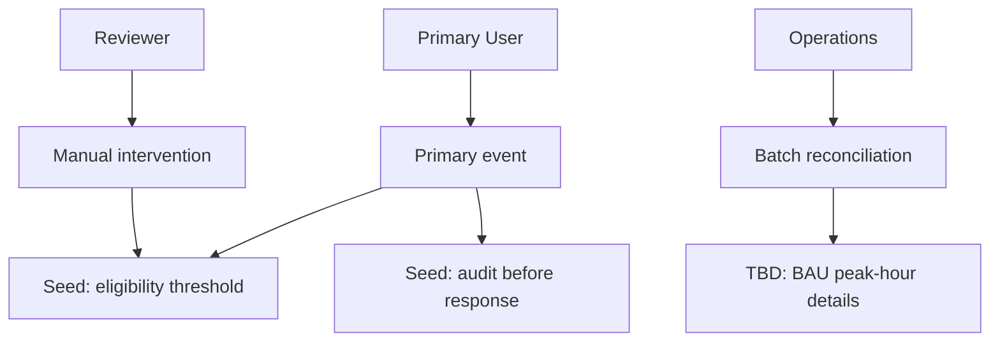
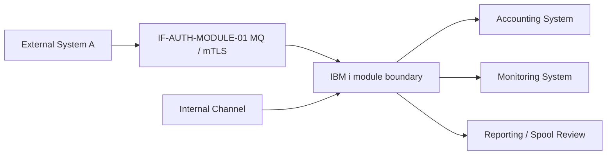
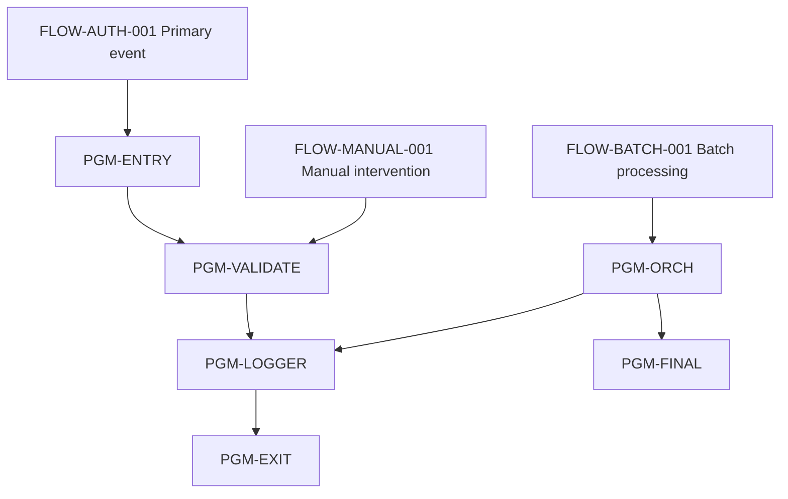
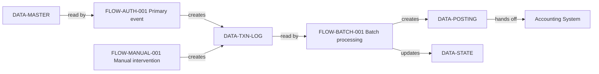

# Output Contract: Module Analysis

This document defines the precise file shape and required fields for each
of the six artifacts in `04_modules/<MODULE-SLUG>/`.

The canonical model is in `../../../docs/module-analysis-model.md`. This
document defines the *file format*; that document defines the *intent*.

---

## File 1: `module-overview.md`

```markdown
# Module: [Business Module Name] (MODULE-<SLUG>-001)

## Metadata
- **Module ID:** MODULE-AUTH-MODULE-001
- **Business Name:** Authorization Processing
- **Scope Statement:** [one paragraph from SME]
- **Module Owner:** [SME name / role]
- **Evidence Mode:** code_backed | context_only
- **In-scope Flows:** [list of FLOW-* with link to each flow analysis]
- **Status:** draft | needs_sme_review | approved | approved_with_non_blocking_tbd | 
  blocked_pending_source | blocked_pending_sme | rejected
- **Mermaid Preview Status:** not_requested | skipped_large_module | passed | failed | timed_out
- **Completion Boundary:** stop_after_writeback

**Blocked Status Values:**
- `blocked_pending_source`: One or more required object maps, flow analyses, or program analyses are missing or incomplete
- `blocked_pending_sme`: Module boundary, scope, or critical SME input (e.g., BAU notes) is missing

## View Index
| View | File | Status | Reviewer |
| --- | --- | --- | --- |
| 1. Operation Flow | 01-operation-flow.md | [status] | [SME name] |
| 2. System Flow | 02-system-flow.md | [status] | [SME name] |
| 3. Program Flow | 03-program-flow.md | [status] | [SME name] |
| 4. Data Flow | 04-data-flow.md | [status] | [SME name] |

## Top Blocking TBDs
(Aggregate of `pending_source` and `pending_sme_judgment` TBDs from all four views.)

## Module Program-Chain Readiness
| Flow ID | Replay Coverage | Critical Lineage Coverage | Persistence Coverage | Exception Chain Coverage | Blocking Gap |
| --- | --- | --- | --- | --- | --- |
| FLOW-AUTH-001 | complete (`REPLAY-AUTH-001`) | partial (`LINEAGE-AUTH-001`) | complete (`PERSIST-AUTH-001`) | complete (`EXCHAIN-AUTH-001`) | TBD-* or none |

This table is the module-level coverage check for flow-analyzer v0.2.0
surfaces. A code-backed module should not summarize a flow as understood if
replay, critical field lineage, persistence, or exception-chain coverage is
missing without a named `TBD-*` or waiver.

## Module Persistence & Critical Field Summary
| Data / Field / Outcome | Source Flows | Persistence / Output | Downstream Consumer | Risk / TBD |
| --- | --- | --- | --- | --- |
| AUTH_STATUS / decision response | FLOW-AUTH-001 (`LINEAGE-*`, `PERSIST-*`) | response + AUTHLOGPF write | external partner + nightly recon | TBD-* or none |

Use this table to surface module-level field and durable-state behavior that
BRD dependencies, validation rules, or downstream SDD data contracts must
preserve.

## Module Exception & Recovery Summary
| Exception Cluster | Source Flow / EXCHAIN | Business Outcome | Manual / Operational Recovery | BRD Coverage / TBD |
| --- | --- | --- | --- | --- |
| RC=-2 / message family | FLOW-BATCH-001 (`EXCHAIN-*`) | GL posting skipped, spool generated | Finance review next morning | covered / TBD-* |

Use this table to keep error handling reviewable at module scope. Do not reduce
multiple message IDs or return-code paths into a generic "error handled" row.

## Capability Seeds For BRD / Spec
(Module-level capability candidates; one row per CAP-*. The BRD writer turns
each selected seed into a BRD Package for SME review before the spec-writer
resolves it into one or more `spec.yaml` artifacts.)

| CAP Seed | Business Signal | Evidence Basis | SME Question |
| --- | --- | --- | --- |
| CAP-AUTH-MODULE-001 | Primary authorization event has its own business outcome, actors, and policy cluster | View 1 business event + View 3 entry flow evidence | Is the primary authorization flow a distinct business capability or part of a broader authorization capability? |

Capability seeds must be framed around business events, outcomes, policy
clusters, or operational ownership. Program flow and data flow are evidence for
the boundary; they are not the boundary itself.

## BRD Functional Analysis Input Crosswalk

This table is the module-level handoff to `legacy-brd-writer`. It does not make
the module analysis a BRD; it tells the BRD writer where the SME-required BRD
sections can safely draw evidence from, and where a `TBD-*` must be carried.

| BRD Section | SME-Required Area | Primary Module Source | Evidence / IDs | Coverage Status | Carry-Forward TBD |
| --- | --- | --- | --- | --- | --- |
| 1 | Function Purpose | View 1 Business Scope + module Scope Statement | ACTOR-* / EVENT-* / EV-* | covered / partial / missing | TBD-* or none |
| 2 | Business Scenarios / Use Cases | View 1 Business Events + BAU Rhythm + Flow Replay Path | EVENT-* / FLOW-* / REPLAY-* / EV-* | covered / partial / missing | TBD-* or none |
| 3 | Channels | View 1 Actors + View 2 Upstream Systems + flow Trigger Context | ACTOR-* / SYS-* / FLOW-* / EV-* | covered / partial / missing | TBD-* or none |
| 4 | User Interface / User Touchpoints | View 1 Manual Intervention + triggered screen/report analysis | ACTOR-* / OBJ-* / EV-* | covered / partial / missing | TBD-* or none |
| 5 | System Interfaces | View 2 Upstream / Downstream Systems + External Interfaces | SYS-* / IF-* / EV-* | covered / partial / missing | TBD-* or none |
| 6 | Process Flow | View 1 Business Events + View 3 Replay Coverage Summary + Flow Replay Path | EVENT-* / FLOW-* / REPLAY-* / EV-* | covered / partial / missing | TBD-* or none |
| 7 | Validation Rules | View 1 Business Rule Seeds + flow branch points + field lineage + exception-chain seeds | BR-* / SEED-* / LINEAGE-* / EXCHAIN-* / EV-* | covered / partial / missing | TBD-* or none |
| 8 | Error Handling | View 1 Exception Lifecycle + flow Exception Propagation Chain | TBD-* / EXCHAIN-* / EV-* / FLOW-* | covered / partial / missing | TBD-* or none |
| 9 | Dependencies | View 2 System Flow + View 4 Data Flow / Persistence + View 3 Cross-Flow Dependencies | SYS-* / DATA-* / OBJ-* / PERSIST-* / LINEAGE-* / EV-* | covered / partial / missing | TBD-* or none |
| 10 | Security / Authentication (optional) | View 2 Security & Network Boundaries | SYS-* / IF-* / EV-* | optional_covered / not_evidenced | TBD-* or none |
| 11 | Workflow / Design Notes (optional) | View 3 Call Topology or supplied workflow docs | FLOW-* / DOC-* / EV-* | optional_covered / not_evidenced | TBD-* or none |
| 12 | Source Document Mapping (optional) | Context package / evidence map / source document index | DOC-* / FRAG-* / EV-* | optional_covered / not_evidenced | TBD-* or none |

Rules:

- Sections 1-9 should be `covered` or `partial` before BRD drafting; `missing`
  creates a BRD input gap and must name a `TBD-*`.
- Optional sections 10-12 are `not_evidenced` unless actual source evidence or
  SME input exists. Do not invent them.
- Coverage status is not approval. SME review still happens in
  `legacy-brd-writer` / `legacy-sme-review-facilitator`.

## Module Review Checklist
- [ ] All four views are at least `approved_with_non_blocking_tbd`
- [ ] If **Evidence Mode** is `code_backed`, `01_inventory/object-map.md`,
      every in-scope `program-analysis.md`, and every in-scope `flow-*.md`
      are present and approved
- [ ] If **Evidence Mode** is `context_only`, missing object-map / program /
      flow artifacts are carried as `TBD-*` blockers and the module is not
      approved for the standard BRD/spec path
- [ ] Cross-view consistency check passed (see view 3 ↔ view 1 actor mapping, etc.)
- [ ] Module Program-Chain Readiness covers every in-scope flow's replay,
      field-lineage, persistence, and exception-chain status, or carries named
      `TBD-*` / waiver entries
- [ ] Module Persistence & Critical Field Summary captures every
      module-critical `LINEAGE-*` and durable `PERSIST-*` outcome that affects
      BRD sections 6-9
- [ ] Module Exception & Recovery Summary maps every material `EXCHAIN-*` to a
      business outcome, recovery owner, or named gap
- [ ] BRD Functional Analysis Input Crosswalk covers sections 1-9 or carries a
      named `TBD-*` for every missing / partial area
- [ ] No blocking TBDs remain
- [ ] Capability seeds reviewed by module owner / BRD reviewer before BRD drafting

## Sign-Off
- **Module Owner:** ____
- **Date:** ____
- **Decision:** ____
```

---

## Per-View Mermaid Flow Diagram Requirement

Every view file must include `## Mermaid Flow Diagram` before the evidence,
inventory, or traceability tables. This diagram is the SME-readable flow
surface; the tables remain required to prove evidence, coverage, IDs, and
review ownership.

Rendered Mermaid preview is optional. The validation gate is the fenced Mermaid
source block plus evidence-backed node/edge traceability. For large modules or
large diagrams, record preview as skipped in `module-overview.md` and do not
open IDE/browser previews unless the user explicitly asks.

Rules:

- Use a fenced `mermaid` block with `flowchart TD` unless the source order is
  explicitly left-to-right.
- Use node IDs that mirror stable IDs such as `ACTOR-*`, `EVENT-*`, `SYS-*`,
  `IF-*`, `FLOW-*`, `PGM-*`, `DATA-*`, `OBJ-*`, `BR-*`, or `TBD-*`, replacing
  hyphens with underscores.
- Every diagram node and edge must be backed by a row or statement in the same
  view, a source artifact, a named SME note, or a named `TBD-*`.
- If a view has incomplete evidence, include a placeholder Mermaid node that
  points to the relevant `TBD-*`. Do not omit the diagram.
- Do not treat table rows as a substitute for flow visualization.

---

## File 2: `01-operation-flow.md` (View 1 — Business)

````markdown
# View 1: Operation Flow / Business Background — [Module Name]

## Status: draft | needs_sme_review | approved | approved_with_non_blocking_tbd | blocked_pending_sme | rejected

## Mermaid Flow Diagram



Diagram intent: show the business flow from actors to events, manual or
exception paths, BAU outcomes, and BRD-relevant rule seeds. Keep technical
names secondary to business labels.

## Business Scope
[Paragraph from SME describing what the module does for the business.]

## Business Actors
| Actor ID | Name / Role | Description | Source |
| --- | --- | --- | --- |
| ACTOR-AUTH-MODULE-01 | Primary User | Main system user role | SME |
| ACTOR-AUTH-MODULE-02 | Secondary User | Supporting user role | SME |
| ACTOR-AUTH-MODULE-03 | Reviewer | Reviews flagged items | SME |
| ACTOR-AUTH-MODULE-04 | Operations | Monitors batch execution | SME |

## Business Events
| Event ID | Event Name | Trigger | Flow ID | Notes |
| --- | --- | --- | --- | --- |
| EVENT-AUTH-MODULE-01 | Primary event | Entry point event | FLOW-AUTH-001 | sub-second SLA |
| EVENT-AUTH-MODULE-02 | Batch reconciliation | Scheduler trigger | FLOW-BATCH-001 | cut-off time enforced |
| EVENT-AUTH-MODULE-03 | Manual intervention | User-initiated event | FLOW-MANUAL-001 | approval required |

## BAU Rhythm
| BAU Item | Cadence | Owner | Notes |
| --- | --- | --- | --- |
| Peak transactions | Mon-Fri 12:00–14:00, Sat 10:00–22:00 | Ops | from SME observation |
| Cut-off windows | Daily 06:00, Month-end 23:59 last day | Finance | from SME |
| Manual exception review | Daily morning, ~30min | Risk team | from SME |

## Manual Intervention Points
| Intervention | When | Who | What | Source |
| --- | --- | --- | --- | --- |
| Override declined auth | On-demand | Supervisor | Manually approve via menu | SME |
| Partial-restart recovery | After batch failure | Ops | Re-run last node only | SME (see flow-NIGHTLY-RECON) |
| Daily exception review | Each morning | Risk team | Read spool RECONPRT | SME |

## Exception Lifecycle
[Free-form description from SME of how exceptions flow from detection
through to resolution, cross-checked against each flow's `EXCHAIN-*` rows.
Use Mermaid when the exception lifecycle has more than one step; do not rely
on an ASCII sketch. Every material message ID, return code, skipped mutation,
retry, rollback, or manual outcome from an `Exception Propagation Chain` must
either appear here or be carried as a named `TBD-*`.]

## Business Rule Seeds
(Module-level seeds aggregating across all in-scope flows.)

| Seed ID | Candidate Rule | Business Signal | Evidence Basis | SME Question |
| --- | --- | --- | --- | --- |
| BR-AUTH-MODULE-01 | Eligibility threshold must be respected for every primary event | Primary event is allowed/blocked based on threshold decision | FLOW-AUTH-001 SEED-01 | Regulatory or operational? |
| BR-AUTH-MODULE-02 | Audit row must persist before response | Business decision is recorded before the response is returned | FLOW-AUTH-001 SEED-03 | Hard requirement or best-effort? |
| ... | ... | ... | ... |

## TBDs
(Group by blocking status, with the SME each TBD requires.)

| TBD ID | Category | Title | Required SME | Evidence Ref | Blocking |
| --- | --- | --- | --- | --- | --- |
| TBD-AUTH-MODULE-001 | pending_source | BAU notes for peak hours | Module Owner | (awaiting input) | no |

## Review Checklist — View 1

Per the SME Review Questions in SKILL.md, the reviewer should verify:

- [ ] **Business actors complete?** All roles interacting with the module are named; no inferred actors (e.g., "probably marketing uses this")
- [ ] **BAU rhythm correct?** Cut-off times, peak hours, seasonal patterns match operational reality
- [ ] **Exception procedures accurate?** Manual intervention points and escalation paths match how the team actually handles failures
- [ ] **Exception chains complete?** Material `EXCHAIN-*` rows from in-scope flows map to business outcomes, skipped work, retry/rollback behavior, and manual recovery
- [ ] **Business-rule seeds reasonable?** Seeds are phrased as open questions, not invented rules
- [ ] **Evidence linked?** Every major actor, event, BAU cadence, and intervention links to SME confirmation or source document
- [ ] **No code-hallucinations?** No procedures, actors, or timing derived solely from program names / table names

## SME Sign-Off
- **Reviewer:** ____
- **Review Date:** ____
- **Decision:** ____
- **Notes:** ____
````

---

## File 3: `02-system-flow.md` (View 2 — Integration)

````markdown
# View 2: System Flow — [Module Name]

## Status: draft | needs_sme_review | approved | approved_with_non_blocking_tbd | blocked_pending_source | blocked_pending_sme | rejected

## Mermaid Flow Diagram



Diagram intent: show upstream systems, interfaces, the IBM i module boundary,
sync/async handoff points, downstream systems, and security boundaries.

## Upstream Systems
| System ID | Name | Type | Integration Pattern | Flow(s) | Evidence |
| --- | --- | --- | --- | --- | --- |
| SYS-AUTH-MODULE-01 | External System A | External network partner | MQ (mTLS) | FLOW-AUTH-001 | EV / SME |
| SYS-AUTH-MODULE-02 | Internal Channel | Internal system channel | DTAQ (sync) | FLOW-MANUAL-001 | EV / SME |

## Downstream Systems
| System ID | Name | Type | Integration Pattern | Flow(s) | Evidence |
| --- | --- | --- | --- | --- | --- |
| SYS-AUTH-MODULE-10 | Accounting System | Internal accounting | File handoff | FLOW-BATCH-001 | EV |
| SYS-AUTH-MODULE-11 | Monitoring System | Internal monitoring | DTAQ async | FLOW-BATCH-001 | EV |
| SYS-AUTH-MODULE-12 | Reporting System | Internal reporting | spool / IFS | FLOW-BATCH-001 | EV |

## External Interfaces
| Interface ID | Counterparty | Direction | Format | SLA | Auth | Evidence |
| --- | --- | --- | --- | --- | --- | --- |
| IF-AUTH-MODULE-01 | External Partner | Bidirectional | Protocol over MQ | sub-second | mTLS + HMAC | SME / spec |

## Integration Patterns Summary
| Pattern | Used By | Async Boundary | Notes |
| --- | --- | --- | --- |
| MQ (mTLS) | External Partner | Yes (inbound queue) | retries by partner |
| File handoff | Accounting System | No (sync batch read) | cut-off enforced |
| Spool | Compliance | No (manual pickup) | morning review |

## Security & Network Boundaries
[Describe DMZ, partition boundaries, TLS termination, auth handoff, and any
edge in the Mermaid diagram that crosses a security boundary.]

## TBDs

| TBD ID | Category | Title | Required SME | Evidence Ref | Blocking |
| --- | --- | --- | --- | --- | --- |
| TBD-AUTH-MODULE-101 | pending_source | Downstream system schema contract | Integration Owner | (awaiting integration spec) | yes |

## Review Checklist — View 2

Per the SME Review Questions in SKILL.md, the reviewer should verify:

- [ ] **All upstream/downstream systems listed?** Every external counterparty and internal system boundary is named
- [ ] **Integration patterns correct?** Sync vs. async, retry logic, and SLA enforcement match actual deployment
- [ ] **SLAs accurate?** Response time, availability, and throughput requirements reflect operational contracts
- [ ] **Security boundaries enforced?** TLS, authentication, and authorization mechanisms documented
- [ ] **Evidence linked?** Each system and interface references an integration spec, deployment diagram, or SME confirmation

## SME Sign-Off
- **Reviewer:** ____
- **Review Date:** ____
- **Decision:** ____
- **Notes:** ____
````

---

## File 4: `03-program-flow.md` (View 3 — Application)

````markdown
# View 3: Program Flow — [Module Name]

## Status: draft | needs_sme_review | approved | approved_with_non_blocking_tbd | blocked_pending_source | rejected

## Mermaid Flow Diagram



Diagram intent: show aggregate program topology across flows, entry programs,
shared sub-programs, exits, and cross-flow dependencies. Do not replace this
diagram with an ASCII tree.

## Flow Inventory
| Flow ID | Business Event | Trigger Model | Entry Program | Exit Program | Runtime |
| --- | --- | --- | --- | --- | --- |
| FLOW-AUTH-001 | Primary event | Entry point | PGM-ENTRY | PGM-EXIT | sync, real-time |
| FLOW-BATCH-001 | Batch processing | Scheduler+Batch | PGM-ORCH | PGM-FINAL | async, batch |
| FLOW-MANUAL-001 | Manual intervention | Menu | PGM-MANUAL | PGM-MANUAL | sync, interactive |

## Replay Coverage Summary
| Flow ID | Replay Paths Covered | Key Decision / Exception Paths | Persisted Outcomes | Missing Replay / Lineage / Persistence Gaps |
| --- | --- | --- | --- | --- |
| FLOW-AUTH-001 | `REPLAY-AUTH-001` trigger → validation → response | approve / decline / `EXCHAIN-AUTH-001` timeout | `PERSIST-AUTH-001` AUTHLOGPF write + response | none |

Replay coverage is required for code-backed module analysis. If a legacy flow
analysis predates flow-analyzer v0.2.0, refresh the flow or record the missing
coverage as `TBD-*` / waiver instead of silently summarizing call topology.

## Cross-Flow Dependencies
| From Flow | To Flow | Mechanism | Reason |
| --- | --- | --- | --- |
| FLOW-AUTH-001 | FLOW-BATCH-001 | Shared file DATA-01 | primary event writes log; batch reads |
| FLOW-MANUAL-001 | FLOW-BATCH-001 | Shared file DATA-01 | manual event also writes log |

## Shared Sub-Programs (called by multiple flows)
| Program | Called By Flows | Role | Notes |
| --- | --- | --- | --- |
| PGM-VALIDATE | FLOW-AUTH-001, FLOW-MANUAL-001 | Validation utility | shared validation |
| PGM-LOGGER | FLOW-AUTH-001, FLOW-MANUAL-001, FLOW-BATCH-001 | Audit log writer | hot path |

## Overall Call Topology
[Explain the Mermaid topology above and cite the underlying approved flow /
program analyses for each edge.]

## TBDs

| TBD ID | Category | Title | Required SME | Evidence Ref | Blocking |
| --- | --- | --- | --- | --- | --- |
| TBD-AUTH-MODULE-201 | pending_sme | Validation utility scope in manual flow | Application SME | (awaiting SME confirmation) | no |

## Review Checklist — View 3

Per the SME Review Questions in SKILL.md, the reviewer should verify:

- [ ] **All flows in scope?** Flow Inventory lists every business event touched by this module; no missing or extra flows
- [ ] **Replay coverage complete?** Each flow has replay paths from trigger to final response, persistence, rollback, or manual outcome
- [ ] **Cross-flow dependencies correct?** Shared files, data areas, and sub-program calls accurately reflect the code and approved flow analyses
- [ ] **Shared sub-programs correctly identified?** Every CALL statement touching multiple flows is documented
- [ ] **Call topology sound?** The Transaction Call Map / Program Call Map accurately represents the actual call topology from approved flow and program analyses
- [ ] **Evidence linked?** Each node, edge, replay path, and dependency references a FLOW-* / REPLAY-* ID or approved program-analysis

## SME Sign-Off
- **Reviewer:** ____
- **Review Date:** ____
- **Decision:** ____
- **Notes:** ____
````

---

## File 5: `04-data-flow.md` (View 4 — Data)

````markdown
# View 4: Data Flow — [Module Name]

## Status: draft | needs_sme_review | approved | approved_with_non_blocking_tbd | blocked_pending_source | rejected

## Mermaid Flow Diagram



Diagram intent: show data movement and lifecycle across flows and major
objects, with edge labels such as `creates`, `updates`, `reads`, `hands off`,
`archives`, or `purges`.

## Data Objects in Scope
(Aggregated from every flow's Cross-Program Data Flow section, backed by
program Data Touch Maps, Object Dependencies, Field Mutation Matrix rows, and
Key File & Field Logic.)

| Object / Carrier | Type | Inventory ID | Producer Flows | Consumer Flows | State Impact Summary | Coupling Score | Evidence |
| --- | --- | --- | --- | --- | --- | --- | --- |
| DATA-TXN-LOG | PF | OBJ-AUTH-MODULE-050 | FLOW-AUTH-001, FLOW-MANUAL-001 | FLOW-BATCH-001 | created by online/manual flows; read by batch | 3 (HIGH) | EV |
| DATA-POSTING | PF | OBJ-AUTH-MODULE-060 | FLOW-BATCH-001 | (external — posting system) | created as file handoff | 1 | EV |
| DATA-STATE | *DTAARA | OBJ-AUTH-MODULE-070 | FLOW-BATCH-001 | FLOW-BATCH-001 | read and updated as shared checkpoint | 1 (internal) | EV |
| DATA-MASTER | PF | OBJ-AUTH-MODULE-080 | (external) | FLOW-AUTH-001 | read-only lookup | 1 | EV |

## Data Lifecycle
| Object / Carrier | Created By | Updated By | Read By | Sent / Received By | Archived By | Purged By |
| --- | --- | --- | --- | --- | --- | --- |
| DATA-TXN-LOG | FLOW-AUTH-001 (per event) | (none — append-only) | FLOW-BATCH-001, FLOW-MANUAL-001 | n/a | (monthly archive job — out of module) | (yearly purge — out of module) |

## Module Persistence Matrix
| Object / Field / Output | Producer Flows (`PERSIST-*`) | Consumer Flows / Systems | Operation Summary | Commit / Retry / Recovery Notes | Evidence |
| --- | --- | --- | --- | --- | --- |
| DATA-TXN-LOG.STATUS | FLOW-AUTH-001 (`PERSIST-AUTH-001`) | FLOW-BATCH-001 | write auth result before response | rollback sends decline response; retry not automatic | EV-* |

Include writes, updates, deletes, skipped mutations, queues, spool files, IFS
handoffs, response payloads, checkpoints, and other durable outputs. Do not
collapse field-level updates into a single file-level row when downstream
behavior depends on the field.

## Critical Field Lineage Across Module
| Critical Field / Business Data | Source Flows (`LINEAGE-*`) | Carriers | Persisted / Output Locations | Consumers | TBD / Risk |
| --- | --- | --- | --- | --- | --- |
| Authorization decision | FLOW-AUTH-001 (`LINEAGE-AUTH-001`) | request DS → work fields → AUTHLOGPF.STATUS | AUTHLOGPF, response message | partner response, nightly recon | none |

Use this section for business-critical fields and values that must be
preserved through modernization. If lineage is missing at a program boundary,
carry the gap as `TBD-*`; do not infer the missing transformation.

## Exception-Aware Data Risks
| Exception Chain | Data / Persist Impact | Recovery / Manual Action | Evidence / TBD |
| --- | --- | --- | --- |
| `EXCHAIN-BATCH-001` RC=-2 | GLPOSTPF write skipped, RECONPRT spool generated | Finance review, possible partial restart | EV-* / TBD-* |

This section makes exception paths visible to data and modernization reviewers:
failed or skipped writes are part of module behavior, not merely error text.

## Coupling Hotspots (Modernization Risks)
| Object | Coupling Score | Risk | Mitigation |
| --- | --- | --- | --- |
| DATA-TXN-LOG | HIGH (3 flows) | Schema change ripples through all flows | Maintain backward compatibility; version transactions |

## Critical Data Trails
[End-to-end paths of important data, using flow `DATA-*` rows as anchors
— e.g., authorization request -> DTAQ -> online program -> AUTHLOG -> GL
posting -> archive. Prefer Mermaid for any multi-step trail.]

## DB Table Relationships
[ER-style Mermaid diagram or table listing PK/FK relationships among the
module's PF / LF / SQL tables.]

## Cross-Module Data Dependencies
| Object | Owned By Module | Used By This Module | Mechanism |
| --- | --- | --- | --- |
| DATA-MASTER | MASTER-DATA module | AUTH-MODULE (read-only lookup) | Direct CHAIN |
| DATA-POSTING | (this module produces; Accounting consumes) | n/a | File handoff |

## TBDs

| TBD ID | Category | Title | Required SME | Evidence Ref | Blocking |
| --- | --- | --- | --- | --- | --- |
| TBD-AUTH-MODULE-301 | pending_sme | DATA-POSTING archival policy | Data Owner | (awaiting data governance) | no |

## Review Checklist — View 4

Per the SME Review Questions in SKILL.md, the reviewer should verify:

- [ ] **Data lifecycle correct?** Created / Updated / Read / Archived / Purged lifecycle per object matches code evidence and BAU (View 1)
- [ ] **Persistence matrix complete?** Durable writes, skipped mutations, response payloads, queues, spool, checkpoints, and retry/rollback effects are represented with `PERSIST-*` evidence
- [ ] **Critical field lineage complete?** Business-critical fields trace through carriers, program boundaries, persisted locations, and consumers with `LINEAGE-*` evidence
- [ ] **Exception-aware data risks captured?** `EXCHAIN-*` rows with data or persistence impact are mapped to recovery, manual action, or `TBD-*`
- [ ] **Coupling hotspots match reality?** HIGH coupling scores point to objects that are actually "scary to change" in operations
- [ ] **Cross-module dependencies identified?** Every object consumed by another module or producing for external systems is listed
- [ ] **DB relationships documented?** PK/FK, versioning, and archival strategy are clear
- [ ] **Evidence linked?** Each object, field lineage, persistence row, and lifecycle phase references an EV-* ID, OBJ-* ID, FLOW-*, LINEAGE-*, or PERSIST-* from approved analyses
- [ ] **No hallucinated fields?** Coupling scores and lifecycle phases derived solely from code and flow evidence, not speculation

## SME Sign-Off
- **Reviewer:** ____
- **Review Date:** ____
- **Decision:** ____
- **Notes:** ____
````

---

## File 6: `module-review-checklist.md`

```markdown
# Module Review Checklist — [Module Name]

## Module-Level Sign-Off

- [ ] All four views are approved (or approved_with_non_blocking_tbd)
- [ ] Cross-view consistency verified
  - [ ] Every business actor (View 1) maps to a node in View 3 OR is
        tagged as manual-only
  - [ ] Every upstream/downstream system (View 2) appears in View 3
  - [ ] Every business-rule seed (View 1) references a program / file in
        View 3 / View 4
  - [ ] Every `REPLAY-*` path in View 3 maps to a business event, exception
        outcome, persisted outcome, or named `TBD-*`
  - [ ] Every `LINEAGE-*`, `PERSIST-*`, and material `EXCHAIN-*` claim is
        represented in View 4 or explicitly waived
  - [ ] Every data object (View 4) traces to a program in View 3
- [ ] No blocking TBDs remain
- [ ] Capability seeds list is complete and SME-confirmed
- [ ] Module ready for BRD writer

## Per-View Reviewers
- View 1 (Business): ____ — date: ____ — decision: ____
- View 2 (Integration): ____ — date: ____ — decision: ____
- View 3 (Application): ____ — date: ____ — decision: ____
- View 4 (Data): ____ — date: ____ — decision: ____

## Module Owner Sign-Off
- ____ — date: ____ — decision: ____
```

---

## ID Conventions

| Prefix | Artifact | Example |
|---|---|---|
| `MODULE-` | the module | `MODULE-AUTH-MODULE-001` |
| `ACTOR-` | business actor (View 1) | `ACTOR-AUTH-MODULE-03` |
| `EVENT-` | business event (View 1) | `EVENT-AUTH-MODULE-02` |
| `SYS-` | upstream / downstream system (View 2) | `SYS-AUTH-MODULE-01` |
| `IF-` | external interface (View 2) | `IF-AUTH-MODULE-01` |
| `BR-` | business-rule seed (View 1) | `BR-AUTH-MODULE-01` |
| `CAP-` | capability seed (overview) | `CAP-AUTH-MODULE-001` |
| `TBD-` | open question | `TBD-AUTH-MODULE-005` |
| `EV-` | evidence | `EV-AUTH-MODULE-012` |

Flow / Node / Edge / Data IDs from flow-analyzer remain valid in View 3 / 4.
Flow-analyzer v0.2.0 IDs (`REPLAY-*`, `LINEAGE-*`, `PERSIST-*`, and
`EXCHAIN-*`) remain valid in module overview, View 1, View 3, and View 4.
Object IDs (`OBJ-*`) and evidence IDs (`EV-*`) from inventory and
program-analyzer remain valid throughout.
