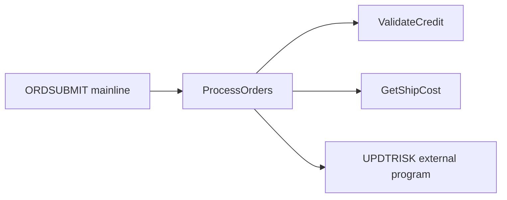

# Program Analysis: Order Submission Batch Job (OBJ-ORDER-BATCH-001)

## Metadata

- **Program ID:** OBJ-ORDER-BATCH-001
- **Program Name:** ORDSUBMIT
- **Program Type:** RPGLE
- **Library:** ORDERLIB
- **Source Location:** ORDSUBMIT (mainline + internal procedures)
- **Collection Date:** 2025-12-15
- **Entry Points:** Main (implicit)
- **Files Accessed:** ORDFILE (PF), CUSTFILE (LF), SHIPFILE (PF), CUSTMSTR (UF)
- **External Calls:** UPDTRISK
- **Status:** draft

---

## Analysis Coverage & Scope

| Field | Value |
| --- | --- |
| Source Lines | representative excerpt of larger ORDSUBMIT |
| Analysis Mode | segmented |
| Mode Reason | Batch program demonstrates large-program handling: call structure was indexed first, then hot-path/state-changing routines were deep-read. |
| Structure Index Built | yes |
| Full Source In Context | no |
| Business Narrative Allowed | yes, limited to deep-read/evidence-backed areas |

### Coverage Ledger

| Coverage Item | Count / Status | Notes |
| --- | --- | --- |
| Routines Found | 4 local + 1 external boundary | Example source index includes Main, ProcessOrders, ValidateCredit, GetShipCost, and UPDTRISK as an external edge. |
| Routines Deep-Read | 4 local + UPDTRISK boundary | Main, ProcessOrders, ValidateCredit, GetShipCost, and the UPDTRISK call contract were deep-read for this example. |
| Routines Indexed Only | 0 | No local routines left as indexed-only in the representative excerpt. |
| External Edges Resolved | 1 of 1 | UPDTRISK call site and parameters identified; return-code meanings remain TBD. |
| Data Touches Resolved | 5 of 5 | ORDFILE, CUSTMSTR, SHIPFILE, UPDTRISK parameters, and QSYSOPR message path accounted for. |
| Deep Read Windows | 5 of 5 documented windows | The representative segmented example documents every window used by this artifact. |
| Blocking Gaps | TBD-ORDER-BATCH-001, TBD-ORDER-BATCH-002, TBD-ORDER-BATCH-008 | Pending source/inventory confirmation. |
| Non-Blocking Gaps | TBD-ORDER-BATCH-006, TBD-ORDER-BATCH-007 | Scheduler and source-comment follow-up. |

### Source Index Summary

| Source Area | Lines / Scope | Coverage | Notes |
| --- | --- | --- | --- |
| Mainline | lines 28-29 | deep_read | Entry into ProcessOrders and LR behavior inspected. |
| ProcessOrders | lines 38-79 | deep_read | Batch loop, file open/close, hot-path calls, UPDTRISK boundary, and MONITOR handler inspected. |
| ValidateCredit | lines 88-94 and related compare logic | deep_read | CUSTMSTR CHAIN and credit decision path inspected. |
| GetShipCost | lines 107-112 | deep_read | SHIPFILE lookup and fallback calculation inspected. |
| External boundary | line 66 | deep_read | UPDTRISK call parameters and RC handling inspected at call site. |

---

## Program Call Map

### Visual Overview

Source: derived-from-code



### Node Inventory

| Node | Node Type | Defined At | Role / Notes | Evidence |
| --- | --- | --- | --- | --- |
| Main | Mainline | line 28 | starts batch processing | EV-ORDER-BATCH-002 |
| ProcessOrders | Procedure | lines 48-75 | main batch loop; hot path | EV-ORDER-BATCH-002 |
| ValidateCredit | Procedure | lines 90-120 | credit validation | EV-ORDER-BATCH-002 |
| GetShipCost | Procedure | lines 130-150 | shipping cost lookup/calculation | EV-ORDER-BATCH-002 |
| UPDTRISK | External Program | line 66 | customer risk profile update | EV-ORDER-BATCH-006 |

**Hub / common candidates:** ProcessOrders is the local orchestrator for this program.

**Orphaned subroutines/procedures:** None.

### Call Tree

Source: derived-from-code (no source-level flow-header comment present in this program)

```text
Main line                    Main flow control
|-- ProcessOrders            Iterate ORDFILE; validate, ship-cost, risk-update per order
|    |-- ValidateCredit      Credit limit check against CUSTMSTR
|    |-- GetShipCost         Lookup or compute shipping cost
|    |-- UPDTRISK (external) Update customer risk profile (external program)
```

**Evidence:**
- [EV-ORDER-BATCH-002: procedure calls and external CALL statement in ProcessOrders body, lines 57–67]
- No source-level flow header found — recommend adding one (non-blocking).

**Header vs. code:** N/A (no header present) → see TBD-ORDER-BATCH-007

### Call Edge Table

| From | To | Type | Line | Call Condition / Context | Evidence |
| --- | --- | --- | --- | --- | --- |
| Main | ProcessOrders | Procedure call (internal) | 28 | always (single call) | confirmed_from_code |
| ProcessOrders | ValidateCredit | Procedure call (internal) | 57 | in DOWHILE loop, every iteration | confirmed_from_code |
| ProcessOrders | GetShipCost | Procedure call (internal) | 63 | only if `CreditStatus ≠ 'D'` | confirmed_from_code |
| ProcessOrders | UPDTRISK | CALL (external prog) | 66 | only if credit approved | confirmed_from_code |

### Reverse Caller Index

| Node | Called By | Notes |
| --- | --- | --- |
| ProcessOrders | Main [line 28] | Single entry point; main batch loop |
| ValidateCredit | ProcessOrders [line 57] | Called once per ORDFILE record (hot path) |
| GetShipCost | ProcessOrders [line 63] | Conditional on credit approval |
| UPDTRISK (external) | ProcessOrders [line 66] | External program; conditional on approval |

**Orphaned subroutines:** None — every declared procedure has at least one caller.

---

## Routine Cards

| Routine | Type | Coverage | Responsibility | Evidence | Notes |
| --- | --- | --- | --- | --- | --- |
| Main | Mainline | deep_read | Start batch processing by calling ProcessOrders, then end program with *INLR. | EV-ORDER-BATCH-002 | Small entry segment; read with ProcessOrders context. |
| ProcessOrders | Procedure | deep_read | Orchestrate order loop, credit validation, shipping cost lookup, external risk update, counters, and MONITOR handling. | EV-ORDER-BATCH-002, EV-ORDER-BATCH-006, EV-ORDER-BATCH-007 | State-changing/hot-path routine. |
| ValidateCredit | Procedure | deep_read | Validate customer/order amount against CUSTMSTR credit limit and return A/D decision. | EV-ORDER-BATCH-005, EV-ORDER-BATCH-008 | Hot-path decision routine. |
| GetShipCost | Procedure | deep_read | Resolve shipping cost from SHIPFILE or fallback calculation. | EV-ORDER-BATCH-004 | Hot-path conditional routine. |
| UPDTRISK | External program boundary | deep_read | Synchronous risk update call after approved credit decision; RC controls success/error counters. | EV-ORDER-BATCH-006, EV-ORDER-BATCH-009 | Boundary only; implementation source not included. |

---

## Deep Read Windows

| Window ID | Source Range | Coverage | Included Routines / Logic | Evidence | Notes |
| --- | --- | --- | --- | --- | --- |
| DRW-ORDER-BATCH-001 | lines 28-29 | deep_read | Mainline call to ProcessOrders and *INLR termination | EV-ORDER-BATCH-002 | Confirms program entry behavior. |
| DRW-ORDER-BATCH-002 | lines 38-79 | deep_read | ProcessOrders open/read loop, ValidateCredit/GetShipCost calls, UPDTRISK boundary, close, MONITOR/ON-ERROR | EV-ORDER-BATCH-002, EV-ORDER-BATCH-006, EV-ORDER-BATCH-007, EV-ORDER-BATCH-009 | State-changing batch hot path. |
| DRW-ORDER-BATCH-003 | lines 88-94 and compare branch | deep_read | ValidateCredit CUSTMSTR lookup and credit decision | EV-ORDER-BATCH-005, EV-ORDER-BATCH-008 | Credit-denial behavior requires SME confirmation only for business intent, not observed flow. |
| DRW-ORDER-BATCH-004 | lines 107-112 | deep_read | GetShipCost SHIPFILE lookup and fallback calculation | EV-ORDER-BATCH-004 | Lookup key semantics remain pending source confirmation. |
| DRW-ORDER-BATCH-005 | line 66 and RC check at line 68 | deep_read | UPDTRISK external boundary and return-code handling | EV-ORDER-BATCH-006, EV-ORDER-BATCH-009 | External implementation not read; call-site contract inspected. |

---

## Entry Points & Parameters

| Entry Point | Type | Parameters | Return | Evidence |
| --- | --- | --- | --- | --- |
| Main | Main Program | (none) | Status code to system | confirmed_from_code |
| ProcessOrders | Callable Procedure | (void) | ReturnCode: numeric 4P0 | confirmed_from_code |
| ValidateCredit | Callable Procedure | (CustID: numeric, RequestAmt: decimal) | Decision: char 1 ('A'/'D') | confirmed_from_code |
| GetShipCost | Callable Procedure | (OrderAmount: decimal) | ShipCost: decimal 5P2 | confirmed_from_code |

**Evidence links:**
- [EV-ORDER-BATCH-001: RPGLE H spec and procedure headers]

---

## Object Dependencies

Source: derived-from-code (no F5-OBJREF TREE export provided for this analysis)

### Uses (forward dependencies)

| Object     | Type    | Version | Description                                   | Inventory ID         | Evidence            |
| ---        | ---     | ---     | ---                                           | ---                  | ---                 |
| ORDFILE    | PF      | —       | Pending orders file (sequential read)         | OBJ-ORDER-BATCH-002  | confirmed_from_code |
| CUSTFILE   | LF      | —       | Customer logical file (declared, unused)      | OBJ-ORDER-BATCH-003  | confirmed_from_code |
| SHIPFILE   | PF      | —       | Shipping cost lookup table                    | OBJ-ORDER-BATCH-004  | confirmed_from_code |
| CUSTMSTR   | PF (UF) | —       | Customer master (update mode, locked on CHAIN)| OBJ-ORDER-BATCH-005  | confirmed_from_code |
| CREDFILE   | PF (DS) | —       | Credit profile DS via EXTNAME (line 94)       | TBD-ORDER-BATCH-008  | confirmed_from_code |
| UPDTRISK   | *PGM    | —       | External program: update customer risk profile| OBJ-ORDER-BATCH-006  | confirmed_from_code |
| QSYSOPR    | *MSGQ   | —       | System operator message queue (via SNDPGMMSG) | (system, no OBJ-*)   | confirmed_from_code |

**Inventory gaps:**
- **TBD-ORDER-BATCH-008:** CREDFILE referenced via EXTNAME in ValidateCredit (line 94) but not yet in inventory; add it.

### Used By (reverse dependencies)

(Not yet populated — depends on `01_inventory/inventory.yaml` `relationships` section, which is out of scope for this single-program analysis.)

---

## Data Touch Map

### Data Touches

| Data Object / Carrier | Mechanism | Operation | Routine / Procedure | Key / Payload | Critical Fields Touched | State Impact | Evidence |
| --- | --- | --- | --- | --- | --- | --- | --- |
| ORDFILE | PF | READ loop | ProcessOrders | sequential order records | OrdID, CustID, OrderAmount | reads pending work | EV-ORDER-BATCH-002 |
| CUSTMSTR | UF | CHAIN | ValidateCredit | key=CustID | CustID, CREDLIMIT | reads/locks customer record | EV-ORDER-BATCH-005 |
| SHIPFILE | PF | CHAIN | GetShipCost | key=OrderAmount | OrderAmount, SHIP_COST | read-only lookup | EV-ORDER-BATCH-004 |
| UPDTRISK | CALL parameters | in/out | ProcessOrders | CustID, OrderAmount, RC | CustID, OrderAmount, RC | external risk update handoff | EV-ORDER-BATCH-006 |
| QSYSOPR | *MSGQ | SNDPGMMSG | error handler | literal message text | message text | operator-visible error reporting | EV-ORDER-BATCH-007 |

### Critical Field Watchlist

| Field / Data Structure | Object / Carrier | Why It Matters | Observed Operations | Evidence |
| --- | --- | --- | --- | --- |
| CustID | ORDFILE / CUSTMSTR / UPDTRISK | customer identity across file lookup and external risk update | read, CHAIN key, passed to UPDTRISK | EV-ORDER-BATCH-002, EV-ORDER-BATCH-005, EV-ORDER-BATCH-006 |
| OrderAmount | ORDFILE / SHIPFILE / UPDTRISK | money amount driving credit, shipping, and risk update | read, compared, used as lookup key, passed externally | EV-ORDER-BATCH-002, EV-ORDER-BATCH-004, EV-ORDER-BATCH-006 |
| CREDLIMIT | CUSTMSTR | credit decision threshold | read and compared | EV-ORDER-BATCH-005 |
| RC | UPDTRISK parameter | external call result controls counters/error path | returned by external program and tested | EV-ORDER-BATCH-006 |

**Unresolved:**
- TBD-ORDER-BATCH-001: Confirm ORDFILE record structure.
- TBD-ORDER-BATCH-003: Confirm UPDTRISK return-code contract.

---

## Control Flow

### Main Entry Point
1. Call ProcessOrders procedure [confirmed_from_code, line 28]
2. Set *INLR = *ON (mark for last record) [confirmed_from_code, line 29]
3. Program terminates [confirmed_from_code]

### ProcessOrders Procedure
1. Enter MONITOR block [confirmed_from_code, line 38]
2. OPEN four files: ORDFILE, CUSTFILE, SHIPFILE, CUSTMSTR [confirmed_from_code, lines 39–42]
3. Loop through ORDFILE:
   - READ ORDFILE [confirmed_from_code, line 46]
   - If EOF → LEAVE loop [confirmed_from_code, lines 47–49]
   - Extract OrderID, CustID, OrderAmt from current record
   - Call ValidateCredit(CustID, OrderAmt) → CreditStatus [confirmed_from_code, line 57]
   - If CreditStatus = 'D' (denied):
     - Increment ErrorCount, set RC = -1
   - Else:
     - Call GetShipCost(OrderAmt) → ShipCost [confirmed_from_code, line 63]
     - CALL 'UPDTRISK' (CustID, OrderAmt, RC) [confirmed_from_code, line 66]
     - If RC = 0: increment OrderCount
     - Else: increment ErrorCount
4. Close all four files [confirmed_from_code, lines 71–74]
5. If any error during MONITOR, catch exception [confirmed_from_code, lines 76–79]

### ValidateCredit Procedure
1. CHAIN CustID on CUSTMSTR file [confirmed_from_code, line 88]
2. If not found → return 'D' (denied) [confirmed_from_code, lines 89–91]
3. Else: compare RequestAmt vs. CREDLIMIT
   - If RequestAmt > CREDLIMIT → return 'D'
   - Else → return 'A' (approved)

### GetShipCost Procedure
1. CHAIN OrderAmount on SHIPFILE [confirmed_from_code, line 107]
2. If found → return SHIP_COST field [confirmed_from_code, lines 108–110]
3. Else → return calculated cost (OrderAmount * 0.0100) [confirmed_from_code, line 112]

## File I/O

| File | Type | Operations | Key Fields | Purpose | Evidence |
| --- | --- | --- | --- | --- | --- |
| ORDFILE | PF | READ (loop) | (implicit sequential) | Read pending orders one by one | [EV-ORDER-BATCH-002] |
| CUSTFILE | LF | (Declared, not accessed) | — | Not used in this program | [EV-ORDER-BATCH-003] |
| SHIPFILE | PF | CHAIN | OrderAmount | Lookup shipping cost table by order amount | [EV-ORDER-BATCH-004] |
| CUSTMSTR | UF | CHAIN | CustID | Fetch and lock customer master record for update | [EV-ORDER-BATCH-005] |

**Operation details:**

- **ORDFILE / READ:** Sequential read in loop. Continues until %EOF(ORDFILE) returns true. Each iteration processes one pending order.
- **SHIPFILE / CHAIN:** Random lookup by OrderAmount (assumed numeric key). If found, use SHIP_COST; else calculate.
- **CUSTMSTR / CHAIN:** Fetch customer record by CustID. Record is locked (UF = Update File).

**Evidence links:**
- [EV-ORDER-BATCH-002: F-spec lines 15–18; READ statement line 46]
- [EV-ORDER-BATCH-003: F-spec line 17; no I/O statements]
- [EV-ORDER-BATCH-004: F-spec line 16; CHAIN in GetShipCost line 107]
- [EV-ORDER-BATCH-005: F-spec line 19; CHAIN in ValidateCredit line 88]

**Unresolved:**
- TBD-ORDER-BATCH-001: Confirm ORDFILE record structure (field names for ORDID, CUSTID_FK, AMOUNT)
- TBD-ORDER-BATCH-002: Confirm SHIPFILE key field (is OrderAmount the key, or is it a range lookup?)

---

## External Calls

| Called Program | Type | Parameters (In / Out) | Purpose | Evidence |
| --- | --- | --- | --- | --- |
| UPDTRISK | RPGLE Program | (CustID: numeric, OrderAmount: decimal, RC: numeric output) | Update customer risk profile after order approval | [EV-ORDER-BATCH-006] |

**Call details:**

- **UPDTRISK:** CALL 'UPDTRISK' (CustID, OrderAmt, RC). Synchronous. RC is output parameter (modified by UPDTRISK). Expected RC values: 0 (success), non-zero (error). Called only if credit validation passed.

**Parameter contracts:**
- CustID: customer ID (numeric, 9P0) — input
- OrderAmount: order amount (decimal, 7P2) — input
- RC: return code (numeric, 4P0) — output. 0 = success, non-zero = error

**Evidence links:**
- [EV-ORDER-BATCH-006: CALL statement line 66]

**Unresolved:**
- TBD-ORDER-BATCH-003: Confirm UPDTRISK return codes (what error codes possible?)

---

## Error Handling

| Error Condition | Detected By | Handling | Recovery | Evidence |
| --- | --- | --- | --- | --- |
| File operation error (OPEN/READ/CHAIN) | MONITOR / ON-ERROR block (lines 38–85) | Catch any unhandled exception; set ReturnCode = -99; send message to QSYSOPR | Send message and exit batch job | [EV-ORDER-BATCH-007] |
| Invalid credit (validation fails) | IF CreditStatus = 'D' | Increment ErrorCount; set RC = -1; skip order processing | Continue to next order | [EV-ORDER-BATCH-008] |
| UPDTRISK returns error | IF RC ≠ 0 | Increment ErrorCount; continue loop | Continue to next order | [EV-ORDER-BATCH-009] |

**Unhandled exceptions:**
- If any file is already open: OPEN statement will fail, caught by MONITOR, job terminates.
- If ORDFILE sequential read encounters I/O error: not explicitly handled within DOWHILE; MONITOR catches, job terminates.

**Logged errors:**
- SNDPGMMSG 'Batch job failed unexpectedly' sent to QSYSOPR if MONITOR catches exception [confirmed_from_code, line 84]
- No persistent error log observed (no database insert, no spool, no message queue write)

**Evidence links:**
- [EV-ORDER-BATCH-007: MONITOR / ON-ERROR block lines 38–79]
- [EV-ORDER-BATCH-008: IF statement line 59 checking CreditStatus]
- [EV-ORDER-BATCH-009: IF statement line 68 checking RC from UPDTRISK]

---

## TBDs & Blocking Status

### Pending Source
- **TBD-ORDER-BATCH-001:** Confirm ORDFILE record structure
  - Blocking: pending_source
  - Question: ORDFILE F-spec is provided, but field definitions (ORDID, CUSTID_FK, AMOUNT) are not. Confirm field names and types match source.
  - Related: [OBJ-ORDER-BATCH-001]

- **TBD-ORDER-BATCH-002:** Confirm SHIPFILE key field and lookup logic
  - Blocking: pending_source
  - Question: CHAIN uses OrderAmount, but is this a unique key or a range? If range, does CHAIN find closest match or exact match? Is calculation (OrderAmount * 0.0100) correct fallback?
  - Related: [OBJ-ORDER-BATCH-001]

- **TBD-ORDER-BATCH-008:** Add CREDFILE to inventory (inventory gap)
  - Blocking: pending_source (inventory)
  - Question: CREDFILE is referenced via EXTNAME data structure in ValidateCredit (line 94) but is not in the current `01_inventory/inventory.yaml`. Inventory skill should add it before this analysis is finalized.
  - Related: [OBJ-ORDER-BATCH-001]

### Pending SME Judgment
- **TBD-ORDER-BATCH-003:** Confirm UPDTRISK return code meanings
  - Blocking: pending_sme_judgment
  - Question: UPDTRISK returns RC; 0 = success. What other values possible? What do they mean?
  - Related: [OBJ-ORDER-BATCH-001]

- **TBD-ORDER-BATCH-004:** Confirm error handling strategy
  - Blocking: pending_sme_judgment
  - Question: Current design logs batch failure to QSYSOPR but does not persist details. Should ErrorCount and OrderCount be logged? Should failed orders be written to error file?
  - Related: [OBJ-ORDER-BATCH-001]

- **TBD-ORDER-BATCH-005:** Confirm CUSTFILE usage intent
  - Blocking: pending_sme_judgment
  - Question: CUSTFILE (LF) is declared but never used. Is this leftover from earlier version? Can it be removed?
  - Related: [OBJ-ORDER-BATCH-001]

### Non-Blocking
- **TBD-ORDER-BATCH-006:** Confirm caller of ORDSUBMIT
  - Blocking: non_blocking
  - Question: This batch program is submitted via job scheduler. Confirm submission mechanism (SBMJOB command vs. submit program name).
  - Related: [OBJ-ORDER-BATCH-001]

- **TBD-ORDER-BATCH-007:** Add source-level flow-header comment to ORDSUBMIT
  - Blocking: non_blocking
  - Question: Per shop convention, programs should carry a `Main flow control` ASCII-tree comment at the top. ORDSUBMIT lacks one. Recommend adding for future maintainability (not required for this analysis).
  - Related: [OBJ-ORDER-BATCH-001]

---

## Review Checklist

Before approval, SME must validate:

- [X] External entry points and callable procedures are correct and complete — Main program plus 3 callable procedures documented
- [X] Parameter contracts match actual usage — All parameters confirmed from procedure specifications
- [X] Data Touch Map captures critical carriers, keys, payloads, and state impacts — ORDFILE, CUSTMSTR, SHIPFILE, UPDTRISK, and QSYSOPR paths captured
- [X] File I/O matches job design — ORDFILE sequential, CUSTMSTR CHAIN on CustID, SHIPFILE CHAIN on OrderAmount
- [X] External calls match system interfaces — UPDTRISK called with correct parameters
- [ ] Error handling aligns with production reliability requirements — **See TBD-ORDER-BATCH-004**
- [ ] TBDs are non-blocking or properly flagged for follow-up — 8 TBDs; 3 pending source (incl. 1 inventory gap), 3 pending SME, 2 non-blocking
- [X] No invented subroutines or undocumented file access — All behaviors confirmed from source
- [X] All evidence links reference existing inventory items — EV-* IDs align with ORDER-BATCH scope
- [X] Analysis coverage ledger is complete — segmented mode; source index built; hot-path/state-changing routines deep-read
- [X] Routine cards and deep-read windows distinguish deep-read source from external boundaries — UPDTRISK implementation remains a boundary, not an invented routine body
- [X] Indexed-only routines are either technical utilities or routed to explicit review items — none present in this representative excerpt
- [X] No whole-program business summary exceeds the documented coverage
- [X] Large-program status path is explicit — business narrative limited to deep-read/evidence-backed areas while source and SME gaps remain tracked as TBDs
- [X] Status field follows contract (`draft` → `needs_sme_review` / `blocked_pending_source` → `approved` / `approved_with_non_blocking_tbd` / `rejected`); current value is `draft`

### Review Sign-Off

- **Reviewer:** [Pending]
- **Review Date:** [Pending]
- **Decision:** Pending SME review; final value must be `approved`, `approved_with_non_blocking_tbd`, or `rejected`.
- **Notes:** [Awaiting SME validation on error logging strategy and external call details]
