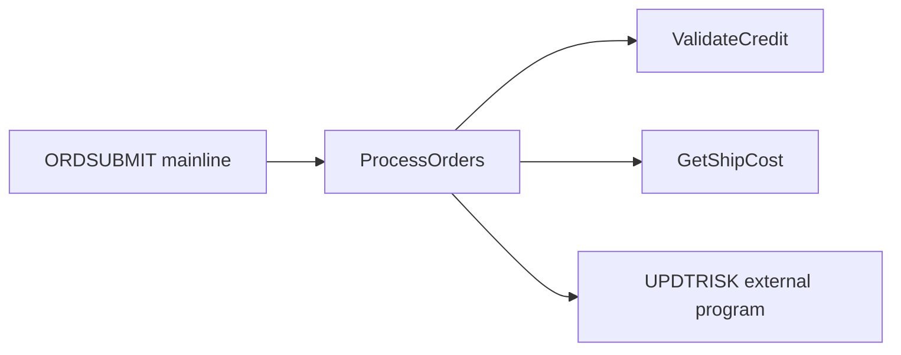

# Program Analysis: Order Submission Batch Job (OBJ-ORDER-BATCH-001)

## Metadata

- **Program ID:** OBJ-ORDER-BATCH-001
- **Program Name:** ORDSUBMIT
- **Program Type:** RPGLE
- **Library:** ORDERLIB
- **Build Target:** not recorded
- **Build / Library Evidence:**
  - EV-ORDER-BATCH-001: source member evidence only; build target not provided
- **Source Location:** ORDSUBMIT (mainline + internal procedures)
- **Collection Date:** 2025-12-15
- **Entry Points:** Main (implicit)
- **Files Accessed:**
  - `ORDFILE` (PF)
  - `CUSTFILE` (LF)
  - `SHIPFILE` (PF)
  - `CUSTMSTR` (UF)
- **Static Calls:**
  - `UPDTRISK`
- **Dynamic Calls:** None
- **Evidence IDs:**
  - EV-ORDER-BATCH-001
  - EV-ORDER-BATCH-002
  - EV-ORDER-BATCH-006
- **Status:** draft

---

## Analysis Coverage & Scope

| Field | Value |
| --- | --- |
| Source Lines | representative excerpt of larger ORDSUBMIT |
| Analysis Mode | segmented |
| Mode Reason | Batch program demonstrates large-program handling: call structure was indexed first, then hot-path/state-changing routines were deep-read. |
| Structure Index Built | yes |
| Full Source In Context | no |
| Business Narrative Allowed | yes, limited to deep-read/evidence-backed areas |

### Coverage Ledger

| Coverage Item | Count / Status | Notes |
| --- | --- | --- |
| Routines Found | 4 local + 1 external boundary | Example source index includes Main, ProcessOrders, ValidateCredit, GetShipCost, and UPDTRISK as an external edge. |
| Routines Deep-Read | 4 local + UPDTRISK boundary | Main, ProcessOrders, ValidateCredit, GetShipCost, and the UPDTRISK call contract were deep-read for this example. |
| Routines Indexed Only | 0 | No local routines left as indexed-only in the representative excerpt. |
| External Edges Resolved | 1 of 1 | UPDTRISK call site and parameters identified; return-code meanings remain TBD. |
| Data Touches Resolved | 5 of 5 | ORDFILE, CUSTMSTR, SHIPFILE, UPDTRISK parameters, and QSYSOPR message path accounted for. |
| Deep Read Windows | 5 of 5 documented windows | The representative segmented example documents every window used by this artifact. |
| Blocking Gaps | TBD-ORDER-BATCH-001, TBD-ORDER-BATCH-002, TBD-ORDER-BATCH-008 | Pending source/inventory confirmation. |
| Non-Blocking Gaps | TBD-ORDER-BATCH-006, TBD-ORDER-BATCH-007 | Scheduler and source-comment follow-up. |

### Source Index Summary

| Source Area | Lines / Scope | Coverage | Notes |
| --- | --- | --- | --- |
| Mainline | lines 28-29 | deep_read | Entry into ProcessOrders and LR behavior inspected. |
| ProcessOrders | lines 38-79 | deep_read | Batch loop, file open/close, hot-path calls, UPDTRISK boundary, and MONITOR handler inspected. |
| ValidateCredit | lines 88-94 and related compare logic | deep_read | CUSTMSTR CHAIN and credit decision path inspected. |
| GetShipCost | lines 107-112 | deep_read | SHIPFILE lookup and fallback calculation inspected. |
| External boundary | line 66 | deep_read | UPDTRISK call parameters and RC handling inspected at call site. |

---

## Program Call Map

### Visual Overview

Evidence basis: derived call analysis only

### Node Inventory

| Node | Node Type | Defined At | Role / Notes | Evidence |
| --- | --- | --- | --- | --- |
| Main | Mainline | line 28 | starts batch processing | EV-ORDER-BATCH-002 |
| ProcessOrders | Procedure | lines 48-75 | main batch loop; hot path | EV-ORDER-BATCH-002 |
| ValidateCredit | Procedure | lines 90-120 | credit validation | EV-ORDER-BATCH-002 |
| GetShipCost | Procedure | lines 130-150 | shipping cost lookup/calculation | EV-ORDER-BATCH-002 |
| UPDTRISK | External Program | line 66 | customer risk profile update | EV-ORDER-BATCH-006 |

**Hub / common candidates:** ProcessOrders is the local orchestrator for this program.

**Orphaned subroutines/procedures:** None.

### Call Evidence

Evidence basis: derived call analysis only

| Caller | Callee | Call Type | Condition | Source Lines | Evidence Source | Resolution |
| --- | --- | --- | --- | --- | --- | --- |
| `Main` | `ProcessOrders` | procedure | always (single call) | line 28 | derived_code_only | confirmed |
| `ProcessOrders` | `ValidateCredit` | procedure | in DOWHILE loop, every iteration | line 57 | derived_code_only | confirmed |
| `ProcessOrders` | `GetShipCost` | procedure | only if `CreditStatus` <> 'D' | line 63 | derived_code_only | confirmed |
| `ProcessOrders` | `UPDTRISK` | external_call | only if credit approved | line 66 | derived_code_only | resolved |

**Header vs. code:** N/A (no header present) → see TBD-ORDER-BATCH-007

### Reverse Caller Index

| Node | Called By | Notes |
| --- | --- | --- |
| ProcessOrders | Main [line 28] | Single entry point; main batch loop |
| ValidateCredit | ProcessOrders [line 57] | Called once per ORDFILE record (hot path) |
| GetShipCost | ProcessOrders [line 63] | Conditional on credit approval |
| UPDTRISK (external) | ProcessOrders [line 66] | External program; conditional on approval |

**Orphaned subroutines:** None — every declared procedure has at least one caller.

---

## Routine Cards

| Routine | Type | Coverage | Responsibility | Evidence | Notes |
| --- | --- | --- | --- | --- | --- |
| Main | Mainline | deep_read | Start batch processing by calling ProcessOrders, then end program with *INLR. | EV-ORDER-BATCH-002 | Small entry segment; read with ProcessOrders context. |
| ProcessOrders | Procedure | deep_read | Orchestrate order loop, credit validation, shipping cost lookup, external risk update, counters, and MONITOR handling. | EV-ORDER-BATCH-002, EV-ORDER-BATCH-006, EV-ORDER-BATCH-007 | State-changing/hot-path routine. |
| ValidateCredit | Procedure | deep_read | Validate customer/order amount against CUSTMSTR credit limit and return A/D decision. | EV-ORDER-BATCH-005, EV-ORDER-BATCH-008 | Hot-path decision routine. |
| GetShipCost | Procedure | deep_read | Resolve shipping cost from SHIPFILE or fallback calculation. | EV-ORDER-BATCH-004 | Hot-path conditional routine. |
| UPDTRISK | External program boundary | deep_read | Synchronous risk update call after approved credit decision; RC controls success/error counters. | EV-ORDER-BATCH-006, EV-ORDER-BATCH-009 | Boundary only; implementation source not included. |

---

## Routine Logic Details

### Main

**Execution trigger:** Program entry.

**Step-by-step logic:**
1. Call `ProcessOrders`.
2. Set `*INLR = *ON` after `ProcessOrders` returns.

**Field calculations and assignments:**

| Target Field / Variable | Calculation / Assignment | Source Operands | Branch / Guard | Precision / Conversion | Business Effect | Evidence |
| --- | --- | --- | --- | --- | --- | --- |
| `*INLR` (last-record indicator) | literal `*ON` | constant `*ON` | after `ProcessOrders` returns | indicator assignment | marks program for termination | EV-ORDER-BATCH-002 |

**Routine field lineage / carriers:**

| Target Field / Variable | Source Carrier / Field | Intermediate Variables | Output / Persisted Carrier | Related Lineage / Mutation | Evidence |
| --- | --- | --- | --- | --- | --- |
| `*INLR` (last-record indicator) | system indicator literal `*ON` | none | IBM i program lifecycle indicator | N/A-no persistence | EV-ORDER-BATCH-002 |

**Branch outcomes:**

| Branch / Condition | Fields Set / Actions | Exit / Next Step | Evidence |
| --- | --- | --- | --- |
| always | `EXSR`/procedure call to `ProcessOrders`, then `*INLR=*ON` | program termination | EV-ORDER-BATCH-002 |

**Routine exception closure:**

| Exception / Guard | Trigger | Fields / Messages Set | Handling Action | Downstream Skip / Rollback / Output | Error Inventory Link | Evidence |
| --- | --- | --- | --- | --- | --- | --- |
| none observed in mainline | no local MONITOR / return-code check in mainline | none | call `ProcessOrders`; then terminate | exception handling delegated to `ProcessOrders` | N/A | EV-ORDER-BATCH-002 |

**Unresolved routine logic:** None.

### ProcessOrders

**Execution trigger:** Called once from Main.

**Step-by-step logic:**
1. Enter `MONITOR` block and open ORDFILE, CUSTFILE, SHIPFILE, and CUSTMSTR.
2. Read ORDFILE in a loop until EOF.
3. For each order, call `ValidateCredit(CustID, OrderAmt)`.
4. If `CreditStatus = 'D'`, increment `ErrorCount`, set `RC = -1`, and skip
   shipping/risk update for that order.
5. If credit is approved, call `GetShipCost(OrderAmt)`, then call `UPDTRISK`
   with customer/order payload and receive `RC`.
6. If `RC = 0`, increment `OrderCount`; otherwise increment `ErrorCount`.
7. On generic MONITOR exception, set `ReturnCode = -99`, send operator
   message, and terminate the current batch path.

**Field calculations and assignments:**

| Target Field / Variable | Calculation / Assignment | Source Operands | Branch / Guard | Precision / Conversion | Business Effect | Evidence |
| --- | --- | --- | --- | --- | --- | --- |
| `ErrorCount` (error count) | `ErrorCount + 1` | current `ErrorCount`, constant 1 | `CreditStatus = 'D'` | numeric counter; no conversion observed | counts denied/skipped order | EV-ORDER-BATCH-008 |
| `RC` (return code) | literal `-1` | constant `-1` | `CreditStatus = 'D'` | numeric return/status field | marks denied order path before loop continues | EV-ORDER-BATCH-008 |
| `OrderCount` (successful order count) | `OrderCount + 1` | current `OrderCount`, constant 1 | `RC = 0` after UPDTRISK | numeric counter; no conversion observed | counts successful risk update | EV-ORDER-BATCH-009 |
| `ErrorCount` (error count) | `ErrorCount + 1` | current `ErrorCount`, constant 1 | `RC <> 0` after UPDTRISK | numeric counter; no conversion observed | counts external update failure | EV-ORDER-BATCH-009 |
| `ReturnCode` (batch return code) | literal `-99` | constant `-99` | MONITOR / ON-ERROR | numeric return code | reports generic unexpected batch failure | EV-ORDER-BATCH-007 |

**Routine field lineage / carriers:**

| Target Field / Variable | Source Carrier / Field | Intermediate Variables | Output / Persisted Carrier | Related Lineage / Mutation | Evidence |
| --- | --- | --- | --- | --- | --- |
| `ErrorCount` (error count) | `CreditStatus` from `ValidateCredit`; `RC` from UPDTRISK | `ErrorCount` | local batch counter / eventual batch status context | N/A-no persistence; counter affects batch outcome | EV-ORDER-BATCH-008, EV-ORDER-BATCH-009 |
| `RC` (return code) | literal `-1` or UPDTRISK output parameter | `RC` | work/status field tested by caller logic | Error Code Inventory rows `-1`, `0`, non-zero RC | EV-ORDER-BATCH-006, EV-ORDER-BATCH-008, EV-ORDER-BATCH-009 |
| `OrderCount` (successful order count) | `RC` from UPDTRISK | `OrderCount` | local batch counter / eventual batch status context | N/A-no persistence; counter affects batch outcome | EV-ORDER-BATCH-009 |
| `ReturnCode` (batch return code) | literal `-99` | `ReturnCode` | procedure/system return context | Error Code Inventory row `-99` | EV-ORDER-BATCH-007 |

**Branch outcomes:**

| Branch / Condition | Fields Set / Actions | Exit / Next Step | Evidence |
| --- | --- | --- | --- |
| EOF after ORDFILE read | leave loop | close/finish path | EV-ORDER-BATCH-002 |
| `CreditStatus = 'D'` | increment `ErrorCount`; set `RC=-1` | continue next order; skip `GetShipCost` and `UPDTRISK` | EV-ORDER-BATCH-008 |
| `CreditStatus <> 'D'` | call `GetShipCost`; call `UPDTRISK` | evaluate `RC` | EV-ORDER-BATCH-006 |
| `RC = 0` | increment `OrderCount` | continue loop | EV-ORDER-BATCH-009 |
| `RC <> 0` | increment `ErrorCount` | continue loop | EV-ORDER-BATCH-009 |
| generic ON-ERROR | `ReturnCode=-99`; SNDPGMMSG | terminate current batch path | EV-ORDER-BATCH-007 |

**Routine exception closure:**

| Exception / Guard | Trigger | Fields / Messages Set | Handling Action | Downstream Skip / Rollback / Output | Error Inventory Link | Evidence |
| --- | --- | --- | --- | --- | --- | --- |
| denied credit decision | `CreditStatus = 'D'` | `ErrorCount += 1`; `RC=-1` | continue next order | skips `GetShipCost` and UPDTRISK for the order | `-1`, `'D'` | EV-ORDER-BATCH-008 |
| external risk update failure | `RC <> 0` after UPDTRISK | `ErrorCount += 1` | continue loop | order is not counted successful; no rollback observed in caller | non-zero RC | EV-ORDER-BATCH-009 |
| generic system/file/call exception | MONITOR / ON-ERROR catches exception | `ReturnCode=-99`; SNDPGMMSG to QSYSOPR | terminate current batch path | no recovery loop observed; operator message emitted | `-99`, generic / bare ON-ERROR | EV-ORDER-BATCH-007 |

**Unresolved routine logic:** TBD-ORDER-BATCH-003: Confirm full UPDTRISK
return-code domain.

### ValidateCredit

**Execution trigger:** Called once per ORDFILE record by `ProcessOrders`.

**Step-by-step logic:**
1. CHAIN CUSTMSTR by `CustID`.
2. If customer record is not found, return denial code `'D'`.
3. If customer is found and `RequestAmt > CREDLIMIT`, return denial code `'D'`.
4. Otherwise return approval code `'A'`.

**Field calculations and assignments:**

| Target Field / Variable | Calculation / Assignment | Source Operands | Branch / Guard | Precision / Conversion | Business Effect | Evidence |
| --- | --- | --- | --- | --- | --- | --- |
| return code (credit decision) | literal `'D'` | constant `'D'` | `%FOUND(CUSTMSTR)` false | char 1 | denies order before shipping/risk update | EV-ORDER-BATCH-005, EV-ORDER-BATCH-008 |
| return code (credit decision) | literal `'D'` | constant `'D'` | `RequestAmt > CREDLIMIT` | char 1 | denies order when requested amount exceeds credit limit | EV-ORDER-BATCH-005, EV-ORDER-BATCH-008 |
| return code (credit decision) | literal `'A'` | constant `'A'` | customer found and `RequestAmt <= CREDLIMIT` | char 1 | allows shipping/risk update path | EV-ORDER-BATCH-005, EV-ORDER-BATCH-008 |

**Routine field lineage / carriers:**

| Target Field / Variable | Source Carrier / Field | Intermediate Variables | Output / Persisted Carrier | Related Lineage / Mutation | Evidence |
| --- | --- | --- | --- | --- | --- |
| return code (credit decision) | literals `'A'` / `'D'`; `CUSTMSTR.CREDLIMIT` comparison | none | `ValidateCredit` return value consumed as `CreditStatus` | Field Lineage via `CreditStatus`; Error Code Inventory rows `'A'`, `'D'` | EV-ORDER-BATCH-005, EV-ORDER-BATCH-008 |
| `CREDLIMIT` (credit limit; inferred) | CUSTMSTR / CREDFILE DS; physical mapping pending | none | read-only comparison operand | LIN-ORDER-BATCH-003 | EV-ORDER-BATCH-005, EV-ORDER-BATCH-008 |

**Branch outcomes:**

| Branch / Condition | Fields Set / Actions | Exit / Next Step | Evidence |
| --- | --- | --- | --- |
| `%FOUND(CUSTMSTR)` false | return `'D'` | caller skips shipping/risk update | EV-ORDER-BATCH-005 |
| `RequestAmt > CREDLIMIT` | return `'D'` | caller skips shipping/risk update | EV-ORDER-BATCH-008 |
| `RequestAmt <= CREDLIMIT` | return `'A'` | caller continues to shipping/risk update | EV-ORDER-BATCH-008 |

**Routine exception closure:**

| Exception / Guard | Trigger | Fields / Messages Set | Handling Action | Downstream Skip / Rollback / Output | Error Inventory Link | Evidence |
| --- | --- | --- | --- | --- | --- | --- |
| customer record not found | `%FOUND(CUSTMSTR)` false | return code `'D'`; no message text observed | return to `ProcessOrders` | caller skips shipping/risk update | `'D'` | EV-ORDER-BATCH-005 |
| credit limit exceeded | `RequestAmt > CREDLIMIT` | return code `'D'`; no message text observed | return to `ProcessOrders` | caller skips shipping/risk update | `'D'` | EV-ORDER-BATCH-008 |
| CUSTMSTR I/O exception unresolved | CHAIN I/O failure; local MONITOR not observed in routine | none locally | outer `ProcessOrders` MONITOR likely catches; exact message ID unresolved | batch generic exception path may terminate current batch | generic / bare ON-ERROR | EV-ORDER-BATCH-005, EV-ORDER-BATCH-007 |

**Unresolved routine logic:** TBD-ORDER-BATCH-008: Add CREDFILE / DS mapping to
inventory and confirm `CREDLIMIT` physical field metadata.

### GetShipCost

**Execution trigger:** Called by `ProcessOrders` only after credit approval.

**Step-by-step logic:**
1. CHAIN SHIPFILE by `OrderAmount`.
2. If a shipping-cost record is found, return `SHIP_COST`.
3. If no record is found, calculate fallback shipping cost as
   `OrderAmount * 0.0100`.

**Field calculations and assignments:**

| Target Field / Variable | Calculation / Assignment | Source Operands | Branch / Guard | Precision / Conversion | Business Effect | Evidence |
| --- | --- | --- | --- | --- | --- | --- |
| `ShipCost` (shipping cost) | `SHIP_COST` | `SHIP_COST` (shipping cost; inferred) | `%FOUND(SHIPFILE)` true | output decimal 5P2; source type pending DDS | uses configured shipping cost | EV-ORDER-BATCH-004 |
| `ShipCost` (shipping cost) | `OrderAmount * 0.0100` | `OrderAmount` (order amount), constant `0.0100` | `%FOUND(SHIPFILE)` false | multiplication into decimal 5P2; rounding behavior not visible | applies fallback one-percent shipping cost | EV-ORDER-BATCH-004 |

**Routine field lineage / carriers:**

| Target Field / Variable | Source Carrier / Field | Intermediate Variables | Output / Persisted Carrier | Related Lineage / Mutation | Evidence |
| --- | --- | --- | --- | --- | --- |
| `ShipCost` (shipping cost) | `SHIPFILE.SHIP_COST` (shipping cost; inferred) or `OrderAmount` parameter with constant `0.0100` | none | `GetShipCost` return value consumed before UPDTRISK call | Field lineage from `OrderAmount` and SHIPFILE lookup; N/A-no persistence | EV-ORDER-BATCH-004 |

**Branch outcomes:**

| Branch / Condition | Fields Set / Actions | Exit / Next Step | Evidence |
| --- | --- | --- | --- |
| `%FOUND(SHIPFILE)` true | return `SHIP_COST` | caller proceeds to UPDTRISK | EV-ORDER-BATCH-004 |
| `%FOUND(SHIPFILE)` false | return `OrderAmount * 0.0100` | caller proceeds to UPDTRISK | EV-ORDER-BATCH-004 |

**Routine exception closure:**

| Exception / Guard | Trigger | Fields / Messages Set | Handling Action | Downstream Skip / Rollback / Output | Error Inventory Link | Evidence |
| --- | --- | --- | --- | --- | --- | --- |
| shipping lookup not found | `%FOUND(SHIPFILE)` false | `ShipCost = OrderAmount * 0.0100` | fallback calculation; return | no skip; caller still proceeds to UPDTRISK | N/A business fallback | EV-ORDER-BATCH-004 |
| SHIPFILE I/O exception unresolved | CHAIN I/O failure; local MONITOR not observed in routine | none locally | outer `ProcessOrders` MONITOR likely catches; exact message ID unresolved | batch generic exception path may terminate current batch | generic / bare ON-ERROR | EV-ORDER-BATCH-004, EV-ORDER-BATCH-007 |

**Unresolved routine logic:** TBD-ORDER-BATCH-002: Confirm SHIPFILE key field,
configured cost semantics, and fallback rounding intent.

### UPDTRISK

**Execution trigger:** External program called by `ProcessOrders` after credit
approval and shipping-cost resolution.

**Step-by-step logic:**
1. Receive `CustID`, `OrderAmount`, and return `RC` at the call boundary.
2. Caller checks `RC = 0` as success and `RC <> 0` as error.

**Field calculations and assignments:**

| Target Field / Variable | Calculation / Assignment | Source Operands | Branch / Guard | Precision / Conversion | Business Effect | Evidence |
| --- | --- | --- | --- | --- | --- | --- |
| `RC` (return code) | set by external program | UPDTRISK implementation not included | after CALL | numeric status; domain unresolved except caller tests 0/non-zero | controls success/error counters | EV-ORDER-BATCH-006, EV-ORDER-BATCH-009 |

**Routine field lineage / carriers:**

| Target Field / Variable | Source Carrier / Field | Intermediate Variables | Output / Persisted Carrier | Related Lineage / Mutation | Evidence |
| --- | --- | --- | --- | --- | --- |
| `RC` (return code) | UPDTRISK output parameter | `RC` | `ProcessOrders` status branch | Error Code Inventory rows `0`, non-zero RC | EV-ORDER-BATCH-006, EV-ORDER-BATCH-009 |
| `CustID` / `OrderAmount` UPDTRISK inputs | ORDFILE fields via `ProcessOrders` work variables | `CustID`, `OrderAmt` | UPDTRISK input parameters | LIN-ORDER-BATCH-001, LIN-ORDER-BATCH-002 | EV-ORDER-BATCH-002, EV-ORDER-BATCH-006 |

**Branch outcomes:**

| Branch / Condition | Fields Set / Actions | Exit / Next Step | Evidence |
| --- | --- | --- | --- |
| `RC = 0` | caller increments `OrderCount` | continue loop | EV-ORDER-BATCH-009 |
| `RC <> 0` | caller increments `ErrorCount` | continue loop | EV-ORDER-BATCH-009 |

**Routine exception closure:**

| Exception / Guard | Trigger | Fields / Messages Set | Handling Action | Downstream Skip / Rollback / Output | Error Inventory Link | Evidence |
| --- | --- | --- | --- | --- | --- | --- |
| external risk update error | `RC <> 0` returned by UPDTRISK | caller increments `ErrorCount`; exact RC message unresolved | caller continues loop | no caller rollback observed; order not counted successful | non-zero RC | EV-ORDER-BATCH-006, EV-ORDER-BATCH-009 |
| external implementation unavailable | UPDTRISK source not included | `RC` domain unresolved | create TBD | side effects of called program unresolved | N/A | TBD-ORDER-BATCH-003 |

**Unresolved routine logic:** TBD-ORDER-BATCH-003: Confirm UPDTRISK return-code
domain and side effects from called program source.

---

## Deep Read Windows

| Window ID | Source Range | Coverage | Included Routines / Logic | Evidence | Notes |
| --- | --- | --- | --- | --- | --- |
| DRW-ORDER-BATCH-001 | lines 28-29 | deep_read | Mainline call to ProcessOrders and *INLR termination | EV-ORDER-BATCH-002 | Confirms program entry behavior. |
| DRW-ORDER-BATCH-002 | lines 38-79 | deep_read | ProcessOrders open/read loop, ValidateCredit/GetShipCost calls, UPDTRISK boundary, close, MONITOR/ON-ERROR | EV-ORDER-BATCH-002, EV-ORDER-BATCH-006, EV-ORDER-BATCH-007, EV-ORDER-BATCH-009 | State-changing batch hot path. |
| DRW-ORDER-BATCH-003 | lines 88-94 and compare branch | deep_read | ValidateCredit CUSTMSTR lookup and credit decision | EV-ORDER-BATCH-005, EV-ORDER-BATCH-008 | Credit-denial behavior requires SME confirmation only for business intent, not observed flow. |
| DRW-ORDER-BATCH-004 | lines 107-112 | deep_read | GetShipCost SHIPFILE lookup and fallback calculation | EV-ORDER-BATCH-004 | Lookup key semantics remain pending source confirmation. |
| DRW-ORDER-BATCH-005 | line 66 and RC check at line 68 | deep_read | UPDTRISK external boundary and return-code handling | EV-ORDER-BATCH-006, EV-ORDER-BATCH-009 | External implementation not read; call-site contract inspected. |

---

## Entry Points & Parameters

| Entry Point | Type | Parameters | Return | Evidence |
| --- | --- | --- | --- | --- |
| Main | Main Program | (none) | Status code to system | confirmed_from_code |
| ProcessOrders | Callable Procedure | (void) | ReturnCode: numeric 4P0 | confirmed_from_code |
| ValidateCredit | Callable Procedure | (CustID: numeric, RequestAmt: decimal) | Decision: char 1 ('A'/'D') | confirmed_from_code |
| GetShipCost | Callable Procedure | (OrderAmount: decimal) | ShipCost: decimal 5P2 | confirmed_from_code |

**Evidence links:**
- [EV-ORDER-BATCH-001: RPGLE H spec and procedure headers]

---

## Object Dependencies

Source: derived-from-code (no F5-OBJREF TREE export provided for this analysis)

### Uses (forward dependencies)

| Object     | Type    | Version | Description                                   | Inventory ID         | Evidence            |
| ---        | ---     | ---     | ---                                           | ---                  | ---                 |
| ORDFILE    | PF      | —       | Pending orders file (sequential read)         | OBJ-ORDER-BATCH-002  | confirmed_from_code |
| CUSTFILE   | LF      | —       | Customer logical file (declared, unused)      | OBJ-ORDER-BATCH-003  | confirmed_from_code |
| SHIPFILE   | PF      | —       | Shipping cost lookup table                    | OBJ-ORDER-BATCH-004  | confirmed_from_code |
| CUSTMSTR   | PF (UF) | —       | Customer master (update mode, locked on CHAIN)| OBJ-ORDER-BATCH-005  | confirmed_from_code |
| CREDFILE   | PF (DS) | —       | Credit profile DS via EXTNAME (line 94)       | TBD-ORDER-BATCH-008  | confirmed_from_code |
| UPDTRISK   | *PGM    | —       | External program: update customer risk profile| OBJ-ORDER-BATCH-006  | confirmed_from_code |
| QSYSOPR    | *MSGQ   | —       | System operator message queue (via SNDPGMMSG) | (system, no OBJ-*)   | confirmed_from_code |

**Inventory gaps:**
- **TBD-ORDER-BATCH-008:** CREDFILE referenced via EXTNAME in ValidateCredit (line 94) but not yet in inventory; add it.

### Used By (reverse dependencies)

(Not yet populated — depends on `01_inventory/inventory.yaml` `relationships` section, which is out of scope for this single-program analysis.)

---

## Logic Decomposition Ledger

| Logic ID | Routine / Lines | Logic Type | Source Inputs / Constants | Operation / Condition | Result Field / Action | Branch Priority / Loop Scope | Evidence |
| --- | --- | --- | --- | --- | --- | --- | --- |
| LOG-ORDER-BATCH-001 | ProcessOrders lines 46-49 | file loop | ORDFILE, `%EOF(ORDFILE)` | READ then EOF check | exit loop when EOF | Controls all per-order processing | EV-ORDER-BATCH-002 |
| LOG-ORDER-BATCH-002 | ProcessOrders lines 57-68 | IF / external-call branch | CreditStatus, literals 'D', 0 | If denied, skip ship/risk; else call GetShipCost and UPDTRISK, then check RC | ErrorCount, OrderCount, RC | UPDTRISK only occurs after credit approval | EV-ORDER-BATCH-006, EV-ORDER-BATCH-008, EV-ORDER-BATCH-009 |
| LOG-ORDER-BATCH-003 | ValidateCredit lines 88-94 | IF / comparison | CustID, RequestAmt, CREDLIMIT | CHAIN CUSTMSTR; if not found deny; else compare RequestAmt > CREDLIMIT | return 'D' or 'A' | Not-found branch precedes amount comparison | EV-ORDER-BATCH-005, EV-ORDER-BATCH-008 |
| LOG-ORDER-BATCH-004 | GetShipCost lines 107-112 | lookup fallback / arithmetic | OrderAmount, SHIP_COST, literal 0.0100 | CHAIN SHIPFILE; if not found calculate OrderAmount * 0.0100 | ShipCost return | fallback calculation only when lookup not found | EV-ORDER-BATCH-004 |

### Routine / Window Data Flow

| Routine / Window | Purpose | Input Variables | Transformation Logic | Output Variables | Side Effects | Source Lines | Evidence |
| --- | --- | --- | --- | --- | --- | --- | --- |
| `ProcessOrders` | Iterate pending orders and route approved orders to shipping/risk update. | `CustID` (customer identifier) [local] `OrderAmt` (order amount) [local] `CreditStatus` (credit decision) [control] | Reads `ORDFILE`, calls `ValidateCredit`, conditionally calls `GetShipCost` and `UPDTRISK`, updates counters from `RC`. | `ReturnCode` (batch return code) [output] `OrderCount` (successful order count) [local] `ErrorCount` (error count) [local] | READ `ORDFILE`; CALL `UPDTRISK`; SNDPGMMSG on generic exception | lines 38-79 | EV-ORDER-BATCH-002, EV-ORDER-BATCH-006, EV-ORDER-BATCH-007 |
| `ValidateCredit` | Determine approval/denial from customer credit limit. | `CustID` (customer identifier) [input] `RequestAmt` (requested amount) [input] | CHAINs `CUSTMSTR`, branches on `%FOUND`, compares `RequestAmt` to `CREDLIMIT`. | return code (credit decision) [output] | CHAIN `CUSTMSTR` | lines 88-94 | EV-ORDER-BATCH-005, EV-ORDER-BATCH-008 |

**Unresolved:**
- TBD-ORDER-BATCH-002: Confirm SHIPFILE key field and whether fallback multiplication is the intended rate.
- TBD-ORDER-BATCH-003: Confirm full UPDTRISK return-code domain.

---

## Data Touch Map

### Data Touches

| Data Object / Carrier | Mechanism | Operation | Routine / Procedure | Key / Payload | Critical Fields Touched | State Impact | Evidence |
| --- | --- | --- | --- | --- | --- | --- | --- |
| ORDFILE | PF | READ loop | ProcessOrders | sequential order records | `OrdID` (order identifier; inferred), `CustID` (customer identifier), `OrderAmount` (order amount) | reads pending work | EV-ORDER-BATCH-002 |
| CUSTMSTR | UF | CHAIN | ValidateCredit | key=`CustID` (customer identifier) | `CustID` (customer identifier), `CREDLIMIT` (credit limit; inferred) | reads/locks customer record | EV-ORDER-BATCH-005 |
| SHIPFILE | PF | CHAIN | GetShipCost | key=`OrderAmount` (order amount) | `OrderAmount` (order amount), `SHIP_COST` (shipping cost; inferred) | read-only lookup | EV-ORDER-BATCH-004 |
| UPDTRISK | CALL parameters | in/out | ProcessOrders | `CustID` (customer identifier), `OrderAmount` (order amount), `RC` (return code) | `CustID` (customer identifier), `OrderAmount` (order amount), `RC` (return code) | external risk update handoff | EV-ORDER-BATCH-006 |
| QSYSOPR | *MSGQ | SNDPGMMSG | error handler | literal message text | message text | operator-visible error reporting | EV-ORDER-BATCH-007 |

### Critical Field Watchlist

| Field / Data Structure | Object / Carrier | Why It Matters | Observed Operations | Evidence |
| --- | --- | --- | --- | --- |
| `CustID` (customer identifier) | ORDFILE / CUSTMSTR / UPDTRISK | customer identity across file lookup and external risk update | read, CHAIN key, passed to UPDTRISK | EV-ORDER-BATCH-002, EV-ORDER-BATCH-005, EV-ORDER-BATCH-006 |
| `OrderAmount` (order amount) | ORDFILE / SHIPFILE / UPDTRISK | money amount driving credit, shipping, and risk update | read, compared, used as lookup key, passed externally | EV-ORDER-BATCH-002, EV-ORDER-BATCH-004, EV-ORDER-BATCH-006 |
| `CREDLIMIT` (credit limit; inferred) | CUSTMSTR | credit decision threshold | read and compared | EV-ORDER-BATCH-005 |
| `RC` (return code) | UPDTRISK parameter | external call result controls counters/error path | returned by external program and tested | EV-ORDER-BATCH-006 |

**Unresolved:**
- TBD-ORDER-BATCH-001: Confirm ORDFILE record structure.
- TBD-ORDER-BATCH-003: Confirm UPDTRISK return-code contract.

---

## Key File & Field Logic

### Key Files

| File / Carrier | Role in Program | Routines | Access / Mutation Pattern | Key Fields | Critical Persisted / Output Fields | Evidence |
| --- | --- | --- | --- | --- | --- | --- |
| ORDFILE | driver | ProcessOrders | sequential READ loop | implicit sequential access | `OrdID` (order identifier; inferred), `CustID` (customer identifier), `OrderAmount` (order amount) read; no write observed | EV-ORDER-BATCH-002 |
| CUSTMSTR | lookup/reference with update-capable file mode | ValidateCredit | CHAIN by CustID; no UPDATE observed in excerpt | `CustID` (customer identifier) | `CREDLIMIT` (credit limit; inferred) read-only in observed source | EV-ORDER-BATCH-005 |
| SHIPFILE | lookup/reference | GetShipCost | CHAIN by OrderAmount, fallback calculation if not found | `OrderAmount` (order amount) | `SHIP_COST` (shipping cost; inferred) read-only in observed source | EV-ORDER-BATCH-004 |
| UPDTRISK parameter list | parameter-DS / external handoff | ProcessOrders | CALL in/out | `CustID` (customer identifier), `OrderAmount` (order amount) | `RC` (return code) output controls counters | EV-ORDER-BATCH-006, EV-ORDER-BATCH-009 |
| QSYSOPR | queue-message | ProcessOrders ON-ERROR | SNDPGMMSG in generic handler | message text | operator-visible failure message | EV-ORDER-BATCH-007 |

### Key Fields

| Field / Data Structure | Source Object / Carrier | Role | Used In | Values / Domain Observed | Downstream Impact | Evidence |
| --- | --- | --- | --- | --- | --- | --- |
| `CustID` (customer identifier) | ORDFILE / CUSTMSTR / UPDTRISK | access-key / external-parameter | CUSTMSTR CHAIN, UPDTRISK CALL | record field; type pending DDS | selects customer, passed to risk update | EV-ORDER-BATCH-002, EV-ORDER-BATCH-005, EV-ORDER-BATCH-006 |
| `OrderAmount` (order amount) | ORDFILE / SHIPFILE / UPDTRISK | calculation-operand / access-key / external-parameter | credit comparison, SHIPFILE CHAIN, fallback multiplication, UPDTRISK CALL | decimal amount; exact type pending DDS | controls credit, ship cost, and risk update | EV-ORDER-BATCH-002, EV-ORDER-BATCH-004, EV-ORDER-BATCH-006 |
| `CREDLIMIT` (credit limit; inferred) | CUSTMSTR / CREDFILE DS | branch-condition | ValidateCredit comparison | DDS pending | returns denied when RequestAmt exceeds limit | EV-ORDER-BATCH-005, EV-ORDER-BATCH-008 |
| `CreditStatus` (credit decision) | ValidateCredit return | return-code / branch-condition | ProcessOrders IF branch | 'A', 'D' | determines whether shipping and risk update happen | EV-ORDER-BATCH-008 |
| `RC` (return code) | UPDTRISK parameter / ProcessOrders work field | return-code | IF RC = 0 branch | 0 success; non-zero error pending SME | increments OrderCount or ErrorCount | EV-ORDER-BATCH-006, EV-ORDER-BATCH-009 |

### Field Lineage

| Lineage ID | Source / Physical Field | Alias / Data Structure | Work Variables | Calculation / Condition | Write-Back Alias | Persisted / Output Field | Evidence |
| --- | --- | --- | --- | --- | --- | --- | --- |
| LIN-ORDER-BATCH-001 | `ORDFILE.CustID` (customer identifier) | order record field | `CustID` (customer identifier) parameter | CHAIN CUSTMSTR; CALL UPDTRISK | N/A | UPDTRISK `CustID` input parameter | EV-ORDER-BATCH-002, EV-ORDER-BATCH-006 |
| LIN-ORDER-BATCH-002 | `ORDFILE.OrderAmount` (order amount) | order record field | `OrderAmt` / `RequestAmt` (requested amount) | ValidateCredit comparison; GetShipCost lookup/fallback; CALL UPDTRISK | N/A | UPDTRISK `OrderAmount` input parameter | EV-ORDER-BATCH-002, EV-ORDER-BATCH-004, EV-ORDER-BATCH-006 |
| LIN-ORDER-BATCH-003 | `CUSTMSTR.CREDLIMIT` (credit limit; inferred) | CREDFILE DS via EXTNAME; inventory gap | none | if RequestAmt > CREDLIMIT | N/A | ValidateCredit return code (credit decision) | EV-ORDER-BATCH-005, EV-ORDER-BATCH-008 |

**Unresolved:**
- TBD-ORDER-BATCH-001: Confirm ORDFILE physical field names and types.
- TBD-ORDER-BATCH-008: Add CREDFILE / DS mapping to inventory.

---

## Control Flow

### Main Entry Point
1. Call ProcessOrders procedure [confirmed_from_code, line 28]
2. Set *INLR = *ON (mark for last record) [confirmed_from_code, line 29]
3. Program terminates [confirmed_from_code]

### ProcessOrders Procedure
1. Enter MONITOR block [confirmed_from_code, line 38]
2. OPEN four files: ORDFILE, CUSTFILE, SHIPFILE, CUSTMSTR [confirmed_from_code, lines 39–42]
3. Loop through ORDFILE:
   - READ ORDFILE [confirmed_from_code, line 46]
   - If EOF → LEAVE loop [confirmed_from_code, lines 47–49]
   - Extract OrderID, CustID, OrderAmt from current record
   - Call ValidateCredit(CustID, OrderAmt) → CreditStatus [confirmed_from_code, line 57]
   - If CreditStatus = 'D' (denied):
     - Increment ErrorCount, set RC = -1
   - Else:
     - Call GetShipCost(OrderAmt) → ShipCost [confirmed_from_code, line 63]
     - CALL 'UPDTRISK' (CustID, OrderAmt, RC) [confirmed_from_code, line 66]
     - If RC = 0: increment OrderCount
     - Else: increment ErrorCount
4. Close all four files [confirmed_from_code, lines 71–74]
5. If any error during MONITOR, catch exception [confirmed_from_code, lines 76–79]

### ValidateCredit Procedure
1. CHAIN CustID on CUSTMSTR file [confirmed_from_code, line 88]
2. If not found → return 'D' (denied) [confirmed_from_code, lines 89–91]
3. Else: compare RequestAmt vs. CREDLIMIT
   - If RequestAmt > CREDLIMIT → return 'D'
   - Else → return 'A' (approved)

### GetShipCost Procedure
1. CHAIN OrderAmount on SHIPFILE [confirmed_from_code, line 107]
2. If found → return SHIP_COST field [confirmed_from_code, lines 108–110]
3. Else → return calculated cost (OrderAmount * 0.0100) [confirmed_from_code, line 112]

## File I/O

### File Access Summary

| File | Record Format | Type | Operations | Key Fields | Purpose | Read / Mutation Conditions | Indicators / Status Checks | Evidence |
| --- | --- | --- | --- | --- | --- | --- | --- | --- |
| ORDFILE | pending DDS | PF | READ loop | implicit sequential | Read pending order records for batch processing. | ProcessOrders loop until EOF | `%EOF(ORDFILE)` | EV-ORDER-BATCH-002 |
| CUSTFILE | pending DDS | LF | declared only | — | Record declared but no runtime file access is observed. | no observed I/O | none observed | EV-ORDER-BATCH-003 |
| SHIPFILE | pending DDS | PF | CHAIN | `OrderAmount` (order amount) | Read shipping-cost lookup value before fallback calculation. | GetShipCost lookup before fallback calculation | `%FOUND(SHIPFILE)` | EV-ORDER-BATCH-004 |
| CUSTMSTR | pending DDS | UF | CHAIN | `CustID` (customer identifier) | Validate customer credit record before approval decision. | ValidateCredit lookup before credit comparison | `%FOUND(CUSTMSTR)` | EV-ORDER-BATCH-005 |

### Field Mutation Matrix

| File | Operation | Routine / Lines | Access Key / Record Condition | Field Mutated / Persisted | Source Value / Expression | Assignment Evidence | Error / Rollback Handling |
| --- | --- | --- | --- | --- | --- | --- | --- |
| (none) | N/A | N/A | N/A | No `WRITE`, `UPDATE`, `DELETE`, or SQL DML observed in representative excerpt | N/A | DRW-ORDER-BATCH-002 through DRW-ORDER-BATCH-004 | MONITOR catches generic exceptions but no persisted file mutation is observed |

**Operation details:**

- **ORDFILE / READ:** Sequential read in loop. Continues until %EOF(ORDFILE) returns true. Each iteration processes one pending order.
- **SHIPFILE / CHAIN:** Read shipping-cost lookup value by `OrderAmount` (order amount; key pending DDS). If found, use `SHIP_COST` (shipping cost; inferred); else calculate.
- **CUSTMSTR / CHAIN:** Validate customer credit record by `CustID` (customer identifier). File is declared update-capable (`UF`), but no `UPDATE` statement is observed in this representative excerpt.

**Evidence links:**
- [EV-ORDER-BATCH-002: F-spec lines 15–18; READ statement line 46]
- [EV-ORDER-BATCH-003: F-spec line 17; no I/O statements]
- [EV-ORDER-BATCH-004: F-spec line 16; CHAIN in GetShipCost line 107]
- [EV-ORDER-BATCH-005: F-spec line 19; CHAIN in ValidateCredit line 88]

**Unresolved:**
- TBD-ORDER-BATCH-001: Confirm ORDFILE record structure (field names for ORDID, CUSTID_FK, AMOUNT)
- TBD-ORDER-BATCH-002: Confirm SHIPFILE key field (is OrderAmount the key, or is it a range lookup?)

---

## External Calls

| Program | Call Type | Caller Routine | Source Lines | Parameters | Resolution Status | Purpose | Evidence |
| --- | --- | --- | --- | --- | --- | --- | --- |
| `UPDTRISK` | external_call | `ProcessOrders` | line 66 | `CustID` (customer identifier) [input], `OrderAmount` (order amount) [input], `RC` (return code) [output] | resolved | Update customer risk profile after order approval. | EV-ORDER-BATCH-006 |

**Call details:**

- **UPDTRISK:** CALL 'UPDTRISK' (CustID, OrderAmt, RC). Synchronous. RC is output parameter (modified by UPDTRISK). Expected RC values: 0 (success), non-zero (error). Called only if credit validation passed.

**Parameter contracts:**
- `CustID` (customer identifier): numeric 9P0 [input]
- `OrderAmount` (order amount): decimal 7P2 [input]
- `RC` (return code): numeric 4P0 [output]. 0 = success, non-zero = error

**Evidence links:**
- [EV-ORDER-BATCH-006: CALL statement line 66]

**Unresolved:**
- TBD-ORDER-BATCH-003: Confirm UPDTRISK return codes (what error codes possible?)

---

## Error Handling

### Exception Closure Ledger

| Exception / Error Condition | Trigger / Source | Message ID / Error Code / RC | Detected By | Fields Set / Messages Sent | Handling Action | Downstream Impact | Evidence |
| --- | --- | --- | --- | --- | --- | --- | --- |
| Generic file/call exception in ProcessOrders | OPEN/READ/CHAIN/CALL inside MONITOR | generic / bare ON-ERROR, ReturnCode -99 | MONITOR / ON-ERROR block | ReturnCode = -99; SNDPGMMSG literal to QSYSOPR | send operator message and exit batch job | terminates current batch; no recovery loop observed | EV-ORDER-BATCH-007 |
| Invalid credit / denied decision | CreditStatus = 'D' | CreditStatus 'D'; RC = -1 | IF CreditStatus = 'D' | ErrorCount incremented; RC = -1 | skip GetShipCost and UPDTRISK for this order | continue to next ORDFILE record | EV-ORDER-BATCH-008 |
| UPDTRISK returns error | RC <> 0 after CALL | non-zero RC; exact values TBD | IF RC = 0 / ELSE | ErrorCount incremented | continue loop | order is not counted as successful; no rollback observed in caller | EV-ORDER-BATCH-009 |

### Error Code Inventory

| Message / Status Code | Message Description | Error Type | Set By / Source Lines | Trigger Condition | Output Carrier | Downstream Effect | Evidence Status |
| --- | --- | --- | --- | --- | --- | --- | --- |
| -99 | generic unexpected batch failure | exception_log | `ReturnCode` assignment in ON-ERROR handler | MONITOR catches exception | return parameter / operator message | terminates current batch | confirmed |
| 'D' | denied credit decision | response_status | ValidateCredit return | credit not found or request exceeds limit | return parameter | skips shipping and risk update | confirmed |
| -1 | denied order / skipped processing | business_rule_error | `RC` assignment | CreditStatus='D' branch | work/status field | order counted as error; loop continues | confirmed |
| 0 | external risk update success | external_call_error | `RC` check after UPDTRISK | RC = 0 branch | return parameter from external call | increments OrderCount | confirmed |
| non-zero RC | external risk update error | external_call_error | `RC` check after UPDTRISK | RC <> 0 branch | return parameter from external call | increments ErrorCount; exact meaning unresolved | unresolved |
| generic / bare ON-ERROR | catch-all system exception coverage only | unresolved | MONITOR block | unexpected exception | operator message / return parameter | generic coverage only | unresolved |

**Error codes unresolved:** UPDTRISK non-zero RC domain is visible but literal meanings are not fully traced.

**Unhandled exceptions:**
- If any file is already open: OPEN statement will fail, caught by MONITOR, job terminates.
- If ORDFILE sequential read encounters I/O error: not explicitly handled within DOWHILE; MONITOR catches, job terminates.

**Generic handlers:**
- The `MONITOR / ON-ERROR` block is generic coverage. No specific `CPF*`, `CPD*`, `MCH*`, `RNX*`, or `SQL*` message ID is named in the representative source excerpt.

**Logged errors:**
- SNDPGMMSG 'Batch job failed unexpectedly' sent to QSYSOPR if MONITOR catches exception [confirmed_from_code, line 84]
- No persistent error log observed (no database insert, no spool, no message queue write)

**Evidence links:**
- [EV-ORDER-BATCH-007: MONITOR / ON-ERROR block lines 38–79]
- [EV-ORDER-BATCH-008: IF statement line 59 checking CreditStatus]
- [EV-ORDER-BATCH-009: IF statement line 68 checking RC from UPDTRISK]

---

## Redundancy Candidate Notes

| Candidate | Location | Candidate Redundancy | Reason | Trace / Last Observed Use | Evidence | Decision |
| --- | --- | --- | --- | --- | --- | --- |
| CUSTFILE declaration | F-spec line 17 | unknown | File is declared but not accessed in the representative excerpt; full production source and SME intent needed before marking redundant. | declared only; no observed runtime touch in deep-read windows | EV-ORDER-BATCH-003 | pending_sme_judgment via TBD-ORDER-BATCH-005 |
| CUSTMSTR `UF` update-capable mode | F-spec line 19 | no | Although no `UPDATE` is observed, update-capable open mode may be required for lock semantics or omitted source paths outside excerpt. | CUSTMSTR -> CHAIN in ValidateCredit -> credit decision | EV-ORDER-BATCH-005 | preserve |

---

## TBDs & Blocking Status

### Open Items / Limitations

| Open Item | Impact | Evidence Gap | Suggested Follow-up |
| --- | --- | --- | --- |
| UPDTRISK return-code meanings unresolved | May weaken downstream risk-update behavior | Called program source/contract missing | Review UPDTRISK source or SME notes |
| SHIPFILE key field unresolved | May affect replay of shipping-cost lookup | DDS/reference source missing | Review SHIPFILE DDS |
| CUSTFILE declared-only intent unresolved | May indicate dead declaration or omitted source path | Full production source/SME intent missing | Ask SME whether declaration is retained intentionally |

### Pending Source
- **TBD-ORDER-BATCH-001:** Confirm ORDFILE record structure
  - Blocking: pending_source
  - Question: ORDFILE F-spec is provided, but field definitions (ORDID, CUSTID_FK, AMOUNT) are not. Confirm field names and types match source.
  - Related: [OBJ-ORDER-BATCH-001]

- **TBD-ORDER-BATCH-002:** Confirm SHIPFILE key field and lookup logic
  - Blocking: pending_source
  - Question: CHAIN uses OrderAmount, but is this a unique key or a range? If range, does CHAIN find closest match or exact match? Is calculation (OrderAmount * 0.0100) correct fallback?
  - Related: [OBJ-ORDER-BATCH-001]

- **TBD-ORDER-BATCH-008:** Add CREDFILE to inventory (inventory gap)
  - Blocking: pending_source (inventory)
  - Question: CREDFILE is referenced via EXTNAME data structure in ValidateCredit (line 94) but is not in the current `01_inventory/inventory.yaml`. Inventory skill should add it before this analysis is finalized.
  - Related: [OBJ-ORDER-BATCH-001]

### Pending SME Judgment
- **TBD-ORDER-BATCH-003:** Confirm UPDTRISK return code meanings
  - Blocking: pending_sme_judgment
  - Question: UPDTRISK returns RC; 0 = success. What other values possible? What do they mean?
  - Related: [OBJ-ORDER-BATCH-001]

- **TBD-ORDER-BATCH-004:** Confirm error handling strategy
  - Blocking: pending_sme_judgment
  - Question: Current design logs batch failure to QSYSOPR but does not persist details. Should ErrorCount and OrderCount be logged? Should failed orders be written to error file?
  - Related: [OBJ-ORDER-BATCH-001]

- **TBD-ORDER-BATCH-005:** Confirm CUSTFILE usage intent
  - Blocking: pending_sme_judgment
  - Question: CUSTFILE (LF) is declared but never used. Is this leftover from earlier version? Can it be removed?
  - Related: [OBJ-ORDER-BATCH-001]

### Non-Blocking
- **TBD-ORDER-BATCH-006:** Confirm caller of ORDSUBMIT
  - Blocking: non_blocking
  - Question: This batch program is submitted via job scheduler. Confirm submission mechanism (SBMJOB command vs. submit program name).
  - Related: [OBJ-ORDER-BATCH-001]

- **TBD-ORDER-BATCH-007:** Add source-level flow-header comment to ORDSUBMIT
  - Blocking: non_blocking
  - Question: Per shop convention, programs should carry a `Main flow control` ASCII-tree comment at the top. ORDSUBMIT lacks one. Recommend adding for future maintainability (not required for this analysis).
  - Related: [OBJ-ORDER-BATCH-001]

---

## Review Checklist

Before approval, SME must validate:

- [X] External entry points and callable procedures are correct and complete — Main program plus 3 callable procedures documented
- [X] Program Call Map keeps a compact Visual Overview and a traceable Call Evidence table — internal procedures and UPDTRISK edge captured
- [X] Parameter contracts match actual usage — All parameters confirmed from procedure specifications
- [X] Logic Decomposition Ledger preserves calculations, constants, branch priority, loops, and CASE/SELECT behavior — ORDFILE loop, denial branch, external RC branch, and shipping fallback captured
- [X] Routine / Window Data Flow shows variable-level input, transformation, output, side effects, source lines, and evidence — ProcessOrders and ValidateCredit flow captured
- [X] Data Touch Map captures critical carriers, keys, payloads, and state impacts — ORDFILE, CUSTMSTR, SHIPFILE, UPDTRISK, and QSYSOPR paths captured
- [X] Key File & Field Logic preserves source identifiers with business meanings — driver, lookup, external handoff, and queue-message fields captured
- [X] File I/O Key Fields preserve source identifiers plus business meanings, and Purpose describes file access behavior — ORDFILE, SHIPFILE, and CUSTMSTR purposes captured
- [X] File I/O field mutation matrix names which files and fields are written, updated, deleted, or skipped — no persisted file mutation observed in the representative excerpt
- [X] External and dynamic calls include caller routine, source lines, parameters, resolution status, purpose, and evidence — UPDTRISK called with visible parameters
- [ ] Error handling includes an Error Code Inventory and closes each exception path through return, rollback, skip, log, or downstream impact — generic handler and observed return codes captured; **See TBD-ORDER-BATCH-004**
- [ ] Inferred and unresolved calls, fields, variable meanings, and error codes are explicitly marked — UPDTRISK non-zero RC meanings unresolved
- [X] Code identifiers remain intact and readable in rendered tables/lists
- [ ] Redundancy candidates are conservative and do not remove hidden rules — CUSTFILE is unknown; CUSTMSTR `UF` preserved
- [ ] TBDs are non-blocking or properly flagged for follow-up — 8 TBDs; 3 pending source (incl. 1 inventory gap), 3 pending SME, 2 non-blocking
- [X] No invented subroutines or undocumented file access — All behaviors confirmed from source
- [X] All evidence links reference existing inventory items — EV-* IDs align with ORDER-BATCH scope
- [X] Analysis coverage ledger is complete — segmented mode; source index built; hot-path/state-changing routines deep-read
- [X] Routine cards and deep-read windows distinguish deep-read source from external boundaries — UPDTRISK implementation remains a boundary, not an invented routine body
- [X] Indexed-only routines are either technical utilities or routed to explicit review items — none present in this representative excerpt
- [X] No whole-program business summary exceeds the documented coverage
- [X] Large-program status path is explicit — business narrative limited to deep-read/evidence-backed areas while source and SME gaps remain tracked as TBDs
- [X] Status field follows contract (`draft` → `needs_sme_review` / `blocked_pending_source` → `approved` / `approved_with_non_blocking_tbd` / `rejected`); current value is `draft`

### Review Sign-Off

- **Reviewer:** [Pending]
- **Review Date:** [Pending]
- **Decision:** Pending SME review; final value must be `approved`, `approved_with_non_blocking_tbd`, or `rejected`.
- **Notes:** [Awaiting SME validation on error logging strategy and external call details]
