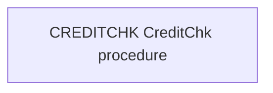

# Program Analysis: Credit Limit Validation (OBJ-CREDIT-VALIDATION-001)

## Metadata

- **Program ID:** OBJ-CREDIT-VALIDATION-001
- **Program Name:** CREDITCHK
- **Program Type:** RPGLE
- **Library:** CREDITLIB
- **Source Location:** CREDITCHK (embedded procedure)
- **Collection Date:** 2025-12-15
- **Entry Points:** CreditChk
- **Files Accessed:** CREDFILE (PF), CUSTFILE (LF)
- **External Calls:** None
- **Status:** draft

---

## Analysis Coverage & Scope

| Field | Value |
| --- | --- |
| Source Lines | approx. 240 |
| Analysis Mode | standard |
| Mode Reason | Small program; all routines and observed I/O fit safely in context. |
| Structure Index Built | yes |
| Full Source In Context | yes |
| Business Narrative Allowed | yes |

### Coverage Ledger

| Coverage Item | Count / Status | Notes |
| --- | --- | --- |
| Routines Found | 1 | CreditChk is the only observed callable procedure. |
| Routines Deep-Read | all | Full source was read in context. |
| Routines Indexed Only | 0 | No indexed-only routines. |
| External Edges Resolved | 0 of 0 | No internal or external calls detected. |
| Data Touches Resolved | 3 of 3 | CREDFILE lookup, return value, and declared-only CUSTFILE accounted for. |
| Blocking Gaps | TBD-CREDIT-VALIDATION-001 | Pending CREDFILE DDS field confirmation. |
| Non-Blocking Gaps | TBD-CREDIT-VALIDATION-004 | Return code convention pending SME confirmation. |

### Source Index Summary

| Source Area | Lines / Scope | Coverage | Notes |
| --- | --- | --- | --- |
| File declarations | lines 17-18 | deep_read | CREDFILE and CUSTFILE declarations inspected. |
| CreditChk procedure | lines 19-42 | deep_read | Full decision logic, CHAIN, and return values inspected. |

---

## Program Call Map

### Visual Overview

Source: derived-from-code



### Node Inventory

| Node | Node Type | Defined At | Role / Notes | Evidence |
| --- | --- | --- | --- | --- |
| CreditChk | Procedure | lines 19-42 | single callable procedure; performs credit validation | EV-CREDIT-VALIDATION-001 |

**Hub / common candidates:** None.

**Orphaned subroutines/procedures:** None.

### Call Tree

Source: derived-from-code (no source-level flow-header comment present)

```text
CreditChk
```

**Evidence:**
- [EV-CREDIT-VALIDATION-001: RPGLE procedure header, lines 19-24]

**Header vs. code:** N/A (no header present)

### Call Edge Table

| From | To | Type | Line | Call Condition / Context | Evidence |
| --- | --- | --- | --- | --- | --- |
| (none) | (none) | N/A | N/A | no internal or external calls detected | EV-CREDIT-VALIDATION-001 |

### Reverse Caller Index

| Node | Called By | Notes |
| --- | --- | --- |
| CreditChk | external caller not provided in this program source | callable entry point; caller contract pending inventory / flow context |

---

## Routine Cards

| Routine | Type | Coverage | Responsibility | Evidence | Notes |
| --- | --- | --- | --- | --- | --- |
| CreditChk | Procedure / entry point | deep_read | Validate requested amount against customer credit limit and return approval decision. | EV-CREDIT-VALIDATION-001, EV-CREDIT-VALIDATION-002 | Only observed routine; full source read in context. |

---

## Deep Read Windows

| Window ID | Source Range | Coverage | Included Routines / Logic | Evidence | Notes |
| --- | --- | --- | --- | --- | --- |
| full-source-read | lines 17-42 | deep_read | File declarations and complete CreditChk procedure | EV-CREDIT-VALIDATION-001, EV-CREDIT-VALIDATION-002, EV-CREDIT-VALIDATION-003 | Full source read in context. |

---

## Entry Points & Parameters

| Entry Point | Type | Parameters | Return | Evidence |
| --- | --- | --- | --- | --- |
| CreditChk | Main Procedure | (CustID: numeric 9P0 in, RequestAmount: decimal 7P2 in, ApprovedAmount: decimal 7P2 out) | Decision Code: char 1 ('A'=Approved, 'D'=Denied) | confirmed_from_code |

**Evidence links:**
- [EV-CREDIT-VALIDATION-001: RPGLE procedure header, lines 19–24]

**Unresolved:**
- None

---

## Object Dependencies

Source: derived-from-code

### Uses (forward dependencies)

| Object | Type | Version | Description | Inventory ID | Evidence |
| --- | --- | --- | --- | --- | --- |
| CREDFILE | PF | — | Credit-limit lookup file | OBJ-CREDIT-VALIDATION-002 | EV-CREDIT-VALIDATION-002 |
| CUSTFILE | LF | — | Declared logical file; no observed I/O in this source | OBJ-CREDIT-VALIDATION-003 | EV-CREDIT-VALIDATION-003 |

**Inventory gaps:** None.

### Used By (reverse dependencies)

From `01_inventory/inventory.yaml` `relationships` section.

| Caller | Type | Notes | Evidence |
| --- | --- | --- | --- |
| (not provided) | — | External caller not included in this single-program analysis | pending flow context |

---

## Logic Decomposition Ledger

| Logic ID | Routine / Lines | Logic Type | Source Inputs / Constants | Operation / Condition | Result Field / Action | Branch Priority / Loop Scope | Evidence |
| --- | --- | --- | --- | --- | --- | --- | --- |
| LOG-CREDIT-VALIDATION-001 | CreditChk lines 30-32 | IF / not-found branch | `%found(CREDFILE)` false, literal 0, literal 'D' | Not-found branch after CHAIN | ApprovedAmount = 0; return 'D' | First branch after file lookup; exits before amount comparison | EV-CREDIT-VALIDATION-001, EV-CREDIT-VALIDATION-002 |
| LOG-CREDIT-VALIDATION-002 | CreditChk lines 34-39 | IF / ELSE amount comparison | RequestAmount, CREDLIMIT, literals 'A'/'D' | Compare RequestAmount <= CREDLIMIT | ApprovedAmount = RequestAmount and return 'A', else ApprovedAmount = CREDLIMIT and return 'D' | Executes only when CREDFILE record is found | EV-CREDIT-VALIDATION-001 |

**Unresolved:**
- TBD-CREDIT-VALIDATION-001: Confirm CREDFILE DDS field list and CREDLIMIT type.

---

## Data Touch Map

### Data Touches

| Data Object / Carrier | Mechanism | Operation | Routine / Procedure | Key / Payload | Critical Fields Touched | State Impact | Evidence |
| --- | --- | --- | --- | --- | --- | --- | --- |
| CREDFILE | PF | CHAIN | CreditChk | key=CustID | CustID, CREDLIMIT | read-only lookup | EV-CREDIT-VALIDATION-002 |
| CreditChk parameter list / return | CALL parameters / return value | out | CreditChk | Decision Code, ApprovedAmount | Decision Code ('A'/'D'), ApprovedAmount | returns approval outcome and approved amount to caller | EV-CREDIT-VALIDATION-001 |
| CUSTFILE | LF | declared only | N/A | N/A | none observed | no runtime touch observed | EV-CREDIT-VALIDATION-003 |

### Critical Field Watchlist

| Field / Data Structure | Object / Carrier | Why It Matters | Observed Operations | Evidence |
| --- | --- | --- | --- | --- |
| CustID | CreditChk parameter / CREDFILE key | customer identifier | input parameter; CHAIN key | EV-CREDIT-VALIDATION-001, EV-CREDIT-VALIDATION-002 |
| RequestAmount | CreditChk parameter | requested money amount | compared to CREDLIMIT | EV-CREDIT-VALIDATION-001 |
| CREDLIMIT | CREDFILE | credit decision threshold | read and compared | EV-CREDIT-VALIDATION-002 |
| ApprovedAmount | CreditChk output parameter | approved amount returned to caller | set to 0, RequestAmount, or CREDLIMIT before return | EV-CREDIT-VALIDATION-001 |
| Decision Code | CreditChk return | approval / denial outcome | returned as 'A' or 'D' | EV-CREDIT-VALIDATION-001 |

**Unresolved:**
- TBD-CREDIT-VALIDATION-001: Confirm CREDFILE DDS field list and CREDLIMIT type.

---

## Key File & Field Logic

### Key Files

| File / Carrier | Role in Program | Routines | Access / Mutation Pattern | Key Fields | Critical Persisted / Output Fields | Evidence |
| --- | --- | --- | --- | --- | --- | --- |
| CREDFILE | lookup/reference | CreditChk | CHAIN then `%found` branch | CustID | CREDLIMIT read-only; no persisted mutation observed | EV-CREDIT-VALIDATION-002 |
| CreditChk parameter list / return | parameter-DS | CreditChk | input parameters and output parameter/return code | CustID input | ApprovedAmount output, Decision Code return | EV-CREDIT-VALIDATION-001 |
| CUSTFILE | declared-only | N/A | no observed I/O | N/A | none observed | EV-CREDIT-VALIDATION-003 |

### Key Fields

| Field / Data Structure | Source Object / Carrier | Role | Used In | Values / Domain Observed | Downstream Impact | Evidence |
| --- | --- | --- | --- | --- | --- | --- |
| CustID | CreditChk parameter / CREDFILE | input / access-key | CHAIN CREDFILE | numeric 9P0 from procedure spec | selects credit record | EV-CREDIT-VALIDATION-001, EV-CREDIT-VALIDATION-002 |
| RequestAmount | CreditChk parameter | input / calculation-operand / branch-condition | comparison with CREDLIMIT | decimal 7P2 from procedure spec | approved amount or denial branch | EV-CREDIT-VALIDATION-001 |
| CREDLIMIT | CREDFILE | lookup field / branch-condition | comparison with RequestAmount | DDS pending | caps ApprovedAmount when RequestAmount exceeds limit | EV-CREDIT-VALIDATION-002 |
| ApprovedAmount | CreditChk output parameter | output / derived | set in every return branch | 0, RequestAmount, or CREDLIMIT | returned to caller | EV-CREDIT-VALIDATION-001 |
| Decision Code | CreditChk return | return-code | returned from CreditChk | 'A', 'D' | caller receives approval/denial outcome | EV-CREDIT-VALIDATION-001 |

### Field Lineage

| Lineage ID | Source / Physical Field | Alias / Data Structure | Work Variables | Calculation / Condition | Write-Back Alias | Persisted / Output Field | Evidence |
| --- | --- | --- | --- | --- | --- | --- | --- |
| LIN-CREDIT-VALIDATION-001 | CreditChk.RequestAmount | procedure parameter | none | if RequestAmount <= CREDLIMIT | ApprovedAmount | CreditChk ApprovedAmount output parameter | EV-CREDIT-VALIDATION-001 |
| LIN-CREDIT-VALIDATION-002 | CREDFILE.CREDLIMIT | file field; DDS pending | none | if RequestAmount > CREDLIMIT | ApprovedAmount | CreditChk ApprovedAmount output parameter | EV-CREDIT-VALIDATION-001, EV-CREDIT-VALIDATION-002 |

**Unresolved:**
- TBD-CREDIT-VALIDATION-001: Confirm physical DDS mapping and type for CREDFILE.CREDLIMIT.

---

## Control Flow

### Main Entry Point (CreditChk)
1. Accept input parameters: CustID, RequestAmount [confirmed_from_code, EV-CREDIT-VALIDATION-001]
2. CHAIN on CREDFILE with CustID as key [confirmed_from_code, EV-CREDIT-VALIDATION-002]
3. If not found (customer not in CREDFILE):
   - Set ApprovedAmount = 0
   - Return 'D' (DENIED) [confirmed_from_code, lines 30–32]
4. If found:
   - Compare RequestAmount vs. CREDLIMIT field
   - If RequestAmount ≤ CREDLIMIT: [confirmed_from_code, line 34]
     - Set ApprovedAmount = RequestAmount
     - Return 'A' (APPROVED)
   - Else: [confirmed_from_code, line 36]
     - Set ApprovedAmount = CREDLIMIT
     - Return 'D' (DENIED: exceeds limit)
5. Procedure exit

**Control structures observed:**
- CHAIN operation (line 29) with error check (line 30)
- IF / ELSE branching (lines 34–39) on amount comparison

**Evidence links:**
- [EV-CREDIT-VALIDATION-001: Source lines 29–39]

**No additional sub-procedures detected.**

## File I/O

### File Access Summary

| File | Record Format | Type | Operations | Key Fields | Read / Mutation Conditions | Indicators / Status Checks | Evidence |
| --- | --- | --- | --- | --- | --- | --- | --- |
| CREDFILE | pending DDS | PF | CHAIN | CustID | before approval/denial decision | `%found(CREDFILE)` checked immediately after CHAIN | EV-CREDIT-VALIDATION-002 |
| CUSTFILE | pending DDS | LF | declared only | N/A | no observed I/O | none observed | EV-CREDIT-VALIDATION-003 |

### Field Mutation Matrix

| File | Operation | Routine / Lines | Access Key / Record Condition | Field Mutated / Persisted | Source Value / Expression | Assignment Evidence | Error / Rollback Handling |
| --- | --- | --- | --- | --- | --- | --- | --- |
| (none) | N/A | N/A | N/A | No `WRITE`, `UPDATE`, `DELETE`, or SQL DML observed | N/A | full-source-read | N/A |

**Operation details:**

- **CREDFILE / CHAIN on CustID:** Random access to fetch the customer credit record used by this procedure. Key field: CustID (numeric 9P0). %found() indicator used to check success. If found, CREDLIMIT field is used in amount comparison (line 35).
- **CUSTFILE / declared only:** File is declared in F-spec but no source statement reads, writes, updates, or deletes it.

**Evidence links:**
- [EV-CREDIT-VALIDATION-002: F-spec line 17; CHAIN statement line 29; %found() check line 30]
- [EV-CREDIT-VALIDATION-003: F-spec line 18; no I/O statements reference CUSTFILE]

**Unresolved:**
- TBD-CREDIT-VALIDATION-001: Confirm CREDFILE DDS field list (verify CREDLIMIT field exists and type matches 7P2)

---

## External Calls

| Called Program | Type | Parameters (In / Out) | Purpose | Evidence |
| --- | --- | --- | --- | --- |
| (None) | — | — | — | — |

**No external program calls detected in this program.**

---

## Error Handling

### Exception Closure Ledger

| Exception / Error Condition | Trigger / Source | Message ID / Error Code / RC | Detected By | Fields Set / Messages Sent | Handling Action | Downstream Impact | Evidence |
| --- | --- | --- | --- | --- | --- | --- | --- |
| Record not found (CustID not in CREDFILE) | CHAIN CREDFILE returns not found | return code 'D' | `%found(CREDFILE)` check | ApprovedAmount = 0; no message sent | return 'D' | caller receives denial; no file mutation observed | EV-CREDIT-VALIDATION-001, EV-CREDIT-VALIDATION-002 |

### Message / Error Code Inventory

| Message ID / Code | Source | Meaning Observed In Code | Handler / Branch | Evidence |
| --- | --- | --- | --- | --- |
| 'A' | return literal | approval decision | amount <= CREDLIMIT branch | EV-CREDIT-VALIDATION-001 |
| 'D' | return literal | denial decision | not-found branch or amount > CREDLIMIT branch | EV-CREDIT-VALIDATION-001 |

**Unhandled exceptions:**
- CHAIN I/O error: No MONITOR block observed. If CREDFILE becomes unavailable (file locked, I/O error), program will abnormally terminate. [medium_confidence, needs_sme_review per TBD]

**Generic handlers:**
- None observed.

**Logged errors:**
- No error logging observed. Errors are signaled via return code ('A' or 'D'), not via message queue or spool.

**Evidence links:**
- [EV-CREDIT-VALIDATION-001: CHAIN statement and subsequent IF logic]

---

## Redundancy Candidate Notes

| Candidate | Location | Candidate Redundancy | Reason | Trace / Last Observed Use | Evidence | Decision |
| --- | --- | --- | --- | --- | --- | --- |
| CUSTFILE declaration | F-spec line 18 | unknown | File is declared but no I/O references are observed in this source; caller/job or copybook usage is not proven absent beyond this program. | declared only; no observed runtime touch | EV-CREDIT-VALIDATION-003 | pending_sme_judgment via TBD-CREDIT-VALIDATION-003 |

---

## TBDs & Blocking Status

### Pending Source
- **TBD-CREDIT-VALIDATION-001:** Confirm CREDFILE DDS field list
  - Blocking: pending_source
  - Question: CREDLIMIT field is referenced in source (line 34) but DDS not provided. Confirm field exists, type is decimal (7P2 assumed), and no other credit-related fields.
  - Related: [OBJ-CREDIT-VALIDATION-001], [EV-CREDIT-VALIDATION-002]

### Pending SME Judgment
- **TBD-CREDIT-VALIDATION-002:** Confirm error handling intent for CREDFILE I/O failures
  - Blocking: pending_sme_judgment
  - Question: CHAIN operation has no MONITOR block. If file becomes unavailable, program terminates. Is this intentional? Should errors be caught and recovery attempted?
  - Related: [OBJ-CREDIT-VALIDATION-001]

- **TBD-CREDIT-VALIDATION-003:** Confirm expected usage of CUSTFILE (declared but unused)
  - Blocking: pending_sme_judgment
  - Question: F-spec declares CUSTFILE (line 18) but no I/O statements reference it. Was this left from previous version? Can it be removed?
  - Related: [OBJ-CREDIT-VALIDATION-001]

### Non-Blocking
- **TBD-CREDIT-VALIDATION-004:** Confirm return code convention
  - Blocking: non_blocking
  - Question: Return codes 'A' (approved) and 'D' (denied) are inferred from comments and logic. Confirm these match calling program expectations.
  - Related: [OBJ-CREDIT-VALIDATION-001]

---

## Review Checklist

Before approval, SME must validate:

- [X] External entry points and callable procedures are correct and complete — Single callable procedure CreditChk with documented parameters
- [X] Parameter contracts match actual usage — No invented parameters; all declared in P spec
- [X] Logic Decomposition Ledger preserves calculations, constants, branch priority, loops, and CASE/SELECT behavior — not-found branch and amount comparison are captured
- [X] Data Touch Map captures critical carriers, keys, payloads, and state impacts — CREDFILE lookup and return decision captured
- [X] Key File & Field Logic shows source fields, aliases, work variables, calculations/conditions, and persisted fields — CustID, RequestAmount, CREDLIMIT, ApprovedAmount, and Decision Code captured
- [X] File I/O field mutation matrix names which files and fields are written, updated, deleted, or skipped — no persisted file mutation observed
- [X] External calls match system interfaces — None present
- [ ] Error handling lists every observed message ID / error code and closes each exception path through return, rollback, skip, log, or downstream impact — return codes captured; **See TBD-CREDIT-VALIDATION-002** for unhandled I/O error intent
- [ ] Redundancy candidates are conservative and do not remove hidden rules — CUSTFILE declaration marked unknown, not removed
- [ ] TBDs are non-blocking or properly flagged for follow-up — 4 TBDs; 2 pending source/SME, 1 pending SME (error handling), 1 non-blocking
- [X] No invented subroutines or undocumented file access — All behaviors confirmed from source
- [X] All evidence links reference existing inventory items — EV-* IDs from CREDIT-VALIDATION capability scope
- [X] Analysis coverage ledger is complete — standard mode; 1 of 1 routine deep-read; 3 of 3 data touches resolved
- [X] Routine cards and deep-read windows support the business narrative — full-source-read window covers the complete program source
- [X] Indexed-only routines are either technical utilities or routed to explicit review items — none present
- [X] No whole-program business summary exceeds the documented coverage
- [X] Status field follows contract (`draft` → `needs_sme_review` / `blocked_pending_source` → `approved` / `approved_with_non_blocking_tbd` / `rejected`); current value is `draft`

### Review Sign-Off

- **Reviewer:** [Pending]
- **Review Date:** [Pending]
- **Decision:** Pending SME review; final value must be `approved`, `approved_with_non_blocking_tbd`, or `rejected`.
- **Notes:** [Awaiting SME validation]
