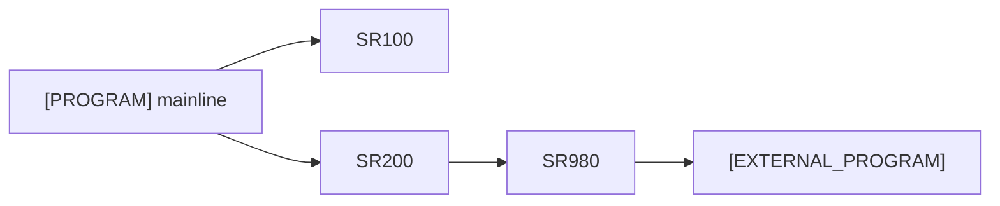

# Program Analysis: [Program Name] (OBJ-[ID])

## Metadata

- **Program ID:** OBJ-[SLUG]-[NNN]
- **Program Name:** [SOURCE_PROGRAM_NAME]
- **Program Type:** RPGLE | CLLE | COBOL
- **Library:** [LIBRARY_NAME]
- **Source Location:** [file path or collection ID]
- **Collection Date:** YYYY-MM-DD
- **Entry Points:** [List entry point names]
- **Files Accessed:** [List file names and types]
- **External Calls:** [List called program/service names]
- **Status:** draft | needs_sme_review | blocked_pending_source | approved | approved_with_non_blocking_tbd | rejected

---

## Analysis Coverage & Scope

Purpose: state how much source was available, how the analysis was scoped, and
which claims are fully supported versus indexed-only.

### Source Size & Strategy

| Source Lines | Analysis Mode | Mode Reason | Structure Index Built | Full Source In Context | Business Narrative Allowed |
| --- | --- | --- | --- | --- | --- |
| [N lines] | standard / segmented / large-program | [why this mode was selected] | yes / no | yes / no | yes / limited / no |

### Coverage Ledger

| Routines Found | Routines Deep-Read | Routines Indexed Only | External Edges Resolved | Data Touches Resolved | Blocking Gaps | Non-Blocking Gaps |
| --- | --- | --- | --- | --- | --- | --- |
| [N] | [N] | [N] | [N/N] | [N/N] | [N] | [N] |

### Source Index Summary

| Mainline Segments | Subroutines / Procedures | External Calls | File Operations | Display / Report Operations | Commit / Rollback Points |
| --- | --- | --- | --- | --- | --- |
| [N] | [N] | [N] | [N] | [N] | [N] |

## Program Call Map

Purpose: RDi-style structural view of the program. This is a call map, not
a business-process diagram.

### Visual Overview

Source: source-level flow header (lines [XX-YY]) | derived-from-code | both (matched)



### Node Inventory

| Node | Node Type | Defined At | Role / Notes | Evidence |
| --- | --- | --- | --- | --- |
| [PROGRAM] | Mainline | lines [XX-YY] | entry orchestration | [EV-[SLUG]-[NNN]] |
| [SR_NAME] | Subroutine / Procedure | line [XX] | [hot path / utility / error handler / unknown] | [EV-[SLUG]-[NNN]] |
| [PROGRAM_NAME] | External Program / Service Program / API / DTAQ / MSGQ | call site line [XX] | external dependency | [EV-[SLUG]-[NNN]] |

**Hub / common candidates:**
- [NODE_NAME]: called by [N] callers; [reason this may matter]

**Orphaned subroutines/procedures:**
- [SR_NAME] -> TBD-[SLUG]-[NNN]: confirm whether dead code, callback entry, or shop convention

### Call Tree

Source: source-level flow header (lines [XX-YY]) | derived-from-code | both (matched)

```text
Main line                    Main flow control
|-- [SR_NAME]                [description from header, if present]
|    |-- [SR_NAME]           [description]
|         |-- [SR_NAME]      [description]
|-- [SR_NAME]                [description]
```

**Evidence:**
- [EV-[SLUG]-[NNN]: source-level flow header lines XX-YY] (if header present)
- [EV-[SLUG]-[NNN]: EXSR / CALL / PERFORM statements] (code-derived)

**Header vs. code:** matched | drift detected -> see TBD-[SLUG]-[NNN]

### Call Edge Table

| From | To | Type | Line | Call Condition / Context | Evidence |
| --- | --- | --- | --- | --- | --- |
| [CALLER] | [CALLEE] | EXSR / CALLP / CALL / PERFORM / CALLPRC | [LINE] | always / in loop / only if X / first-time-only | [EV-[SLUG]-[NNN]] |

### Reverse Caller Index

| Node | Called By | Notes |
| --- | --- | --- |
| [SR_NAME] | [CALLER] [line] | [hot path / common utility / single callsite / etc.] |

---

## Routine Cards

Purpose: summarize every routine that affects calls, data, errors, state, or
external boundaries, including whether the routine was deep-read or only indexed.
SME confirmation belongs in evidence, review notes, or sign-off; it is not a
coverage value.

| Routine | Location | Called By | Calls Out | Data Touches | State Impact | Error Handling | Evidence | Coverage |
| --- | --- | --- | --- | --- | --- | --- | --- | --- |
| [MAIN / SR_NAME / PROCEDURE] | lines [XX-YY] | [CALLER list] | [EXSR / CALL / CALLP / API list] | [files, data areas, queues, parameters] | read-only / creates / updates / deletes / boundary-state | [MONITOR / indicator / ON ERROR / none observed] | [EV-[SLUG]-[NNN]] | indexed_only / deep_read / blocked |

---

## Deep Read Windows

Purpose: identify the source windows used to support high-risk claims,
state-changing behavior, and business narrative. For `standard` mode where the
full source was read in context, record one `full-source-read` window or mark
this section `N/A — full source read in context`; do not invent artificial
windows.

| Window ID | Source Range | Reason Selected | Routines Covered | Claims Supported | Evidence |
| --- | --- | --- | --- | --- | --- |
| WIN-[SLUG]-[NNN] | lines [XX-YY] or full-source-read | state change / external boundary / error path / high-risk branch / representative path / full-source-read | [routine list] | [claim IDs or short claim summary] | [EV-[SLUG]-[NNN]] |

---

## Entry Points & Parameters

| Entry Point | Type | Parameters | Return | Evidence |
| --- | --- | --- | --- | --- |
| [NAME] | Main Program / Callable Procedure / External Entry | (param1: type, param2: type) | [return type/code] | confirmed_from_code |

**Evidence links:**
- [EV-[SLUG]-[NNN]: Description]

**Unresolved:**
- TBD-[SLUG]-[NNN]: [Question]

---

## Object Dependencies

Source: shop F5-OBJREF TREE tool output | derived-from-code | both (matched)

### Uses (forward dependencies)

| Object | Type | Version | Description | Inventory ID | Evidence |
| --- | --- | --- | --- | --- | --- |
| [OBJ_NAME] | [PF / LF / DSPF / PRTF / *DTAARA / *DTAQ / *MSGF / *PGM / *SRVPGM / Copybook / PF (DS)] | [VERSION or —] | [Description] | OBJ-[SLUG]-[NNN] or TBD-[SLUG]-[NNN] | confirmed_from_code |

**Inventory gaps:**
- TBD-[SLUG]-[NNN]: object [NAME] referenced by program but not in inventory.yaml

### Used By (reverse dependencies)

From `01_inventory/inventory.yaml` `relationships` section.

| Caller     | Type   | Notes                          | Evidence |
| ---        | ---    | ---                            | --- |
| [CALLER]   | *PGM   | [description]                  | from inventory relationships |

---

## Data Touch Map

Purpose: program-local data movement and state-change view. Track objects,
records, carriers, and critical fields; do not enumerate every temporary
working variable.

### Data Touches

| Data Object / Carrier | Mechanism | Operation | Routine / Procedure | Key / Payload | Critical Fields Touched | State Impact | Evidence |
| --- | --- | --- | --- | --- | --- | --- | --- |
| [FILE_NAME] | PF / LF | CHAIN / READ / READE / WRITE / UPDATE / DELETE | [SRxxx / procedure] | key=[FIELD] | [amount/status/customer/account/RC/etc.] | read-only / creates / updates / deletes | [EV-*] |
| [DTAARA_NAME] | *DTAARA | IN / OUT / CHGDTAARA / RTVDTAARA | [SRxxx / procedure] | [value or structure] | [critical fields] | reads shared state / updates shared state | [EV-*] |
| [DTAQ_NAME] | *DTAQ | SNDDTAQ / RCVDTAQ / QSNDDTAQ / QRCVDTAQ | [SRxxx / procedure] | [message structure] | [critical fields] | async send / async receive | [EV-*] |
| [CALL_TARGET] | CALL parameters | in / out / inout | [SRxxx / procedure] | [parameter list] | [decision/status/error fields] | passes state across program boundary | [EV-*] |

### Critical Field Watchlist

| Field / Data Structure | Object / Carrier | Why It Matters | Observed Operations | Evidence |
| --- | --- | --- | --- | --- |
| [FIELD_NAME] | [OBJECT] | amount / status / customer / account / inventory / posting / approval / error code | read / written / compared / returned | [EV-*] |

**Unresolved:**
- TBD-[SLUG]-[NNN]: [Question about payload structure, key field, direction, or state impact]

---

## Control Flow

Purpose: concise narrative derived from Program Call Map, Routine Cards, Data
Touch Map, and Deep Read Windows. Do not introduce new business facts here that
are absent from the evidence-backed sections above.

### Main Entry Point
1. [Step description] [evidence_strength]
2. [Step description] [evidence_strength]
3. [Conditional/Loop structure]
   - [Path 1 description]
   - [Path 2 description]
4. [Return or final step]

**Control structures observed:**
- [IF/SELECT/MONITOR description with line numbers]

**Evidence links:**
- [EV-[SLUG]-[NNN]: Source lines XX–YY]

### [Sub-Procedure Name]
1. [Step description]
2. [Step description]
3. [Return or final step]

**Error handling:** [Yes/No] — [Description if yes]

---

## File I/O

| File | Type | Operations | Key Fields | Purpose | Evidence |
| --- | --- | --- | --- | --- | --- |
| [FILE_NAME] | PF / LF / DSPF / PRTF | SETLL, READE, CHAIN, WRITE, UPDATE, DELETE | [KEY_FIELD_NAMES] | [Purpose description] | [EV-[SLUG]-[NNN]] |

**Operation details:**

- **[FILE_NAME] / [OPERATION] on [KEY]:** [Description of operation, indicators, result].

**Evidence links:**
- [EV-[SLUG]-[NNN]: Source lines / DDS reference]

**Unresolved:**
- TBD-[SLUG]-[NNN]: [Question about file access or missing DDS]

---

## External Calls

| Called Program | Type | Parameters (In / Out) | Purpose | Evidence |
| --- | --- | --- | --- | --- |
| [PROGRAM_NAME] | RPGLE Program / CLLE Program / Service Program / API / etc. | (param1: type, param2: type) → (return: type) | [Purpose description] | [EV-[SLUG]-[NNN]] |

**Call details:**

- **[PROGRAM_NAME]:** [Description of parameters, return values, synchronous/asynchronous, known error handling].

**Parameter contracts:**
- [PROGRAM_NAME] expects [parameter description]. [Evidence or TBD status].

**Unresolved:**
- TBD-[SLUG]-[NNN]: [Question about parameter contract, error handling, or availability]

---

## Error Handling

| Error Condition | Detected By | Handling | Recovery | Evidence |
| --- | --- | --- | --- | --- |
| [Error type] | MONITOR block / IF statement / Indicator / File operation | [Description of how error is caught] | [Recovery action or result] | [EV-[SLUG]-[NNN]] |

**Unhandled exceptions:**
- [Description of unhandled error conditions if any]

**Logged errors:**
- [Description of error logging, message queues, spool output]

**Evidence links:**
- [EV-[SLUG]-[NNN]: RPGLE MONITOR blocks / CLLE MONMSG / COBOL ON ERROR]

---

## TBDs & Blocking Status

### Pending Source
- **TBD-[SLUG]-[NNN]:** [Question about missing DDS, source, or documentation]
  - Blocking: pending_source
  - Related: [OBJ-*, EV-*]

### Pending SME Judgment
- **TBD-[SLUG]-[NNN]:** [Question about unclear behavior or undocumented interface]
  - Blocking: pending_sme_judgment
  - Related: [OBJ-*, EV-*]

### Non-Blocking
- **TBD-[SLUG]-[NNN]:** [Question with workaround or non-blocking impact]
  - Blocking: non_blocking
  - Related: [OBJ-*, EV-*]

---

## Review Checklist

Before approval, SME must validate:

- [ ] External entry points and callable procedures are correct and complete
- [ ] Analysis Coverage & Scope honestly states whether this was standard, segmented, or large-program mode
- [ ] Routine Cards cover every routine that affects calls, data, errors, or external boundaries
- [ ] Deep Read Windows support all high-risk claims and state-changing behavior
- [ ] Indexed-only routines are either technical utilities or routed to explicit review items
- [ ] No whole-program business summary exceeds the documented coverage
- [ ] Parameter contracts match actual usage (no invented parameters)
- [ ] Data Touch Map captures critical carriers, keys, payloads, and state impacts
- [ ] File I/O matches job design (no hallucinated key fields or unobserved operations)
- [ ] External calls match system interfaces (especially for undocumented calls)
- [ ] Error handling aligns with production reliability requirements
- [ ] TBDs are non-blocking or properly flagged for follow-up
- [ ] No invented subroutines or undocumented file access
- [ ] All evidence links reference existing inventory items (OBJ-*, EV-*)
- [ ] Status field is set correctly (`draft` → `needs_sme_review` /
  `blocked_pending_source` → `approved` / `approved_with_non_blocking_tbd` /
  `rejected`)

### SME Sign-Off

- **Reviewer:** [Name]
- **Review Date:** [YYYY-MM-DD]
- **Decision:** approved | approved_with_non_blocking_tbd | rejected
- **Notes:** [Free-form SME commentary]
