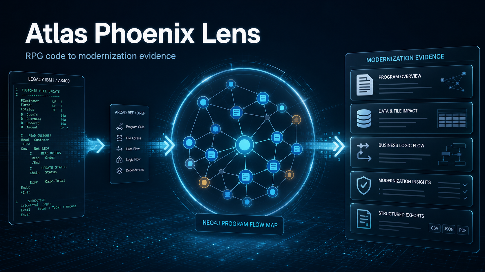
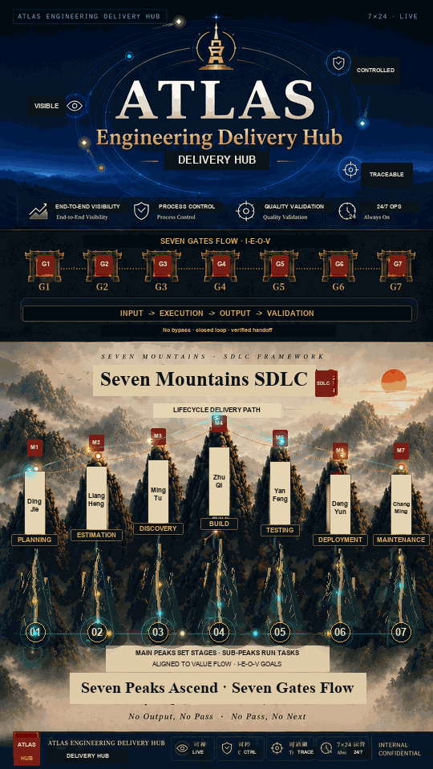

# Atlas Phoenix Lens

English | [中文](README.zh-CN.md)



**Atlas Phoenix Lens** is the **M3 Discovery** capability within the
**Atlas Engineering Delivery Hub** / Seven Mountains SDLC narrative. It scans
RPG code and turns legacy system behavior into structured modernization
evidence.

This repository packages the **Legacy Spec Factory** skills, tooling, evidence
contracts, templates, and documentation behind that capability. It helps teams
turn low-level ARCAD REF / XREF data, program-call relationships, and RPG / CL /
COBOL / DDS source evidence into structured, reviewable modernization
knowledge.

The current repository is focused on two connected capabilities:

1. **Program-flow discovery**: generate Program Flow Maps from ARCAD REF / XREF
   data so teams can understand how legacy programs call each other. The Neo4j
   import and Program Flow Map application currently live in a separate
   company-internal repository (`TBD: internal Program Flow Map repo link`).
2. **Source-code scanning with skills**: use the discovered flow as the
   navigation map for agent skills that inspect source code and extract
   business behavior, calculation logic, validation logic, exception handling,
   data usage, and operational evidence.

The project does **not** directly translate legacy source into Java or cloud
services. Its purpose is to recover business intent, preserve source evidence,
surface SME questions, and prepare trusted inputs for BRDs, gap analysis,
target architecture planning, application retirement, and AI-native SDLC
handoff.

For the full historical README and deeper design notes, see
[docs/full-reference-readme.md](docs/full-reference-readme.md).

## Delivery Hub Positioning

Atlas Phoenix Lens sits under the Atlas Engineering Delivery Hub as the
Discovery-stage lens between early planning/estimation and downstream build,
testing, deployment, and maintenance work.





Editable source:
[docs/assets/atlas-phoenix-lens-delivery-hub-position.mmd](docs/assets/atlas-phoenix-lens-delivery-hub-position.mmd).

## Current Scope

Atlas Phoenix Lens currently ships as a two-repository capability:

| Area | Status |
| --- | --- |
| Neo4j Program Flow Map application | Upstream company-internal repository, link pending |
| Program Flow Map export contract | Documented here as the handoff boundary |
| Legacy Spec Factory skills | Included in this repository under `skills/` |
| RPG / CL / COBOL / DDS source scanning | Included through agent skills, templates, validators, and guidance |
| BRD / spec / handoff generation | Supported as downstream outputs after review gates |

This repository is the evidence and skill layer. It consumes Program Flow Map
outputs, scans source code along those flows, and produces structured
modernization evidence. It does not host the Neo4j application itself yet.

## Naming

| Name | Meaning |
| --- | --- |
| **Atlas Phoenix Lens** | M3 Discovery capability narrative used under Atlas Engineering Delivery Hub and open collaboration communication |
| **Legacy Spec Factory** | Repository skill/tooling package that powers the evidence workflow |
| **Program Flow Map** | Upstream Neo4j application that visualizes ARCAD REF / XREF relationships |
| **Modernization evidence** | Structured output used for SME review, BRD/gap analysis, and target-architecture planning |

## Why It Matters

Legacy modernization often fails because teams treat the old system as only a
code-conversion problem. In practice, the hardest part is discovering what the
legacy system actually does, which behaviors matter to the business, and which
parts are safe to retire, redesign, or preserve.

This is why Atlas Phoenix Lens does not start by converting RPG to Java. It
first creates an evidence layer: what was observed in source or runtime, what
is only inferred, what SMEs have confirmed, and what modernization decisions are
still open. Code conversion can come later, after behavior and business meaning
are understood.

Atlas Phoenix Lens provides a reusable evidence layer between legacy systems
and modernization delivery:

```text
ARCAD REF / XREF data
  -> internal Neo4j Program Flow Map repo (TBD)
  -> Program Flow Map
  -> targeted source-code scan with skills
  -> evidence-backed program / flow analysis
  -> SME questions and modernization-ready business evidence
  -> BRD / spec / handoff packages when approved
```

## Implementation Design Overview


Editable source:
[docs/assets/atlas-phoenix-lens-design.mmd](docs/assets/atlas-phoenix-lens-design.mmd).

## Demo Scenario

A short evaluation path for reviewers:

1. Export ARCAD REF / XREF relationship data from the IBM i estate.
2. Load that data into the upstream Neo4j Program Flow Map repository.
3. Select a representative transaction flow, such as an account update, card
   adjudication, nightly batch, or customer journey step.
4. Export the flow package: program list, call edges, optional field trace, and
   source-member hints.
5. Use `legacy-ibmi-program-list-batch` to prepare a resumable code-scan queue.
6. Use `legacy-ibmi-program-analyzer` for each program on the flow.
7. Use `legacy-ibmi-flow-analyzer` to connect the program findings into one
   business-readable behavior chain.
8. Review generated `BEH-*`, `BR-*`, and `TBD-*` evidence with SMEs before
   using it for BRD, gap analysis, or target-architecture planning.

## Sample Output Package

A small synthetic sample is available at
[docs/samples/atlas-phoenix-lens-mini-output/](docs/samples/atlas-phoenix-lens-mini-output/).
It shows the expected handoff shape from Program Flow Map export to
source-backed modernization evidence:

- `program-flow-export.sample.csv`
- `program-analysis.sample.md`
- `flow-analysis.sample.md`
- `modernization-evidence.sample.yaml`

## Upstream Program Flow Map Contract

The upstream Neo4j Program Flow Map repository is expected to provide a small,
stable handoff package. The exact repo link and file names are still pending,
but the contract should include:

| Artifact | Purpose |
| --- | --- |
| Flow metadata | Flow name, business area, source system, export timestamp, and source snapshot |
| Program list | Ordered or grouped programs included in the selected flow |
| Call edges | Caller, callee, relationship type, and ARCAD / XREF evidence reference |
| Source-member mapping | Program name to library, source file, member, path, or repo location when known |
| Field trace | Optional field movement, file/table access, key fields, and persistence hints |
| Review notes | Known gaps, unresolved calls, confidence notes, and SME hints |

Preferred export formats are CSV, JSON, YAML, or Markdown. The downstream
skills should treat the Program Flow Map export as navigation evidence, not as
final business truth. Source scanning and SME review remain required before
modernization decisions are approved.

Template:
[docs/program-flow-map-export-contract.md](docs/program-flow-map-export-contract.md).

## Main Capabilities

### 1. Program-Flow Discovery

- Import ARCAD REF / XREF relationship data.
- Load relationship data into Neo4j through a separate internal Program Flow
  Map repository (`TBD: add repo name/link`).
- Preserve authoritative `CALLS` relationships.
- Generate Program Flow Map exports for human review and downstream discovery.
- Enrich flows with screen, report, API, T&C, batch, advice, and DB-field
  evidence when available.
- Provide a shared navigation map for migration teams, SMEs, and AI agents.

### 2. Business-Logic Discovery From Source Code

- Use Program Flow outputs as the guide for source-code scanning.
- Analyze RPG / CL / COBOL / DDS one program or one flow at a time.
- Extract observed behavior, calculations, validations, file I/O, dependencies,
  exception paths, and operational evidence.
- Produce structured evidence with stable IDs, source coordinates, coverage
  gaps, and SME review questions.
- Feed downstream module analysis, BRD generation, spec writing, and migration
  planning only after review gates pass.

## Open Collaboration Fit

Atlas Phoenix Lens is designed as an internal open collaboration capability
rather than a one-off project script. It supports:

- **AI-friendly reuse**: clear Markdown, YAML, CSV, examples, validators, and
  stable evidence IDs.
- **Cross-team standardization**: one repeatable way to describe program flows,
  source findings, evidence strength, and SME decisions.
- **Portable agent skills**: canonical skills live under `skills/` and can be
  synced to Codex, Claude Code, and OpenCode adapters.
- **Modernization acceleration**: teams can reuse flow maps, code-scan prompts,
  evidence contracts, and review checklists instead of rebuilding discovery
  methods from scratch.
- **Target-architecture support**: outputs can support future-state planning,
  legacy / .NET application retirement, and AI-assisted SDLC handoff.

For a submission-ready overview, see
[docs/open-collaboration-submission.md](docs/open-collaboration-submission.md).
Chinese one-page draft:
[docs/open-collaboration-submission.zh-CN.md](docs/open-collaboration-submission.zh-CN.md).
Pitch and speaker notes:
[docs/atlas-phoenix-lens-pitch.md](docs/atlas-phoenix-lens-pitch.md).
Materials index:
[docs/atlas-phoenix-lens-index.md](docs/atlas-phoenix-lens-index.md).
Contribution guide:
[CONTRIBUTING.md](CONTRIBUTING.md).

## Roadmap

| Phase | Focus |
| --- | --- |
| Phase 1 | Stabilize the bilingual README, design diagram, promotional visual, and submission narrative |
| Phase 2 | Finalize the upstream Program Flow Map export contract and add the internal repo link |
| Phase 3 | Expand the current mini sample into a richer redacted demo package |
| Phase 4 | Strengthen the E2E demo from Program Flow export to modernization evidence |
| Phase 5 | Package stakeholder-facing HTML / slide material for internal adoption |

## Repository Layout

> Note: the Neo4j Program Flow Map application is currently maintained in a
> separate company-internal repository and is listed here as an upstream
> dependency placeholder. Add the repo link and setup notes when they are ready.

```text
skills/       canonical agent skills, templates, references, and scripts
docs/         design notes, quickstarts, scorecards, diagrams, and examples
scripts/      validation and helper utilities
tests/        regression tests for contracts and skill helper scripts
templates/    shared output templates
schemas/      structured artifact schemas
outputs/      generated or local run outputs
```

Runtime-specific folders such as `.claude/`, `.opencode/`, `.agents/`, and
`.codex/` are adapters or synced copies. The canonical skill source is
`skills/<skill-name>/`.

## Key Skills

| Skill | Purpose |
| --- | --- |
| `legacy-ibmi-program-list-batch` | Prepare resumable program-list scan batches and one-program prompt queues. |
| `legacy-ibmi-program-analyzer` | Analyze one IBM i program and extract source-backed behavior evidence. |
| `legacy-ibmi-flow-analyzer` | Analyze one end-to-end transaction flow across multiple programs. |
| `legacy-ibmi-module-analyzer` | Assemble reviewed program / flow evidence into module-level context. |
| `legacy-brd-writer` | Produce evidence-backed BRD packages from approved module context. |
| `legacy-step-validator` | Validate whether an artifact can move forward, move with warnings, or must block. |
| `legacy-html-exporter` | Export stable Markdown artifacts to stakeholder-friendly HTML. |

See [docs/skill-card-index.md](docs/skill-card-index.md) and
[docs/skill-families.md](docs/skill-families.md) for the broader skill family.

## Quick Start

Start with:

- [QUICKSTART.md](QUICKSTART.md) for a short walkthrough.
- [docs/new-team-flow-scan-quickstart.md](docs/new-team-flow-scan-quickstart.md)
  for a flow-scan adoption path.
- [docs/flow-analysis-prompt-e2e-guideline.md](docs/flow-analysis-prompt-e2e-guideline.md)
  for Codex / Claude Code flow prompt testing.
- [docs/flow-analysis-copilot-chat-e2e-guideline.md](docs/flow-analysis-copilot-chat-e2e-guideline.md)
  for GitHub Copilot Chat segmented flow testing.
- [docs/rpg-code-scan-e2e-guideline.md](docs/rpg-code-scan-e2e-guideline.md)
  for the current RPG source-code scan E2E path.
- [docs/EXAMPLE-tutorial/](docs/EXAMPLE-tutorial/) for a populated minimal
  example.
- [docs/review-workspace.md](docs/review-workspace.md) for the interactive
  review workspace shape used by the example tutorial.

Useful validation commands:

```bash
python3 -m pytest
scripts/sync-skills.sh --target all --check
```

On Windows, use `py -3` before falling back to `python` for Python scripts.

## Evidence And Governance

The project keeps four things separate:

- **Observed behavior**: what the legacy system does, backed by source,
  runtime, screen, report, or data evidence.
- **Inferred business rules**: likely business meaning that still needs SME
  review.
- **SME decisions**: confirmed, rejected, or unresolved business meaning.
- **Modernization decisions**: follow, redesign, retire, or defer choices made
  after review.

Every approved rule should carry source evidence or SME approval. Ambiguous or
missing evidence becomes a `TBD-*` item instead of being hidden in polished
prose.

## Status

Atlas Phoenix Lens is backed by a production-oriented skill family under active
development for IBM i / AS400 modernization discovery. Reviewed skill
scorecards live under
[docs/reviews/](docs/reviews/), and the runtime matrix is tracked in
[docs/runtime-matrix.md](docs/runtime-matrix.md).

## License

See [LICENSE](LICENSE), [NOTICE](NOTICE), and [AUTHORS.md](AUTHORS.md).
