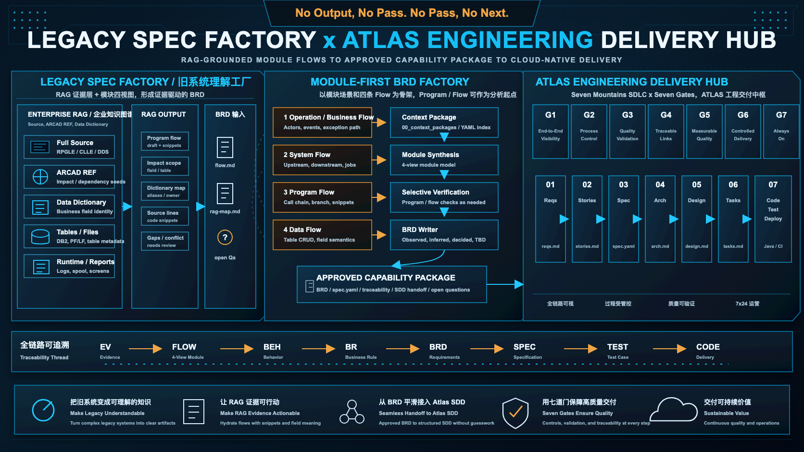
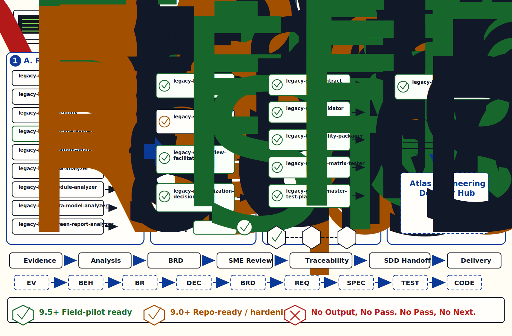
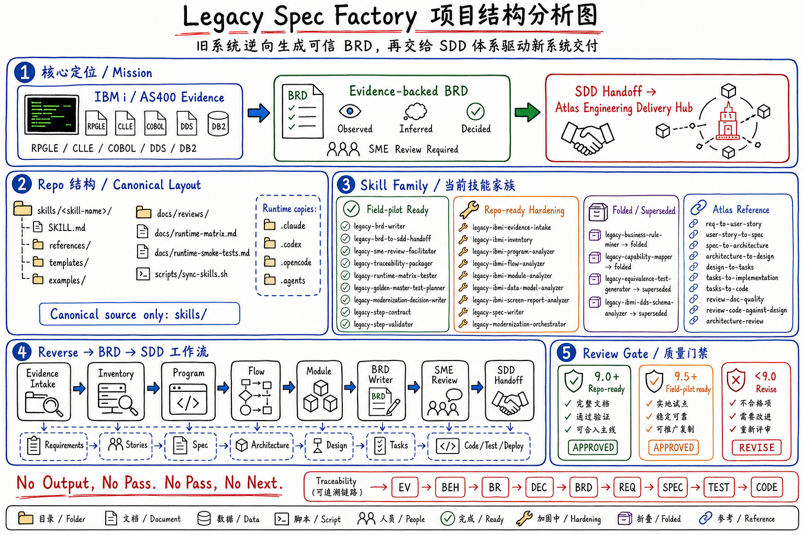

# Legacy Spec Factory

**New here?** Start with [QUICKSTART.md](QUICKSTART.md) (10-minute
walkthrough) or study [docs/EXAMPLE-tutorial/](docs/EXAMPLE-tutorial/) (a
fully-populated minimal project — every artifact in the chain).

Legacy Spec Factory is an end-to-end modernization pipeline for turning IBM i
(AS/400) legacy system behavior into evidence-backed, reviewable, and
implementation-ready specifications. In field use, it can be driven by an
external RAG / code knowledge graph that already indexes source, ARCAD REF
relationships, table metadata, and the enterprise data dictionary.

The goal is not to translate RPG, CL, COBOL, or DDS source directly into Java.
The goal is to recover the business intent hidden inside the legacy system,
produce a trusted `spec.yaml` / `spec.md` pair, and then use that spec package
as the source of truth for AI-native SDLC on the new cloud platform.

The preferred enterprise scenario is **module-first**: the team supplies a
business module or subsystem context, including four reviewed flows (Operation /
Business Flow, System Flow, Program Flow, and Data Flow), plus RAG-retrieved
evidence. Program and flow analysis remain valid starting points for building
or validating that module model; they are not the only required entry path when
the module context is already known.

For RAG construction details, see
[`docs/rag-setup-detail.md`](docs/rag-setup-detail.md). For a concrete
file-based output example, see
[`docs/rag-output-sample/`](docs/rag-output-sample/).

## Operating Paths

Legacy Spec Factory now has two explicit operating paths:

```text
Default path — RAG-assisted module-first
  RAG evidence bundle + four confirmed flows
        -> module-context-intake
        -> module-analyzer
        -> brd-writer
        -> BRD Package / spec / handoff

Verification path — source-first discovery and evidence repair
  evidence intake / inventory / program / flow / data / screen analysis
        -> used only when module context is missing, conflicting, or high risk
```

The default path is the enterprise field workflow. Teams bring a module-level
context package, four reviewed flows, and RAG-retrieved evidence. Source-first
skills remain available as selective verification tools: use them when RAG
output conflicts with human flow, when a high-risk rule needs source evidence,
or when the module boundary is not yet understood.

## Visual Overview



### Skill Family Poster



### Repository Overview



```text
Enterprise RAG / Code Knowledge Graph
  full source, ARCAD REF, table metadata, data dictionary, snippets, impact scope
        |
        v
Module Context
  Operation / Business Flow, System Flow, Program Flow, Data Flow
        |
        v
Legacy Understanding Layer
  program analysis, flow analysis, module synthesis, selective source checks
        |
        v
Evidence-backed spec package
  BRD, rules, acceptance criteria, traceability, open questions
        |
        v
Human Review Gate
  SME validation, confidence levels, modernization decisions
        |
        v
AI-native SDLC
  Java services, APIs, tests, migration scripts, deployment artifacts
```

## Why This Exists

Many IBM i modernization efforts fail because they treat the legacy system as a
code conversion problem. In practice, the most valuable asset is not the old
source code format. It is the accumulated business knowledge encoded across:

- RPGLE, CLLE, COBOL, and SQL logic
- DDS physical files, logical files, display files, and printer files
- DB2 for i data relationships and control tables
- batch jobs, schedulers, job logs, and message queues
- interactive screens, spool files, reports, and operational workarounds
- SME knowledge that was never written down

Legacy Spec Factory turns those assets into a structured specification layer.
That layer becomes the bridge from legacy modernization to AI-native software
delivery.

## Design Principles

- **Spec as source of truth**: `spec.yaml` is the structured source of truth
  for agents and automation; `spec.md` is the human-readable review view.
- **Evidence over guesses**: every extracted rule should point to source code,
  data, logs, screens, reports, or SME confirmation.
- **RAG as evidence context, not final truth**: retrieval output, ARCAD REF
  relationships, source snippets, and dictionary mappings help hydrate the
  module context; they do not replace source evidence, human-confirmed flows,
  or SME approval.
- **Module-first analysis**: when a team already has the business module and
  four flows, start from that module context and use program / flow analysis to
  validate and fill gaps. When the module is unclear, start from program and
  flow analysis and synthesize the module model incrementally.
- **Observed vs inferred vs decided**: legacy behavior, inferred business rules,
  and modernization decisions must not be mixed together.
- **Traceability by default**: requirements, business rules, tests, and
  generated code should carry stable IDs across the chain.
- **SME-led governance**: IBM i / AS400 SMEs define the quality bar for legacy
  understanding and approve what can safely move into the spec package.
- **Human approval gates**: AI can extract, organize, and draft, but ambiguous
  business meaning must be reviewed by humans.
- **AI-native from day 1**: the new Java/cloud system should start with
  structured specs, quality contracts, executable tests, and agent-readable
  context instead of recreating documentation debt.

## Relationship to `build-agent-skill`

This project is the reverse-modernization companion to
[`wwa-lab/build-agent-skill`](https://github.com/wwa-lab/build-agent-skill).

`build-agent-skill` focuses on the forward IBM i delivery chain:

```text
Requirement -> Functional Spec -> Technical Design -> Program/File Spec
            -> RPGLE/CLLE/DDS generation -> review -> test scaffold
```

Legacy Spec Factory focuses on the reverse chain:

```text
Existing IBM i system -> evidence model -> business capability spec
                     -> reviewed spec.yaml/spec.md -> Java/cloud SDLC
```

The two projects share the same core ideas:

- layered artifacts
- BR-xx business rule continuity
- review gates
- task-based orchestration
- anti-hallucination rules
- test generation as part of the delivery chain

## Baseline Lessons From Reverse-Code Evaluation

A prior A/B reverse-code comparison is useful as a symptom list, but it is not
the acceptance authority for IBM i modernization. The comparison highlights the
right failure modes: missing artifacts, weak traceability, uncertain mappings,
and low automation readiness. The final judgment still needs to come from IBM i
SMEs who understand RPGLE, CLLE, DDS, DB2 for i, job execution, screens,
reports, and shop-specific conventions.

The useful output is not the one that produces more text. It is the one that is
complete, explicitly traceable, directly mapped to source, technically accurate
from an IBM i perspective, and machine-consumable enough for downstream agents.

| Evaluation Area | Observed Failure Mode | Legacy Spec Factory Standard |
| --- | --- | --- |
| Program coverage | Top-level programs may be listed, but secondary artifacts can be missed | Inventory must report complete program coverage and list unresolved objects explicitly |
| PRTF / report coverage | Missing printer files reduce traceability for reports and outputs | PRTF, spool, and report artifacts are first-class evidence sources |
| Deep subroutines | Missed internal routines create gaps in call graph and behavior analysis | Deep subroutine discovery is a required gate before spec generation |
| Evidence traceability | Tentative language such as "appears" or "likely" makes output hard to audit | Every rule must carry evidence tags such as `Confirmed from Code`, `Observed in Runtime`, `Strongly Inferred`, or `Needs SME Review` |
| Code-to-doc mapping | Ambiguous or reversed mappings create maintenance risk | Each rule, field, and behavior should map directly to source locations or runtime evidence IDs |
| Signature and interface extraction | Incorrect parameters and entry points hurt refactoring and automation | Entry points, parameters, return values, file I/O, and external calls must be extracted into structured contracts |
| Engineering specificity | Generic narrative is not enough for developers or agents | Output must contain actionable engineering notes, dependencies, edge cases, and downstream implementation hints |
| AI consumability | Ambiguous prose blocks reliable automation | Artifacts must be structured, stable-ID based, and friendly to automated parsing |
| Engineering handoff | Manual validation load remains high | Approved specs should be ready for SDLC agents with minimal rework |

This turns the A/B comparison into a reusable evaluation rubric: reverse
engineering is only successful when the output can be audited by humans and
consumed by agents.

## SME Governance Model

Legacy Spec Factory treats the IBM i SME as the control point for the reverse
engineering chain. The SME is not only a final reviewer. The SME defines what
evidence is valid, which extracted facts are trustworthy, and which legacy
behaviors should become modern requirements.

| Stage | SME Responsibility | Required Judgment |
| --- | --- | --- |
| Scope selection | Choose a representative business slice and identify critical programs, files, jobs, screens, and reports | Is this slice narrow enough to finish but important enough to prove the approach? |
| Evidence intake | Confirm source members, DDS, DB2 metadata, job logs, spool files, and sample transactions are sufficient | Are we missing hidden dependencies such as data areas, control files, submitted jobs, or external calls? |
| Inventory review | Validate program, PRTF, DSPF, PF/LF, batch job, and subroutine coverage | Did the analyzer miss any objects an IBM i developer would expect? |
| Static analysis review | Check call graph, CRUD matrix, file usage, indicators, record formats, and subroutine signatures | Does the report reflect how the program actually runs on IBM i? |
| Business rule review | Separate true business rules from technical workarounds, defensive coding, and historical patches | Should this behavior be preserved, redesigned, or retired? |
| Spec approval | Approve `Observed Behavior`, confirm or reject `Inferred Business Rule`, and sign off `Modernization Decision` | Is the spec package safe to feed into the Java/cloud SDLC agent? |
| Equivalence validation | Select golden master cases and edge cases for old-vs-new comparison | Do the selected tests protect the important legacy behavior? |

SME review should explicitly cover IBM i details that generic code-reverse
approaches often miss:

- fixed-format and free-format RPGLE idioms
- CL command flow, submitted jobs, overrides, and message handling
- DDS record formats, indicators, function keys, subfiles, and display-file
  behavior
- PRTF layouts, spool output, and report control breaks
- PF/LF access paths, keyed reads, `SETLL` / `READE` patterns, and join logical
  files
- data areas, data queues, message queues, control tables, and job scheduler
  dependencies
- commitment control, locking, update/delete semantics, and error recovery
- shop-specific naming, copybooks, service programs, and coding conventions

The default rule is simple: if a finding cannot survive SME review, it should
not become an approved requirement.

## Multi-Runtime Skill Portability

The skills in this project should be portable across Codex, Claude Code, and
OpenCode. Different IDEs and agents discover skills from different folders, so
the project should not treat any one runtime directory as the only source of
truth.

Recommended layout:

```text
skills/
  legacy-spec-writer/
    SKILL.md              # canonical skill source
    references/
    templates/
    scripts/

.claude/
  skills/
    legacy-spec-writer/   # Claude Code adapter/copy

.opencode/
  skills/
    legacy-spec-writer/   # OpenCode adapter/copy when not using Claude fallback

.agents/
  skills/
    legacy-spec-writer/   # Open Agent Skills compatible local adapter

.codex/
  skills/
    legacy-spec-writer/   # Codex-specific local adapter, if used by the team setup
```

Runtime guidance:

| Runtime | Recommended Project Folder | Notes |
| --- | --- | --- |
| Codex | `skills/` as canonical source, then install/link into the Codex-supported skill location used by the team | Keep `SKILL.md` compatible with the open Agent Skills shape. Use Codex-specific metadata only in an adapter when needed. |
| Claude Code | `.claude/skills/<skill-name>/SKILL.md` | Claude Code discovers project skills from `.claude/skills/` and personal skills from `~/.claude/skills/`. |
| OpenCode | `.opencode/skills/<skill-name>/SKILL.md`, `.agents/skills/<skill-name>/SKILL.md`, or `.claude/skills/<skill-name>/SKILL.md` | OpenCode supports its native project skill folder and Claude-compatible skill folders. Use `AGENTS.md` for project rules. |

Portability rules:

- Keep the canonical version of each skill under `skills/<skill-name>/`.
- Treat `.claude/`, `.opencode/`, `.agents/`, and `.codex/` as runtime
  adapters or synced copies.
- Do not hand-edit runtime copies without back-porting the change to
  `skills/<skill-name>/`.
- Keep shared `SKILL.md` frontmatter conservative: `name`, `description`, and
  portable metadata first.
- Do not modify adapter `SKILL.md` files directly. Put runtime-only notes under
  `runtime-overrides/` or in files named `*.adapter.md`; the sync script
  preserves those files.
- When validating a skill, test it in all target runtimes before calling it
  release-ready.
- Document the tested runtime matrix in each skill's version history.

Use [scripts/sync-skills.sh](scripts/sync-skills.sh) to copy canonical skills
into runtime adapter folders or check for drift:

```bash
scripts/sync-skills.sh --target all
scripts/sync-skills.sh --target all --check
```

Track validation in [docs/runtime-matrix.md](docs/runtime-matrix.md). Use
[docs/runtime-smoke-tests.md](docs/runtime-smoke-tests.md) before promoting a
runtime from `synced` to `loaded`, `executed`, or `passed`.

The portability goal is simple: one skill design, multiple execution surfaces.
Team members can use Codex, Claude Code, or OpenCode without changing the
business logic, SME governance, evidence model, or spec contract.

## HTML Exports For User / SME Docs

Markdown remains the canonical source for human-facing artifacts in this
repository, but pilot reviews often go more smoothly when stakeholders can read
the same content as standalone HTML.

`legacy-modernization-orchestrator` may remind users to run
`legacy-html-exporter` when stable human-facing Markdown already exists and an
SME / user review would benefit from a browser-readable companion. HTML export
is optional review packaging only: it does not advance gates, replace Markdown,
or replace `spec.yaml` as the machine-readable source of truth.

Use [scripts/render_stakeholder_html.py](scripts/render_stakeholder_html.py) to
export any Markdown artifact into a styled HTML companion:

```bash
python3 scripts/render_stakeholder_html.py 05_specs/CAP-PRICE-CALCULATION/spec.md
python3 scripts/render_stakeholder_html.py docs/EXAMPLE-tutorial --recursive
```

Typical good candidates:

- `brd.md`, `spec.md`, `sdd-handoff.md`
- `*-review.md`, `traceability.md`, `question-pack.md`
- `STATUS.md`, `programs-batch-digest.md`, `object-map.md`

Directory mode creates sibling `.html` files plus an `index.html` page for
easy sharing inside pilot reviews. See
[docs/human-readable-html-exports.md](docs/human-readable-html-exports.md) for
usage details.

## OpenCode Internal Pilot Fixtures

For company environments that only run OpenCode, use the synthetic corpus under
[docs/synthetic-corpus/](docs/synthetic-corpus/) to validate the main reverse
chain without customer source code.

Current starter fixtures cover:

- fixed-format `SQLRPGLE` credit-check happy path
- blocked credit-check path for missing LF / SME-meaning gaps
- scheduler-submitted batch AR reconciliation with joblog and spool evidence
- DSPF subfile inquiry flow

Use
[docs/synthetic-corpus/pilot-execution-checklist.md](docs/synthetic-corpus/pilot-execution-checklist.md),
[docs/synthetic-corpus/pilot-prompts.md](docs/synthetic-corpus/pilot-prompts.md),
and
[docs/synthetic-corpus/pilot-results-template.md](docs/synthetic-corpus/pilot-results-template.md)
to run and record the first OpenCode-only pilot. Use
[docs/orchestrator-review-checklist.md](docs/orchestrator-review-checklist.md)
to score whether `legacy-modernization-orchestrator` is reliable enough as the
single front door.

## Skill Review Quality Gate

Skills generated for this project must pass a Codex review gate before they are
used by the team.

Quality thresholds:

- **9.5 / 10 or higher**: field-pilot ready
- **9.0 - 9.4**: repo-ready, but not ready for internal field pilot
- **below 9.0**: return to Claude Code for revision

Claude Code may generate or revise skills. Codex reviews them using
[docs/skill-review-gate.md](docs/skill-review-gate.md) and records the result
with [templates/skill-review-scorecard.md](templates/skill-review-scorecard.md).
Calibration examples live under [docs/calibration](docs/calibration).
Actual review records live under [docs/reviews](docs/reviews).

The review focuses on:

- trigger clarity
- workflow completeness
- IBM i / AS400 SME correctness
- evidence discipline and anti-hallucination
- output contract quality
- progressive disclosure
- Codex / Claude Code / OpenCode portability
- reviewability and testability
- engineering handoff value
- maintainability

Any skill below 9.0 must iterate. Any skill below 9.5 should not be used in a
field pilot unless the gap is explicitly accepted by the project owner.

### Current Skill Scores

**Single source of truth**: [`docs/skill-status-truth-table.md`](docs/skill-status-truth-table.md).
The table below is the README view of that table. Run
`python3 scripts/verify-skill-claims.py` to confirm they agree.

The scores below are the current repository-facing quality signal. They are
deliberately conservative: the review gate caps a skill at **9.0** when it has
not yet passed the runtime smoke protocol in Codex, Claude Code, and OpenCode,
even if the static review score is higher.

| Skill | Review Record | Static Score | Current Score | Status | Main Reason It Is Not Higher |
| --- | --- | ---: | ---: | --- | --- |
| `legacy-module-context-intake` | [v0.1.0 scorecard](docs/reviews/legacy-module-context-intake-v0.1.0-scorecard.md) | 9.33 | 9.0 | Repo-ready | New module-first RAG intake skill; runtime copies synced, execution smoke pending |
| `legacy-ibmi-evidence-intake` | [v0.1.0 scorecard](docs/reviews/legacy-ibmi-evidence-intake-v0.1.0-scorecard.md) | 9.16 | 9.16 | Repo-ready | Three-runtime smoke passed 2026-05-15; static score below 9.5 keeps it repo-ready |
| `legacy-ibmi-inventory` | [v0.1.0 scorecard](docs/reviews/legacy-ibmi-inventory-v0.1.0-scorecard.md) | 9.35 | 9.0 | Repo-ready | Runtime load/execution validation still pending |
| `legacy-ibmi-runtime-evidence-miner` | [v0.1.0 scorecard](docs/reviews/legacy-ibmi-runtime-evidence-miner-v0.1.0-scorecard.md) | 9.57 | 9.57 | Field-pilot ready | Three-runtime positive and negative no-write smoke passed; downstream analyzer integration smoke remains optional |
| `legacy-ibmi-program-analyzer` | [v0.1.0 scorecard](docs/reviews/legacy-ibmi-program-analyzer-v0.1.0-scorecard.md) | 9.39 | 9.0 | Repo-ready | Fixes committed in `99e27f4`; three-runtime execution evidence is pending |
| `legacy-ibmi-flow-analyzer` | [v0.1.1 provisional scorecard](docs/reviews/legacy-ibmi-flow-analyzer-v0.1.1-scorecard.md) | 9.61 expected | 9.0 | Repo-ready; provisional field-pilot after smoke | Claude Code passed; Codex and OpenCode smoke execution still pending |
| `legacy-ibmi-module-analyzer` | [v0.1.1 corrected scorecard](docs/reviews/legacy-ibmi-module-analyzer-v0.1.1-scorecard.md) | 9.27 | 9.0 | Repo-ready | Post-review fixes committed and re-scored; three-runtime smoke evidence is still pending |
| `legacy-ibmi-data-model-analyzer` | [v0.1.0 scorecard](docs/reviews/legacy-ibmi-data-model-analyzer-v0.1.0-scorecard.md) | 9.32 | 9.0 | Repo-ready | Codex and OpenCode smoke passed; Claude Code smoke was blocked by local CLI login |
| `legacy-ibmi-screen-report-analyzer` | [v0.1.0 scorecard](docs/reviews/legacy-ibmi-screen-report-analyzer-v0.1.0-scorecard.md) | 9.38 | 9.38 | Repo-ready | Positive three-runtime smoke passed; negative stop-condition smoke is still needed for 9.5 |
| `legacy-brd-writer` | [v0.1.1 scorecard](docs/reviews/legacy-brd-writer-v0.1.1-scorecard.md) | 9.56 | 9.56 | Field-pilot ready | Three-runtime smoke passed in a disposable synced workspace; remaining work is optional contradictory-evidence example coverage |
| `legacy-brd-to-sdd-handoff` | [v0.1.0 scorecard](docs/reviews/legacy-brd-to-sdd-handoff-v0.1.0-scorecard.md) | 9.63 | 9.63 | Field-pilot ready | Three-runtime positive and negative no-write smoke passed; remaining work is optional frozen positive example output |
| `legacy-spec-writer` | [v0.1.0 scorecard](docs/reviews/legacy-spec-writer-v0.1.0-scorecard.md) | 9.24 | 9.0 | Repo-ready | Post-review fixes committed; Claude Code passed; Codex/OpenCode smoke and post-smoke re-score pending |
| `legacy-modernization-orchestrator` | [v0.2.0 scorecard](docs/reviews/legacy-modernization-orchestrator-v0.2.0-scorecard.md) | 9.34 | 9.0 | Repo-ready | Expanded v0.2.0 smoke prompts are ready; Codex/OpenCode and expanded-route execution remain pending |
| `legacy-modernization-decision-writer` | [v0.1.0 scorecard](docs/reviews/legacy-modernization-decision-writer-v0.1.0-scorecard.md) | 9.56 | 9.56 | Field-pilot ready | Three-runtime positive and negative no-write smoke passed; remaining work is optional field-style decision package coverage |
| `legacy-sme-review-facilitator` | [v0.1.0 scorecard](docs/reviews/legacy-sme-review-facilitator-v0.1.0-scorecard.md) | 9.55 | 9.55 | Field-pilot ready | Three-runtime positive and negative no-write smoke passed; remaining work is optional DSPF/PRTF SME review example coverage |
| `legacy-traceability-packager` | [v0.1.1 scorecard](docs/reviews/legacy-traceability-packager-v0.1.1-scorecard.md) | 9.51 | 9.51 | Field-pilot ready | Three-runtime positive and negative no-write smoke passed |
| `legacy-runtime-matrix-tester` | [v0.1.0 scorecard](docs/reviews/legacy-runtime-matrix-tester-v0.1.0-scorecard.md) | 9.56 | 9.56 | Field-pilot ready | Three-runtime positive and negative no-write smoke passed |
| `legacy-golden-master-test-planner` | [v0.1.0 scorecard](docs/reviews/legacy-golden-master-test-planner-v0.1.0-scorecard.md) | 9.59 | 9.59 | Field-pilot ready | Three-runtime positive and negative no-write smoke passed |
| `legacy-step-contract` | [v0.1.1 scorecard](docs/reviews/legacy-step-contract-v0.1.1-scorecard.md) | 9.52 | 9.52 | Field-pilot ready | Three-runtime smoke passed; remaining work is optional maintainability cleanup |
| `legacy-step-validator` | [v0.1.1 scorecard](docs/reviews/legacy-step-validator-v0.1.1-scorecard.md) | 9.53 | 9.53 | Field-pilot ready | Three-runtime smoke passed; remaining work is optional checklist-ID / re-validation-ID cleanup |
| `legacy-html-exporter` | [v0.1.0 scorecard](docs/reviews/legacy-html-exporter-v0.1.0-scorecard.md) | 9.31 | 9.0 | Repo-ready | Codex passed smoke, but Claude Code failed the negative source-of-truth guardrail and OpenCode has not yet converged to a final no-write answer |

For public trust, scorecards should show both the score before caps and the
score after caps. A 9.0 here should usually be read as "repo-ready and
structurally strong, but not yet proven across all runtime surfaces."

### What the Scores Are Based On

Each review uses [docs/skill-review-gate.md](docs/skill-review-gate.md) and
[templates/skill-review-scorecard.md](templates/skill-review-scorecard.md).
The weighted rubric evaluates:

- purpose and trigger clarity
- workflow completeness
- IBM i / AS400 domain correctness
- evidence and anti-hallucination discipline
- output contract quality
- progressive disclosure
- Codex / Claude Code / OpenCode portability
- reviewability and testability
- engineering handoff value
- maintainability

The reviewer checks these evidence sources:

- **Canonical skill source:** `skills/<skill-name>/SKILL.md`
- **Bundled skill assets:** `references/`, `templates/`, `examples/`, and
  `scripts/` under each skill folder
- **Repository governance docs:** [docs/id-conventions.md](docs/id-conventions.md),
  [docs/evidence-and-knowledge-taxonomy.md](docs/evidence-and-knowledge-taxonomy.md),
  [docs/code-as-ground-truth.md](docs/code-as-ground-truth.md), and
  [docs/data-collection-and-redaction.md](docs/data-collection-and-redaction.md)
- **Runtime portability evidence:** [scripts/sync-skills.sh](scripts/sync-skills.sh),
  [docs/runtime-matrix.md](docs/runtime-matrix.md), and
  [docs/runtime-smoke-tests.md](docs/runtime-smoke-tests.md)
- **Spec contract evidence:** [schemas/spec.schema.yaml](schemas/spec.schema.yaml),
  [templates/spec.yaml](templates/spec.yaml),
  [skills/legacy-spec-writer/templates/spec.yaml](skills/legacy-spec-writer/templates/spec.yaml),
  and [scripts/check-spec-contract.py](scripts/check-spec-contract.py)
- **Multi-user collaboration:** [docs/collaboration.md](docs/collaboration.md) —
  ownership patterns, per-section merge rules for `workflow-state.yaml`,
  and a `.gitattributes` recipe
- **Workflow state contract:** [docs/workflow-state-contract.md](docs/workflow-state-contract.md),
  [skills/legacy-modernization-orchestrator/templates/workflow-state.yaml](skills/legacy-modernization-orchestrator/templates/workflow-state.yaml),
  and [scripts/check-workflow-state.py](scripts/check-workflow-state.py) —
  validate `workflow-state.yaml` against the cross-skill resume contract
- **Project status tooling:**
  - [scripts/generate-status.py](scripts/generate-status.py) —
    emit human-readable `docs/<project>/STATUS.md` from the project's
    `workflow-state.yaml`. Re-run after every orchestrator turn (the
    orchestrator does this automatically at Step 8.5).
  - [scripts/list-projects.py](scripts/list-projects.py) —
    scan `docs/*/workflow-state.yaml` in the current repo and print a
    table of all projects, their current focus, and open blocker counts.
    Supports `--markdown` and `--json` output.
- **Review records:** concrete scorecards under [docs/reviews](docs/reviews)
  rather than informal claims in prose

Mandatory stop conditions can cap a skill at 8.0. Runtime portability that is
synced but not smoke-tested caps a skill at 9.0. A skill should only be called
field-pilot ready when the scorecard, runtime matrix, and smoke-test evidence
all agree.

## Target Skill Family

**See [`docs/skill-families.md`](docs/skill-families.md) for how the 21 skills
group into 7 families, which order they fire in, and which pairs were
intentionally kept separate.**

The active skill family is organized around two operating paths:

- **Default path — Module-first context.** External RAG / code-knowledge-graph
  output, data dictionary mappings, ARCAD REF, source snippets, and four
  human-confirmed flows enter as a reviewed module context package.
- **Verification path — Platform-specific extraction.** IBM i source,
  runtime, data, screen, and report analyzers are used selectively when the
  module context has gaps, contradictions, high-risk rules, or missing source
  evidence.
- **Shared synthesis and governance.** BRD, spec, traceability, SME review,
  validation, and handoff skills consume approved context and evidence without
  depending on one specific legacy platform.

For enterprise deployments, the expected starting point is usually the
module-first operating model:

```text
RAG output + human-confirmed 4-flow module context
        |
        v
context intake package (00_context_packages/)
        |
        v
module synthesis / selective program-flow validation
        |
        v
BRD package -> spec package -> SDD handoff
```

The RAG layer is outside this repository. It provides relationship and evidence
context such as source snippets, ARCAD REF impact references, table/field
metadata, and data dictionary mappings. Legacy Spec Factory consumes that
context, keeps evidence provenance visible, and turns the reviewed module
model into BRD / spec / traceability artifacts. Source-facing skills remain
available as targeted verification tools, not as a mandatory full pass for
every module.

Naming convention:

```
legacy-<platform>-<extractor>    # source verification, e.g. legacy-ibmi-inventory
legacy-<synthesizer>             # synthesis / governance, e.g. legacy-spec-writer
```

The `legacy-` prefix distinguishes this reverse chain from the forward chain
at [`wwa-lab/build-agent-skill`](https://github.com/wwa-lab/build-agent-skill),
which uses `ibm-i-*`.

### Core Skill Map

The active repo story is intentionally smaller than the full historical
roadmap. It has two paths:

```text
Default path
  RAG/context + four module flows -> context package -> module -> BRD -> spec/handoff

Verification path
  evidence/intake -> inventory -> program/flow/data/screen analysis -> module evidence repair
```

Atlas Engineering Delivery Hub remains the downstream consumer after the BRD,
spec, and handoff gates pass; its detailed skills are outside this repository.

The table below lists the repo-owned skills that matter to the two paths. See
[`docs/skill-status-truth-table.md`](docs/skill-status-truth-table.md) for the
full status matrix and scorecard links.

| # | Skill | Chain | Status | Review / next action |
| ---: | --- | --- | --- | --- |
| 1 | `legacy-modernization-orchestrator` | Legacy routing | Existing | v0.2.0 repo-ready; run expanded runtime smoke tests to lift the 9.0 cap |
| 2 | `legacy-module-context-intake` | Module-first context | Existing | Repo-ready (v0.1.0, 9.0 capped); run three-runtime smoke tests for RAG/context package intake |
| 3 | `legacy-ibmi-evidence-intake` | Legacy BRD factory | Existing | Repo-ready; keep hardening examples and runtime smoke evidence |
| 4 | `legacy-ibmi-inventory` | Legacy BRD factory | Existing | Repo-ready; run three-runtime smoke tests |
| 5 | `legacy-ibmi-runtime-evidence-miner` | Legacy BRD factory | Existing | Field-pilot ready (v0.1.0, 9.57); optional integration smoke with program/flow/module analyzers for `runtime_hints` and `bau_notes` |
| 6 | `legacy-ibmi-program-analyzer` | Legacy BRD factory | Existing | Repo-ready; run three-runtime smoke tests |
| 7 | `legacy-ibmi-flow-analyzer` | Legacy BRD factory | Existing | Provisional field-pilot candidate after remaining smoke tests |
| 8 | `legacy-ibmi-module-analyzer` | Legacy BRD factory | Existing | Repo-ready; run three-runtime smoke tests |
| 9 | `legacy-brd-writer` | Legacy BRD factory | Existing | Field-pilot ready (v0.1.1, 9.56); emits the BRD review package before spec writing |
| 10 | `legacy-spec-writer` | Legacy synthesis | Existing | Repo-ready; consume approved BRD/module inputs and finish remaining smoke |
| 11 | `legacy-step-contract` | Governance | Existing | Field-pilot ready; keep as shared quality contract |
| 12 | `legacy-step-validator` | Governance | Existing | Field-pilot ready; keep as shared validation gate |
| 13 | `legacy-ibmi-data-model-analyzer` | Legacy BRD factory | Existing | Repo-ready (v0.1.0, 9.0 capped); Codex/OpenCode smoke passed, Claude Code smoke blocked by local CLI login |
| 14 | `legacy-ibmi-screen-report-analyzer` | Legacy BRD factory | Existing | Repo-ready (v0.1.0, 9.38); positive smoke passed, negative stop-condition smoke still needed for 9.5 |
| 15 | `legacy-sme-review-facilitator` | Governance | Existing | Field-pilot ready (v0.1.0, 9.55); prepares SME review packages and records decision logs |
| 16 | `legacy-brd-to-sdd-handoff` | Bridge | Existing | Field-pilot ready (v0.1.0, 9.63); validates approved BRD + spec and packages Atlas-compatible handoff inputs |
| 17 | `legacy-traceability-packager` | Governance / bridge | Existing | Field-pilot ready (v0.1.1, 9.51); packages traceability across evidence, BRD, SDD, tests, and code |
| 18 | `legacy-runtime-matrix-tester` | Governance | Existing | Field-pilot ready (v0.1.0, 9.56); orchestrates runtime smoke evidence, matrix rows, and scorecard decisions across Codex, Claude Code, and OpenCode |
| 19 | `legacy-golden-master-test-planner` | Verification | Existing | Field-pilot ready (v0.1.0, 9.59); plans old-vs-new equivalence and golden-master tests |
| 20 | `legacy-modernization-decision-writer` | Governance / BRD | Existing | Field-pilot ready (v0.1.0, 9.56); optional DEC expansion package when spec decisions become large, cross-cutting, or architecture-governed |
| 21 | `legacy-html-exporter` | Governance / publishing | Existing | Repo-ready (v0.1.0, 9.0 capped); exports stakeholder-facing Markdown docs to standalone HTML companions |

Downstream Atlas skills such as requirements-to-stories, design, task, code,
and review gates are referenced by the handoff package but are not implemented
or mirrored here.

No repository-owned skill in the current BRD + SDD handoff roadmap remains only
as a placeholder. The remaining work is validation and scorecard hardening:

1. `legacy-ibmi-runtime-evidence-miner` — optionally run integration smoke with program/flow/module analyzers for `runtime_hints` and `bau_notes`.
2. `legacy-ibmi-data-model-analyzer` — run Claude Code smoke after CLI login is restored.
3. `legacy-ibmi-screen-report-analyzer` — add and run negative stop-condition smoke.
4. `legacy-module-context-intake`, `legacy-ibmi-inventory`, `legacy-ibmi-program-analyzer`, `legacy-ibmi-flow-analyzer`, `legacy-ibmi-module-analyzer`, `legacy-spec-writer`, and `legacy-modernization-orchestrator` — finish pending three-runtime smoke or expanded-route smoke.

Governance/Infrastructure skills (already implemented):
- `legacy-runtime-matrix-tester` ✓ Created 2026-05-16
- `legacy-step-contract` ✓ Field-pilot ready
- `legacy-step-validator` ✓ Field-pilot ready

### Module-first context intake (`legacy-*`)

| Skill | Purpose | Primary Output | Status |
| --- | --- | --- | --- |
| `legacy-module-context-intake` | Normalize external RAG / code-knowledge-graph output and human-confirmed four-view module context into a traceable package before module analysis | `00_context_packages/<MODULE-SLUG>/` | Repo-ready (v0.1.0, 9.0 capped; runtime smoke pending) |

### Layer 1 — IBM i extraction (`legacy-ibmi-*`)

| Skill | Purpose | Primary Output | Status |
| --- | --- | --- | --- |
| `legacy-ibmi-evidence-intake` | Register evidence, assign `EV-*` IDs, govern redaction, and produce an approved evidence manifest before inventory | `evidence/manifest.yaml`, `redaction-log.md` | Repo-ready (v0.1.0, 9.16; three-runtime smoke passed) |
| `legacy-ibmi-inventory` | Discover programs, files, tables, jobs, screens, and reports | `inventory.yaml`, object map | Repo-ready (9.0 capped) |
| `legacy-ibmi-program-analyzer` | Explain RPGLE/CLLE/COBOL-on-IBM-i logic, control flow, and data flow | `program-analysis.md` | Repo-ready (9.0 capped; fixes committed) |
| `legacy-ibmi-flow-analyzer` | Analyze one end-to-end IBM i transaction flow across programs | `flow-<FLOW-SLUG>.md` | Repo-ready (9.0 capped; smoke pending for provisional 9.6) |
| `legacy-ibmi-module-analyzer` | Synthesize a 4-view module model from reviewed Operation / Business, System, Program, and Data flows; when needed, start from program or flow analysis and build the module incrementally | `04_modules/<MODULE-SLUG>/` | Repo-ready (v0.1.1, 9.0 capped; smoke pending) |
| `legacy-ibmi-data-model-analyzer` | Analyze PF/LF/DDS/DB2 for i data models, access paths, field semantics, CRUD lifecycle, and unresolved data questions | `03_data_models/<DATA-SLUG>/` | Repo-ready (v0.1.0, 9.0 capped; Claude Code smoke pending) |
| `legacy-ibmi-screen-report-analyzer` | Analyze DSPF, PRTF, screen behavior, function keys, subfiles, spool/report semantics, and SME-visible UI/report behavior | `03_screen_reports/<OBJECT-SLUG>/` | Repo-ready (v0.1.0, 9.38; negative smoke pending) |
| `legacy-ibmi-call-graph-analyzer` | Extract program calls, job flow, service boundaries, and dependencies | `call-graph.md`, `call-graph.json` | Folded into program/flow analyzer for MVP |
| `legacy-ibmi-crud-matrix-analyzer` | Map programs to physical/logical files and DB2 operations | `crud-matrix.md` | Folded into program/module analyzer for MVP |
| `legacy-ibmi-dds-schema-analyzer` | Analyze PF, LF, DSPF, PRTF definitions and field semantics | `data-dictionary.md`, `screen-map.md` | Superseded by `legacy-ibmi-data-model-analyzer` and `legacy-ibmi-screen-report-analyzer` |
| `legacy-ibmi-runtime-evidence-miner` | Mine job logs, spool files, transaction samples, and test data | `runtime-evidence.jsonl` | Field-pilot ready (v0.1.0, 9.57; three-runtime smoke passed) |

### Layer 1 — Other platforms (`legacy-<platform>-*`)

| Family | Status |
| --- | --- |
| `legacy-cobol-*` (z/OS COBOL, JCL, copybooks) | Future |
| `legacy-mainframe-*` (CICS, DB2, IMS) | Future |

These are not yet planned in detail; the slot is reserved so that Layer 2
contracts remain platform-agnostic from day one.

### Layer 2 — Platform-agnostic synthesis (`legacy-*`)

| Skill | Purpose | Primary Output | Status |
| --- | --- | --- | --- |
| `legacy-modernization-orchestrator` | Route users through the reverse chain; identify current stage, next safest skill, and required gates | routing decision | v0.2.0 repo-ready (9.0 capped; expanded-route smoke pending) |
| `legacy-business-rule-miner` | Convert code paths and runtime evidence into business rules | `business-rules.md` | Folded into module analyzer + spec writer for MVP |
| `legacy-capability-mapper` | Group program-level behavior into business capabilities | `capability-map.md` | Folded into module analyzer for MVP |
| `legacy-brd-writer` | Produce an evidence-backed BRD from an approved module analysis, including module-first inputs hydrated by RAG evidence, while keeping observed behavior, inferred rules, SME decisions, assumptions, and TBDs separate | `05_brds/<CAPABILITY-SLUG>/brd.md`, `brd-review.md`, `traceability.md` | Field-pilot ready (v0.1.1, 9.56) |
| `legacy-spec-writer` | Produce the modernization-ready `spec.yaml` and `spec.md` | `spec.yaml`, `spec.md` | Repo-ready (9.0 capped; fixes committed) |
| `legacy-modernization-decision-writer` | Expand and govern complex `DEC-*` modernization decisions without becoming the architecture/design/task layer | `05_decisions/<CAPABILITY-SLUG>/` | Field-pilot ready (v0.1.0, 9.56) |
| `legacy-sme-review-facilitator` | Prepare SME review sessions, record decision logs, capture sign-off, and route follow-up findings without substituting AI judgment | `07_sme_reviews/<CAPABILITY-SLUG>/<REVIEW-SLUG>/` | Field-pilot ready (v0.1.0, 9.55) |
| `legacy-brd-to-sdd-handoff` | Validate an approved BRD and approved spec, then package the Atlas SDD handoff without inventing design or implementation decisions | `06_sdd_handoffs/<CAPABILITY-SLUG>/sdd-handoff.yaml`, `sdd-handoff.md`, `atlas-context-pack.json`, `handoff-review.md`, `traceability.md` | Field-pilot ready (v0.1.0, 9.63) |
| `legacy-traceability-packager` | Package and audit cross-artifact traceability from evidence through BRD, spec, acceptance criteria, tests, and SDD handoff | `06_traceability_packages/<CAPABILITY-SLUG>/` | Field-pilot ready (v0.1.1, 9.51) |
| `legacy-runtime-matrix-tester` | Generate and validate runtime smoke evidence, runtime-matrix rows, and scorecard readiness decisions across Codex, Claude Code, and OpenCode | runtime matrix update plan and scorecard evidence | Field-pilot ready (v0.1.0, 9.56) |
| `legacy-golden-master-test-planner` | Plan old-vs-new equivalence tests from approved observed behavior, rules, acceptance criteria, and runtime evidence | `06_quality/<CAPABILITY-SLUG>/golden-master-tests.yaml`, `golden-master-tests.md` | Field-pilot ready (v0.1.0, 9.59) |
| `legacy-spec-reviewer` | Validate traceability, completeness, ambiguity, and testability | `review-report.md` | Planned |
| `legacy-equivalence-test-generator` | Generate old-vs-new comparison tests from observed behavior | golden master test pack | Superseded by `legacy-golden-master-test-planner` for the current roadmap |
| `legacy-step-contract` | Define the shared INPUT -> EXECUTION -> OUTPUT -> VALIDATION contract for every reverse-chain step | Step Contract block and validation templates | Field-pilot ready (v0.1.1, 9.52) |
| `legacy-step-validator` | Validate completed step artifacts against the Step Contract | `06_quality/step-validation-report.md`, `blocking-findings.yaml` | Field-pilot ready (v0.1.1, 9.53) |
| `legacy-knowledge-hub-builder` | Publish SME-reviewed analysis outputs into an LLM Wiki / knowledge hub for browsing, retrieval, impact analysis, and downstream agent context packs | `05_knowledge_hub/` or a separate LLM Wiki repo | Proposed |

## SME-Reviewed Knowledge Publishing Model

Legacy Spec Factory should separate three responsibilities that are often mixed
together:

1. extracting candidate knowledge from legacy code
2. reviewing and accepting that knowledge with an RPG / IBM i SME
3. publishing accepted knowledge into a wiki that people and agents can use

The operating model is:

```text
Legacy Code Repo
  -> skills analyze source and evidence
  -> draft analysis artifacts

Analysis Output Repo
  -> stores only skill outputs
  -> junior engineer + agent iterate on a feature branch
  -> RPG SME reviews the PR
  -> main branch becomes the accepted analysis fact layer

LLM Wiki Repo
  -> generated only from Analysis Output Repo main
  -> people browse it
  -> LLMs retrieve from it
  -> downstream agents receive focused context packs from it
```

Core rule:

```text
Draft output is not organizational knowledge.
SME-merged output on main is the trusted fact layer.
The LLM Wiki is a derived read model, not the source of truth.
```

If the wiki conflicts with `inventory.yaml`, `program-analysis.md`, `flow.md`,
module analysis, or `spec.yaml`, treat the upstream analysis artifact as
authoritative and regenerate or fix the wiki.

### Repo 1: Legacy Code Repo

The legacy code repo contains the raw or redacted IBM i system materials:

```text
src/
  RPGLE / CLLE / COBOL members
  DDS PF / LF / DSPF / PRTF members
evidence/
  redacted job logs
  redacted spool samples
  redacted transaction samples
  DB2 metadata extracts
```

Use this repo to run the extraction and synthesis skills:

- `legacy-ibmi-inventory`
- `legacy-ibmi-program-analyzer`
- `legacy-ibmi-flow-analyzer`
- `legacy-ibmi-module-analyzer`
- `legacy-brd-writer`
- `legacy-spec-writer`

The legacy code repo is not the long-term home for generated review artifacts
unless the team explicitly chooses a single-repo pilot. For the recommended
workflow, generated skill outputs are copied or committed into the Analysis
Output Repo.

### Repo 2: Analysis Output Repo

The Analysis Output Repo stores only Legacy Spec Factory outputs. It should not
store raw production evidence or private runtime data.

Recommended repo names:

```text
<system-slug>-legacy-analysis
<domain-slug>-legacy-analysis
<portfolio-slug>-legacy-analysis
```

Examples:

```text
card-auth-legacy-analysis
order-entry-legacy-analysis
ibmi-modernization-legacy-analysis
```

Recommended repo settings:

- Visibility: private or internal.
- Default branch: `main`.
- Branch naming: `analysis/<CAP-SLUG>-<short-topic>`.
- Protect `main`; require PR review before merge.
- Require at least one RPG / IBM i SME approval for analysis artifacts that
  claim accepted behavior, business rules, or spec readiness.
- Prefer `CODEOWNERS` for high-risk paths such as `01_inventory/`,
  `02_programs/`, `03_flows/`, `04_modules/`, `05_specs/`, and
  `knowledge-hub.manifest.yaml`.
- Do not allow raw production evidence, secrets, customer data, or unredacted
  job logs / spool samples.
- Keep draft work on feature branches. Treat only `main` as the accepted
  analysis fact layer.
- Tag important SME-approved baselines, for example
  `baseline-CREDIT-CHECK-2026-05-14`.

Recommended directory structure:

```text
README.md
knowledge-hub.manifest.yaml

00_project/
  scope.md
  source-system.md
  sme-roster.md
  decision-log.md

00_context_packages/
  <MODULE-SLUG>/
    context-index.yaml
    01-operation-business-flow.md
    02-system-flow.md
    03-program-flow.md
    04-data-flow.md
    rag-evidence-map.md
    contradiction-log.md
    open-questions.md

01_inventory/
  <CAP-SLUG>/
    inventory.yaml
    object-map.md
    inventory-review-checklist.md

02_programs/
  <CAP-SLUG>/
    <PROGRAM>/
      program-analysis.md

03_flows/
  <CAP-SLUG>/
    <FLOW-SLUG>/
      flow.md

04_modules/
  <MODULE-SLUG>/
    01-operation-flow.md
    02-system-flow.md
    03-program-flow.md
    04-data-flow.md
    module-overview.md

05_specs/
  <CAP-SLUG>/
    spec.yaml
    spec.md
    traceability.md
    spec-review.md

06_review/
  <CAP-SLUG>/
    sme-review-notes.md
    approval-record.md
    unresolved-findings.md

99_archive/
  retired/
```

Branch and review workflow:

1. A junior engineer and agent create a feature branch.
2. They run the relevant skills and iterate through conversation until the
   first draft is ready for review.
3. They open a PR containing only generated or curated analysis outputs.
4. The RPG / IBM i SME reviews object coverage, evidence, call chains, file
   I/O, business rules, TBDs, and spec readiness.
5. The SME requests changes or approves.
6. After merge, the `main` branch is the accepted analysis fact layer.

The PR can include a temporary knowledge-hub preview to help review, but that
preview must not be treated as trusted organizational knowledge until the
underlying analysis outputs are merged.

The repo root `README.md` should state:

- which legacy system or business domain this analysis covers
- which source repo and evidence bundle it was derived from
- who the RPG / IBM i SME reviewers are
- which branch is authoritative
- where the published LLM Wiki lives

### Repo 3: LLM Wiki Repo

The LLM Wiki Repo contains a generated knowledge hub built from the Analysis
Output Repo `main` branch. It is optimized for browsing, search, LLM retrieval,
impact analysis, and downstream agent handoff.

Recommended repo names:

```text
<system-slug>-llm-wiki
<system-slug>-knowledge-hub
<portfolio-slug>-legacy-knowledge-hub
```

Examples:

```text
card-auth-llm-wiki
order-entry-knowledge-hub
ibmi-modernization-legacy-knowledge-hub
```

Recommended repo settings:

- Visibility: private or internal.
- Default branch: `main`.
- Branch naming for generated updates:
  `publish/<analysis-source-commit-short-sha>`.
- Write access: limited to knowledge publishers or repo maintainers.
- Read access: available to SMEs, architects, developers, testers, and agents
  that need approved modernization context.
- Protect `main`; use PR review if the wiki is consumed by downstream agents.
- Record the Analysis Output Repo name, branch, and source commit in generated
  metadata.
- Do not edit generated facts directly. Fix factual errors upstream in the
  Analysis Output Repo, then republish.
- Allow manual commentary only in explicitly marked manual-note sections or
  dedicated `manual-notes/` pages.

Recommended directory structure:

```text
README.md
index.md
.wiki-publish.yaml

sources/
  source-lock.json
  publish-history.md

capabilities/
  CAP-<CAP-SLUG>-001.md

objects/
  OBJ-<CAP-SLUG>-NNN-<NAME>.md

programs/
  OBJ-<CAP-SLUG>-NNN-<PROGRAM>.md

files/
  OBJ-<CAP-SLUG>-NNN-<FILE>.md

jobs/
  OBJ-<CAP-SLUG>-NNN-<JOB>.md

rules/
  BR-<CAP-SLUG>-NNN.md

flows/
  FLOW-<CAP-SLUG>-<FLOW-SLUG>.md

evidence/
  EV-<CAP-SLUG>-NNN.md

questions/
  TBD-<CAP-SLUG>-NNN.md

decisions/
  DEC-<CAP-SLUG>-NNN.md

indexes/
  object-index.md
  program-index.md
  file-index.md
  rule-index.md
  evidence-index.md
  review-status-index.md
  impact-index.md
  open-question-index.md

llm/
  manifest.json
  chunks.jsonl
  backlinks.jsonl
  context-packs/
    CAP-<CAP-SLUG>-001.json

quality/
  publish-report.md
  broken-link-report.md
  orphan-evidence-report.md

manual-notes/
  <CAP-SLUG>.md
```

The repo root `README.md` should state:

- this repo is generated from the Analysis Output Repo `main` branch
- the latest source commit and publish date
- how to ask an agent questions against the wiki
- how to request a correction
- which sections are generated and which sections may contain manual notes

Each generated page should carry machine-readable frontmatter:

```yaml
id: BR-<CAP-SLUG>-001
type: business_rule
title: "<short title>"
review_status: approved
source_repo: "<analysis-output-repo>"
source_ref: main
source_commit: "<commit-sha>"
source_artifacts:
  - 05_specs/<CAP-SLUG>/spec.yaml
evidence_ids:
  - EV-<CAP-SLUG>-001
related_objects:
  - OBJ-<CAP-SLUG>-001
```

The wiki may preserve explicitly marked manual notes, but generated sections
should be reproducible from the Analysis Output Repo. If a human discovers an
error in the wiki, the fix should usually be made upstream in the analysis
artifact, then republished.

### Knowledge Hub Manifest

The Analysis Output Repo should include `knowledge-hub.manifest.yaml` so the
publisher does not have to guess which artifacts belong together.

Example:

```yaml
schema_version: "0.1"
source_type: legacy-spec-factory-analysis

capabilities:
  - id: CAP-CREDIT-CHECK-001
    slug: CREDIT-CHECK
    inventory: 01_inventory/CREDIT-CHECK/inventory.yaml
    programs:
      - 02_programs/CREDIT-CHECK/CREDCHK/program-analysis.md
      - 02_programs/CREDIT-CHECK/CRDAUTH/program-analysis.md
    flows:
      - 03_flows/CREDIT-CHECK/credit-check-auth/flow.md
    modules:
      - 04_modules/credit-check/
    specs:
      - 05_specs/CREDIT-CHECK/spec.yaml

publish:
  mode: approved-main-only
  target: llm-wiki
  preserve_manual_notes: true
```

The manifest is the machine-readable entry point. The wiki `index.md` is a
generated human-facing result, not the control file.

### Manual Publish Workflow

If the company does not use GitHub Actions or another CI runner, publishing can
be an explicit agent-assisted operation.

After the SME merges the Analysis Output Repo PR:

1. Open Codex, Claude Code, or OpenCode with access to both repos.
2. Ask the agent to run `legacy-knowledge-hub-builder` in publish mode.
3. Point it at:
   - `source_repo`: the Analysis Output Repo
   - `source_ref`: `main`
   - `manifest`: `knowledge-hub.manifest.yaml`
   - `target_repo`: the LLM Wiki Repo
4. The agent validates that the source is `main`, reads the manifest, generates
   or updates the wiki, records the source commit, and creates a wiki change.
5. The wiki change can be reviewed through a normal PR or committed directly,
   depending on the team's governance model.

Example prompt:

```text
Use legacy-knowledge-hub-builder in publish mode.
Read /path/to/analysis-output-repo on main.
Use knowledge-hub.manifest.yaml as the source index.
Publish the LLM Wiki into /path/to/llm-wiki-repo.
Generate index.md, capability/object/rule/evidence pages, indexes,
llm/chunks.jsonl, llm/backlinks.jsonl, and capability context packs.
Record the source commit in the generated metadata.
```

### Preview vs Publish

`legacy-knowledge-hub-builder` should support two modes:

| Mode | Source | Purpose | Trust Level |
| --- | --- | --- | --- |
| `preview` | Analysis Output Repo feature branch / PR | Help the RPG SME review changed objects, rules, evidence, weak spots, and TBDs | Review aid only |
| `publish` | Analysis Output Repo `main` after SME merge | Generate the official LLM Wiki / knowledge hub | Trusted derived read model |

Preview mode can produce a temporary `index.md`, review dashboard, and quality
summary for a PR. Publish mode should consume only `main` unless the project
owner explicitly authorizes another source ref.

### How the LLM Wiki Is Used

The published wiki supports five main workflows:

- **Human browsing:** SMEs, architects, developers, and testers can navigate
  capabilities, objects, programs, rules, evidence, open questions, and review
  status without reading every generated analysis document.
- **LLM question answering:** agents can retrieve focused pages and chunks to
  answer questions such as "Which rules depend on CUSTMSTR?" or "What evidence
  supports BR-CREDIT-CHECK-004?"
- **Impact analysis:** indexes and backlinks show which flows, rules,
  acceptance criteria, and tests may be affected by changing a program, file,
  report, or business rule.
- **Review management:** status indexes expose `needs_sme_review`, weak
  evidence, missing evidence, contradictory evidence, orphan evidence, and
  blocking TBDs.
- **Downstream agent handoff:** `llm/context-packs/*.json` gives forward SDLC
  agents a small, approved, traceable context bundle for one capability instead
  of forcing them to read the whole analysis repo.

This makes the knowledge hub the main consumption surface, while keeping
`spec.yaml`, `inventory.yaml`, and the reviewed analysis artifacts as the
authoritative sources.

## Artifact Chain

Primary module-first chain:

```text
00_context_packages/
  <MODULE-SLUG>/
    context-index.yaml
    01-operation-business-flow.md
    02-system-flow.md
    03-program-flow.md
    04-data-flow.md
    rag-evidence-map.md
    contradiction-log.md
    open-questions.md

04_modules/
  <MODULE-SLUG>/
    module-overview.md
    01-operation-flow.md
    02-system-flow.md
    03-program-flow.md
    04-data-flow.md

05_brds/
  <CAPABILITY-SLUG>/
    brd.md
    brd-review.md
    traceability.md

05_specs/
  spec.yaml
  spec.md
  traceability-matrix.md
  modernization-decisions.md

06_traceability_packages/
  <CAPABILITY-SLUG>/

06_sdd_handoffs/
  <CAPABILITY-SLUG>/
```

Selective verification outputs:

```text
01_inventory/
  inventory.yaml
  object-map.md
  inventory-review-checklist.md

02_programs/
  <CAP-SLUG>/
    <PROGRAM>/
      program-analysis.md

03_flows/
  <CAP-SLUG>/
    <FLOW-SLUG>/
      flow.md

03_data_models/
  <DATA-SLUG>/

03_screen_reports/
  <OBJECT-SLUG>/

06_quality/
  golden-master-tests.md
  acceptance-tests.feature
  review-report.md

07_runtime-evidence/
  runtime-evidence.jsonl
  sample-transactions/
  spool-samples/
  job-log-samples/
```

## Spec Package Contract

The generated spec has two views:

- `spec.yaml`: canonical structured contract for agents and automation.
- `spec.md`: human-readable review view rendered from the same information.

Use [schemas/spec.schema.yaml](schemas/spec.schema.yaml) as the structured
contract and [templates/spec.yaml](templates/spec.yaml) as the starting
template. `spec.md` should describe what the new system must do, while keeping
a clear record of where the knowledge came from.

Recommended sections:

```markdown
# Capability: <Business Capability Name>

## Metadata
- spec_id:
- status: draft | in_review | approved
- source_system:
- target_platform:
- owner:

## Business Goal

## Scope
### In Scope
### Out of Scope

## Legacy Evidence
| Evidence ID | Source Type | Location | Summary |
| --- | --- | --- | --- |

## Observed Behavior
| Behavior ID | Description | Evidence | Confidence |
| --- | --- | --- | --- |

## Business Rules
| Rule ID | Rule | Evidence | Confidence | Review Status |
| --- | --- | --- | --- | --- |

## Data Model
| Entity | Legacy Source | Target Concept | Notes |
| --- | --- | --- | --- |

## Process Flow
| Step ID | Description | Evidence |
| --- | --- | --- |

## Inputs
| Input ID | Name | Source | Required | Validation | Evidence |
| --- | --- | --- | --- | --- | --- |

## Outputs
| Output ID | Name | Target | Description | Evidence |
| --- | --- | --- | --- | --- |

## Exceptions
| Exception ID | Condition | Expected Behavior | Severity | Evidence |
| --- | --- | --- | --- | --- |

## Acceptance Criteria

## Modernization Decisions
| Decision ID | Decision | Rationale | Impact |
| --- | --- | --- | --- |

## Open Questions

## Traceability Matrix
```

## Evidence Classification

Each requirement or business rule should be classified before it is used to
generate new-system code. Evidence strength and knowledge type are separate
dimensions; see
[docs/evidence-and-knowledge-taxonomy.md](docs/evidence-and-knowledge-taxonomy.md)
for the canonical taxonomy.

Quick mental model:

- `knowledge_type` classifies the claim: `observed_behavior`,
  `inferred_business_rule`, `modernization_decision`, or `unknown_tbd`.
- `evidence_strength` classifies each linked evidence item:
  `confirmed_from_code`, `observed_in_runtime`, `confirmed_by_sme`,
  `strongly_inferred`, `weakly_inferred`, `needs_sme_review`,
  `contradictory`, or `missing`.
- Claims do not duplicate `evidence_strength`; they link to evidence records and
  derive support from those records.

## Review Gates

The pipeline should stop or request human review when:

- a business rule has no evidence
- program, PRTF, report, or deep subroutine coverage is incomplete
- evidence conflicts across programs, data, or runtime samples
- the rule looks like a technical workaround instead of business intent
- code-to-document mappings are ambiguous, reversed, or missing
- subroutine signatures, parameters, file I/O, or external interfaces cannot be
  extracted confidently
- a field or table has unclear business meaning
- a behavior affects money, inventory, compliance, customer status, or posting
- acceptance criteria cannot be generated
- new-system behavior intentionally differs from legacy behavior

## E2E Modernization Flow

Default enterprise flow:

1. **Select a module or capability**
   Pick a high-value but bounded module, such as credit check, settlement, or
   reconciliation.

2. **Bring RAG and flow inputs**
   Provide the RAG evidence bundle plus the four reviewed flows: Operation /
   Business, System, Program, and Data.

3. **Normalize module context**
   Run `legacy-module-context-intake` to create
   `00_context_packages/<MODULE-SLUG>/`.

4. **Synthesize module and BRD**
   Run module synthesis and BRD writing, keeping RAG evidence, human-confirmed
   flow, source snippets, dictionary mappings, contradictions, and open
   questions visible.

5. **Verify selectively**
   Use inventory, program, flow, data-model, screen/report, or runtime analysis
   only where the module context is missing evidence, high risk, or
   contradictory.

6. **Review and approve**
   SMEs and engineers review confidence levels, TBDs, modernization decisions,
   and acceptance criteria.

7. **Generate Java/cloud artifacts**
   Feed the approved `spec.yaml` / `spec.md` pair into the forward SDLC agent
   chain to generate Java services, API contracts, tests, migration scripts,
   and deployment artifacts.

8. **Run equivalence validation**
   Compare legacy outputs and new-system outputs using golden master tests for
   representative and edge-case transactions.

9. **Promote the spec**
   Once validated, the spec becomes the new system's ongoing source of truth.

## MVP Plan

The first milestone should prove the module-first path before broadening into
more verification surfaces. See
[docs/mvp-scope.md](docs/mvp-scope.md) for the current MVP definition.

Current module-first MVP:

- one bounded business module or capability
- one RAG evidence bundle with `rag-run-index.yaml`
- four human-confirmed flows: Operation / Business, System, Program, and Data
- one `00_context_packages/<MODULE-SLUG>/` package produced by
  `legacy-module-context-intake`
- one approved module analysis and BRD Package
- one SME approval pass before spec / handoff

Program, flow, data-model, screen/report, and runtime analysis remain in scope
as selective verification when RAG output is incomplete, contradictory, or high
risk.

The broader roadmap becomes:

| Phase | Duration | Goal | Output |
| --- | --- | --- | --- |
| Phase 0 | 1 week | Select module and collect RAG / flow inputs | RAG bundle, four flows, SME roster |
| Phase 1 | 1 week | Normalize module context | `00_context_packages/<MODULE-SLUG>/` |
| Phase 2 | 1 week | Synthesize module and BRD | `04_modules/`, `05_brds/` |
| Phase 3 | 1 week | Run selective source verification | targeted program / flow / data / screen evidence |
| Phase 4 | 1 week | SME review and spec / handoff | approved BRD, `spec.yaml`, handoff package |
| Phase 5 | 1-2 weeks | Forward generation into Java/cloud POC | service skeleton, APIs, tests, validation report |

Success criteria:

- at least one module-first BRD Package is approved by SME
- every approved business rule has evidence or SME approval
- every RAG-derived claim is traced to source, dictionary, ARCAD REF, runtime,
  or human flow evidence
- the generated Java/cloud POC can run acceptance tests derived from the spec
- golden master tests can compare selected legacy and new-system behavior
- unresolved questions are explicit and tracked, not hidden in generated code

## Data Safety

Raw production evidence should not be committed to this repository. Job logs,
spool output, transaction samples, and DB extracts may contain sensitive
customer, financial, employee, or operational data. Follow
[docs/data-collection-and-redaction.md](docs/data-collection-and-redaction.md)
before using evidence with any agent workflow.

## What This Is Not

- It is not a direct RPG-to-Java transpiler.
- It is not a one-shot LLM prompt.
- It is not a replacement for SME review.
- It is not a reason to preserve every legacy workaround.
- It is not only a migration tool; it is a way to establish an AI-native SDLC
  foundation for the new system.

## Authorship, Copyright, and License

Original author: **Leo L Zhang**

Copyright 2026 Leo L Zhang.

This project is licensed under the Apache License 2.0. See [LICENSE](LICENSE)
for the full license text and [NOTICE](NOTICE) for attribution details.

Recommended header for future skill files:

```markdown
<!--
Legacy Spec Factory
Copyright 2026 Leo L Zhang

Original author: Leo L Zhang
License: Apache License 2.0

This skill is part of the Legacy Spec Factory project.
Retain this notice in substantial copies or derived versions.
-->
```

The license allows reuse and modification under the Apache-2.0 terms, while the
author and notice files preserve attribution for the original skill design,
documentation patterns, workflow model, and modernization approach.

## Current Status

This repository is in the MVP hardening stage. It now contains the architecture,
governance model, quality gate, scorecard templates, structured spec contract,
ID conventions, data safety guidance, runtime sync script, and the core Legacy
Spec Factory skill set:

- `skills/legacy-modernization-orchestrator`
- `skills/legacy-module-context-intake`
- `skills/legacy-ibmi-evidence-intake`
- `skills/legacy-ibmi-inventory`
- `skills/legacy-ibmi-program-analyzer`
- `skills/legacy-ibmi-flow-analyzer`
- `skills/legacy-ibmi-module-analyzer`
- `skills/legacy-brd-writer`
- `skills/legacy-spec-writer`
- `skills/legacy-brd-to-sdd-handoff`
- `skills/legacy-step-contract`
- `skills/legacy-step-validator`

The canonical skills have author/copyright notices and are synced to Codex,
Claude Code, OpenCode, and `.agents` adapter folders. Current review posture:
`legacy-brd-writer`, `legacy-brd-to-sdd-handoff`, `legacy-step-contract`, and
`legacy-step-validator` are field-pilot ready after three-runtime smoke passes;
the remaining extraction/synthesis skills and orchestrator remain repo-ready at
9.0 after the runtime cap until the remaining smoke evidence is recorded.

The next implementation steps are:

1. Run the smoke protocol in Codex, Claude Code, and OpenCode for each remaining
   capped core skill, then update [docs/runtime-matrix.md](docs/runtime-matrix.md).
2. Re-score `legacy-ibmi-evidence-intake`, `legacy-ibmi-module-analyzer`, and
   `legacy-spec-writer` after smoke output, since their post-review hardening
   has now been committed.
3. Smoke-test the expanded `legacy-modernization-orchestrator` v0.2.0 routing
   scope in Codex CLI, Claude Code, and OpenCode.
4. Refresh the scorecards after the smoke runs so field-pilot readiness is
   backed by evidence, not just intent.
