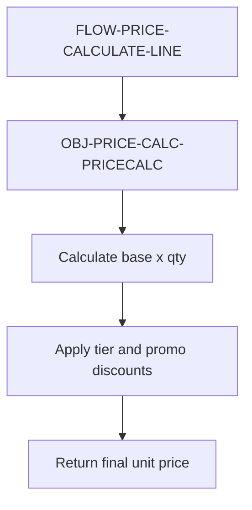

# Program Flow: PRICE-CALC

## Metadata

- module_slug: PRICE-CALC
- review_status: approved
- evidence_ids: [EV-SRC-001, EV-SME-001]

## Mermaid Flow Diagram

## Flow Inventory

| Flow ID | Trigger | Entry Program | Status | Evidence |
| --- | --- | --- | --- | --- |
| FLOW-PRICE-CALCULATE-LINE | Order line pricing request | OBJ-PRICE-CALC-PRICECALC | approved | EV-SRC-001 |

## Replay Coverage Summary

| Replay ID | Coverage | Outcome | Status |
| --- | --- | --- | --- |
| REPLAY-PRICE-001 | Input item/customer/promo -> PRICECALC -> final rounded unit price | final price returned to caller | approved |

## Exception / Recovery Summary

| Exception ID | Condition | Disposition | Evidence |
| --- | --- | --- | --- |
| EXCHAIN-PRICE-001 | Unknown promo code | no promo discount applied; behavior SME-confirmed intentional | EV-SRC-001, EV-SME-001 |
