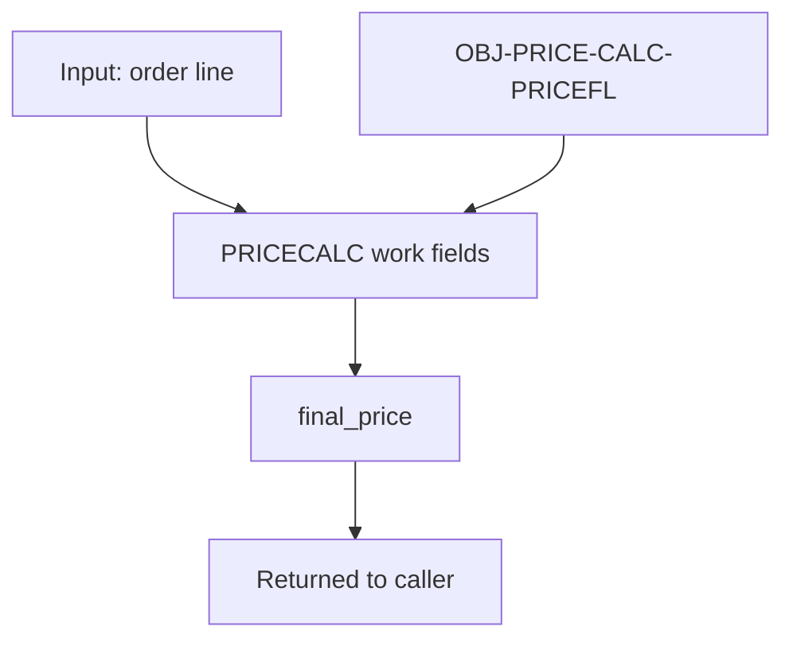

# Data Flow: PRICE-CALC

## Metadata

- module_slug: PRICE-CALC
- review_status: approved
- evidence_ids: [EV-SRC-001, EV-DDS-001]

## Mermaid Flow Diagram

## Data Objects In Scope

| Object ID | Role | Operations | Source Flows | Evidence |
| --- | --- | --- | --- | --- |
| OBJ-PRICE-CALC-PRICEFL | price lookup file | read | FLOW-PRICE-CALCULATE-LINE | EV-DDS-001 |

## Module Persistence Matrix

| Persistence ID | Object / Output | Operation | Outcome | Evidence |
| --- | --- | --- | --- | --- |
| PERSIST-PRICE-001 | final_price response field | return | calculated price returned; no durable write in this module | EV-SRC-001 |

## Critical Field Lineage Across Module

| Lineage ID | Source | Transform | Output | Evidence |
| --- | --- | --- | --- | --- |
| LINEAGE-PRICE-001 | base price, quantity, tier discount, promo discount | multiply, apply discounts, round to 2 decimals | final_price | EV-SRC-001 |
