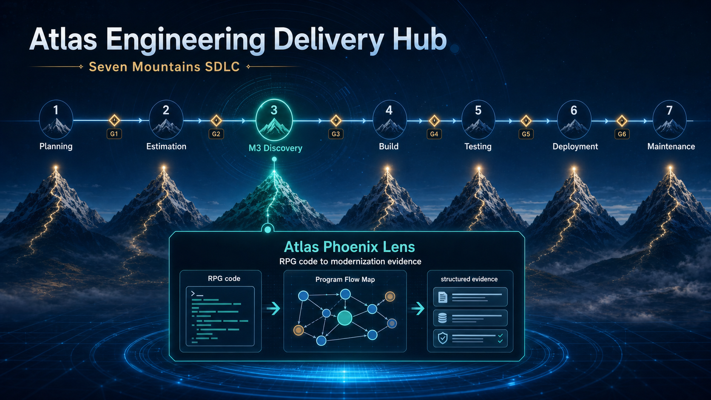

# Project Details: Atlas Phoenix Lens
[中文](../atlas-phoenix-lens-project-detail.zh-CN.md) | English

- **Unified competition project:** Atlas Engineering Delivery Hub
- **Capability demonstrated:** Atlas Phoenix Lens
- **Lifecycle position:** Discovery (M3) — Legacy reverse discovery
- **Current technology focus:** IBM i / AS400, RPG, CL, and DDS
- **Current internal implementation:** Program Flow Map + Evidence Core + Dify + SME Governance
- **Evidence Core source code:** [wwa-lab/legacy-spec-factory](https://github.com/wwa-lab/legacy-spec-factory)

> **Modernization begins with understanding, not translation.**

Atlas Engineering Delivery Hub is a unified engineering delivery system that
spans Planning, Estimation, Discovery, Build, Testing, Deployment, and
Maintenance. Atlas Phoenix Lens is its core tool for the Discovery stage.

It helps teams recover what a legacy system actually does before they decide on
a target architecture, development approach, migration strategy, or retirement
plan. It turns knowledge scattered across source code, program relationships,
documents, runtime evidence, and SME experience into evidence-backed,
reviewable, and reusable Modernization Knowledge.

This roadshow demonstrates Atlas Phoenix Lens only. Build Agent and Deployment
Agent are lifecycle capabilities elsewhere in Atlas Engineering Delivery Hub.
They are not presented as implemented Phoenix Lens functionality.

## 1. Where Phoenix Lens Fits in Atlas Engineering Delivery Hub



```text
Atlas Engineering Delivery Hub

Planning → Estimation → Discovery → Build → Testing → Deployment → Maintenance
                          │
                          └── Atlas Phoenix Lens
                              Program Flow Map
                              + Evidence Core
                              + Dify Knowledge Activation
                              + SME Governance
```

Phoenix Lens recovers the current system and delivers reviewed Discovery
Knowledge. Downstream Build creates the future system only after the evidence
and business decisions have been approved. This boundary prevents teams from
treating an AI inference about the old system as a formal requirement for the
new one.

Phoenix Lens Discovery outputs include:

- Observed Behavior of the legacy system;
- Inferred Business Rules that require SME review;
- evidence covering programs, data, exceptions, persistence, and restart
  behavior;
- Contradictions, Evidence Gaps, and `TBD-*` items;
- Evidence IDs, Source Coordinates, Snapshots, and Review States;
- a Modernization Knowledge Package that can be handed downstream after
  review.

## 2. The Core Challenge in Legacy Modernization

Legacy Modernization is often treated as a technical conversion. Yet the
largest unknown is not whether the code can be converted. It is the absence of
a complete, current, and reviewable model of how the existing system behaves.

- Critical business rules are scattered across RPG, CL, DDS, database access,
  Batch, Screen, Report, and Runtime conventions;
- documentation may be outdated or may not correspond to the Source Snapshot
  used for the modernization effort;
- one business process may span multiple programs, files, interfaces,
  exceptions, persistence paths, and restart paths;
- large programs may exceed 10K lines, and incomplete reading can silently hide
  critical behavior;
- critical knowledge is concentrated among a small number of senior SMEs;
- AI summaries may look complete while mixing Observed Facts, Inferences, and
  unsupported assumptions.

As a result, teams repeatedly read code, interview SMEs, analyze spreadsheets,
and perform manual cross-checks before forward delivery can begin. Any missed
rule or dependency can later become requirements rework, a testing gap, a
migration delay, a failed retirement, or a production risk.

> The greatest risk is not that the team cannot generate new code. It is that
> the team generates the wrong new system without fully understanding the old
> one.

## 3. The Current Solution: One Capability, Three Implementation Layers, and One Governance Loop

Atlas Phoenix Lens is not a stitched-together demonstration of three
repositories. It is one Discovery capability delivered through three
coordinated implementation layers and a closed SME governance loop:

| Component | Current responsibility | Actual boundary |
|---|---|---|
| **Program Flow Map** | Builds cross-program relationships from ARCAD REF / XREF and helps SMEs select a business-meaningful Program Flow | A Flow is scope and navigation evidence; it does not automatically become an approved business fact |
| **Evidence Core** | Scans RPG, CL, and DDS to extract behavior, rules, data, exceptions, source coordinates, and evidence gaps | The Legacy Spec Factory skills, contracts, templates, and validators in this repository |
| **Dify Implementation Layer** | Provides metadata-scoped retrieval, business Q&A, orchestration, and BRD draft generation over documents and Program scan results | The current internal implementation layer; Dify stores searchable copies but is not the Canonical Evidence Source |
| **SME Governance** | Reviews evidence, resolves TBD items, records named decisions, and writes back approval states | AI-generated content cannot bypass the Review Gate and be promoted automatically to an Approved Business Fact |


The unified product formula is:

> **Atlas Phoenix Lens = Program Flow Map + Evidence Core + Dify Knowledge
> Activation + SME Governance**

## 4. How It Works

```text
ARCAD REF / XREF + legacy documents + RPG / CL / DDS source code
                              ↓
                     Program Flow Map
              Select a bounded business Flow and Snapshot
                              ↓
                       Evidence Core
          Program / Flow / Data Analysis + Evidence Governance
                              ↓
                 Module Context / Evidence Map
       Observed / Inferred / Contradiction / TBD / Review State
                              ↓
                 Dify Knowledge Activation
        Metadata-scoped Retrieval / Business Q&A / BRD Draft
                              ↓
             SME Review / Decision Log / Write-back
                              ↓
             Reviewed Modernization Knowledge Package
                              ↓
      Downstream design and engineering delivery through
               Atlas Engineering Delivery Hub
```

### 4.1 Map The Flow

ARCAD REF / XREF relationships expose Callers, Callees, objects, and data
dependencies, enabling reviewers to select a business-meaningful Program Flow.

The map first answers, “Where should we look?” It uses the Program List, Call
Edges, Source Members, Snapshot, and optional Field Traces to define the
analysis boundary. It does not promote an SME's navigation order directly into
an actual call chain. Every Confirmed Call Edge still requires source-code or
runtime evidence.

### 4.2 Scan The Code

Evidence Core performs controlled analysis of the RPG, CL, and DDS within the
defined scope. It extracts:

- source-supported Program Behavior;
- Calculations, Validations, and Business Rule Seeds;
- Files, Tables, Fields, and External Dependencies;
- Exception, Persistence, and Restart Paths;
- Source Coordinates, Coverage Gaps, and Evidence Strength;
- `Observed`, `Inferred`, `Contradiction`, and `TBD` items.

The output is not a black-box summary. It is a set of structured artifacts that
can be reviewed, validated, and rerun.

### 4.3 Preserve The Evidence

Canonical Evidence is stored in version-controlled artifacts and includes:

- stable Evidence IDs;
- Source Paths, Source Versions, and Source Coordinates;
- Snapshots, Hashes, and analysis scope;
- Sensitivity, Authorization, and Redaction States;
- Knowledge Types, Evidence Strength, and Review States.

This means that approved conclusions can always be traced back to the original
evidence, even when prompts, models, Dify Collections, or downstream
implementations change.

### 4.4 Activate The Knowledge Through Dify

The current internal implementation uses Dify to create one knowledge base for
documents and another for Program scan results. An SME-selected Program Flow
then constrains the Capability, Module, Program, and Snapshot scope.

Dify is used to:

- query Program and Flow behavior in business language;
- connect document knowledge with source-code analysis results;
- display Supporting Evidence and open questions;
- generate BRD content with a status of `candidate`, `poc_draft`, or
  `in_review`;
- rapidly validate Retrieval, Prompts, response formats, and SME readability.

Dify is not used to:

- replace Canonical Evidence;
- infer business boundaries on its own across the entire Legacy Estate;
- automatically promote AI inferences to business facts;
- bypass SME Review to generate an Approved BRD;
- move a BRD draft beyond its authority into Build, Test, or SDD.

### 4.5 Review And Decide

SME Review confirms:

- whether a conclusion has sufficient evidence;
- whether an AI inference reflects the correct business meaning;
- how a Contradiction should be resolved;
- whether a `TBD-*` item should be confirmed, rejected, or investigated
  further;
- which behaviors should be retained, redesigned, consolidated, or retired.

Only content supported by qualified evidence or a named SME decision can enter
the Approved Knowledge Package.

## 5. What Phoenix Lens Changes

| Before Phoenix Lens | With Phoenix Lens |
|---|---|
| Start with an unbounded codebase | Start with an SME-selected Program Flow and an explicit Snapshot |
| Read programs one by one in isolation | Analyze program, data, exception, persistence, and restart evidence within a defined scope |
| Produce narrative summaries that cannot be validated | Produce structured facts, inferences, contradictions, Evidence Links, and TBD items |
| Ask SMEs to explain the entire implementation again | Focus SME attention on reviewing evidence and unresolved business decisions |
| Allow RAG to infer scope across a global knowledge base | Use Capability, Module, Program, and Snapshot Metadata to scope Dify retrieval |
| Insert AI-generated content directly into documents | Require every Draft to pass the Evidence Gate and SME Review |
| Rebuild the Discovery method for every project | Reuse the Flow Contract, Skills, Evidence Schema, Review States, and Evaluation Cases |

The final output is not an isolated document. It is a human-reviewed
Modernization Knowledge Package that can support requirements, target design,
migration planning, testing scope, and retirement decisions.

## 6. Current Capabilities, Evidence, and Actual Boundaries

| Capability | Current status | Evidence or boundary |
|---|---|---|
| Atlas Engineering Delivery Hub positioning | **Unified** | Phoenix Lens is presented only as the Discovery capability |
| Program Flow Map navigation | **Current internal capability / Demo Ready** | Used to scope the Program Flow and Snapshot; the actual internal access URL is not published in this repository |
| RPG, CL, and DDS analysis | **Current implementation** | Evidence Core skills, templates, validators, and sample artifacts are available in this repository |
| Evidence Package | **Available in the repository** | [Phoenix Lens Mini Output](../samples/atlas-phoenix-lens-mini-output/) |
| Dify retrieval, Q&A, and orchestration | **Current internal implementation approach** | Uses scoped document knowledge and Program scan knowledge; Demo output remains subject to the Review Gate |
| Dify Metadata Governance | **Being strengthened / Pilot Control** | Critical fields must be verified against silent loss during import, retrieval, and export |
| SME Decision Write-back | **Being strengthened / Pilot Control** | Owner, date, Evidence, decision, and status history must be recorded consistently |
| BRD generation | **Draft supported** | Output can only be `candidate`, `poc_draft`, or `in_review`; it cannot become `approved` automatically |
| Handoff to Build, Testing, and Deployment | **Not demonstrated in this roadshow** | Phoenix Lens output can serve as trusted input, but this repository does not claim to implement the downstream stages |
| COBOL analysis | **Future vision** | Not yet delivered as a current capability; it requires a dedicated Adapter, Skills, Benchmark, and SME validation |
| Other legacy platforms | **Reusable method / Future Pilot** | Each platform requires an Inventory Adapter, Scanning Skills, Benchmark Evidence, and SME validation |

Current capability maturity, the local engineering state of Evidence Core, Dify
deployment maturity, and complete Field Pilot results must be described
separately. An existing design does not mean that every production scenario has
been validated.

## 7. Why This Method Can Be Reused Across Legacy Systems

The current implementation focuses on RPG, CL, and DDS on IBM i / AS400.
Phoenix Lens can be extended because it separates platform-specific analysis
from shared evidence governance:

| Reusable layer | What different legacy systems can share | What a new platform must adapt |
|---|---|---|
| Scope Discovery | Start with a bounded business Flow and an explicit Snapshot | Inventory and Dependency Adapter |
| Source Scanning | Coverage, Evidence Coordinates, uncertainty, and Batch Control | Platform-specific Parsers, Prompts, and Scanning Skills |
| Evidence Contract | Stable IDs, source coordinates, states, sensitivity, and Review States | Source Types and platform Metadata |
| Knowledge Activation | Dify metadata-scoped retrieval over reviewed artifacts | Collection Design, Chunk Strategy, and Filters |
| Human Governance | SME approval, Contradictions, TBD items, and Decision History | Domain Owners and Acceptance Benchmarks |
| Evaluation | Evidence Links, Unsupported Claims, Coverage, and Repeatability | Platform-specific Golden Samples and Challenge Cases |

The rollout path should be validated incrementally:

1. First validate one real business Flow containing 5–10 programs;
2. then expand to one Application or Capability;
3. add an Adapter, Skills, and Benchmark for each new Legacy Technology;
4. claim platform support only after SME and security review;
5. ultimately reuse the same governance method across the Modernization
   Portfolio.

Phoenix Lens is therefore not a universal Parser that claims to support every
platform today. It is a Discovery Operating Model that can expand continuously
through Adapters and Benchmarks. COBOL is the next potential area of extension,
but it is not promoted as an implemented capability today.

## 8. Significance and Business Value for the Company

Phoenix Lens delivers far more than faster document generation. It can reduce
the “uncertainty premium” built into every Modernization estimate and decision.

- **Release delivery capacity:** Reduce repeated code reading, context
  reconstruction, and broad SME explanation;
- **avoid downstream rework:** Reduce requirements, target-design, testing, and
  migration rework caused by misunderstood legacy behavior;
- **preserve institutional knowledge:** Retain critical evidence and decisions
  after a project ends or a senior SME leaves;
- **enable Portfolio reuse:** Stop different teams from rebuilding Flows,
  Prompts, Evidence Schemas, and governance processes for every application;
- **support reliable retirement:** Distinguish behavior that must be retained,
  redesigned, consolidated, or can be retired safely;
- **reduce AI risk:** Keep evidence, uncertainty, and approval states visible so
  black-box answers do not contaminate formal requirements and downstream
  design.

```text
Annual quantifiable net value
  = Value of released Discovery and SME delivery capacity
  + Avoided cost of evidence-related rework
  + Avoided cost of duplicated project setup
  + Validated value of earlier retirement
  - Annual Phoenix Lens operating cost
```

At the Portfolio level:

```text
Validated value for each adoption scope
  × Number of adoptable Applications / Capabilities
  × Validated Adoption Rate
  = Portfolio Value Opportunity
```

Actual benefits must be validated using an owned Baseline, comparable Pilot
data, and unit costs accepted by Finance. Targets, illustrative estimates, and
Capacity Release must not be presented automatically as realized Cash Savings.

## 9. Roadshow Demo Path

This roadshow uses Dify as the user entry point. The Program Flow Map and the
artifacts in this repository demonstrate the scope controls and evidence
governance behind it.

```text
Program Flow Map
  → Select a business-meaningful Flow and Source Snapshot
  → View Evidence Core Program Analysis and Source Coordinates
  → Use the same Scope for business Q&A in Dify
  → Trace the response back to an Evidence ID and the original evidence
  → Generate a BRD Draft
  → Show the SME Review, Decision Log, and Approval Boundary
  → Produce a Reviewed Modernization Knowledge Package
```

The demonstration should emphasize:

1. one explicit SME Program Flow;
2. one Observed Behavior with a Source Coordinate;
3. one `TBD-*` item that AI cannot close silently;
4. the Metadata Scope in Dify;
5. one drill-down from an answer to its Evidence ID;
6. one BRD excerpt marked `poc_draft` or `in_review`;
7. how an SME Decision confirms or rejects content, or keeps it open for further
   investigation.

## 10. Pilot Success Metrics and Next Steps

The following metrics are proposed acceptance targets, not claims of benefits
already realized:

- at least a 95% success rate for sampled Evidence Links;
- no more than 5% Unsupported Claims;
- an SME correction rate for Observed Behavior no higher than the agreed
  threshold;
- core results that are consistent when the same Snapshot is rerun, or whose
  differences can be explained;
- a verifiable reduction in SME Review time relative to the Baseline after two
  rounds;
- qualified evidence or a named SME decision for all Approved content;
- no silent truncation of RPG programs exceeding 10K lines, with a processing
  state recorded for every source range;
- source-code or runtime evidence for every Confirmed Call Edge in the Program
  Chain;
- security approval for sensitive-data, model-use, retention, and deletion
  policies.

Next-step priorities:

1. Complete the Metadata, state, and approval mappings across Program Flow Map,
   Evidence Core, and Dify;
2. verify that Dify import, retrieval, and export do not silently drop Evidence
   fields;
3. strengthen the SME Decision Log, Write-back, and BRD Approval Gate;
4. establish a Golden Evaluation Set for retrieval and generation;
5. complete the Challenge Case using a real RPG program exceeding 10K lines and
   a 5–10 Program Chain;
6. begin extending to COBOL or another legacy platform only after the current
   platform benchmark has passed.

## 11. Alignment with Company Values

- **We Get It Done:** Turn an opaque Legacy Estate into reviewable
  Modernization Input;
- **We Take Responsibility:** Keep evidence, uncertainty, sensitivity, and
  approval states visible instead of hiding them behind an AI-generated answer;
- **We Succeed Together:** Turn individual SME and engineering knowledge into
  reusable organizational assets;
- **We Value Difference:** Combine source-code evidence, engineering analysis,
  business knowledge, and human judgment.

## In One Sentence

> **Map the flow. Scan the code. Activate the knowledge.** Atlas Phoenix Lens
> enables teams to Modernize Legacy Systems based on evidence rather than
> assumptions.

## Related Materials

- [Chinese README](../../README.zh-CN.md)
- [Chinese roadshow script](../atlas-phoenix-lens-pitch.zh-CN.md)
- [Roadshow and review materials index](../atlas-phoenix-lens-index.md)
- [Program Flow Map Export Contract](../program-flow-map-export-contract.md)
- [Phoenix Lens Mini Output](../samples/atlas-phoenix-lens-mini-output/)
- [Vendor BRD AI POC vs. Atlas Phoenix Lens: Comparison and Implementation Improvement Plan](../vendor-vs-atlas-phoenix-lens-comparison-improvement-2026-07-23.zh-CN.md)
