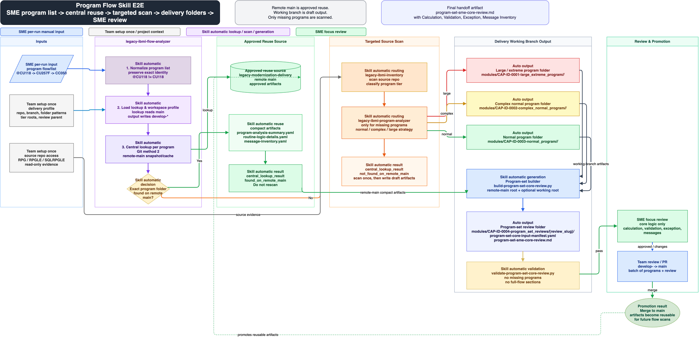

# Flow Skill E2E Guideline

Use this guide when an SME provides one or more program flows/lists and expects
reviewable output that merges the core logic across each flow's programs.
For copy-ready internal test prompts, use the runtime-specific guides:
[`flow-analysis-prompt-e2e-guideline.md`](flow-analysis-prompt-e2e-guideline.md)
for Codex / Claude Code style agents, and
[`flow-analysis-copilot-chat-e2e-guideline.md`](flow-analysis-copilot-chat-e2e-guideline.md)
for GitHub Copilot Chat segmented execution.
For interrupted runs or new-session handoff, see
[`flow-analysis-resume-guideline.md`](flow-analysis-resume-guideline.md).

The default field workflow is **program-evidence first with no cross-run
reuse**:

1. Analyze every distinct program named by the SME from the current source repo
   and write current-run program-analysis artifacts to the delivery working
   branch.
2. Reuse only artifacts produced earlier in the same run/batch when a program
   repeats.
3. Assemble those current-run program-level results into one
   `program-set-sme-core-review.md`.

Do not use remote main, another branch, a prior-run cache, or another analyst's
artifact as completion evidence for the default program-flow workflow. Git/PR
review is the comparison mechanism after the current-run artifacts exist.

After an all-program scan has been reviewed and merged into the document /
delivery repo, SME-local flow assembly can use **approved document repo reuse**:

1. SME clones the document/delivery repo locally.
2. SME provides the program flow/list.
3. The builder reads only the requested programs' approved compact artifacts
   from the local clone with `--artifact-repo-mode approved_document_repo`.
4. Missing programs remain visible as pending/missing rows; the builder does
   not invent or silently skip them.
5. If fresh source inventory finds a missing program, scan just that program and
   refresh the document repo artifact. If fresh inventory also misses it, block
   with SME follow-up for spelling, aliases, library/scope, or missing source.

Default output:

```text
program-set-sme-core-review.md
```

This workflow does not generate `flow-<FLOW-SLUG>.md` unless the user
explicitly asks for full transaction-flow analysis.



Editable source: [`assets/program-flow-skill-e2e-flow.drawio`](assets/program-flow-skill-e2e-flow.drawio).

## What The SME Provides

Ask for these work-specific values for a single flow:

```text
Delivery working branch: develop-<person>
Review name: <business-friendly review name>
Source repo: /path/to/source-repo
Programs, in SME order:
- <PROGRAM-1>
- <PROGRAM-2>
- <PROGRAM-3>
Optional context:
- entry/menu/job/API hint
- known files, messages, or exception paths
```

Program identity is exact. `@CU118` and `CU118` are different programs unless
the team's profile explicitly defines aliases.

For multiple flows in one request, ask the SME to provide one block per flow:

```text
Delivery working branch: develop-<person>
Source repo: /path/to/source-repo

Flow 1 review name: <business-friendly flow name>
Programs:
- <PROGRAM-1>
- <PROGRAM-2>

Flow 2 review name: <business-friendly flow name>
Programs:
- <PROGRAM-3>
- <PROGRAM-4>
```

Each flow block becomes one independent program-set review folder under
`program_set_review_parent`. Do not merge separate business flows into one
`program-set-sme-core-review.md`.

## Inputs The Agent Loads

- Source repo checkout or approved source export.
- Source inventory cache at `<source-root>/outputs/repo-scan/`, when present.
- Delivery repo working branch checkout, normally `develop-<person>`.
- Team delivery profile, usually copied from
  [`skills/legacy-ibmi-flow-analyzer/templates/delivery-profile.yaml`](../skills/legacy-ibmi-flow-analyzer/templates/delivery-profile.yaml).

The working branch is the current run's draft workspace. For program-flow core
review, it is also the only artifact root the builder reads.

## E2E Flow

1. Normalize the SME program list.
2. Load the delivery profile.
3. Build one distinct current-run program worklist. Preserve each flow's SME
   order for assembly.
4. Check source inventory cache:
   `<source-root>/outputs/repo-scan/program-list.csv` and
   `<source-root>/outputs/repo-scan/scan-summary.yaml`.
5. If cache is fresh, use `program-list.csv` to locate source path and tier; if
   cache is missing/stale/dirty, rerun `legacy-ibmi-inventory` repo scan first.
6. Use `legacy-ibmi-program-list-batch` for multiple distinct programs in
   Copilot Chat-limited runs; each queue item delegates one fresh chat to
   `legacy-ibmi-program-analyzer`. For a single distinct program,
   `legacy-ibmi-program-analyzer` may be used directly.
7. Write current-run program artifacts to the delivery working branch under the
   configured tier folder.
8. For each program, confirm the required tier-appropriate program-level
   artifacts. Normal programs require `program-analysis.md`,
   `program-analysis-summary.yaml`, `source-index.yaml`, `routine-index.md`,
   and `message-inventory.yaml`.
9. For complex or large programs, also require `routine-logic-details.md`,
   `routine-logic-details.yaml`, and retained detail such as
   `deep-read-plan.md`, `all-routine-coverage-ledger.md`, and
   `routine-logic-details/deep-read-batch-*.md` when more than one
   five-routine batch is needed.
10. Build the program-set manifest and review skeleton only after all distinct
    programs have current-run artifacts or explicit pending/blocked states.
11. Fill only Calculation Logic, Validation Logic, Exception Handling, and
    Message Inventory from the current-run per-program artifacts.
12. Validate the review before SME handoff.
13. Open a PR from the working branch. Merge to `main` only after review.

For multiple flow blocks, analyze each distinct program once, then run the
assembly steps once per flow block. Reuse the same source inventory cache,
delivery working branch, and PR when they belong to the same SME batch. If a
program appears in more than one flow in the same batch, reuse the current-run
artifact; do not rescan it just because it appears in a second flow.

## Commands

The field deployment environment is Windows/Cline. Use direct `py -3` commands
against `.agents\skills\legacy-ibmi-flow-analyzer\scripts\program_set_core_review.py`.
If `py -3` is unavailable, rerun the same command with `python`. Do not use
PowerShell, `.cmd`, `.ps1`, shell continuations, or `py ... || python ...`.
Use `python3` only on macOS/Linux development machines.

Default program-evidence-first order:

1. Run or refresh repo-level inventory when the source inventory cache is not
   fresh.
2. Run `legacy-ibmi-program-list-batch` for multiple distinct programs in
   Copilot Chat-limited runs, or `legacy-ibmi-program-analyzer` directly for a
   single distinct program, then write new artifacts to the delivery working
   branch tier folders.
3. Confirm each program has the required tier-appropriate artifacts: normal
   programs keep lightweight validated output, while complex or large programs
   also keep `routine-logic-details.md`, `routine-logic-details.yaml`, and
   retained deep-read evidence when needed.
4. Run the program-set builder with `--working-root` and fill
   `program-set-sme-core-review.md` from those completed per-program artifacts.
5. Validate before SME handoff.

Create the program list:

```text
@CU118
CU257F
CC050
```

Build the deterministic program-set inputs on Windows:

```text
py -3 .agents\skills\legacy-ibmi-flow-analyzer\scripts\program_set_core_review.py build
  --review-name "card auth posting core review"
  --programs-file programs.txt
  --working-root C:\path\to\legacy-modernization-delivery
  --source-root C:\path\to\source-repo
  --profile C:\path\to\delivery-profile.yaml
  --working-branch develop-leo
  --program-first
  --output-dir C:\path\to\legacy-modernization-delivery\modules\CAP-ID-0004-program_set_reviews\card_auth_posting_core_review
```

macOS/Linux:

```bash
python3 scripts/build-program-set-core-review.py \
  --review-name "card auth posting core review" \
  --programs-file programs.txt \
  --working-root /path/to/legacy-modernization-delivery \
  --source-root /path/to/source-repo \
  --profile path/to/delivery-profile.yaml \
  --working-branch develop-leo \
  --program-first \
  --output-dir /path/to/legacy-modernization-delivery/modules/CAP-ID-0004-program_set_reviews/card_auth_posting_core_review
```

`--working-root` is the current-run artifact root. Do not pass `--delivery-root`
for the default program-flow workflow.

Use `--source-root` to enable the default source inventory cache lookup at
`<source-root>/outputs/repo-scan/`. Use `--inventory-dir` only when the team
profile or local run stores `program-list.csv` and `scan-summary.yaml` in a
different location.

Build from an approved local document repo clone on Windows:

```text
py -3 .agents\skills\legacy-ibmi-flow-analyzer\scripts\program_set_core_review.py build
  --review-name "card auth posting core review"
  --programs-file programs.txt
  --working-root C:\path\to\legacy-modernization-delivery
  --profile C:\path\to\delivery-profile.yaml
  --working-branch main
  --artifact-repo-mode approved_document_repo
  --output-dir C:\path\to\legacy-modernization-delivery\modules\CAP-ID-0004-program_set_reviews\card_auth_posting_core_review
```

macOS/Linux:

```bash
python3 scripts/build-program-set-core-review.py \
  --review-name "card auth posting core review" \
  --programs-file programs.txt \
  --working-root /path/to/legacy-modernization-delivery \
  --profile path/to/delivery-profile.yaml \
  --working-branch main \
  --artifact-repo-mode approved_document_repo \
  --output-dir /path/to/legacy-modernization-delivery/modules/CAP-ID-0004-program_set_reviews/card_auth_posting_core_review
```

Repo-level inventory cache, only when needed on Windows:

```text
py -3 skills\legacy-ibmi-inventory\scripts\scan_ibmi_repo.py C:\path\to\source-repo
  --out-dir C:\path\to\source-repo\outputs\repo-scan
```

macOS/Linux:

```bash
python3 skills/legacy-ibmi-inventory/scripts/scan_ibmi_repo.py /path/to/source-repo \
  --out-dir /path/to/source-repo/outputs/repo-scan
```

The builder marks the cache `fresh` only when `scan-summary.yaml` records the
same clean Git source revision. Missing, stale, or dirty source states route to
repo-level inventory before targeted program scan.

Validate before handoff on Windows:

```text
py -3 .agents\skills\legacy-ibmi-flow-analyzer\scripts\program_set_core_review.py validate
  --manifest C:\path\to\legacy-modernization-delivery\modules\CAP-ID-0004-program_set_reviews\card_auth_posting_core_review\program-set-core-input-manifest.yaml
  --review C:\path\to\legacy-modernization-delivery\modules\CAP-ID-0004-program_set_reviews\card_auth_posting_core_review\program-set-sme-core-review.md
```

macOS/Linux:

```bash
python3 scripts/validate-program-set-core-review.py \
  --manifest /path/to/legacy-modernization-delivery/modules/CAP-ID-0004-program_set_reviews/card_auth_posting_core_review/program-set-core-input-manifest.yaml \
  --review /path/to/legacy-modernization-delivery/modules/CAP-ID-0004-program_set_reviews/card_auth_posting_core_review/program-set-sme-core-review.md
```

For multiple flow blocks, create one `programs.txt` per flow and run the
builder once per flow with a different `--review-name` and `--output-dir`:

```text
modules/CAP-ID-0004-program_set_reviews/
  card_auth_posting/
    program-set-core-input-manifest.yaml
    program-set-sme-core-review.md
  nightly_recon/
    program-set-core-input-manifest.yaml
    program-set-sme-core-review.md
```

## Program Evidence Routing Table

| Run resolution | What it means | Action |
| --- | --- | --- |
| `analyzed_this_run` | Current-run artifact exists in the delivery working branch. | Use compact artifacts for review fill. |
| `reused_same_run` | The same normalized program already produced a current-run artifact earlier in this batch. | Reuse that current-run artifact for this flow/repeat. |
| `reused_artifact_repo` | Approved artifact exists in the local document repo clone and `artifact_repo_mode` is `approved_document_repo`. | Use compact artifacts for SME-local review fill. |
| `pending_source` | No artifact exists yet, but source lookup/analysis is still needed or fresh inventory found the program. | Use fresh inventory to locate source and run targeted program analysis. |
| `blocked_missing_source` | Source or required evidence is unavailable. | Record precise TBD/blocker; do not fake completion. |

## Output Placement

Program artifacts:

```text
modules/CAP-ID-0001-large_extreme_program/<PROGRAM>/
modules/CAP-ID-0002-complex_normal_program/<PROGRAM>/
modules/CAP-ID-0003-normal_program/<PROGRAM>/
```

Program-set review:

```text
modules/CAP-ID-0004-program_set_reviews/{review_slug}/
  program-set-core-input-manifest.yaml
  program-set-sme-core-review.md
```

Multiple program flows:

```text
modules/CAP-ID-0004-program_set_reviews/{flow_1_review_slug}/
modules/CAP-ID-0004-program_set_reviews/{flow_2_review_slug}/
modules/CAP-ID-0004-program_set_reviews/{flow_3_review_slug}/
```

## Pass Criteria

- Every SME-provided program appears in the manifest, Sources table, and Core
  Completeness Ledger for its flow.
- Every distinct SME-provided program has completed current-run program-level
  artifacts before the program-set review is assembled, unless it has a precise
  `pending_source` or `blocked_missing_source` row.
- Program artifacts are written to the correct tier folder.
- Source inventory cache is reused only when its source revision is fresh.
- Multiple SME-provided flows produce separate `{review_slug}` folders under
  `program_set_review_parent`; they may share one working branch and PR.
- The review contains only:
  - Calculation Logic
  - Validation Logic
  - Exception Handling
  - Message Inventory
- The four core sections contain routine-level evidence-backed rows or precise
  per-program TBD rows. Placeholder-only statements from lightweight source
  scans are not sufficient for SME handoff.
- `scripts/validate-program-set-core-review.py` passes before SME review.
