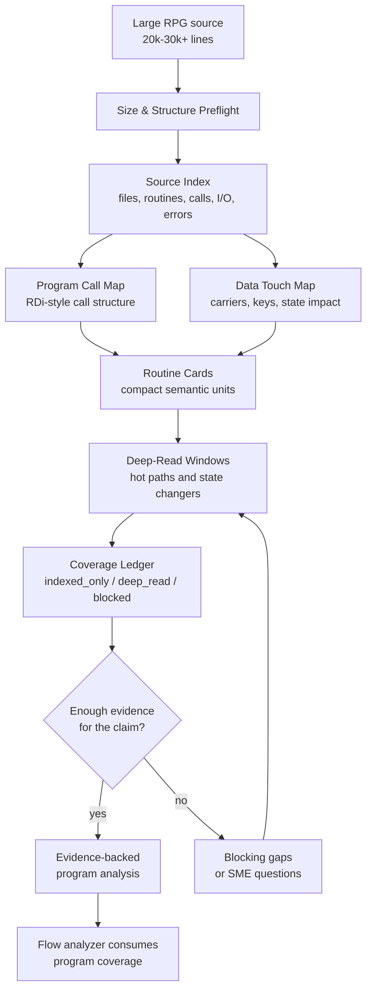

# Large RPG Analysis Strategy

This document explains how Legacy Spec Factory handles very large IBM i RPG
programs, such as 20,000-30,000+ line RPGLE members, without pretending the AI
has safely understood more than the evidence supports.

## One-Sentence Principle

Do not treat a 30,000-line RPG program as a big text summary problem. Treat it
as an evidence-backed program-understanding problem.

## Why Fixed Chunks Are Not Safe

Splitting a large RPG member into fixed 1,000-line chunks and summarizing each
chunk is fast, but it breaks the relationships that matter most:

- A routine can be called from many distant locations.
- A field can be read in one section, changed in another, and returned through
  a parameter later.
- Error paths, indicators, and return codes often cross routine boundaries.
- Common utilities may look unimportant locally but sit on hot call paths.
- A chunk summary can sound confident while missing the caller, callee, or data
  carrier that gives the code its business meaning.

For modernization, that is the dangerous kind of wrong: readable, plausible,
and hard to detect.

## The Safer Analysis Flow

The preferred flow uses a text-native Mermaid diagram rather than a Draw.io
file. It stays readable in Markdown, works in diffs, and does not require a
separate diagram editor.

## What We Build First

The first output is not a business summary. The first output is a structure
that can be checked:

- **Source Index:** where the routines, files, copybooks, calls, file I/O,
  display/report I/O, commits, rollback points, indicators, and error handlers
  are.
- **Program Call Map:** an IBM RDi-style view of mainline, subroutines,
  procedures, external programs, APIs, queues, and common utilities.
- **Data Touch Map:** which routines read, write, update, delete, send, or
  receive which data carriers and critical fields.
- **Routine Cards:** compact cards for each semantic unit, including callers,
  callees, data touches, state impact, error handling, evidence, and coverage.
- **Deep-Read Windows:** selected source windows for hot paths, state-changing
  routines, external handoffs, error paths, and high-risk business data.
- **Coverage Ledger:** a plain account of what is only indexed, what has been
  deep-read, and what is blocked.

## Coverage Rules

Coverage is deliberately small and strict:

| Coverage | Meaning |
| --- | --- |
| `indexed_only` | The structure is known, but the behavior has not been deep-read enough for strong claims. |
| `deep_read` | The relevant source window has been inspected closely enough to support evidence-backed claims. |
| `blocked` | Missing, contradictory, or insufficient evidence blocks safe downstream use. |

SME confirmation is important, but it is not a coverage value. It belongs in
review/sign-off metadata. This keeps code evidence, AI inference, and human
approval separate.

## How This Prevents AI Hallucination

The method forces every strong statement to answer four questions:

- Where is the source evidence?
- Which routine or call edge supports it?
- Which data carrier or field is affected?
- Is the relevant code `deep_read`, or only `indexed_only`?

If the answer is weak, the analysis must mark a gap instead of producing a
confident summary.

## How Flow Analysis Uses This

Flow analysis is allowed to consume a program only with its coverage attached.

If a flow depends on a state-changing routine that is only `indexed_only`, the
flow should not turn that routine into a business fact. It must either route
back to program analysis for a deep-read window or record a named SME waiver in
review metadata.

This is the handoff discipline that keeps program analysis, flow analysis, and
eventual Java/cloud specifications aligned with evidence.

## Practical Decision

For large RPG programs, the target is not "summarize all lines." The target is:

- build the call skeleton
- map data movement
- deep-read the risky parts
- preserve coverage and gaps
- let SMEs confirm meaning at the right boundary

That is slower than a raw summary, but it is much safer for modernization.
